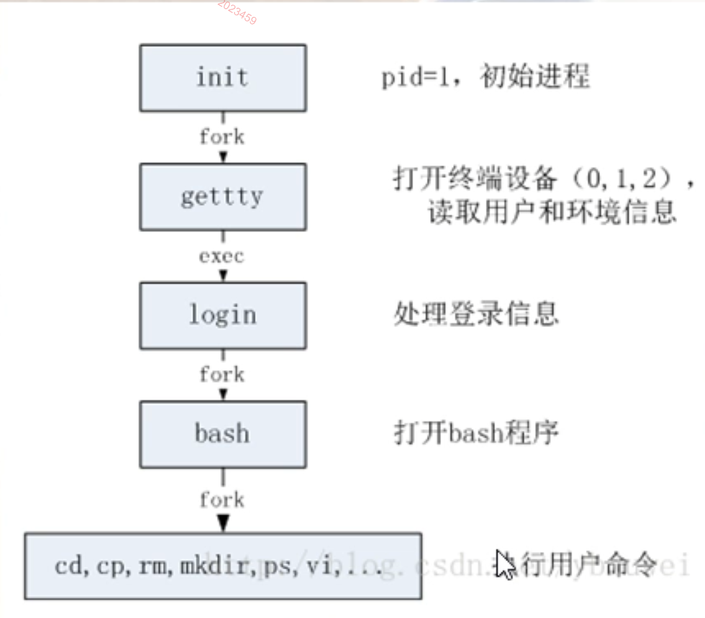
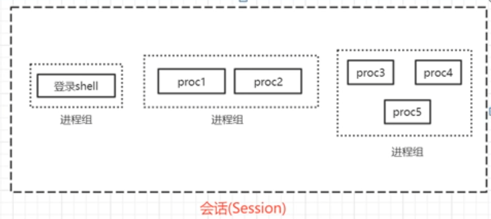
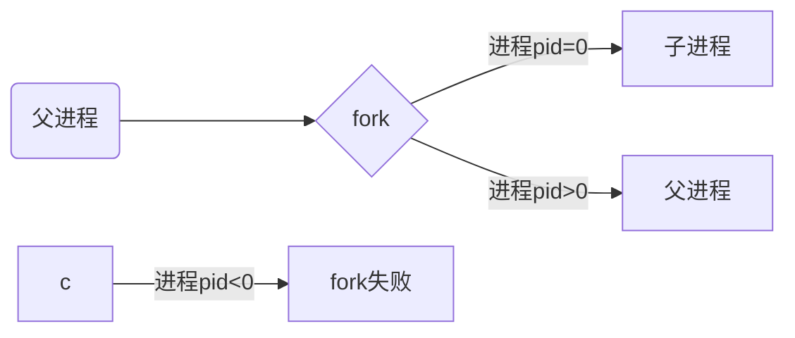

# （1）nginx源码学习方法

# （2）终端和进程的关系

## （2.1）终端与bash进程

首先在共享文件夹下准备一个测试程序 nginx.c
然后再ubuntu下进行编译，编译出来的可执行程序 叫做 nginx
代码如下

```c
#include <stdio.h>
#include <unistd.h>

int main()
{
   printf("hello Word \n");

   for(;;)
   {
      sleep(1); // 休息1秒
      printf("sleep 1s \n");
   }

   printf("程序退出！\n");

   return 0;
}
```

```shell
# 查看bash进程(1个终端连接)
ps -ef | grep bash
# invi@inviubuntu:/mnt/hgfs/nginxWeb$ ps -ef | grep bash
# invi        1290    1289  0 01:27 pts/0    00:00:00 -bash

# 查看bash进程(2个终端连接)
ps -ef | grep bash
# invi@inviubuntu:/mnt/hgfs/nginxWeb$ ps -ef | grep bash
# invi        1290    1289  0 01:27 pts/0    00:00:00 -bash
# invi        3146    3145  0 02:18 pts/1    00:00:00 -bash

```

pts(虚拟终端)，每连接一个终端到ubuntu，就会出现一个bash进程（shell【壳】）
这个bash就用来解释用户输入命令

## （2.2）终端上的开启进程

```shell
invi@inviubuntu:~$ ps -la
# F S   UID     PID    PPID  C PRI  NI ADDR SZ WCHAN  TTY          TIME CMD
# 0 S  1000    3525    1290  0  80   0 -   627 hrtime pts/0    00:00:00 nginx
# 0 R  1000    3540    3146  0  80   0 -  2441 -      pts/1    00:00:00 ps

```

关闭终端，运行在终端上的进程（自己写的nginx）也被关闭了

```shell
invi@inviubuntu:~$ ps -la
# F S   UID     PID    PPID  C PRI  NI ADDR SZ WCHAN  TTY          TIME CMD
# 0 R  1000    3592    3146  0  80   0 -  2434 -      pts/1    00:00:00 ps

```

将服务跑起来，查看相关进程

```shell
invi@inviubuntu:~$ ps -ef | grep bash
# invi        3146    3145  0 02:18 pts/1    00:00:00 -bash
# invi        3752    3751  0 02:37 pts/0    00:00:00 -bash
# invi        3812    3146  0 02:39 pts/1    00:00:00 grep --color=auto bash
invi@inviubuntu:~$ ps -ef | grep nginx
# invi        3802    3752  0 02:38 pts/0    00:00:00 ./nginx
# invi        3824    3146  0 02:39 pts/1    00:00:00 grep --color=auto nginx

```

通过观察发现，我们的nginx进程的父进程（ppid=3752)恰好就是第一个终端（bash)的进程（pid = 3752).
也就是说，这个bash是这个nginx可执行程序的父进程



## （2.3）进程关系进一步分析

每个进程还属于一个进程组（一个或者多个进程的集合），每个进程组有一个唯一的进程组ID，可以调用系统函数来创建进程组、加入进程组
【回话（session）】是一个或者多个进程组的集合



一般只要不进行特殊的系统调用，一个bash（shell)上面运行的所有程序都属于一个回话，而这个回话有一个session leader；
那么这个bash（shell）通常就是这个session leader
当然你也可以调用系统函数创建新的session

启用3个终端，进行观察
ps -eo pid,ppid,sid,tty,pgrp,comm | grep -E 'bash|PID|nginx'
-e:显示所有进程
-o:表示我们可以自定义显示哪些列
pid:进程id
ppid:父进程ID
sid:sessionID
tty:终端
pgrp:进程组
comm：执行的对应命令
-E 'bash|PID|nginx' ：表示查看这几个字样的组合（只要有这几个字样都可以进行展示，也就是需要查看的列）

```shell
# ps -eo pid,ppid,sid,tty,pgrp,comm | grep -E 'bash|PID|nginx'
invi@inviubuntu:~$ ps -eo pid,ppid,sid,tty,pgrp,comm | grep -E 'bash|PID|nginx'
#     PID    PPID     SID TT          PGRP COMMAND
#    3146    3145    3146 pts/1       3146 bash
#    3752    3751    3752 pts/0       3752 bash
#    4049    3752    3752 pts/0       4049 nginx
#    4254    4253    4254 pts/2       4254 bash

```

通过观察：
nginx的进程（pid = 4049)他的父进程是 bash-0(pid = 3752)，同时，3752还是这个bash-0 和 nginx的sessionID，
那么这里bash-0 他的进程id（pid)和他的sessionID相同，就说明这个bash-0是这个session的session leader
然后这里nginx的进程id(pid)和他的pgrp相同，说明这个nginx自成一个进程组

* 如果我这个 xshell 终端要断开的话，系统会发送 <font color="#d71345">SIGHUP 信号（终端断开信号）</font> 给session leader（也就是这个bash-0进程）
* session leader收到这个 SIGHUP 信号后，他会把这个信号发送给 session 里的所有进程，收到这个 SIGHUP 信号的缺省动作就是退出

退出nginx所在的终端,再次查看进程

```shell
invi@inviubuntu:~$ ps -eo pid,ppid,sid,tty,pgrp,comm | grep -E 'bash|PID|nginx'
    PID    PPID     SID TT          PGRP COMMAND
   3146    3145    3146 pts/1       3146 bash
   4254    4253    4254 pts/2       4254 bash
```

## （2.4）strace工具的使用

linux下的调试分析工具，可以跟踪程序执行是的进程调用以及收到的信号

* 1）跟踪nginx进程
sudo strace -e trace=signal -p 5222

```shell
# 查看进程
invi@inviubuntu:~$ ps -eo pid,ppid,sid,tty,pgrp,comm | grep -E 'bash|PID|nginx'
    PID    PPID     SID TT          PGRP COMMAND
   3146    3145    3146 pts/1       3146 bash
   4254    4253    4254 pts/2       4254 bash
   5196    5195    5196 pts/0       5196 bash
   5222    5196    5196 pts/0       5222 nginx
# 跟踪Nginx进程
invi@inviubuntu:~$ sudo strace -e trace=signal -p 5222
strace: Process 5222 attached
# 然后另起一个终端跟踪其父进程
invi@inviubuntu:~$ sudo strace -e trace=signal -p 5196
strace: Process 5196 attached

```

* 然后关闭nginx所在的bash终端

* 2）观察nginx跟踪情况

```shell
invi@inviubuntu:~$ sudo strace -e trace=signal -p 5222
strace: Process 5222 attached
--- SIGHUP {si_signo=SIGHUP, si_code=SI_USER, si_pid=5196, si_uid=1000} ---
+++ killed by SIGHUP +++

```

看到 nginx 进程收到一个SIGHUP 信号，谁发出的？i_pid=5196发出来的，也就是 bash-0发送信号 SIGHUP 给nginx
也就是 nginx这个 SIGHUP 信号是由他的父进程 bash-0发来的

* 3）观察nginx父进程的跟踪情况

```shell
invi@inviubuntu:~$ sudo strace -e trace=signal -p 5196
strace: Process 5196 attached
--- SIGHUP {si_signo=SIGHUP, si_code=SI_KERNEL} ---
--- SIGCONT {si_signo=SIGCONT, si_code=SI_KERNEL} ---
rt_sigreturn({mask=[CHLD]})             = -1 EINTR (Interrupted system call)
kill(-5222, SIGHUP)                     = 0
rt_sigprocmask(SIG_BLOCK, [CHLD TSTP TTIN TTOU], [CHLD], 8) = 0
rt_sigprocmask(SIG_SETMASK, [CHLD], NULL, 8) = 0
rt_sigprocmask(SIG_BLOCK, [CHLD], [CHLD], 8) = 0
rt_sigprocmask(SIG_SETMASK, [CHLD], NULL, 8) = 0
rt_sigprocmask(SIG_SETMASK, [], NULL, 8) = 0
--- SIGCHLD {si_signo=SIGCHLD, si_code=CLD_KILLED, si_pid=5222, si_uid=1000, si_status=SIGHUP, si_utime=0, si_stime=2} ---
rt_sigreturn({mask=[]})                 = 0
rt_sigaction(SIGHUP, {sa_handler=SIG_DFL, sa_mask=[], sa_flags=SA_RESTORER, sa_restorer=0x7fad617f1040}, {sa_handler=0x5653f1d67500, sa_mask=[HUP INT ILL TRAP ABRT BUS FPE USR1 SEGV USR2 PIPE ALRM TERM XCPU XFSZ VTALRM SYS], sa_flags=SA_RESTORER, sa_restorer=0x7fad617f1040}, 8) = 0
kill(5196, SIGHUP)                      = 0
--- SIGHUP {si_signo=SIGHUP, si_code=SI_USER, si_pid=5196, si_uid=1000} ---
+++ killed by SIGHUP +++

```

那么父进程是怎么被通知到的呢？

```shell
kill(-5222, SIGHUP)                     = 0
```

首先看到它（父进程）收到一个 kill(-5222, SIGHUP) 的命令，这个命令的含义就是通知这个进程往（绝对值为 -5222的进程组）发送一个SIGHUP信号
所以，这里 nginx 就收到了这个 SIGHUP 信号

然后，再往下看。有一个

```shell
kill(5196, SIGHUP)                      = 0
```

5196 就是这个bash进程本身，这句话就是 把这个 SIGHUP 信号发送给自己，然后将自己杀死退出

所以全流程看下来就是，这个bash先发送 SIGHUP 给同一个 session 里面的所有进程，
再发送 SIGHUP 信号给 bash 自己

## （2.5）终端关闭时如何让进程不退出

设想：

* 1）nginx进程拦截 SIGHUP 信号，收到这个信号，但是告诉操作系统，不要把我杀死

验证：
修改 nginx.c代码

```c
#include <stdio.h>
#include <unistd.h>

#include <signal.h>

int main()
{
   printf("hello Word \n");

   // signal 系统函数（设置某个信号来的时候的处理程序），用哪个函数来进行处理
   // 这里没有设置处理函数额，而是使用SIG_HUB标志：代表要忽略这个信号，请操作系统不要用缺省的方式来处理本进程
   signal(SIGHUP, SIG_HUP);

   for(;;)
   {
      sleep(1); // 休息1秒
      printf("sleep 1s \n");
   }

   printf("程序退出！\n");

   return 0;
}

```

然后进入 共享文件夹 目录里，重新编译测试程序

```shell
invi@inviubuntu:/$ cd mnt/hgfs/nginxWeb/
invi@inviubuntu:/mnt/hgfs/nginxWeb$ gcc -o nginx nginx.c
invi@inviubuntu:/mnt/hgfs/nginxWeb$ ./nginx
```

然后重启一个新终端查看进程信息

```shell
invi@inviubuntu:~$ ps -eo pid,ppid,sid,tty,pgrp,comm | grep -E 'bash|PID|nginx'
    PID    PPID     SID TT          PGRP COMMAND
  10554   10551   10554 pts/0      10554 bash
  10693   10554   10554 pts/0      10693 nginx
  10771   10770   10771 pts/1      10771 bash

```

然后此时关闭nginx进程所在终端，再次查看进程信息

```shell
invi@inviubuntu:~$ ps -eo pid,ppid,sid,tty,pgrp,comm | grep -E 'bash|PID|nginx'
    PID    PPID     SID TT          PGRP COMMAND
  10693       1   10554 ?          10693 nginx
  10771   10770   10771 pts/1      10771 bash

```

看到原来nginx进程所在的bash进程没了（因为终端关闭，bash就关闭了），
但是nginx进程依然存在，只是他的终端号 tty 变成了 ？,表示它没有对应的终端了，
其次，他的ppid，父进程变成了 1 ，原来的bash被关闭后，父进程变成了1.
这样它就变成了一个孤儿进程，被初始化进程（init)所接收管理

kill关闭

```shell
invi@inviubuntu:~$ kill 10693
invi@inviubuntu:~$ ps -eo pid,ppid,sid,tty,pgrp,comm | grep -E 'bash|PID|nginx'
    PID    PPID     SID TT          PGRP COMMAND
  10771   10770   10771 pts/1      10771 bash
invi@inviubuntu:~$ 

```

* 2）如果nginx进程和bash进程不在同一个 session里
  
修改源码(通过setsid 来改变session，使其和bash不在同一个session中)

```c
#include <stdio.h>
#include <unistd.h>

// #include <signal.h>

int main()
{
   printf("hello Word \n");

   // signal 系统函数（设置某个信号来的时候的处理程序），用哪个函数来进行处理
   // 这里没有设置处理函数额，而是使用SIG_HUB标志：代表要忽略这个信号，请操作系统不要用缺省的方式来处理本进程
   // signal(SIGHUP, SIG_IGN);

   setsid();

   for(;;)
   {
      sleep(1); // 休息1秒
      printf("sleep 1s \n");
   }

   printf("程序退出！\n");

   return 0;
}

```

编译后启动
然后程序观察进程信息

```shell
invi@inviubuntu:~$ ps -eo pid,ppid,sid,tty,pgrp,comm | grep -E 'bash|PID|nginx'
    PID    PPID     SID TT          PGRP COMMAND
  10771   10770   10771 pts/1      10771 bash
  11194   11193   11194 pts/0      11194 bash
  11234   11194   11194 pts/0      11234 nginx

```

但是观察发现 代码并没有安装我们设想的那样新建一个session （setsid(); // 新建一个不同的session，）
原因是：// 进程组组长调用setsid是无效的，这个setsid不适合给进程组组长调用

fork()简单图解



重新修改源码，fork一个子进程出来，用于setsid，同时修改打印

```c
#include <stdio.h>
#include <unistd.h>

// #include <signal.h>

int main()
{
   pid_t pid;

   printf("hello Word \n");

   // signal 系统函数（设置某个信号来的时候的处理程序），用哪个函数来进行处理
   // 这里没有设置处理函数额，而是使用SIG_HUB标志：代表要忽略这个信号，请操作系统不要用缺省的方式来处理本进程
   // signal(SIGHUP, SIG_IGN);

   // 虽然进程组组长不能调用setsid，但是子进程可以，所以这里fork一个子进程
   pid = fork(); // 系统函数，用来创建子进程
   // 这一句一执行，那么这个子进程就立马创建出来，子进程会从fork()调用之后开始执行
   // 那么这行代码下面的所有代码子进程和父进程都会同时执行

   // setsid(); // 新建一个不同的session，
   // 但是进程组组长调用setsid是无效的，这个setsid不适合给进程组组长调用

   if (pid < 0)   // 子进程fork失败
   {
      printf("fork()失败\n");
   }
   else if (pid == 0)
   {
      // fork之后往下走，两条路，一条父进程，一条子进程
      // 进程id == 0 表示是子进程

      printf("子进程开始执行\n");

      setsid(); // 新建一个不同的session，

      for(;;)
      {
         sleep(1); // 休息1秒
         printf("子进程 sleep 1s \n");
      }
      return 0;
   }
   else
   {
      // 父进程到这
      for(;;)
      {
         sleep(1); // 休息1秒
         printf("父进程 sleep 1s \n");
      }
      return;
   }

   // for(;;)
   // {
   //    sleep(1); // 休息1秒
   //    printf("sleep 1s \n");
   // }

   printf("程序退出！\n");

   return 0;
}

```

查看进程信息

```shell
invi@inviubuntu:~$ ps -eo pid,ppid,sid,tty,pgrp,comm | grep -E 'bash|PID|nginx'
    PID    PPID     SID TT          PGRP COMMAND
  10771   10770   10771 pts/1      10771 bash
  11915   11914   11915 pts/0      11915 bash
  11966   11915   11915 pts/0      11966 nginx
  11967   11966   11967 ?          11967 nginx

```

11966   11915   11915 pts/0      11966 nginx
 这个是我吗./nginx启动的进程，也就是程序主进程，
11967   11966   11967 ?          11967 nginx
这个是fork()出来的子进程，他的终端为空，不隶属于任何终端
这就实现了我们说的，通过setsid 来改变session，使其和bash不在同一个session中

然后关闭nginx所在终端，打印进程信息

```shell
invi@inviubuntu:~$ ps -eo pid,ppid,sid,tty,pgrp,comm | grep -E 'bash|PID|nginx'
    PID    PPID     SID TT          PGRP COMMAND
  10771   10770   10771 pts/1      10771 bash
  11967       1   11967 ?          11967 nginx

```

可以看见独立出来的（setsid）的子进程并没被关闭。
kill关闭它

至此，两种终端推出，但是进程不退出的实现方法测试完毕
除此之外还有没有可以实现终端推出，进程不退出的方法？
有，可以使用setid命令
setsid：启动一个进程，而且能够使得启动的进程在一个新的session中，这样的话，终端关闭的时候，该进程就不会退出

```shell
invi@inviubuntu:/mnt/hgfs/nginxWeb$ setsid ./nginx

```

观察进程信息

```shell
invi@inviubuntu:~$ ps -eo pid,ppid,sid,tty,pgrp,comm | grep -E 'bash|PID|nginx'
    PID    PPID     SID TT          PGRP COMMAND
  10771   10770   10771 pts/1      10771 bash
  12282   12281   12282 pts/0      12282 bash
  12399       1   12399 ?          12399 nginx

```

关闭进程启动时的终端，查看进程信息

```shell
invi@inviubuntu:~$ ps -eo pid,ppid,sid,tty,pgrp,comm | grep -E 'bash|PID|nginx'
    PID    PPID     SID TT          PGRP COMMAND
  10771   10770   10771 pts/1      10771 bash
  12399       1   12399 ?          12399 nginx

```

同样的，使用nohup也可以实现，他的原理类似于 SIGHUP 忽略
nohup(no hang up 不要挂断):使用该命令启动的进程和上面忽略掉SIGHUP信号的道理相同

```shell
invi@inviubuntu:/mnt/hgfs/nginxWeb$ nohup ./nginx
nohup: ignoring input and appending output to 'nohup.out'

```

使用nohup命令启动的进程，会导致本来往屏幕上输出的内容重定向到当前目录的nohup.out文件中去

```shell
invi@inviubuntu:/mnt/hgfs/nginxWeb$ ls -la
total 30
drwxrwxrwx 1 root root  4096 Oct  3 08:04 .
dr-xr-xr-x 1 root root  4192 Oct  3 08:06 ..
-rwxrwxrwx 1 root root 16144 Oct  3 07:55 nginx
-rwxrwxrwx 1 root root   263 Oct  3 07:54 nginx.c
drwxrwxrwx 1 root root  4096 Oct  1 12:16 nginxWeb
-rwxrwxrwx 1 root root  1024 Oct  3 08:05 nohup.out

```

注意：这里的打印内容，不是说你程序里printf一次他就打印一次，而是会积攒了一定数量的打印之后，才会往文件中写，一块一块的写

打印进程信息

```shell
invi@inviubuntu:/mnt/hgfs/nginxWeb$ ps -eo pid,ppid,sid,tty,pgrp,comm,cmd | grep -E 'bash|PID|nginx'
    PID    PPID     SID TT          PGRP COMMAND         CMD
  10771   10770   10771 pts/1      10771 bash            -bash
  12645   12644   12645 pts/0      12645 bash            -bash
  12677   12645   12645 pts/0      12677 nginx           ./nginx
  12814   10771   10771 pts/1      12813 grep            grep --color=auto -E bash|PID|nginx

```

可以看到这种启动方式，它只是忽略掉信号，但是他的终端信息还是存在，sessionid也和bash进程相同（同一个session）
关闭进程启动终端，然后打印进程信息

```shell
invi@inviubuntu:/mnt/hgfs/nginxWeb$ ps -eo pid,ppid,sid,tty,pgrp,comm,cmd | grep -E 'bash|PID|nginx'
    PID    PPID     SID TT          PGRP COMMAND         CMD
  10771   10770   10771 pts/1      10771 bash            -bash
  12677       1   12645 ?          12677 nginx           ./nginx
  12872   10771   10771 pts/1      12871 grep            grep --color=auto -E bash|PID|nginx

```

所以看到使用nohup启动的进程在终端关闭后依然健在，被老祖宗进程收养，终端变成一个?

## （2.6）后台运行

正常启动一个进程

```shell
./nginx
```

使用后台运行方式启动一个进程

```shell
./nginx &
invi@inviubuntu:/mnt/hgfs/nginxWeb$ ./nginx &
[1] 12984

```

后台执行，执行的同时，你的终端可以干其他的事情，接收其他命令
如果你不用后台执行，那么你的终端就只能等待这个程序执行完毕才能继续执行其他操作

ctrl c 杀不掉后台执行的进程
使用 fg 切换为前台

但是一旦你关闭进程执行的终端，那么这个进程就也会被关闭，所以终端断开，程序退不退出和你是前台运行还是后台运行没有关系
