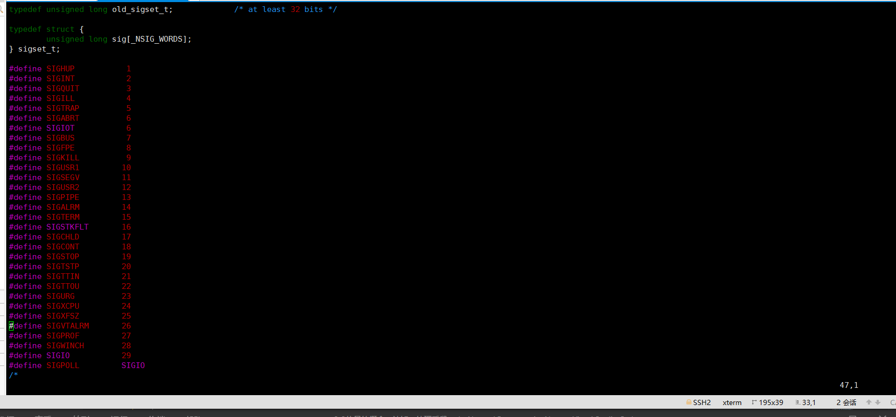
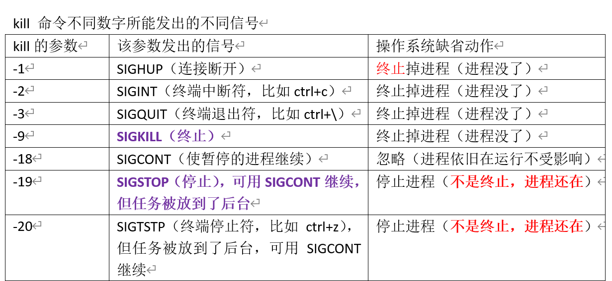
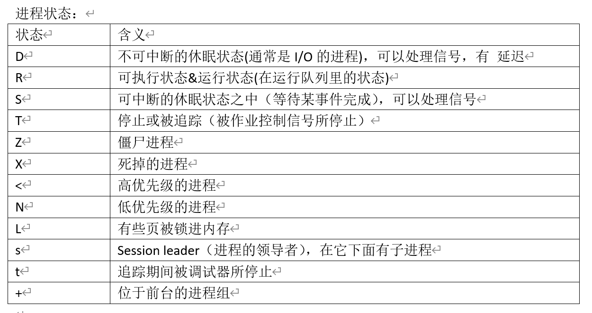
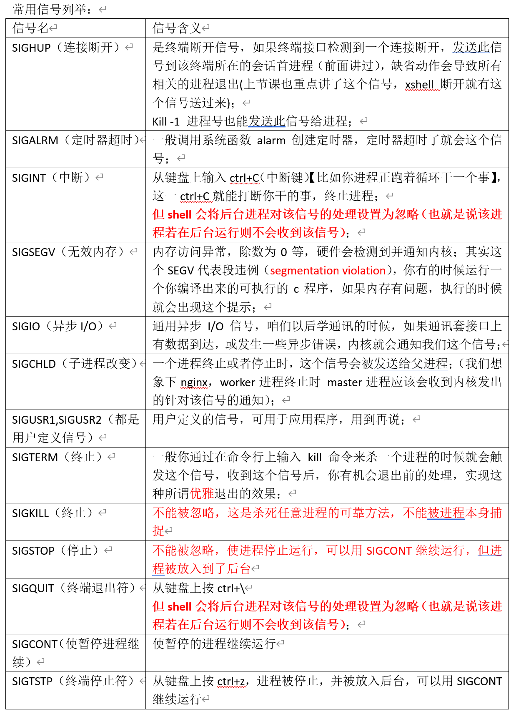

# （1）信号的基本概念

进程之间的常用通信手段：发送信号 kill
SIGHUP
信号：通知（事情事件通知），用来通知某个进程发生了某些事情
而这些事件，往往都是突然到来的突发事件，进程本身并不知道这些事件是什么时候发生的，换句话来说就是信号是异步发生的
信号也被称呼为 软中断"软件中断"

信号如何产生？

* 1）某个进程发生给另外一个进程或者发送给自己
* 2）由内核（操作系统）发送给某个进程
  * 2-1）通过在键盘输入 ctrl c【中断信号】/kill 命令
  * 2-2）内存访问异常。除数为0了等等，硬件都会检测到并且通知内核

信号名字。都是以SIG开头的，（SIGHUP【终端断开信号】)
unix以及类unix操作系统（linux,freebsd,solaris)：支持的信号数量各有不同，10-6-之间

信号既有名字：其实也都是一些数字，信号是一些正整数常量

```c
#include <signal.h>
// 一般都是在 /usr/include/
// gcc在编译的时候，一般都会去这些路径下搜索头文件
// 头文件。包含路径：/usr/local/include  /usr/include
// 库文件。包含路径：/usr/local/lib/     /ust/lib
```

sudo find / -name "signal.h" | xargs grep -in "SIGHUP"
sudo：管理员权限
find：查询
/ 表示从根目录开始查询
-name 表示使用name来查询
"signal.h" 表示这个name就时signal.h
| 管道符
xargs 这个用来给其他命令传递参数
grep 搜索，筛选
-in -i表示查找的时候忽略大小写，-n表示查找结果显示行号
"SIGHUP" 表示我们要搜索的内容

这句指令就是从根目录开始搜索所有叫“signal.h”的文件，然后通过 xargs这个将搜索结果的内容传递到搜索工具 grep 中，grep再在这些内容中忽略大小写查找 “SIGHUP”，并显示结果所在行号
如果这里不用xargs那么就不是在内容中搜索，而是在文件名中搜索。

```shell
invi@inviubuntu:~$ sudo find / -name "signal.h" | xargs grep -in "SIGHUP"
[sudo] password for invi: 
/usr/src/linux-headers-5.11.0-37/arch/powerpc/include/uapi/asm/signal.h:21:#define SIGHUP   1
/usr/src/linux-headers-5.11.0-37/arch/xtensa/include/uapi/asm/signal.h:35:#define SIGHUP   1
/usr/src/linux-headers-5.11.0-37/arch/s390/include/uapi/asm/signal.h:26:#define SIGHUP           1
/usr/src/linux-headers-5.11.0-37/arch/sparc/include/uapi/asm/signal.h:12:#define SIGHUP   1
/usr/src/linux-headers-5.11.0-37/arch/parisc/include/uapi/asm/signal.h:5:#define SIGHUP   1
/usr/src/linux-headers-5.11.0-37/arch/arm/include/uapi/asm/signal.h:18:#define SIGHUP   1
/usr/src/linux-headers-5.11.0-37/arch/m68k/include/uapi/asm/signal.h:18:#define SIGHUP   1
/usr/src/linux-headers-5.11.0-37/arch/alpha/include/uapi/asm/signal.h:23:#define SIGHUP   1
/usr/src/linux-headers-5.11.0-37/arch/mips/include/uapi/asm/signal.h:25:#define SIGHUP   1 /* Hangup (POSIX).  */
/usr/src/linux-headers-5.11.0-37/arch/h8300/include/uapi/asm/signal.h:18:#define SIGHUP   1
/usr/src/linux-headers-5.11.0-37/arch/ia64/include/uapi/asm/signal.h:13:#define SIGHUP   1
/usr/src/linux-headers-5.11.0-37/arch/x86/include/uapi/asm/signal.h:23:#define SIGHUP   1
/usr/src/linux-headers-5.11.0-37/include/linux/signal.h:352: * |  SIGHUP            |  terminate |
/usr/src/linux-headers-5.11.0-37/include/uapi/asm-generic/signal.h:11:#define SIGHUP   1
/usr/include/asm-generic/signal.h:11:#define SIGHUP   1
/usr/include/x86_64-linux-gnu/asm/signal.h:21:#define SIGHUP   1

```

去到signal.h中查看信号是如何进行定义的

```shell
invi@inviubuntu:~$ cd /
invi@inviubuntu:/$ cd /usr/src/linux-headers-5.11.0-37/arch/powerpc/include/uapi/asm/
invi@inviubuntu:/usr/src/linux-headers-5.11.0-37/arch/powerpc/include/uapi/asm$ ls-la
ls-la: command not found
invi@inviubuntu:/usr/src/linux-headers-5.11.0-37/arch/powerpc/include/uapi/asm$ vim signal.h 
```



# （2）通过kill命令认识一些信号

kill ： kill 进程ID  杀死一个进程

kill的工作是发送信号给一个进程，它能给进程发送多个信号
想观察进程收到那些信号，可以使用strace工具

```shell
# 终端0 启动nginx

# 终端1 跟踪nginx进程
invi@inviubuntu:/mnt/hgfs/nginxWeb$ sudo strace -e trace=signal -p 14297
[sudo] password for invi: 
strace: Process 14297 attached

# 终端2 查看进程信息
invi@inviubuntu:~$ ps -eo pid,ppid,sid,tty,pgrp,comm | grep -E 'bash|PID|nginx'
    PID    PPID     SID TT          PGRP COMMAND
  10771   10770   10771 pts/1      10771 bash
  13070   13069   13070 pts/0      13070 bash
  14297   13070   13070 pts/0      14297 nginx
  14511   14510   14511 pts/2      14511 bash

```

然后kill nginx
跟踪打印显示

```shell
kill 14279

# 跟踪显示
--- SIGTERM {si_signo=SIGTERM, si_code=SI_USER, si_pid=14511, si_uid=1000} ---
+++ killed by SIGTERM +++

```

如果你单纯使用kill进程ID，那么就是往该进程发送 SIGTERM 信号（终止信号）

测试其他 kill 带信号

```shell
# 启动nginx

# 查看进程信息
invi@inviubuntu:~$ ps -eo pid,ppid,sid,tty,pgrp,comm | grep -E 'bash|PID|nginx'
    PID    PPID     SID TT          PGRP COMMAND
  10771   10770   10771 pts/1      10771 bash
  13070   13069   13070 pts/0      13070 bash
  14511   14510   14511 pts/2      14511 bash
  14708   13070   13070 pts/0      14708 nginx

# 跟踪nginx进程信号
invi@inviubuntu:/mnt/hgfs/nginxWeb$ sudo strace -e trace=signal -p 14708
strace: Process 14708 attached

```

kill 发送 -1 (SIGHUP)

```shell
invi@inviubuntu:~$ kill -1 14708

--- SIGHUP {si_signo=SIGHUP, si_code=SI_USER, si_pid=14511, si_uid=1000} ---
+++ killed by SIGHUP +++

```

1）所以 kill -数字 进程ID 能够发出该数字对应的信号
2）如果我们使用 kill -1 进程ID 那么就是往nginx中发送 SIGHUP终止信号，同时nginx进程被终止
3）kill -2 进程ID 发送 SIGINT 信号

一些常见的kill信号量



# （3）进程的状态

ps -eo pid,ppid,sid,tty,pgrp,comm,stat | grep -E 'bash|PID|nginx'
或者
ps aux | grep -E 'bash|PID|NGINX'



查看进程状态

```shell
invi@inviubuntu:~$ ps -eo pid,ppid,sid,tty,pgrp,comm,stat | grep -E 'bash|PID|nginx'
    PID    PPID     SID TT          PGRP COMMAND         STAT
  10771   10770   10771 pts/1      10771 bash            Ss+
  13070   13069   13070 pts/0      13070 bash            Ss
  14511   14510   14511 pts/2      14511 bash            Ss
  19062   13070   13070 pts/0      19062 nginx           S+
invi@inviubuntu:~$ ps aux | grep -E 'bash|PID|NGINX'
USER         PID %CPU %MEM    VSZ   RSS TTY      STAT START   TIME COMMAND
invi       10771  0.0  0.1   8700  5604 pts/1    Ss+  07:04   0:00 -bash
invi       13070  0.0  0.1   8700  5736 pts/0    Ss   08:16   0:00 -bash
invi       14511  0.0  0.1   8568  5400 pts/2    Ss   09:08   0:00 -bash
invi       19072  0.0  0.0   6524   852 pts/2    S+   12:15   0:00 grep --color=auto -E bash|PID|NGINX

```

执行kill -19 进程ID
nginx进程状态由s+ 变成了 T
再执行 kill -18 进程ID
让进程继续执行
状态变成了 s （后台运行）

```shell
invi@inviubuntu:~$ kill -19 19062
invi@inviubuntu:~$ ps -eo pid,ppid,sid,tty,pgrp,comm,stat | grep -E 'bash|PID|nginx'
    PID    PPID     SID TT          PGRP COMMAND         STAT
  10771   10770   10771 pts/1      10771 bash            Ss+
  13070   13069   13070 pts/0      13070 bash            Ss+
  14511   14510   14511 pts/2      14511 bash            Ss
  19062   13070   13070 pts/0      19062 nginx           T

invi@inviubuntu:~$ kill -18 19062
invi@inviubuntu:~$ ps -eo pid,ppid,sid,tty,pgrp,comm,stat | grep -E 'bash|PID|nginx'
    PID    PPID     SID TT          PGRP COMMAND         STAT
  10771   10770   10771 pts/1      10771 bash            Ss+
  13070   13069   13070 pts/0      13070 bash            Ss+
  14511   14510   14511 pts/2      14511 bash            Ss
  19062   13070   13070 pts/0      19062 nginx           S

```

所以 kill 只是发个信号，而不是单纯的杀死的意思。

# （4）常用的信号列举



注意：这里 SIGKILL 和 SIGSTOP 这两个信号，无论你在程序里怎么写忽略，都不会生效，这两个信号不能被忽略
不能被进程本身捕捉

所以遇到杀不死的进程，可以使用 kill -9 ID 来杀死
同样的，遇到无法停止的进程，可以使用功能 kill -19 ID 来停止

# （5）信号处理的相关动作

当某个信号出现时;我们可以按照三种方式之一进行处理，我们称之为信号处理或者信号相关动作
1）执行系统默认动作（绝大多数都是杀死）
2）忽略此信号； signal(SIGHUP, SIG_IGN); 程序收到这个信号后，请求系统不要干掉我
3）捕获该信号：写一个处理函数，等到信号来得时候，使用该函数进行处理
