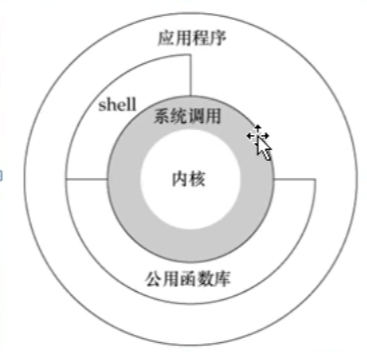
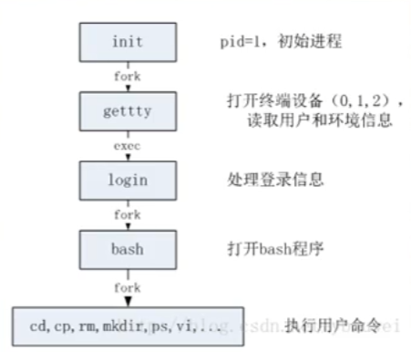
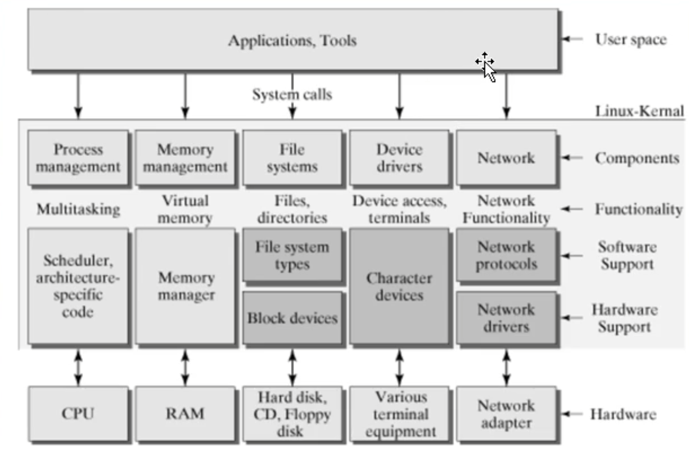
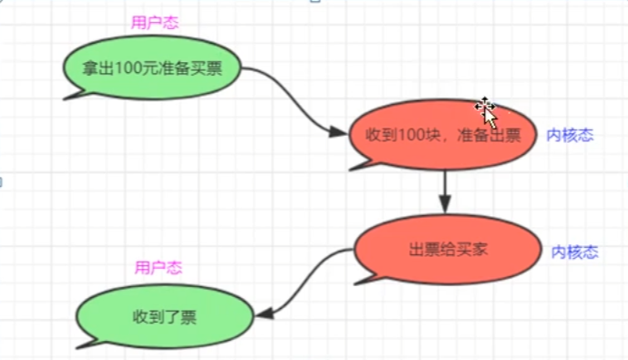
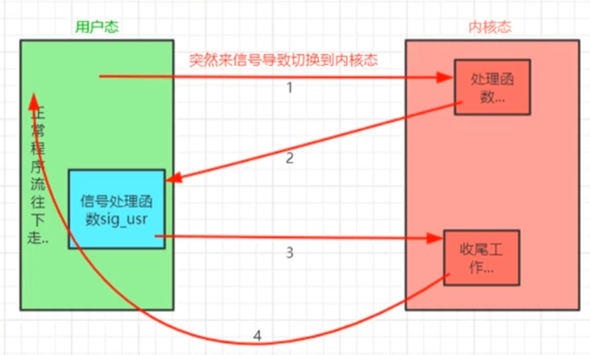
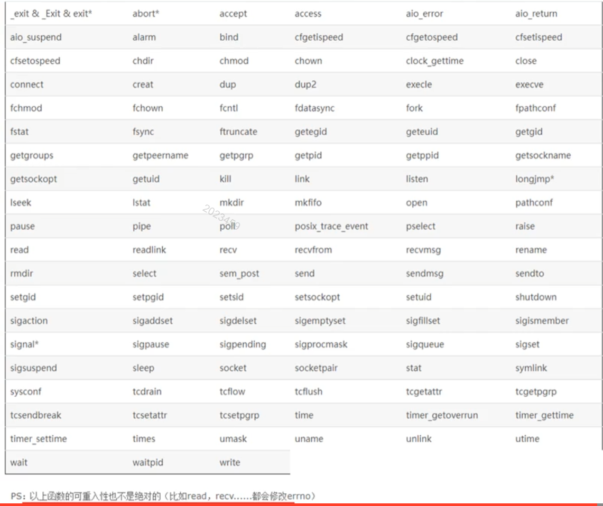

# （1）Unix/Linux操作系统体系结构



类Unix操作系统结构分为两个状态
用户态 、 内核态

* 1）操作系统/内核：用来控制计算机硬件资源，提供应用程序运行的环境
我们写的一样程序，他要么运行在用户态，要么运行在内核态。一般都是运行在用户态
当程序需要执行一些特殊代码的时候，程序就可能切换到内核态、这种切换由操作系统控制，不需要认为介入

* 2）换种角度理解，用户态;最外圈应用程序的活动空间

系统调用：就是一些函数（系统函数），你只需要调用这些函数；

* 3）shell: bash(borne again shell[重新装配的shell]),它是shell的一种，linux上默认采用的是bash这种shell;
通俗一点理解，bash是一个可执行程序；主要作用是：把用户输入的命令翻译给操作系统（命令解释器）；
分隔系统调用 和应用程序； 有胶水的感觉；

login进程启动bash流程图


* 4）用户态，内核态之间的切换

而运行在内核态的进程可以执行任何操作并且在资源的使用上没有限制（内核态权限大）；
一个进程执行的时候，大部分时间是处于用户态下的，只有需要内核所提供的服务时 才会切换到内核态，内核态做的事情完成后，又转回到用户态；

系统内核细分图


### 疑问：为什么要区分用户态，内核态

大概有两个目的：

* (1)一般情况下，程序都运行在用户态状态，权限小，不至于危害到系统其它部分；当你干一些危险的事情的时候，系统给你提供接口，让你去干；
* (2)既然这些接口是系统提供给你的，那么这些接口也是操作系统统一管理的；
资源是有限的， 如果大家都来访问这些资源，如果不加以管理，一个是访问冲突，一个是被访问的资源如果耗尽，那系统还可能崩溃；
系统提供这些接口，就是为了减少有限的资源的访问以及使用上冲突；



那么什么时候从用户态切换到内核态去呢？

* a)系统调用，比如调用malloc();
* b)异常事件，比如来了个信号；
* c)外围设备中断：

总结起来，只需要知道 用户态，内核态，两者根据需要自动切换

# （2）signal函数范例

信号来了之后，可以忽略，可以捕捉。使用signal函数

范例代码：

```c
#include <stdio.h>
#include <stdlib.h>
#include <unistd.h>
#include <signal.h>
#include <errno.h>

//信号处理函数
void sig_usr(int signo)
{

    int myerrno = errno;

    if(signo == SIGUSR1)
    {
        printf("收到了SIGUSR1信号!\n");
    }
    else if(signo == SIGUSR2)
    {
        printf("收到了SIGUSR2信号!\n");
    }
    else
    {
        printf("收到了未捕捉的信号%d!\n",signo);
    }
    

    //g_mysign = tmpsign;
    errno = myerrno;
}

int main(int argc, char *const *argv)
{
    if(signal(SIGUSR1,sig_usr) == SIG_ERR)  //系统函数，参数1：是个信号，参数2：是个函数指针，代表一个针对该信号的捕捉处理函数
    {
        printf("无法捕捉SIGUSR1信号!\n");
    }
    if(signal(SIGUSR2,sig_usr) == SIG_ERR) 
    {
        printf("无法捕捉SIGUSR2信号!\n");
    }
    for(;;)
    {
        sleep(1); //休息1秒
        printf("休息1秒\n");        
    }
    printf("再见!\n");
    return 0;
}
```

编译启动后查看进程信息

```shell
invi@inviubuntu:~$ ps -eo pid,ppid,sid,tty,pgrp,comm,stat | grep -E 'bash|PID|nginx3_3_1'
    PID    PPID     SID TT          PGRP COMMAND         STAT
   1442    1441    1442 pts/0       1442 bash            Ss
   1691    1442    1442 pts/0       1691 nginx3_3_1      S+
   1769    1768    1769 pts/1       1769 bash            Ss

invi@inviubuntu:~$ kill -USR1 1691

#    收到了SIGUSR1信号!
```

如果你使用kill发送一些程序里没有捕获的参数，那么系统会执行该参数的默认动作。

你的进程收到了信号，那么这个信息就会被内核知道，



## （2.1）可重入函数

```c
#include <stdio.h>
#include <stdlib.h>
#include <unistd.h>
#include <signal.h>
#include <errno.h>

int g_mysign = 0;
void muNEfunc(int value) //我这个函数能够修改这个全局变量g_mysign的值
{
    //.....其他处理代码
    g_mysign = value;  
    //.....其他处理代码
}

//信号处理函数
void sig_usr(int signo)
{     
    //int tmpsign = g_mysign;   
    //muNEfunc(22); //因为一些实际需求必须要在sig_user这个信号处理函数里调用muNEfunc

    int myerrno = errno;

    if(signo == SIGUSR1)
    {
        printf("收到了SIGUSR1信号!\n");
    }
    else if(signo == SIGUSR2)
    {
        printf("收到了SIGUSR2信号!\n");
    }
    else
    {
        printf("收到了未捕捉的信号%d!\n",signo);
    }
    

    //g_mysign = tmpsign;
    errno = myerrno;
}

int main(int argc, char *const *argv)
{
    if(signal(SIGUSR1,sig_usr) == SIG_ERR)  //系统函数，参数1：是个信号，参数2：是个函数指针，代表一个针对该信号的捕捉处理函数
    {
        printf("无法捕捉SIGUSR1信号!\n");
    }
    if(signal(SIGUSR2,sig_usr) == SIG_ERR) 
    {
        printf("无法捕捉SIGUSR2信号!\n");
    }
    for(;;)
    {
        sleep(1); //休息1秒
        printf("休息1秒\n");        
        
        muNEfunc(15);
        printf("g_mysign=%d\n",g_mysign); 
        //拿g_mysign做一些其他用途；
    }
    printf("再见!\n");
    return 0;
}

```

严格意义上来说：这里的muNEfunc()不应该是一个可重入函数
所谓的可重入函数，就是我在信号处理函数中调用它是安全的
在信号处理函数中保证调用安全的函数，这些函数是可重入的并被称为异步信号安全的
有一些周知的函数都是不可重入的，比如 malloc(), printf()等

在写信号处理函数的时候需要注意的事项：

* 1）在信号处理函数中，尽量使用简单的语句做简单的事，尽量不要调用系统函数以免引起不必要的麻烦；
* 2）如果必须要在信号处理函数中调用系统函数，那么一定要保证在信号处理函数中调用的系统函数是可重入的（异步信号安全的）
* 3）如果必须要在信号处理函数中调用那些可能修改errno值得可重入系统函数，那么就得事先备份errno值
然后再信号处理函数返回之前将errno值回复回来

一些异步信号安全的系统函数



*ps: errno 一个系统全局量 Linux中系统调用的错误都存储于 errno中，errno由操作系统维护，存储就近发生的错误，即下一次的错误码会覆盖掉上一次的错误。只有当系统调用或者调用lib函数时出错，才会置位errno！*

## （2.2）不可重入函数的错用演示

```c


#include <stdio.h>
#include <stdlib.h>  //malloc
#include <unistd.h>
#include <signal.h>

//信号处理函数
void sig_usr(int signo)
{   
    //这里也malloc，这是错用，不可重入函数不能用在信号处理函数中；
    //int* p;
    //p = (int *) malloc (sizeof(int)); //用了不可重入函数；
    //free(p);

    if(signo == SIGUSR1)
    {
        printf("收到了SIGUSR1信号!\n");
    }
    else if(signo == SIGUSR2)
    {
        printf("收到了SIGUSR2信号!\n");
    }
    else
    {
        printf("收到了未捕捉的信号%d!\n",signo);
    }
    
}

int main(int argc, char *const *argv)
{
    if(signal(SIGUSR1,sig_usr) == SIG_ERR)  //系统函数，参数1：是个信号，参数2：是个函数指针，代表一个针对该信号的捕捉处理函数
    {
        printf("无法捕捉SIGUSR1信号!\n");
    }
    if(signal(SIGUSR2,sig_usr) == SIG_ERR) 
    {
        printf("无法捕捉SIGUSR2信号!\n");
    }
    for(;;)
    {
        //sleep(1); //休息1秒
        //printf("休息1秒\n");              
        int* p;
        p = (int *) malloc (sizeof(int));
        free(p);
    }
    printf("再见!\n");
    return 0;
}
```

signal()函数因为一些可靠性，兼容性等等一些历史性问题，不建议使用
官方建议使用：sigaction()函数代替
