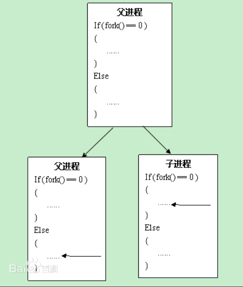
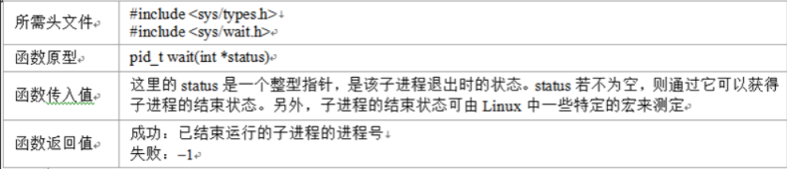
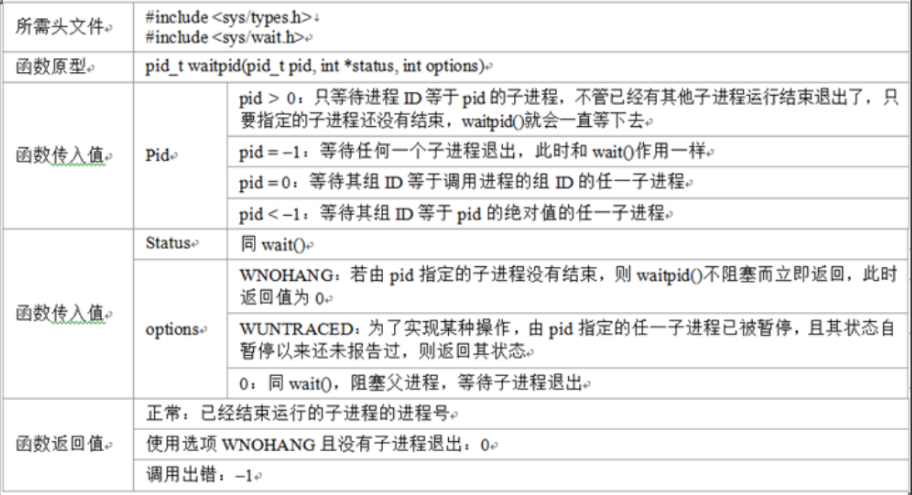
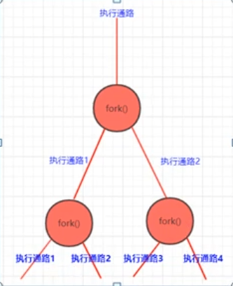
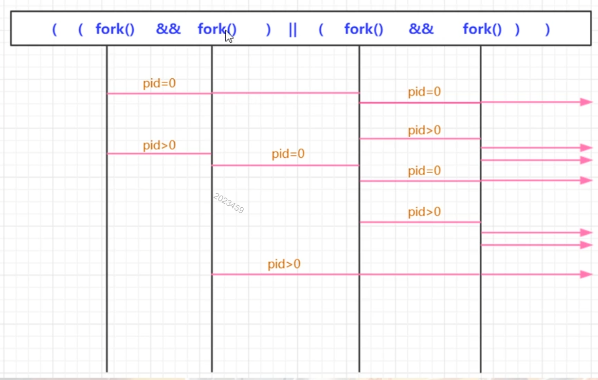

# （1）fork()函数简单认识

创建进程；
//进程的概念：
一个可执行程序，执行起来就是一个进程，再执行起来一次，它就又是一个进程（多个进程可以共享同一个可执行文件）
文雅说法：进程 定义为程序执行的一个实例；

在一个进程（程序）中，可以用fork()创建一个子进程，当该子进程创建时，
它从fork()指令的下一条(或者说从fork()的返回处)开始执行与父进程相同的代码；

a)说白了：fork()函数产生了一个和当前进程完全一样的新进程，并和当前进程一样从fork()函数里返回；
原来一条执行通路（父进程），现在变成两条（父进程+子进程）



## （1.1）fork()函数简单范例

ps -eo pid,ppid,sid,tty,pgrp,comm,stat | grep -E ‘bash|PID|nginx’
fork()之后，是父进程fork()之后的代码先执行还是子进程fork()之后的代码先执行是不一定的；这个跟内核调度算法有关；

```c
#include <stdio.h>
#include <stdlib.h>  //malloc,exit
#include <unistd.h>  //fork
#include <signal.h>

//信号处理函数
void sig_usr(int signo)
{
    printf("收到了SIGUSR1信号，进程id=%d!\n",getpid());    
}

int main(int argc, char *const *argv)
{
    pid_t  pid;

    printf("进程开始执行!\n");

    //先简单处理一个信号
    if(signal(SIGUSR1,sig_usr) == SIG_ERR)  //系统函数，参数1：是个信号，参数2：是个函数指针，代表一个针对该信号的捕捉处理函数
    {
        printf("无法捕捉SIGUSR1信号!\n");
        exit(1);
    }

    //---------------------------------
    pid = fork();  //创建一个子进程

    //要判断子进程是否创建成功
    if(pid < 0)
    {
        printf("子进程创建失败，很遗憾!\n");
        exit(1);
    }

    //现在，父进程和子进程同时开始 运行了 
    for(;;)
    {        
        sleep(1); //休息1秒
        printf("休息1秒，进程id=%d!\n",getpid());
    }
    printf("再见了!\n");
    return 0;
}
```

编译运行后，重启一个新终端，查看进程信息

```shell
invi@inviubuntu:~$ ps -eo pid,ppid,sid,tty,pgrp,comm,stat | grep -E 'bash|PID|nginx3_6_1'
    PID    PPID     SID TT          PGRP COMMAND         STAT
   1442    1441    1442 pts/0       1442 bash            Ss
   1769    1768    1769 pts/1       1769 bash            Ss
  12040    1442    1442 pts/0      12040 nginx3_6_1      S+
  12041   12040    1442 pts/0      12040 nginx3_6_1      S+
```

跟踪父进程，然后查看在杀死子进程的时候，父进程的信号接收结果

```shell
invi@inviubuntu:~$ sudo strace -e trace=signal -p 12040
[sudo] password for invi: 
strace: Process 12040 attached

invi@inviubuntu:~$ kill -9 12041

# 父进程跟踪显示结果（父进程收到一个来自于子进程的SIGCHLD信号）
--- SIGCHLD {si_signo=SIGCHLD, si_code=CLD_KILLED, si_pid=12041, si_uid=1000, si_status=SIGKILL, si_utime=0, si_stime=0} ---

# ps查看进程信息

invi@inviubuntu:~$ ps -eo pid,ppid,sid,tty,pgrp,comm,stat | grep -E 'bash|PID|nginx'
    PID    PPID     SID TT          PGRP COMMAND         STAT
   1442    1441    1442 pts/0       1442 bash            Ss
   1769    1768    1769 pts/1       1769 bash            Ss
  12040    1442    1442 pts/0      12040 nginx3_6_1      S+
  12041   12040    1442 pts/0      12040 nginx <defunct> Z+     # 注意这行，子进程依然存在，但是变成了僵尸进程
  12265   12264   12265 pts/2      12265 bash            Ss

```

kill子进程，观察父进程收到什么信号:SIGCHLD信号 ，子进程变成了僵尸进程Z

## （1.2）僵尸进程的产生、解决，SIGCHLD

僵尸进程的产生：在Unix系统中，一个子进程结束了，但是他的父进程还活着，
但该父进程没有调用(wait/waitpid)函数来进行额外的处置，那么这个子进程就会变成一个僵尸进程；
僵尸进程：已经被终止，不干活了，但是依旧没有被内核丢弃掉，因为内核认为父进程可能还需要该子进程的一些信息；
作为开发者，坚决不允许僵尸进程的存在；

如何干掉僵尸进程：

* a)重启电脑
* b)手工的把僵尸进程的父进程kill掉，僵尸进程就会自动消失；

SIGCHLD信号：一个进程被终止或者停止时，这个信号会被发送给父进程；
所以，对于源码中有fork()行为的进程，我们 应该拦截并处理SIGCHLD信号；

wait函数语法：


waitpid函数语法


```c
#include <stdio.h>
#include <stdlib.h>  //malloc,exit
#include <unistd.h>  //fork
#include <signal.h>
#include <sys/wait.h>  //waitpid

//信号处理函数
void sig_usr(int signo)
{
    int  status;

    switch(signo)
    {
    case SIGUSR1:
        printf("收到了SIGUSR1信号，进程id=%d!\n",getpid());    
        break;
    
    case SIGCHLD:        
        printf("收到了SIGCHLD信号，进程id=%d!\n",getpid());    
        //这里大家学了一个新函数waitpid，有人也用wait,要求掌握和使用waitpid即可；
        //这个waitpid说白了获取子进程的终止状态，这样，子进程就不会成为僵尸进程了；
        pid_t pid = waitpid(-1,&status,WNOHANG); //第一个参数为-1，表示等待任何子进程，
                                      //第二个参数：保存子进程的状态信息(大家如果想详细了解，可以百度一下)。
                                       //第三个参数：提供额外选项，WNOHANG表示不要阻塞，让这个waitpid()立即返回
        if(pid == 0)       //子进程没结束，会立即返回这个数字，但这里应该不是这个数字                        
            return;
        if(pid == -1)      //这表示这个waitpid调用有错误，有错误也理解返回出去，我们管不了这么多
            return;
        //走到这里，表示  成功，那也return吧
        return;   
        break;    
    } //end switch
}

int main(int argc, char *const *argv)
{
    pid_t  pid;

    printf("进程开始执行!\n");

    //先简单处理一个信号
    if(signal(SIGUSR1,sig_usr) == SIG_ERR)  //系统函数，参数1：是个信号，参数2：是个函数指针，代表一个针对该信号的捕捉处理函数
    {
        printf("无法捕捉SIGUSR1信号!\n");
        exit(1);
    }

    if(signal(SIGCHLD,sig_usr) == SIG_ERR) 
    {
        printf("无法捕捉SIGCHLD信号!\n");
        exit(1);
    }

    //---------------------------------
    pid = fork();  //创建一个子进程

    //要判断子进程是否创建成功
    if(pid < 0)
    {
        printf("子进程创建失败，很遗憾!\n");
        exit(1);
    }

    //现在，父进程和子进程同时开始 运行了 
    for(;;)
    {        
        sleep(1); //休息1秒
        printf("休息1秒，进程id=%d!\n",getpid());
    }
    printf("再见了!\n");
    return 0;
}

```

编译运行后，查看进程信息

```shell
invi@inviubuntu:~$ clear
invi@inviubuntu:~$ ps -eo pid,ppid,sid,tty,pgrp,comm,stat | grep -E 'bash|PID|nginx'
    PID    PPID     SID TT          PGRP COMMAND         STAT
   1442    1441    1442 pts/0       1442 bash            Ss
   1769    1768    1769 pts/1       1769 bash            Ss
  12265   12264   12265 pts/2      12265 bash            Ss+
  12873    1442    1442 pts/0      12873 nginx3_6_2      S+
  12874   12873    1442 pts/0      12873 nginx3_6_2      S+

# kill 子进程，查看进程信息
invi@inviubuntu:~$ ps -eo pid,ppid,sid,tty,pgrp,comm,stat | grep -E 'bash|PID|nginx'
    PID    PPID     SID TT          PGRP COMMAND         STAT
   1442    1441    1442 pts/0       1442 bash            Ss
   1769    1768    1769 pts/1       1769 bash            Ss
  12265   12264   12265 pts/2      12265 bash            Ss+
  12873    1442    1442 pts/0      12873 nginx3_6_2      S+

```

# （2）fork()函数进一步认识

b)fork()产生新进程的速度非常快，fork()产生的新进程并不复制原进程的内存空间，而是和原进程（父进程)一起共享一个内存空间，但这个内存空间的特性是“写时复制”，也就是说：
原来的进程和fork()出来的子进程可以同时、自由的读取内存，但如果子进程（父进程）对内存进行修改的话，那么这个内存就会复制一份给该进程单独使用，以免影响到共享这个内存空间的其他进程使用；

```c
#include <stdio.h>
#include <stdlib.h>  //malloc,exit
#include <unistd.h>  //fork
#include <signal.h>

int main(int argc, char *const *argv)
{
    
    fork();  //一般fork都会成功所以不判断返回值了,我们假定成功
    fork();

    //((fork() && fork()) || (fork() && fork()));
    //printf("每个实际用户ID的最大进程数=%ld\n",sysconf(_SC_CHILD_MAX));

    
    for(;;)
    {        
        sleep(1); //休息1秒
        printf("休息1秒，进程id=%d!\n",getpid());
    }
    printf("再见了!\n");
    return 0;
}
```

fork情况（执行结束，fork出来了4个进程）



```shell
invi@inviubuntu:~$ ps -eo pid,ppid,sid,tty,pgrp,comm,stat | grep -E 'bash|PID|nginx'
    PID    PPID     SID TT          PGRP COMMAND         STAT
   1442    1441    1442 pts/0       1442 bash            Ss
   1769    1768    1769 pts/1       1769 bash            Ss
  12265   12264   12265 pts/2      12265 bash            Ss+
  13153    1442    1442 pts/0      13153 nginx3_6_3      S+
  13154   13153    1442 pts/0      13153 nginx3_6_3      S+
  13155   13153    1442 pts/0      13153 nginx3_6_3      S+
  13156   13154    1442 pts/0      13153 nginx3_6_3      S+
```

# （3）完善一下fork()代码

fork()回返回两次：父进程中返回一次，子进程中返回一次,而且，fork()在父进程中返回的值和在子进程中返回的值是不同的子进程的fork()返回值是0；
父进程的fork()返回值是新建立的子进程的ID，因为全局量g_mygbltest的值发生改变，导致主，子进程内存被单独的分开，所以每个的g_mygbltest值也不同；

```c
#include <stdio.h>
#include <stdlib.h>  //malloc,exit
#include <unistd.h>  //fork
#include <signal.h>

int g_mygbltest = 0;
int main(int argc, char *const *argv)
{
    pid_t  pid;
    printf("进程开始执行!\n");   
    //---------------------------------
    pid = fork();  //创建一个子进程

    //要判断子进程是否创建成功
    if(pid < 0)
    {
        printf("子进程创建失败，很遗憾!\n");
        exit(1);
    }

    //现在，父进程和子进程同时开始 运行了 
    //for(;;)
    //{        
    //    sleep(1); //休息1秒
    //    printf("休息1秒，进程id=%d!\n",getpid());
    //}
    //printf("再见了!\n");

    //走到这里，fork()成功，执行后续代码的可能是父进程，也可能是子进程
    if(pid == 0)
    {
        //子进程，因为子进程的fork()返回值会是0；
        //这里专门针对子进程的处理代码
        while(1)
        {
            g_mygbltest++;
            sleep(1); //休息1秒
            printf("真是太高兴了，我是子进程的，我的进程id=%d,g_mygbltest=%d!\n",getpid(),g_mygbltest);
        }
    }
    else
    {
        //这里就是父进程，因为父进程的fork()返回值会 > 0（实际返回的是子进id程）
        //这是专门针对父进程的处理代码
        while(1)
        {
            g_mygbltest++;
            sleep(5); //休息5秒
            printf("......。。，我是父进程的，我的进程id=%d,g_mygbltest=%d!\n",getpid(),g_mygbltest);
        }
    }

    return 0;
}

```

## （3.1）一个和fork()执行有关的逻辑判断

||或：有1出1，全0出0；
&&与：全1出1，有0出0；

<strong>((fork() && fork()) || (fork() && fork()))</strong>
的执行结果是产生几个进程

*注意：fork()的结果是0(pid=0) 和 子进程id(pid>0)*

|fork()|&&|fork()|\|\||fork()|&&|fork()|进程|
|---|---|---|---|---|---|---|---|
|pid=0||不执行||pid=0||不执行|第1条进程通路|
|||||pid>0||pid=0|第2条进程通路|
|||||||pid>0|第3条进程通路|
|pid>0||pid=0||pid=0||不执行|第4条进程通路|
|||||pid>0||pid=0|第5条进程通路|
|||||||pid>0|第6条进程通路|
|||pid>0|||||第7条进程通路|

一个箭头代表一个进程通路


# （4）fork()失败的可能性

a)系统中进程太多
缺省情况，最大的pid：32767

b)每个用户有个允许开启的进程总数；
7788
