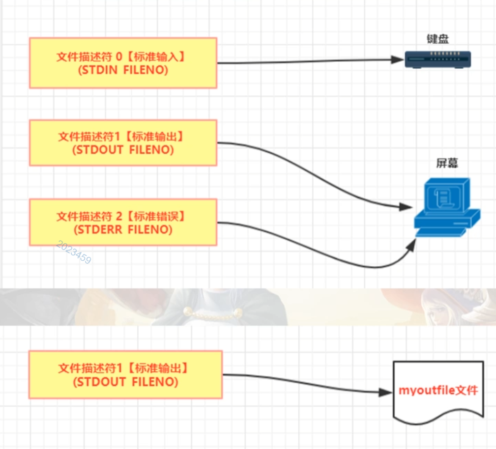
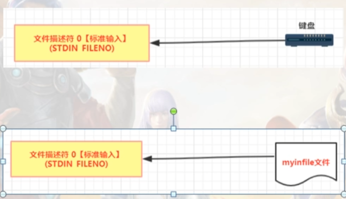
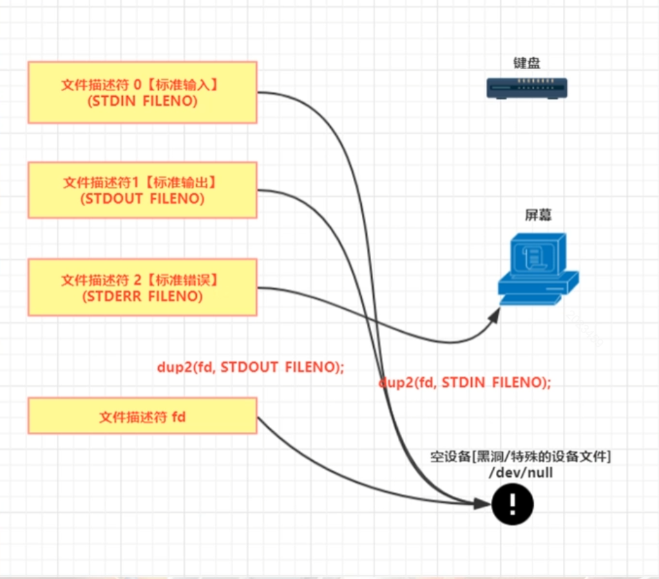

# （1）普通进程运行观察

```c
#include <stdio.h>
#include <stdlib.h>  //malloc
#include <unistd.h>
#include <signal.h>

int main(int argc, char *const *argv)
{  
    printf("进程开始执行!\n");
    write(STDOUT_FILENO,"aaaabbb",6);
    
    for(;;)
    {        
        sleep(1); //休息1秒
        //printf("休息1秒，进程id=%d!\n",getpid()); 
    }
    printf("再见了!\n");
    return 0;
}

```

编译运行后，查看进程信息

```shell
invi@inviubuntu:~$ ps -eo pid,ppid,sid,tty,pgrp,comm,stat | grep -E 'bash|PID|nginx'
    PID    PPID     SID TT          PGRP COMMAND         STAT
   1442    1441    1442 pts/0       1442 bash            Ss
   1769    1768    1769 pts/1       1769 bash            Ss
  12265   12264   12265 pts/2      12265 bash            Ss+
  14695    1442    1442 pts/0      14695 nginx3_7_1      S+

```

ps -eo pid,ppid,sid,tty,pgrp,comm,stat,cmd | grep -E ‘bash|PID|nginx’
a)进程有对应的终端，如果终端退出，那么对应的进程也就消失了；它的父进程是一个bash
b)终端被占住了，你输入各种命令这个终端都没有反应；

# （2）守护进程基本概念

守护进程 一种长期运行的进程：这种进程在后台运行，并且不跟任何的控制终端关联；
基本特点：
a)生存期长[不是必须，但一般应该这样做]，一般是操作系统启动的时候他就启动，操作系统关闭的时候他才关闭；
b)守护进程跟终端无关联，也就是说他们没有控制终端，所以你控制终端退出，也不会导致守护进程退出；
c)守护进程是在后台运行,不会占着终端，终端可以执行其他命令

linux操作系统本身是有很多的守护进程在默默的运行，维持着系统的日常活动。大概30-50个；

```shell
invi@inviubuntu:~$ ps -efj
UID          PID    PPID    PGID     SID  C STIME TTY          TIME CMD
root           1       0       1       1  0 00:51 ?        00:00:02 /sbin/init
root           2       0       0       0  0 00:51 ?        00:00:00 [kthreadd]
root           3       2       0       0  0 00:51 ?        00:00:00 [rcu_gp]
root           4       2       0       0  0 00:51 ?        00:00:00 [rcu_par_gp]
root           6       2       0       0  0 00:51 ?        00:00:00 [kworker/0:0H-events_hi
root           7       2       0       0  0 00:51 ?        00:00:09 [kworker/0:1-events]
root           9       2       0       0  0 00:51 ?        00:00:00 [mm_percpu_wq]
·····

```

a)ppid = 0：内核进程，跟随系统启动而启动，声明周期贯穿整个系统；
b)cmd列名字带[]这种，叫内核守护进程；
c)老祖init：也是系统守护进程,它负责启动各运行层次特定的系统服务；所以很多进程的PPID是init。而且这个init也负责收养孤儿进程；
d)cmd列中名字不带[]的普通守护进程（用户级守护进程）

共同点总结：
a)大多数守护进程都是以超级 用户特权运行的；
b)守护进程没有控制终端，TT这列显示?
内核守护进程以无控制终端方式启动
普通守护进程可能是守护进程调用了setsid的结果（无控制端）；

# （3）守护进程编写规则

* (1)调用umask(0);
umask是个函数，用来限制（屏蔽）一些文件权限的。
* (2)fork()一个子进程(脱离终端)出来,然后父进程退出( 把终端空出来，不让终端卡住)；固定套路
fork()的目的是想成功调用setsid()来建立新会话，目的是子进程有单独的sid；而且子进程也成为了一个新进程组的组长进程；同时，子进程不关联任何终端了；

--------------讲解一些概念

## （3.1）文件描述符

当你打开一个存在的文件或者创建一个新文件，操作系统都会返回这个文件描述符（其实就是代表这个文件的），后续对这个文件的操作的一些函数，都会用到这个文件描述符作为参数；

linux中三个特殊的文件描述符，数字分别为0,1,2
//0:标准输入【键盘】，对应的符号常量叫STDIN_FILENO
//1:标准输出【屏幕】，对应的符号常量叫STDOUT_FILENO
//2:标准错误【屏幕】，对应的符号常量叫STDERR_FILENO
类Unix操作系统，默认从STDIN_FILENO读数据，向STDOUT_FILENO来写数据，向STDERR_FILENO来写错误；
类Unix操作系统有个说法：一切皆文件,所以它把标准输入，标准输出，标准错误 都看成文件。
与其说 把 标准输入，标准输出，标准错误 都看成文件 到不如说
象看待文件一样看待 标准输入，标准输出，标准错误
象操作文件一样操作 标准输入，标准输出，标准错误

同时，你程序一旦运行起来，这三个文件描述符0,1,2会被自动打开(自动指向对应的设备)；

文件描述符虽然是数字，但是，如果我们把文件描述符直接理解成指针（指针里边保存的是地址——地址说白了也是个数字）；
write(STDOUT_FILENO,“aaaabbb”,6);

文件描述符图解


## （3.2）输入输出重定向

输出重定向：标准输出文件描述符，不指向屏幕了，假如我指向（重定向）一个文件
重定向，在命令行中用 >即可；

```shell
# 比如 ls -la 缺省情况先是往屏幕输出信息
invi@inviubuntu:/mnt/hgfs/nginxWeb$ ls -la
total 165
drwxrwxrwx 1 root root  4096 Oct  5 09:38 .
dr-xr-xr-x 1 root root  4192 Oct  5 12:33 ..
-rwxrwxrwx 1 root root 16144 Oct  3 07:55 nginx
-rwxrwxrwx 1 root root 16384 Oct  5 00:59 nginx3_3_1
-rwxrwxrwx 1 root root  1516 Oct  5 00:56 nginx3_3_1.c
-rwxrwxrwx 1 root root  1241 Oct  5 00:55 nginx3_3_2.c
-rwxrwxrwx 1 root root 16552 Oct  5 03:06 nginx3_5_1
-rwxrwxrwx 1 root root  3633 Oct  5 07:43 nginx3_5_1.c
-rwxrwxrwx 1 root root 16392 Oct  5 07:56 nginx3_6_1
-rwxrwxrwx 1 root root  1100 Dec 25  2018 nginx3_6_1.c
-rwxrwxrwx 1 root root 16488 Oct  5 08:25 nginx3_6_2
-rwxrwxrwx 1 root root  2512 Oct  5 08:15 nginx3_6_2.c
-rwxrwxrwx 1 root root 16232 Oct  5 08:36 nginx3_6_3
-rwxrwxrwx 1 root root   583 Dec 26  2018 nginx3_6_3.c
-rwxrwxrwx 1 root root 16352 Oct  5 08:44 nginx3_6_4
-rwxrwxrwx 1 root root  1619 Dec 25  2018 nginx3_6_4.c
-rwxrwxrwx 1 root root 16192 Oct  5 09:38 nginx3_7_1
-rwxrwxrwx 1 root root   407 Dec 29  2018 nginx3_7_1.c
-rwxrwxrwx 1 root root  2409 Dec 29  2018 nginx3_7_2.c
-rwxrwxrwx 1 root root   264 Oct  4 10:12 nginx.c
drwxrwxrwx 1 root root  4096 Oct  5 00:55 nginxWeb
-rwxrwxrwx 1 root root  5120 Oct  3 08:12 nohup.out

# 现在我们使用 > 将输出重定向到一个文件中
invi@inviubuntu:/mnt/hgfs/nginxWeb$ ls -la > myoutfile
# 可以看见同级目录下出现了一个myoutfile文件，打开显示输出内容
invi@inviubuntu:/mnt/hgfs/nginxWeb$ cat myoutfile 
total 165
drwxrwxrwx 1 root root  4096 Oct  5 12:34 .
dr-xr-xr-x 1 root root  4192 Oct  5 12:34 ..
-rwxrwxrwx 1 root root     0 Oct  5 12:34 myoutfile
-rwxrwxrwx 1 root root 16144 Oct  3 07:55 nginx
-rwxrwxrwx 1 root root 16384 Oct  5 00:59 nginx3_3_1
-rwxrwxrwx 1 root root  1516 Oct  5 00:56 nginx3_3_1.c
-rwxrwxrwx 1 root root  1241 Oct  5 00:55 nginx3_3_2.c
-rwxrwxrwx 1 root root 16552 Oct  5 03:06 nginx3_5_1
-rwxrwxrwx 1 root root  3633 Oct  5 07:43 nginx3_5_1.c
-rwxrwxrwx 1 root root 16392 Oct  5 07:56 nginx3_6_1
-rwxrwxrwx 1 root root  1100 Dec 25  2018 nginx3_6_1.c
-rwxrwxrwx 1 root root 16488 Oct  5 08:25 nginx3_6_2
-rwxrwxrwx 1 root root  2512 Oct  5 08:15 nginx3_6_2.c
-rwxrwxrwx 1 root root 16232 Oct  5 08:36 nginx3_6_3
-rwxrwxrwx 1 root root   583 Dec 26  2018 nginx3_6_3.c
-rwxrwxrwx 1 root root 16352 Oct  5 08:44 nginx3_6_4
-rwxrwxrwx 1 root root  1619 Dec 25  2018 nginx3_6_4.c
-rwxrwxrwx 1 root root 16192 Oct  5 09:38 nginx3_7_1
-rwxrwxrwx 1 root root   407 Dec 29  2018 nginx3_7_1.c
-rwxrwxrwx 1 root root  2409 Dec 29  2018 nginx3_7_2.c
-rwxrwxrwx 1 root root   264 Oct  4 10:12 nginx.c
drwxrwxrwx 1 root root  4096 Oct  5 00:55 nginxWeb
-rwxrwxrwx 1 root root  5120 Oct  3 08:12 nohup.out

```

输入重定向 使用 <

*cat 1.txt ：1.txt是作为cat命令的参数*
*cat < 1.txt ：输入重定向，cat命令无参数时，从标准输入（键盘）读取内容，加了<后，就改从1.txt读内容*

```shell
invi@inviubuntu:/mnt/hgfs/nginxWeb$ cat < nginx_3_3_1.c > myoutfile 
# 这句就表示重定向输入从 nginx_3_3_1.c中读取内容，然后重定向输出到 myoutfile 文件中
```

输入输出重定向


## （3.3）空设备

/dev/null ：是一个特殊的设备文件，它丢弃一切写入其中的数据（象黑洞一样）；

```shell
invi@inviubuntu:/mnt/hgfs/nginxWeb$ cat < nginx3_3_1.c > /dev/null

```

<hr/>

守护进程虽然可以通过终端启动，但是和终端不挂钩。
守护进程是在后台运行，它不应该从键盘上接收任何东西，也不应该把输出结果打印到屏幕或者终端上来
所以，一般按照江湖规矩，我们要把守护进程的 标准输入，标准输出，重定向到 空设备（黑洞）；
从而确保守护进程不从键盘接收任何东西，也不把输出结果打印到屏幕；

```c
int fd;
fd = open("/dev/null", O_RDWR);  // 打开空设备
dup2(fd, STDIN_FILEND); // dup2 复制文件描述符，类似指针赋值，把第一个指针指向的内容赋值给了第二个参数
// 同时dup2还有一个能力就是在复制之前会先关闭原来的文件关闭
dup2(FD,STDOUT_FILEND);
if(fd > STDERR_FILEEND)
{
    close(fd);
}
```

复制文件描述符


## （3.4）实现范例

守护进程可以用命令启动，如果想开机启动，则需要借助 系统初始化脚本来启动。

```c
#include <stdio.h>
#include <stdlib.h>  //malloc
#include <unistd.h>
#include <signal.h>

#include <sys/stat.h>
#include <fcntl.h>

//创建守护进程
//创建成功则返回1，否则返回-1
int ngx_daemon()
{
    int  fd;

    switch (fork())  //fork()子进程
    {
    case -1:
        //创建子进程失败，这里可以写日志......
        return -1;
    case 0:
        //子进程，走到这里，直接break;
        break;
    default:
        //父进程，直接退出 
        exit(0);         
    }

    //只有子进程流程才能走到这里
    if (setsid() == -1)  //脱离终端，终端关闭，将跟此子进程无关
    {
        //记录错误日志......
        return -1;
    }
    umask(0); //设置为0，不要让它来限制文件权限，以免引起混乱

    fd = open("/dev/null", O_RDWR); //打开黑洞设备，以读写方式打开
    if (fd == -1) 
    {
        //记录错误日志......
        return -1;
    }
    if (dup2(fd, STDIN_FILENO) == -1) //先关闭STDIN_FILENO[这是规矩，已经打开的描述符，动他之前，先close]，类似于指针指向null，让/dev/null成为标准输入；
    {
        //记录错误日志......
        return -1;
    }

    if (dup2(fd, STDOUT_FILENO) == -1) //先关闭STDOUT_FILENO，类似于指针指向null，让/dev/null成为标准输出；
    {
        //记录错误日志......
        return -1;
    }

     if (fd > STDERR_FILENO)  //fd应该是3，这个应该成立
    //  至于这里为什么应该是3,首先因为标准输入是 0 ,标准输出是1，标准错误是2 ，所以这里新定义出来的文件描述符是 0，1，2之后的最小整数，所以应该是3
     {
        if (close(fd) == -1)  //释放资源这样这个文件描述符就可以被复用；不然这个数字【文件描述符】会被一直占着；
        {
            //记录错误日志......
            return -1;
        }
    }

    return 1;
}

int main(int argc, char *const *argv)
{
    if(ngx_daemon() != 1)
    {
        //创建守护进程失败，可以做失败后的处理比如写日志等等
        return 1; 
    } 
    else
    {
        //创建守护进程成功,执行守护进程中要干的活
        for(;;)
        {        
            sleep(1); //休息1秒
            printf("休息1秒，进程id=%d!\n",getpid()); //你就算打印也没用，现在标准输出指向黑洞（/dev/null），打印不出任何结果【不显示任何结果】
        }
    }
    return 0;
}
```

编译启动，观察进程信息

```shell
invi@inviubuntu:~$ ps -eo pid,ppid,sid,tty,pgrp,comm,stat | grep -E 'bash|PID|nginx'
    PID    PPID     SID TT          PGRP COMMAND         STAT
   1442    1441    1442 pts/0       1442 bash            Ss+
   1769    1768    1769 pts/1       1769 bash            Ss
  12265   12264   12265 pts/2      12265 bash            Ss+
  21649       1   21649 ?          21649 nginx3_7_2      Ss

# S ：休眠，因为程序代码里进程一直在sleep，
# s : 表示它是session leader，回话领导者
# 父进程为1，孤儿进程
# 终端号 ？ 表示脱离终端，终端不挂钩
```

同样的，我们启动官方nginx程序，可以发现，master进程也是一个守护进程(缺省情况下，他就是以守护进程方式启动的)

```shell
invi@inviubuntu:~$ ps -eo pid,ppid,sid,tty,pgrp,comm,stat | grep -E 'bash|PID|nginx'
    PID    PPID     SID TT          PGRP COMMAND         STAT
   1442    1441    1442 pts/0       1442 bash            Ss+
   1769    1768    1769 pts/1       1769 bash            Ss
  12265   12264   12265 pts/2      12265 bash            Ss+
  21820       1   21820 ?          21820 nginx           Ss
  21821   21820   21820 ?          21820 nginx           S
  21822   21820   21820 ?          21820 nginx           S
  21823   21820   21820 ?          21820 nginx           S
  21824   21820   21820 ?          21820 nginx           S

```

# （4）守护进程不会收到的信号

## （4.1）SIGHUP信号

守护进程不会收到来自内核的 SIGHUP 信号； 潜台词就是 如果守护进程收到了 SIGHUP信号，那么肯定是另外的进程发给你的；
很多守护进程把这个信号作为通知信号，表示配置文件已经发生改动，守护进程应该重新读入其配置文件；

*比如nginx的程序启动命令*

```shell
invi@inviubuntu:/usr/local/nginx/sbin$ sudo ./nginx -s reload
# 重新热启动后，查看进程信息
invi@inviubuntu:~$ ps -eo pid,ppid,sid,tty,pgrp,comm,stat | grep -E 'bash|PID|nginx'
    PID    PPID     SID TT          PGRP COMMAND         STAT
   1442    1441    1442 pts/0       1442 bash            Ss+
   1769    1768    1769 pts/1       1769 bash            Ss
  12265   12264   12265 pts/2      12265 bash            Ss+
  21820       1   21820 ?          21820 nginx           Ss
  22009   21820   21820 ?          21820 nginx           S
  22010   21820   21820 ?          21820 nginx           S
  22011   21820   21820 ?          21820 nginx           S
  22012   21820   21820 ?          21820 nginx           S
# 对比上文发现守护进程没有改变，但是旗下的worker进程都程序更新了

# 所以，这里这条命令 sudo ./nginx -s reload 就是给已经启动的master进程发送了一个SIGHUP信号
# 所以，同理，这句指令其实和 kill -1效果是一样的(因为SIGHUP的信号量就是1，kill也是发送信号)
invi@inviubuntu:/usr/local/nginx/sbin$ sudo kill -1 21820

```

## （4.2）SIGINT、SIGWINCH信号

守护进程不会收到来自内核的 SIGINT（ctrl+C),SIGWINCH(终端窗口大小改变) 信号；

# （5）守护进程和后台进程的区别

(1)守护进程和终端不挂钩；后台进程能往终端上输出东西(和终端挂钩)；
(2)守护进程关闭终端时不受影响，守护进程不会随着终端的退出而退出；
(3)…其他的，大家自己总结；
