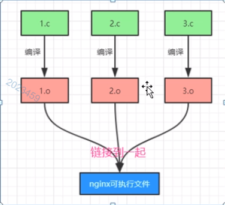

# （1）信号高级认识范例

```c
#include <stdio.h>
#include <stdlib.h>
#include <unistd.h>
#include <signal.h>
#include <errno.h>


//信号处理函数
void sig_usr(int signo)
{         
    if(signo == SIGUSR1)
    {
        printf("收到了SIGUSR1信号，我休息10秒......!\n");
        sleep(10);
        printf("收到了SIGUSR1信号，我休息10秒完毕，苏醒了......!\n");
    }
    else if(signo == SIGUSR2)
    {
        printf("收到了SIGUSR2信号，我休息10秒......!\n");
        sleep(10);
        printf("收到了SIGUSR2信号，我休息10秒完毕，苏醒了......!\n");
    }
    else
    {
        printf("收到了未捕捉的信号%d!\n",signo);
    }
}

int main(int argc, char *const *argv)
{
    if(signal(SIGUSR1,sig_usr) == SIG_ERR)  //系统函数，参数1：是个信号，参数2：是个函数指针，代表一个针对该信号的捕捉处理函数
    {
        printf("无法捕捉SIGUSR1信号!\n");
    }
    if(signal(SIGUSR2,sig_usr) == SIG_ERR) 
    {
        printf("无法捕捉SIGUSR2信号!\n");
    }
    
    for(;;)
    {
        sleep(1); //休息1秒    
        printf("休息1秒~~~~!\n");
    }
    printf("再见!\n");
    return 0;
}

```

主要观察这里信号处理函数里，sleep（10）这10秒钟，可能发生那些事，那些事是发生不了的

ps -eo pid,ppid,sid,tty,pgrp,comm,stat,cmd | grep -E ‘bash|PID|nginx’
用kill 发送 USR1信号给进程
（1）执行信号处理函数被卡住了10秒，这个时候因为流程回不到main()，所以main中的语句无法得到执行；
（2）在触发SIGUSR1信号并因此sleep了10秒种期间，就算你多次触发SIGUSR1信号，也不会重新执行SIGUSR1信号对应的信号处理函数,而是会等待上一个SIGUSR1信号处理函数执行完毕才 第二次执行SIGUSR1信号处理函数；换句话说：在信号处理函数被调用时，操作系统建立的新信号屏蔽字（sigprocmask()）,自动包括了正在被递送的信号，因此，保证了在处理一个给定信号的时候，如果这个信号再次发生，那么它会阻塞到对前一个信号处理结束为止；
（3）不管你发送了多少次kill -usr1信号，在该信号处理函数执行期间，后续所有的SIGUSR1信号统统被归结为一次。

比如当前正在执行SIGUSR1信号的处理程序但没有执行完毕，这个时候，你又发送来了5次SIGUSR1信号，那么当SIGUSR1信号处理程序执行完毕（解除阻塞），SIGUSR1信号的处理程序也只会被调用一次（而不会分别调用5次SIGUSR1信号的处理程序）。

kill -usr1,kill -usr2
（1）执行usr1信号处理程序，但是没执行完时，是可以继续进入到usr2信号处理程序里边去执行的，这个时候，相当于usr2信号处理程序没执行完毕
usr1信号处理程序也没执行完毕，此时再发送usr1和usr2都不会有响应
（2）既然是在执行usr1信号处理程序的时候来得usr2信号，导致又去执行了usr2信号处理程序，这就意味着：
只有usr2信号处理程序执行完毕，才会跳到usr1信号处理程序中。然后只有usr1信号处理程序执行完毕了，才会返回main主函数中继续去执行

思考：
如果我希望在我处理SIGUSR1信号，执行usr1信号处理函数的时候，如果来了SIGUSR2信号，不要跳转到usr2信号处理程序中去，（堵住/屏蔽 SIGUSR2）。可以做到，使用sigprocmask以及其他方法。

```shell
invi@inviubuntu:~$ kill -usr2 1812
invi@inviubuntu:~$ kill -usr1 1812

# 休息1秒~~~~!
# 休息1秒~~~~!
# 收到了SIGUSR2信号，我休息10秒......!
# 收到了SIGUSR1信号，我休息10秒......!
# 收到了SIGUSR1信号，我休息10秒完毕，苏醒了......!
# 收到了SIGUSR2信号，我休息10秒完毕，苏醒了......!
# 休息1秒~~~~!
# 休息1秒~~~~!
# 休息1秒~~~~!
```

# （2）服务器架构初步

通讯架构源代码

## （2.1）目录结构规划

nginx
 ├─app
 │  ├─link_obj
 │  ├─deep
 │  ├─makefile
 │  ├─nginx.c
 │  └─ngx_conf.c
 │
 ├─misc
 ├─net
 ├─proc
 ├─common.mk
 ├─config.mk
 ├─makefile
 ├─signal
 │  ├─makefile
 │  └─ngx_signal.c
 │
 └─_include
    ├─ngx_func.h
    ├─ngx_signal2.h
    └─ngx_signal.h

* _include：专门存放各种头文件
* app：放主应用程序的，.c（main函数所在文件）以及一些比较核心的文件
  - link_obj：临时目录。会存放临时的.o文件，这个目录不会手工创建，后续使用makefile脚本创建
  - deep：临时目录，会存放临时的.d开头的一些依赖文件。这个依赖文件能够告知系统哪些相关文件发生变化，需要重新编译
  - nginx.c：主文件，main()入口函数就放在这里
  - ngx_conf.c：普通的源码文件，跟主文件nginx.c关系密切，但是又不值得单独放在一个目录下
* misc目录：专门存放各种杂合性的，不好归类的1个到多个.c文件，暂时为空
* net目录：专门存放网络处理相关的一个到多个.c文件，暂时为空
* proc目录：专门存放进程处理相关的一个到多个.c文件，暂时为空
* signal目录：专门用于存放和信号处理有关的1到多个.c文件，暂时为空
  - ngx_signal.c

linux下看目录结构，使用 tree 命令（tree 如果没有安装，使用 sudo apt install tree 命令进行安装）

## （2.2）编译工具make的使用概述 (编译出可执行文件)



每个.c文件生成一个.o 多个.c生成多个.o文件，最终这些.o被链接在一起，生成一个可执行文件

* 1）借助make命令来进行编译，能够把工程编译链接...最终生成可执行文件，大型项目一般都用make来编译
* 2）make命令的工作原理，就是去当前目录读取一个叫做makefile的配置文件（文本文件，没有后缀）,
根据这个makefile文件里的规则将源代码编译成可执行文件，开发者的任务就是要把这个Makefile文件写出来
* 3）这个Makefile里面就定义了我们这个项目怎么编译，链接的规则，所以实际上makefile文件就是我们编译工程要用到的各种源文件的依赖关系描述
* 4）makefile文件，文本文件，utf-8编码格式，没有扩展名，一般放在根目录下，也会根据需要放在子目录下

make工具：autotools，cmake

```shell
gcc -o nginx ng1.c
gcc -o nginx ng1.c ng2.c # 通过中间加空格可同时编译两个.c源文件链接生成一个可执行文件
```

### gcc /g++命令重要参数
* (1)-o：指定编译链接后生成的可执行文件名，比如
```shell
gcc -o nginx nginx.c
```
* (2)-c:  将.c编译成.o目标文件[仅执行编译操作，不进行链接操作]
```shell
gcc -c nginx.c
```
将生成nginx.o的目标文件
* (3)-M：显示一个源文件所依赖的各种文件
```shell
gcc -M nginx.c
```
* (4)-MM：显示一个源文件所依赖的各种文件，但不包括系统的一些头文件；
```shell
gcc -MM nginx.c
```
这种扫描是有用途的，尤其是在写makefile文件时，需要用到这些依赖关系，以做到比如当某个.h头文件更改时，整个工程会实现自动重新编译的目的；

* (5) -g：生成调试信息。GNU 调试器可利用该信息。
* (6)-I：gcc会先到你 用这个参数指定的目录去查找头文件，你在.c/.cpp中可以 
```shell
#include <abc.h>   //这里用尖括号了
gcc -I /mnt/mydir
```

规划makefile文件的编写
* 1）nginx目录下放3个文件
 - common.mk    最重要最核心的编译脚本，用来定义makefile的编译规则，依赖规则等。通用性很强
                并且各个子目录中都有用到这个脚本，用来实现对应子目录的.c文件的编译
 - config.mk    这是个配置脚本，被makefile包含，单独分离出来是为了应付一些可变的文件
                所以，一般变动的文件都往这里面添加
 - makefile     编译项目的入口脚本，编译项目从这里开始，起总体控制的作用
* 2）每个子目录（app, signal）下都有一个 makefile 文件，每个makefile文件都会包含根目录下的这个common.mk文件
  从而实现自己这个子目录下的.c 文件的编译
* 现阶段的makefile不支持目录中套子目录，除非手动修改
* 其他规划：
  app/link_obj临时目录 用来存放.o目标文件，
  app/dep：存放.d开头的依赖关系文件

## （2.3）makefile脚本用法介绍

编译项目，生成可执行文件
```shell
# 项目主目录下，直接使用make命令进行编译
make
# 编译完使用 tree查看编译后的项目结构
tree
# 然后执行make clean命令删除那些编译生成的中间文件（垃圾文件）
make clean
```


*该图仅针对当前版本项目程序做分析*

## （2.4）makefile脚本具体实现讲解
