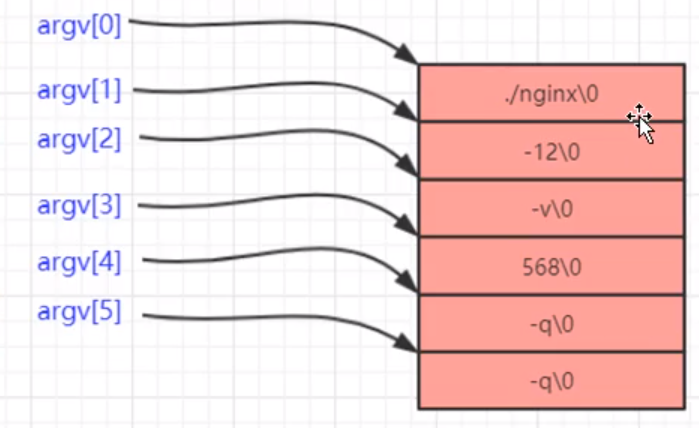
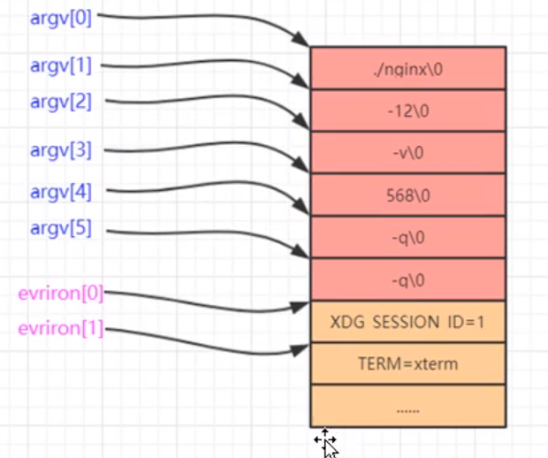
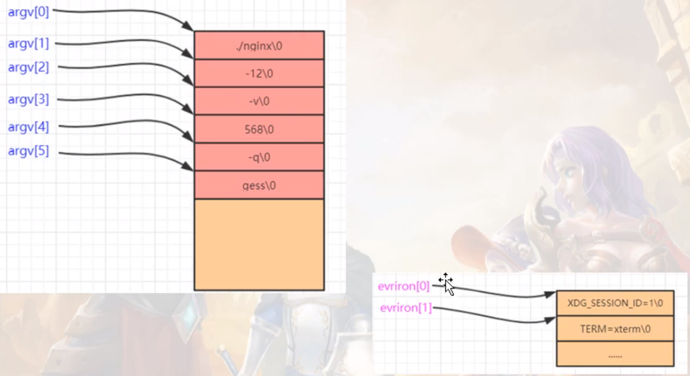

# （1）基础设施之配置文件读取
## （1.1）前提内容和修改

使用配置文件可以使得我们的服务器程序有极大的灵活性，是作为服务器开发者必须要首先搞定的部分

配置文件：除了注释外，不要使用中文。只在配置文件中使用 字母，下划线，数字

以#开头作为注释行

我们这个项目第一个需要解决的问题就是读取配置文件中的配置项（读到内存中来）

## （1.2）配置文件读取功能实战代码

# （2）内存泄漏的检查工具

Valgrind

安装
```shell
sudo apt-get install valgrind

# 或者

# 源码下载
# http://valgrind.org/docs/manual/manual.html
# 文档

tar jxvf valgrind-3.14.0.tar.bz2

cd valgrind-3.14.0/

./autogen.sh

./configure --prefix=/home/renz/rz/opt/valgrind

make

make install

```

Valgrind是一个GPL的软件，用于Linux（For x86, amd64 and ppc32）程序的内存调试和代码剖析。你可以在它的环境中运行你的程序来监视内存的使用情况，比如C 语言中的malloc和free或者 C++中的new和 delete。使用Valgrind的工具包，你可以自动的检测许多内存管理和线程的bug，避免花费太多的时间在bug寻找上，使得你的程序更加稳固。

Valgrind的主要功能

Valgrind工具包包含多个工具，如Memcheck,Cachegrind,Helgrind, Callgrind，Massif。下面分别介绍个工具的作用

## （2.1）memcheck的基本功能

Memcheck 工具主要检查下面的程序错误：

* 使用未初始化的内存 (Use of uninitialised memory)

* 使用已经释放了的内存 (Reading/writing memory after it has been free’d)

* 使用超过 malloc分配的内存空间(Reading/writing off the end of malloc’d blocks)

* 对堆栈的非法访问 (Reading/writing inappropriate areas on the stack)

* 申请的空间是否有释放 (Memory leaks – where pointers to malloc’d blocks are lost forever)

* malloc/free/new/delete申请和释放内存的匹配(Mismatched use of malloc/new/new [] vs free/delete/delete [])

* src和dst的重叠，memcpy()内存拷贝函数中原指针和目标指针重叠 (Overlapping src and dst pointers in memcpy() and related functions)
  
## （2.2）内存泄漏检查示范

所有应该释放的内存，都应该释放

格式：
 valgrind --tool=memcheck    一些开关   可执行文件名
 --tool=memcheck : 使用valgrind工具集中的memcheck工具
 --leak-check=full : 指的是完全检查内存泄漏
 --show-reachable=yes : 是显示内存泄漏的地点
 --trace-children = yes : 是否跟入子进程
 --log-file = log.txt : 将调试信息输出到log.txt 而不输出到屏幕


```shell
# 编译文件
make
# tree查看
tree
# 使用valgrind工具集中的memcheck工具查看内存是否泄漏
valgrind --tool=memcheck ./nginx
# 那么能不能查看到具体是哪行代码导致的泄漏呢？
valgrind --tool=memcheck --leak-check=full ./nginx
# 如果还想查看更详细的详细
valgrind --tool=memcheck --leak-check=full --show-reachable=yes ./nginx
```

查看内存泄漏的三个打印
1） 9 alloc, 8 free 差值为1，就没泄漏，超过1就有泄漏
2）中间诸如 这种和我们源代码有关的提示就有内存泄漏，需要注意
3）LEAK_SUMMARY : definitely lost: 100 byte in 2 blocks

# （3）设置可执行程序的标题（名称）

查看系统的nginx进程模型
```shell
cd /
cd /usr/local/nginx/sbin
sudo ./nginx

# 启动nginx之后，查看进程详细
ps -eo pid,ppid,sid,tty,pgrp,comm,stat,cmd | grep -E 'bash|PID|nginx'
# 这个cmd其实就是显示的进程名

```

## （3.1）原理和实现思路分析

带形参的main函数，如 main( int argc, char* argv[], char **env ) ，是UNIX、Linux以及Mac OS操作系统中C/C++的main函数标准写法，并且是血统最纯正的main函数写法。

在如今的Visual Studio编译器中，main()函数带有参数argc和argv或者不带，即无论是否在函数体中使用argc和argv，返回值为void或不为void，都是合法的。 
即至少有如下三种写法合法：

1 返回值为整型带参的main函数

```c
int main( int argc, char** argv )
{ 
     //函数体内使用或不使用argc和argv都可
     ……
     return 0;
}
```

2 返回值为整型不带参的main函数

```c
char    *ptr;
int main( int argc, char** argv )
{ 
     //函数体内使用了argc或argv
     ptr = argv[i];
     ……
     return 0;
}
```

3 返回值为void且不带参的main函数
```c
void main()
{ 
     ……
}
```

### argc、argv的具体含义

argc和argv参数在用命令行编译程序时有用。main( int argc, char* argv[], char **env ) 中


第一个参数，int型的argc，为整型，用来统计程序运行时发送给main函数的命令行参数的个数，在VS中默认值为1。

第二个参数，：char*型的argv[]，为字符串数组，用来存放指向的字符串参数的指针数组，每一个元素指向一个参数。各成员含义如下


- argv[0]指向程序运行的全路径名 
- argv[1]指向在DOS命令行中执行程序名后的第一个字符串 
- argv[2]指向执行程序名后的第二个字符串 
- argv[3]指向执行程序名后的第三个字符串 
- argv[argc]为NULL 
- 第三个参数，char**型的env，为字符串数组。env[]的每一个元素都包含ENVVAR=value形式的字符串，
其中ENVVAR为环境变量，value为其对应的值。平时使用到的比较少

比如你输入 ./nginx -12 -v 568 -q q
那么此时argv内存示意图



在这块红色内存之后，还紧挨着一块内存（下图的黄色部分）,这块内存是环境变量内存（环境变量参数信息）
是这个可执行程序运行时有关的所有环境变量的的参数信息
这个环境变量可以通过一个全局的environ[char **]就可以访问



```shell
# linux下可以输入env命令查看环境变量信息
env
```

思路:
1）重新分配一段内存，用来保存环境变量的内容（environ）
2）修改argv[0]所指向的内存
3）保证argv里的参数后续不再使用

## （3.2）设置可执行程序的标题实战代码

```c++
#include <stdio.h>
#include <stdlib.h>
#include <unistd.h> // env
#include <string.h>

#include "ngx_global.h"

// 设置可执行程序标题相关函数：分配内存，并且把环境变量拷贝到新内存中来
void ngx_init_setproctitle()
{
    int i;
    // 统计环境变量所占的内存。注意判断方法是environ[i]是否为空作为环境变量结束标记
    for(i = 0; environ[i]; i++)
    {
        g_environlen += strlen(environ[i]) + 1;
        // + 1 是因为末尾有\0，是占实际内存位置的，要算进来
    }

    // 这里无需判断 penvmen == NULL,有些编译器new会返回NULL，有些会爆异常，但是不管怎么样，
    // 如果在重要的地方new失败了，你无法收场，让程序崩溃，帮助你发现问题为好
    gp_envmem = new char[g_environlen];
    memset(gp_envmem, 0, g_encironlen);     // 对于new出来的内存要清零防止出现问题

    char *ptmp = gp_envmem;

    // 把原来的内存内容般到新地方
    for(i = 0; environ[i]; i++)
    {
        size_t size = strlen(environ[i])+1;
        // 不要落下+1；否者内存全乱套了（因为字符串末尾有\0)。因为strlen是不包括字符串末尾符\0的
        strcpy(ptmp, environ[i]);
        // 把原环境变量内容拷贝到新内存中
        environ[i] = ptmp;  // 搬完了内容后，再把这个新的内存赋给environ[i]，这样就实现了内容搬家并且environ[i]也指向了正确的新的内存
        ptmp += size;   // 然后将ptmp指向这个内存的结尾（也就是下一个环境变量的内存开头）
    }
    return;
}

// 设置可执行程序标题
void ngx_setproctitile(const char * title)
{

    // 这里我们假设，所有的命令行 参数我们都不要了，可以被随意覆盖；
    // 注意：我们标题的长度，不会长到原始标题和原始环境变量都装不下，否者怕出问题，不处理

    // 1）计算新标题的长度
    size_t ititlelen = strlen(title);

    // 2）计算总的原始的argv的那块内存的总长度【包括各种参数】
    size_t e_environlen = 0;    // e 表示全局变量
    for(int i = 0; g_os_argv[i]; i++)
    {
        e_environlen += strlen(g_os_argv[i])+1;
    }

    size_t esy = e_environlen + g_environlen;   // argv和environ内存总和

    if(esy <= ititlelen)
    {
        // 标题过长，argv和environ总和都存不下。
        // 注意字符串末尾多了一个 \0 ，所以这块的判断是 <= 【也就是=都算存不下】
        return;
    }

    // 空间够保存标题

    // 3）设置后续的命令行参数为空，表示只有argv[]中一个元素，这是好习惯，防止后续argv被滥用，
    // 因为很多判断是用argv[] == NULL来做结束标记判断的;
    g_os_argv[1] = NULL;

    // 4) 把标题弄进来，注意原来的命令行参数都会被覆盖掉，不要在使用这些命令行参数，而且g_os_argv[1]已经被置空
    char *ptmp = g_os_argv[0];
    // 让ptmp指向g_os_argv所指向的内存
    strcpy(ptmp,title);
    ptmp += ititlelen; // 跳过标题长度

    // 5）把剩下的原argv以及environ所占的内存全部清零，否者会出现ps的cmd列可能还会残余一些没有被覆盖的内容
    size_t cha = esy - ititlelen;
    // 内存总和减去标题字符串长度（不包含字符串末尾的\0），剩余的大小，就是要memset的
    memset(ptmp, 0, cha);
    return;
    

}
```
environ搬家示意图

