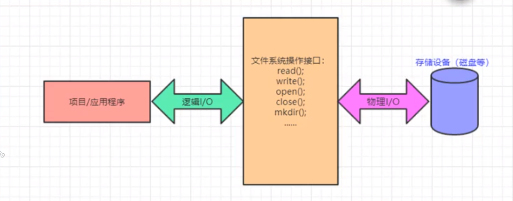
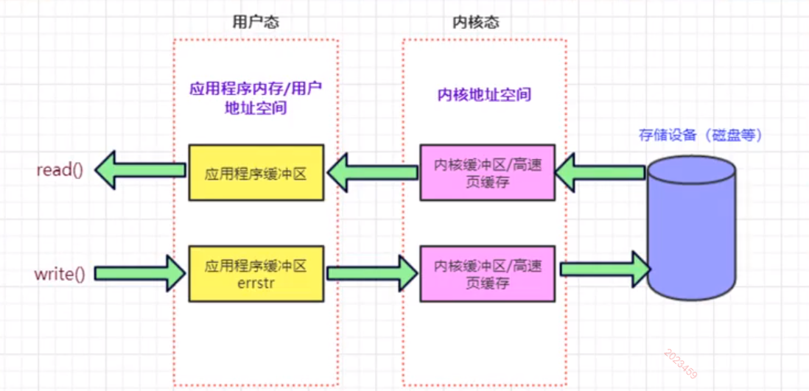
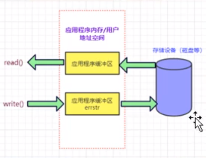
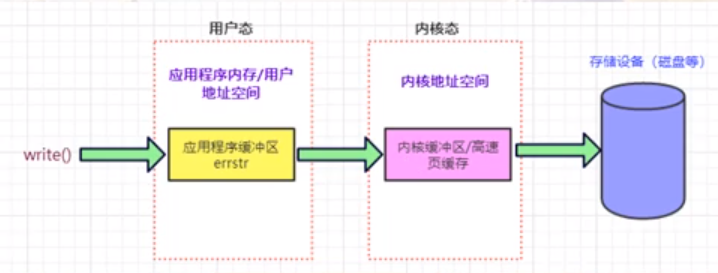
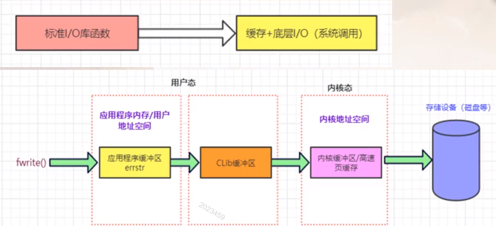
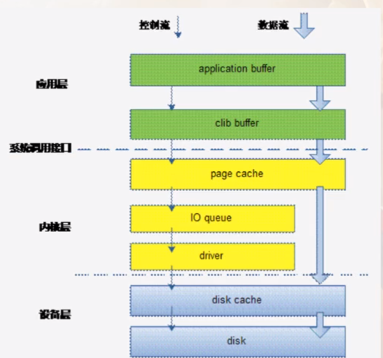
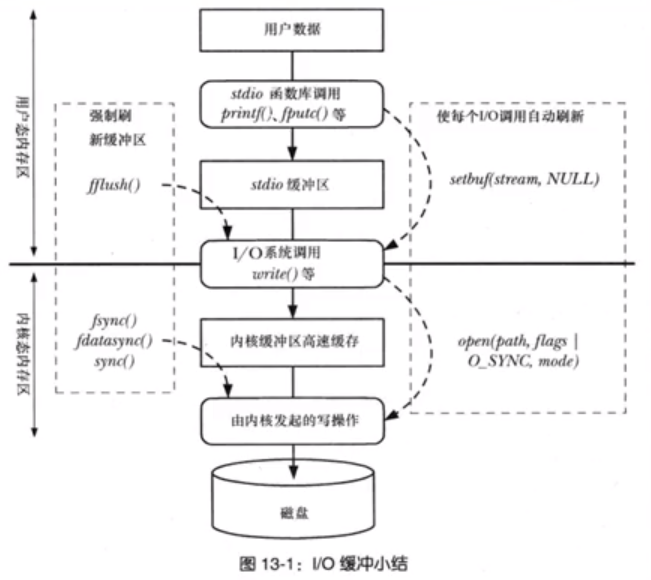

# （1）信号功能实战

signal()：注册信号处理程序的函数
商业软件中：不使用signal()而是使用sigaction()函数

```c++
//和信号有关的函数放这里
#include <string.h>
#include <stdint.h>
#include <stdio.h>
#include <stdlib.h>
#include <signal.h>    //信号相关头文件 
#include <errno.h>     //errno

#include "ngx_macro.h"
#include "ngx_func.h" 

// 定义一个和信号处理有关的结构体   ngx_signal_t
typedef struct
{
    int         signo;          // 信号对应的数字编号，每个信号都有对应的#define
    const char  *signame;       // 信号对应的中文名字，比如SIGHUP

    // 信号处理函数，这个函数由我们自己提供，但是他的参数和返回值都是固定的【操作系统就这样要求】
    void (*handler)(int signo, siginfo_t *siginfo, void *ucontext);     // 函数指针，siginfo_t：系统定义的结构
}ngx_signal_t;


// 声明一个信号处理函数(函数指针)
static void ngx_signal_handler(int signo, siginfo_t *siginfo, void *ucontext);  // static表示该函数只在当前文件内可见


// 数组。定义本系统中处理的各种信号，我们取一小部分nginx中的信号，并没有全部搬移到这里，日后若有需要可以根据情况增加
// 在实际业务中，需要把能想到的要处理的信号都弄进来
ngx_signal_t  signals[] = {
    // signo      signame             handler
    { SIGHUP,    "SIGHUP",           ngx_signal_handler },        //终端断开信号，对于守护进程常用于reload重载配置文件通知--标识1
    { SIGINT,    "SIGINT",           ngx_signal_handler },        //标识2   
	{ SIGTERM,   "SIGTERM",          ngx_signal_handler },        //标识15
    { SIGCHLD,   "SIGCHLD",          ngx_signal_handler },        //子进程退出时，父进程会收到这个信号--标识17
    { SIGQUIT,   "SIGQUIT",          ngx_signal_handler },        //标识3
    { SIGIO,     "SIGIO",            ngx_signal_handler },        //指示一个异步I/O事件【通用异步I/O信号】
    { SIGSYS,    "SIGSYS, SIG_IGN",  NULL               },        //我们想忽略这个信号，SIGSYS表示收到了一个无效系统调用，如果我们不忽略，进程会被操作系统杀死，--标识31
                                                                  //所以我们把handler设置为NULL，代表 我要求忽略这个信号，请求操作系统不要执行缺省的该信号处理动作（杀掉我）
    //...日后根据需要再继续增加
    { 0,         NULL,               NULL               }         //信号对应的数字至少是1，所以可以用0作为一个特殊标记
};


// 初始化信号的函数，用于注册信号处理程序
// 、返回值： 0 成功 -1 失败
int ngx_init_signals()
{
    ngx_signal_t        *sig;       // 指向自定义的结构数组的指针
    struct sigaction    sa;         // sigaction: 系统定义的跟信号有关的一个结构，后续调用系统的sigaction()函数都用这个同名的结构

    for (sig = signals; sig->signo != 0; sig++)
    {
        // 注意这里：现在要把一堆信息往 变量 sa 对应的结构里弄
        memset(&sa, 0, sizeof(struct sigaction));

        if(sig->handler)    // 如果信号处理函数不为空，那么这就表示我需要定义自己的信号处理函数
        {
            sa.sa_sigaction = sig->handler;
            // sa->sigaction: 指定信号处理函数，注意sa_sigaction也是函数指针，这个是系统定义的结构sigaction中的一个成员（函数指针成员）
            sa.sa_flags = SA_SIGINFO;
            // sa_flags: int型 指定信号的一些选项，设置了该标记（SA_SIGINFO) 就表示信号附带的参数可以被传送到信号处理函数中
            // 说白了就是你想让 sa.sa_sigaction 指定的信号处理程序生效，那就把sa_flags 设置为 SA_SIGINFO

        }
        else
        {
            sa.sa_handler = SIG_IGN;
            // sa_handler:这个标记 SIG_IGN 给到sa_handler成员，表示忽略信号的处理程序，否者操作系统的缺省信号处理程序可能会把这个进程杀掉
            // 其实sa_handler和sa_sigaction都是一个函数指针用来表示信号处理程序，只不过这两个函数指针他们的参数不一样，sa_sigaction带的参数多，信息量大
            // 而sa_handler带的参数少，信息量少。如果你想用sa_sigaction，那么你就需要把sa_flags设置为SA_SIGINFO
        }

        sigemptyset(&sa.sa_mask);
        // 比如这里。处理某个信号SIGUSR1信号时不希望接收到SIGUSR2信号， 那么就可以用诸如 sigaddset(&sa.sa_mask,SIGUSR2);这样的语句来针对信号为SIGUSR1时做处理
        // 这里.sa_mask是一个信号集（描述信号合集），用于表示要阻塞的信号，sigemptyset()这个函数：把信号集中所有的信号清0，本意就是不准备阻塞任何信号
        


        // 设置信号处理动作（信号处理函数—）。说白了就是这里就是让信号来了后，调用我的处理程序，有个旧的同类函数 叫 signal， 不过signal这个函数被认为是不可靠信号语义，不建议使用
        // 参数1：要操作的信号
        // 参数2：主要就是那个信号处理函数以及执行信号处理函数时要屏蔽的信号等等内容
        // 参数3：返回已往的对信号的处理方式【跟sigprocmask()函数右边第三个参数是一样的】,跟参数2是同一个类型，这里不需要这个东西，所以直接设置为NULL
        if(sigaction(sig->signo, &sa, NULL) == -1)
        {
            ngx_log_error_core(NGX_LOG_EMERG, errno, "sigactoin(%s) faild", sig->signame);  // 显示到日志文件中去
            return -1;  // 有失败就直接返回
        }
        else
        {
            // ngx_log_error_core(NGX_LOG_EMERG,errno,"sigaction(%s) succed!",sig->signame);     //成功不用写日志 
            ngx_log_stderr(0, "sigaction(%s) success!", sig->signame);  // 直接往屏幕上打印，不需要时间可以去掉
        }
    }
    return 0;
    
}

//信号处理函数
static void ngx_signal_handler(int signo, siginfo_t *siginfo, void *ucontext)
{
    printf("来信号了\n");
}

```

# （2）nginx中创建worker子进程

官方nginx中是一个master进程创建了多个worker子进程

函数调用关系

ngx_master_processes_cycle()………………………………………………………………………创建子进程等一系列动作
────ngx_setproctitle()………………………………………………………………………………设置进程标题
────ngx_start_worker_processes()………………………………………………………………创建worker子进程
────────for(i = 0; i < threadnums; i++)…………………………………………………………master进程在这个循环里，创建若干子进程
────────────pid = fork()…………………………………………………………………………分叉，从原来的一个master进程分成两个
────────────────ngx_worker_processes_cycle(inum,pprocname);………………………子进程分叉（只有子进程才会走进来
────────────────────ngx_worker_processes_init();
────────────────────────sigemptyset(&set);
────────────────────────sigprocmask(SIG_SETMASK,&set, NULL);………………允许接收所有信号
────────────────────────ngx_setproctitile(pprocname);……………………………重新为子进程设置标题
────────────────────────for( ; ; ){}……………………………………………………子进程在这里不断死循环

────sigemptyset(&set);
────for( ;; ){}……………………………………………………………………………………………父进程master在这里不断死循环


*tips:使用负号加组ID，可以杀死一组进程*
*kill -9 -1244*

## （2.1）sigsuspend()函数讲解

sigsuspend函数作用 ：如果在等待信号发生时希望去休眠，则使用sigsuspend函数是非常合适的

这个函数是官方nginx中，主master进程的for循环里用的一个函数
这个函数说白了，就是阻塞在这里，等待一个信号，此时进程是挂起状态，是不占用CPU时间的，只有收到信号才会被唤醒（返回）
但是，在代码里我们是发现，信号在之前就已经被我们屏蔽掉了，此时我们是收不到任何信号的，但是这个函数有一个能力收信号，不占用CPU时间，
所以，这个函数后面的代码，才是处理信号的，唤醒，就是返回了，然后往下走

这个函数，可以把一系列的操作捏在一起，形成原子操作，因为他是原子操作，这样就保证了在处理信号的时候，即便你来了信号，这个信号也丢不了

```cxx
        // 1）根据给定的参数设置新的mask 并 阻塞当前进程 【因为是一个空集，所以不会阻塞任何信号】
        // 2）此时，一旦收到信号，便恢复原先的信号屏蔽【因为原来的mask在上面设置的，阻塞了多达10个信号，从未保证下面的执行流程不会再被其他信号截断】
        // 3）调用该信号对应的信号处理函数
        // 4）信号处理函数返回之后，sigsuspend返回，使得流程继续往下走
        // printf("for 进来了！\n");        // 发现，如果printf不加 \n ，无法及时显示到屏幕上去，是行缓存的问题，


        sigsuspend(&set);   // 阻塞在这里，等待一个信号，此时进程是挂起的，不占用CPU时间，只有收到信号才会被唤醒（返回）
                            // 此时master进程完全靠信号驱动干活
        
        printf("执行到sigsuspend下面来了\n");
```

针对这个函数，有个疑问
这里是在master进程的for循环中挂了一个 sigsuspend()函数，那么我可不可以在worker进程的for循环中也挂一个 sigsuspend() 函数呢？
不可以，因为master进程作为管理进程，只需要通过信号进行驱动即可，但是worker进程是真正处理业务代码的，他不仅能接收信号，还能通过其他很多触发，让程序走动，所以不可以单纯的使用sigsuspend()挂起触发

### sigprocmask和sigsuspend

sigprocmask系统调用用于改变当前阻塞信号集，比如进程想阻塞SIGMIN+1信号。就把这个信号加入掩码中，然后调用sigprocmask。

而sigsuspend是挂起进程，等待信号。等收到信号后，继续执行进程。见如下程序：

```cxx

sigemptyset(&zeromask); sigemptyset(&newmask);  
sigaddset(&newmask, SIGMIN+1); 
if(sigprocmask(SIG_BLOCK, &newmask, &oldmask) < 0) {  //阻塞SIGMIN+1
  fprintf(stderr, "call sigprocmask() error\n");
  goto error;
} 

if(sigsuspend(&zeromask) != -1) {  //等待信号到来(zeromask表示可以等待任何信号
  fprintf(stderr, "sigsuspend() error\n");
  goto error;   
} 

```

有4个问题，1。如果前面SIGMIN+1被阻塞了，那后面则表示进程一直收不到，被suspend悬挂么？2。这样写如何就有防止信号丢失的作用呢？3。假设在sigsuspend运行之前收到SIGMIN+1，那么sigsuspend会从sigqueue里面取出来处理还是等待新的SIGMIN+1到来？4。sigsuspend是否应该只放行SIGMIN+1而不是用空信号集？

1。其实sigsuspend是一个原子操作，包含4个步骤：

(1) 设置新的mask阻塞当前进程；
(2) 收到信号，恢复原先mask；
(3) 调用该进程设置的信号处理函数；
(4) 待信号处理函数返回后，sigsuspend返回。

所以第一步之后，进程是可以接受任何信号的。接收到SIGMIN+1，恢复之前阻塞信号集，并处理SIGMIN+1信号。
第二步：就是收到信号，那就回复原先的信号屏蔽，因为来信号了，我要去执行该信号的处理函数，这时候我是不希望有信号来干扰我的

2。为什么有防止信号丢失的作用呢？

这个功能是sigsuspend 4步原子操作决定的。如果不用sigsuspend(&zeromask)而改用

sigprocmask(SIG_BLOCK,&emptyset,NULL); pause();
这2个函数不是原子操作，在2个函数之间信号到来了，继续pause，由于就没有信号到来，则进程还会停在那里等待新的SIGMIN+1到来。所以用sigsuspend来取代这2个函数功能，就能保证在sigsuspend函数运行时收到的信号不会丢失，会被处理的。

3.第三个问题，按道理是从sigqueue里面取，而不会重新等待新的SIGMIN+1信号的到来。不过我没有从官方文档找到这种说法，sigsuspending是获得当前已传送到进程，却被阻塞的所有信号，在set指向的信号集中保存未决（阻塞）的信号。认定sigsuspending和sigsuspend有相似之处。再加上从不能丢失信号，答案偏向于前者。

4。就是为了预防对其他信号也返回，并继续执行进程。但是假设其他信号没有处理函数也就是原子操作第三步没完成，sigsuspend不会继续执行，这种做法就没有意义了。所以还需要继续看看source code.

在sigsuspend之所以置为zeromask是为了对之前阻塞的信号进行处理。不过对于apache module里面的信号，可以以旧采取blocked mask+(SIGMIN+1).目的是不想影响apache对自己设定阻塞信号的处理。在进入module之前阻塞的，从module出来后依然保持阻塞就是了。


# （3）日志输出重要信息谈

## （3.1）换行回车进一步示意

"\r" ： 回车符（把打印【输出】信息的位置定位到本行的开头）
"\n" :  换行符（把输出位置移动到下一行）
所以，一般把光标移动到下一行的开头，应该结合使用 "\r\n"
但是这种写法明显有点浪费，就出现了不同系统下
windows:    \r\n    每行结尾
类Unix:     \n      每行结尾
mac：       \r      每行结尾

结论：统一使用 \n 

## （3.2）printf()函数不加\n无法及时输出的解释

### 原因：  输出缓冲区的问题.

unix上标准输入输出都是带有缓存的，一般是行缓存。【windows上没有这个问题】

对于标准输出，需要输出的数据并不是直接输出到终端上，而是首先缓存到某个地方，当遇到行刷新标志或者该缓存已满的情况下，才会把缓存的数据显示到终端设备上。

ANSI C中定义换行符'\n'可以认为是行刷新标志。所以，printf函数没有带'\n'是不会自动刷新输出流，直至缓存被填满。


### 解决方案：

方案1、在printf里加"\n"

方案2、fflush(stdout)刷新标准输出缓冲区，把输出缓冲区里的东西打印到标准输出设备上 。


fflush(stdout); //  刷新一下缓冲区 让它马上输出.  在printf 之后调用它,就会马上输出了.  

setvbuf(stdout,NULL,_IONBF,0); //如果你嫌上个方法麻烦, 就使用这个函数. 直接将缓冲区禁止了. 它就直接输出了。

这两个函数都是有关流缓冲区的. 具体使用和说明网上有很多.   我只说一下什么是流缓冲区, 是做什么用的。

操作系统为减少 IO操作 所以设置了缓冲区.  等缓冲区满了再去操作IO. 这样是为了提高效率。


# （4）write()函数思考

多个进程，同时写一个文件，比如我们当前这5个进程（1master4worker）同时往日志文件中写入日志，那么你会不会造成日志文件的混乱
多个进程密集的写一个日志文件，并不会导致输出混乱，是有序的。
也说明了这里的多进程代码应对多进程写日志没有问题

```cxx
while (1)
    {
        if(level > ngx_log.log_level)
        {
            // 要打印的这个日志等级态落后，（等级数字太大，比配置文件中的数字大）
            // 这种日志就不打印了
            break;
        }

        // 磁盘是否满了判断
        // todolist

        // 写日志文件
        n = write(ngx_log.fd, errstr, p-errstr);
        // 文件写入成功后，如果中途
        if(n==-1)
        {
            // 写入失败
            if(errno == ENOSPC) // 写失败了，且原因是磁盘没空间了
            {
                // todo
            }
            else
            {
                // 这里有其他错误，考虑把这些错误显示到标准错误设备
                if(ngx_log.fd != STDERR_FILENO) // 当前是定位到文件的，则条件成立
                {
                    n = write(STDERR_FILENO, errstr, p - errstr);
                }
            }
        }

        break;

    }
    
```

[文件IO](../补充知识/【Linux】文件IO详解.md)

多个进程写一个文件，可能会出现数据覆盖，混乱的问题

那我们这里是如何保证的日志打印不混乱呢？

因为我们在父进程就调用了日志初始化函数，然后在这个函数里就已经打开日志文件了，然后fork出来的worker子进程
都是用的拷贝自父进程的文件描述符，这样就保证父子进程的文件描述符指向的都是同一个文件的某一个部分的，这样就能保证父子进程密集打印日志也不会出现混乱

所以，如果每个进程都用自己打开文件open函数的文件描述符，然后再去同一个文件里写东西就会导致混乱

`ngx_log.fd = open((const char *)plogname, O_WRONLY|O_APPEND|O_CREAT, 0644);`
这里 O_APPEND 这个标记就能够保证多个进程操作同一个文件不会相互覆盖

内核write()写入时是一个原子操作

父进程fork()子进程时亲缘关系，是会 共享文件表项 的。
文件表项里有一个当前文件的偏移量，子进程写了一段日志后，并且子进程是使用write来写，父进程会知道这个信息，
然后切换到父进程去写日志，那父进程就根据这个文件偏移量，找到子进程写文件的尾部，继续进行日志写入，就不会导致写覆盖，写混乱了

```cxx
// 描述：日志初始化，就是把日志文件打开，这里涉及到释放问题，如何解决
void ngx_log_init()
{
    u_char *plogname = NULL;
    size_t nlen;

    // 从配置文件中读取日志相关的配置信息
    CConfig *p_config = CConfig::GetInstance();
    plogname = (u_char *)p_config->GetString("Log");
    if(plogname == NUll)
    {
        // 没读到，就需要提供一个缺省的路径文件名
        plogname = (u_char *)NGX_ERROR_LOG_PATH;    // "logs/error.log", logs目录需要提前建立出来

    }

    ngx_log.log_level = p_config->GetIntDefault("LogLevel", NGX_LOG_NOTICE);
    // 缺省的日志等级为 6 【注意】,如果读失败，就给缺省的日志等级
    // nlen = strlen((const char *)plogname);

    // 只写打开|追加到末尾|文件不存在则创建文件 【这3个参数指定文件访问权限】
    // mode = 0644:文件访问权限， 6:110， 4:100， 【用户：读写，   用户所在组：读，   其他：读】
    ngx_log.fd = open((const char *)plogname, O_WRONLY|O_APPEND|O_CREAT, 0644);
    if(ngx_log.fd==-1)  // 如果有错误，则直接定位到 标准错误上去
    {
        ngx_log_stderr(errno, "[alert] could not open error log file: open() \"%s\" failed", plogname);
        ngx_log.fd = STDERR_FILENO; // 直接定位到标准错误
    }
    
    return;
}
```

关于write()安全性问题，是否成功将数据写到磁盘

write()调用返回时，内核已经将应用程序缓冲区提供的数据返回到了内核缓冲区
但是无法保证数据已经写到了预定的目的地（磁盘）

因为write调用速度极快，可能没有时间完成该项目的工作（写磁盘）
所以write调用不等价于数据在内核缓冲区和磁盘之间的数据调用（不等于 真写到磁盘）






打开文件使用功能O_APPEND，多个进程写日志用write()来写

## （4.1）掉电导致write()的数据丢失破解法

1）直接I/O，直接访问物理磁盘（不推荐）
在使用open函数打开文件的时候，使用 O_DIRECT 参数，绕过内核缓冲区。用posix_memalign
2）open文件的时候，使用O_SYNC选项（不推荐）



同步选项，把数据直接同步到磁盘，只针对write函数有效，使得每次write操作都等待物理I/O操作完成

两者的区别就在于2是立即将内核缓冲区的数据写入磁盘，是没有绕过内核缓存区的

每次写数据，要大块大块的写，一般 4K 写一次

3）缓存同步，尽量保证缓存数据和写到磁盘上的数据保持一致。缓存同步有3个函数
 sync(void):    将所有修改过的块缓冲区排入写队列。并不等待时机写磁盘操作结束，数据是否写入磁盘并没有保证
 fsync(int fd): 将fd对应的文件的块缓冲区立即写入磁盘，并等待实际写磁盘操作结束返回
 fdatesync(int fd): 类似于 fsync,但是只影响文件的数据部分。而fsync除了数据外，还会同步更新文件属性

write(4K); 1000次以后，一直到把这个write完整（整个文件4M）
fsync(fd), 一次fsync后，就把这4M的内存一次性写入到磁盘上了

所以，每次write 建议4K，然后调用一次fsync，这是fsync的正确用法



# （5）标准IO库

建议优先考虑使用系统函数（在不清楚标准IO里的函数的情况下）

fopen、fclose
fread、fwrite
fflush
fseek
fgetc、getc、getchar
fputc、put、putchar
fgets、gets
printf、fprintf、sprintf
scanf、fscan、sscanf

fwrite和write有什么区别？
fwrite()是标准I/O提供的，一般在“stdio.h"中
write()是系统提供的调用





clib缓冲区



i/o缓冲区

