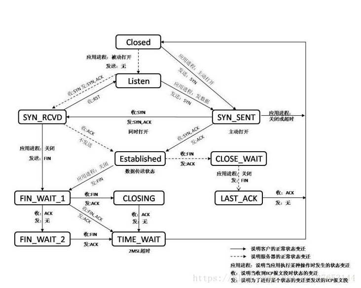
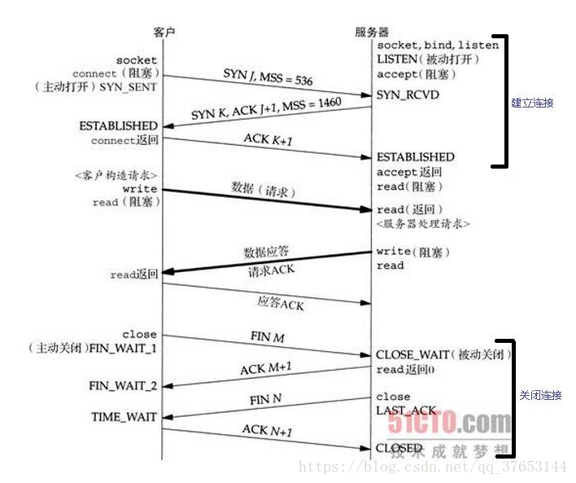

# （1）TCP状态转换

同一个IP（`INADDR_ANY`），同一个端口`SERV_PORT`，只能被成功的bind()一次，若再次bind()就会失败，并且显示：Address already in use

结论：相同IP地址的相同端口，只能被bind一次；第二次bind会失败；

命令`netstat`：显示网络相关信息
-a：显示所有选项
-n：能显示成数字的内容全部显示成数字
-p：显示端口和对应程序名
`netstat -anp | grep -E 'State|9000'`

测试代码(nginx5_3_1_server.c)

```c++
#include <stdio.h>
#include <ctype.h>
#include <unistd.h>
#include <sys/types.h>
#include <arpa/inet.h>
#include <sys/socket.h>
#include <stdlib.h>
#include <string.h>
#include <errno.h>

#define SERV_PORT 9000  //本服务器要监听的端口号，一般1024以下的端口很多都是属于周知端口，所以我们一般采用1024之后的数字做端口号

int main(int argc, char *const *argv)
{    
    //这些演示代码的写法都是固定套路，一般都这么写

    //服务器的socket套接字【文件描述符】
    int listenfd = socket(AF_INET, SOCK_STREAM, 0);    //创建服务器的socket，大家可以暂时不用管这里的参数是什么，知道这个函数大概做什么就行

    struct sockaddr_in serv_addr;                  //服务器的地址结构体
    memset(&serv_addr,0,sizeof(serv_addr));
    
    //设置本服务器要监听的地址和端口，这样客户端才能连接到该地址和端口并发送数据
    serv_addr.sin_family = AF_INET;                //选择协议族为IPV4
    serv_addr.sin_port = htons(SERV_PORT);         //绑定我们自定义的端口号，客户端程序和我们服务器程序通讯时，就要往这个端口连接和传送数据
    serv_addr.sin_addr.s_addr = htonl(INADDR_ANY); //监听本地所有的IP地址；INADDR_ANY表示的是一个服务器上所有的网卡（服务器可能不止一个网卡）多个本地ip地址都进行绑定端口号，进行侦听。

    int result;
    result = bind(listenfd, (struct sockaddr*)&serv_addr, sizeof(serv_addr));//绑定服务器地址结构体
    if(result  == -1)
    {
        char *perrorinfo = strerror(errno); 
        printf("bind返回的值为%d,错误码为:%d，错误信息为:%s;\n",result,errno,perrorinfo);
        return -1;
    }
    result = listen(listenfd, 32);     //参数2表示服务器可以积压的未处理完的连入请求总个数，客户端来一个未连入的请求，请求数+1，连入请求完成，c/s之间进入正常通讯后，请求数-1
    if(result == -1)
    {        
        char *perrorinfo = strerror(errno); 
        printf("listen返回的值为%d,错误码为:%d，错误信息为:%s;\n",result,errno,perrorinfo);
        return -1;
    }
        

    /*
    {        
        //再绑定一个
        int listenfd2 = socket(AF_INET, SOCK_STREAM, 0); 

        struct sockaddr_in serv_addr2;
        memset(&serv_addr2,0,sizeof(serv_addr2));
        serv_addr2.sin_family = AF_INET;   
        serv_addr2.sin_port = htons(SERV_PORT);  //端口重复,bind会失败 
        serv_addr2.sin_addr.s_addr = htonl(INADDR_ANY);
        result = bind(listenfd2, (struct sockaddr*)&serv_addr2, sizeof(serv_addr2));        
        char *perrorinfo = strerror(errno); //根据资料不会返回NULL;
        printf("bind返回的值为%d,错误码为:%d，错误信息为:%s;\n",result,errno,perrorinfo);   //bind返回的值为-1,错误码为:98，错误信息为:Address already in use;
    }*/

    int connfd;
    const char *pcontent = "I sent sth to client!\n"; //指向常量字符串区的指针
    for(;;)
    {
        //卡在这里，等客户单连接，客户端连入后，该函数走下去【注意这里返回的是一个新的socket——connfd，后续本服务器就用connfd和客户端之间收发数据，而原有的lisenfd依旧用于继续监听其他连接】        
        connfd = accept(listenfd, (struct sockaddr*)NULL, NULL);

        //发送数据包给客户端
        write(connfd,pcontent,strlen(pcontent)); //注意第一个参数是accept返回的connfd套接字
        printf("本服务器给客户端发送了一串字符~~~~~~~~~~~!\n");
        
        //只给客户端发送一个信息，然后直接关闭套接字连接；
        close(connfd); 
    } //end for
    close(listenfd);     //实际本简单范例走不到这里，这句暂时看起来没啥用
    return 0;
}
```


我们用两个客户端连接到服务器，服务器给每个客户端发送一串字符"I sent sth to client!\n"，并关闭客户端;
我们用netstat观察，原来那个监听端口 一直在监听【listen】，但是当来了两个连接之后【连接到服务器的9000端口】，
虽然这两个连接被`close`掉了，但是产生了两条TIME_WAIT状态的信息【因为你有两个客户端连入进来】

只要客户端 连接到服务器，并且 服务器把客户端关闭，那么服务器端就会产生一条针对9000监听端口的 状态为 `TIME_WAIT` 的连接；
只要用`netstat`看到 `TIME_WAIT`状态的连接，那么此时， 你杀掉服务器程序再重新启动，就会启动失败，`bind()`函数返回失败：
`bind`返回的值为-1,错误码为:98，错误信息为:Address already in use
`TIME_WAIT`：涉及到TCP状态转换这个话题了；

在前面，已经介绍了TCP协议的三路握手和四次挥手。如下图所示，TCP通信过程包括三个步骤：建立TCP连接通道（三次握手）、数据传输、断开TCP连接通道（四次挥手）。

这里进一步探究TCP三路握手和四次挥手过程中的状态变迁以及数据传输过程。先看TCP状态状态转换图。

TCP状态转换图【11种状态】 是 针对“一个TCP连接【一个socket连接】”来说的；
客户端： CLOSED ->SYN_SENT->ESTABLISHED【连接建立，可以进行数据收发】
服务端： CLOSED ->LISTEN->【客户端来握手】SYN_RCVD->ESTABLISHED【连接建立，可以进行数据收发】
谁主动close连接，谁就会给对方发送一个FIN标志置位的一个数据包给对方；【服务器端发送FIN包给客户端】
客户端主动关闭连接：ESTABLISHED->FIN_WAIT1->FIN_WAIT2->TIME_WAIT
服务器被动关闭：ESTABLISHED->CLOSE_WAIT->LAST_ACK




上半部分是TCP三路握手过程的状态变迁，下半部分是TCP四次挥手过程的状态变迁。

CLOSED：起始点，在超时或者连接关闭时候进入此状态，这并不是一个真正的状态，而是这个状态图的假想起点和终点。
LISTEN：服务器端等待连接的状态。服务器经过 socket，bind，listen 函数之后进入此状态，开始监听客户端发过来的连接请求。此称为应用程序被动打开（等到客户端连接请求）。
SYN_SENT：第一次握手发生阶段，客户端发起连接。客户端调用 connect，发送 SYN 给服务器端，然后进入 SYN_SENT 状态，等待服务器端确认（三次握手中的第二个报文）。如果服务器端不能连接，则直接进入CLOSED状态。
SYN_RCVD：第二次握手发生阶段，跟 3 对应，这里是服务器端接收到了客户端的 SYN，此时服务器由 LISTEN 进入 SYN_RCVD状态，同时服务器端回应一个 ACK，然后再发送一个 SYN 即 SYN+ACK 给客户端。状态图中还描绘了这样一种情况，当客户端在发送 SYN 的同时也收到服务器端的 SYN请求，即两个同时发起连接请求，那么客户端就会从 SYN_SENT 转换到 SYN_REVD 状态。
ESTABLISHED：第三次握手发生阶段，客户端接收到服务器端的 ACK 包（ACK，SYN）之后，也会发送一个 ACK 确认包，客户端进入 ESTABLISHED 状态，表明客户端这边已经准备好，但TCP 需要两端都准备好才可以进行数据传输。服务器端收到客户端的 ACK 之后会从 SYN_RCVD 状态转移到 ESTABLISHED 状态，表明服务器端也准备好进行数据传输了。这样客户端和服务器端都是 ESTABLISHED 状态，就可以进行后面的数据传输了。所以 ESTABLISHED 也可以说是一个数据传送状态。
上面就是 TCP 三次握手过程的状态变迁。结合第一张三次握手过程图，从报文的角度看状态变迁：SYN_SENT 状态表示已经客户端已经发送了 SYN 报文，SYN_RCVD 状态表示服务器端已经接收到了 SYN 报文。


下面看看TCP四次挥手过程的状态变迁。结合第一张四次挥手过程图来理解。



FIN_WAIT_1：第一次挥手。主动关闭的一方（执行主动关闭的一方既可以是客户端，也可以是服务器端，这里以客户端执行主动关闭为例），终止连接时，发送 FIN 给对方，然后等待对方返回 ACK 。调用 close() 第一次挥手就进入此状态。
CLOSE_WAIT：接收到FIN 之后，被动关闭的一方进入此状态。具体动作是接收到 FIN，同时发送 ACK。之所以叫 CLOSE_WAIT 可以理解为被动关闭的一方此时正在等待上层应用程序发出关闭连接指令。前面已经说过，TCP关闭是全双工过程，这里客户端执行了主动关闭，被动方服务器端接收到FIN 后也需要调用 close 关闭，这个 CLOSE_WAIT 就是处于这个状态，等待发送 FIN，发送了FIN 则进入 LAST_ACK 状态。
FIN_WAIT_2：主动端（这里是客户端）先执行主动关闭发送FIN，然后接收到被动方返回的 ACK 后进入此状态。
LAST_ACK：被动方（服务器端）发起关闭请求，由状态2 进入此状态，具体动作是发送 FIN给对方，同时在接收到ACK 时进入CLOSED状态。
CLOSING：两边同时发起关闭请求时（即主动方发送FIN，等待被动方返回ACK，同时被动方也发送了FIN，主动方接收到了FIN之后，发送ACK给被动方），主动方会由FIN_WAIT_1 进入此状态，等待被动方返回ACK。
TIME_WAIT：从状态变迁图会看到，四次挥手操作最后都会经过这样一个状态然后进入CLOSED状态。共有三个状态会进入该状态
由CLOSING进入：同时发起关闭情况下，当主动端接收到ACK后，进入此状态，实际上这里的同时是这样的情况：客户端发起关闭请求，发送FIN之后等待服务器端回应ACK，但此时服务器端同时也发起关闭请求，也发送了FIN，并且被客户端先于ACK接收到。
由FIN_WAIT_1进入：发起关闭后，发送了FIN，等待ACK的时候，正好被动方（服务器端）也发起关闭请求，发送了FIN，这时客户端接收到了先前ACK，也收到了对方的FIN，然后发送ACK（对对方FIN的回应），与CLOSING进入的状态不同的是接收到FIN和ACK的先后顺序。
由FIN_WAIT_2进入：这是不同时的情况，主动方在完成自身发起的主动关闭请求后，接收到了对方发送过来的FIN，然后回应 ACK。

# （2）TIME_WAIT状态

下面来看看这个看似有点多余的TIME_WAIT状态：从上面进入TIME_WAIT状态的三个状态动作来看（可以直接看状态变迁图）都是主动方最后回应一个ACK（CLOSING实际上前面的那个FIN_WAIT_1状态就已经回应了ACK）。

先考虑这样的一个情况，假如这个最后回应的ACK丢失了，也就是服务器端接收不到这个ACK，那么服务器将继续发送它最终的那个FIN，因此客户端必须维护状态信息（TIME_WAIT）允许它重发最后的那个ACK。如果没有这个TIME_WAIT状态，客户端处于CLOSED状态（开头就说了CLOSED状态实际并不存在，是我们为了方便描述假想的），那么客户端将响应RST（连接复位），服务器端收到后会将该RST分节解释成一个错误，也就不能实现最后的全双工关闭了（可能是主动方单方的关闭）。所以要实现TCP全双工连接的正常终止（两方都关闭连接），必须处理终止过程中四个分节任何一个分节的丢失情况，那么主动关闭连接的主动端必须维持TIME_WAIT状态，最后一个回应ACK的是主动执行关闭的那端。从变迁图可以看出，如果没有TIME_WAIT状态，我们将没有任何机制来保证最后一个ACK能够正常到达。前面的FIN，ACK正常到达均有相应的状态对应。

还有这样一种情况，如果目前的通信双方都已经调用了 close()，都到达了CLOSED状态，没有TIME_WAIT状态时，会出现这样一种情况，现在有一个新的连接被建立起来，使用的IP地址和端口和这个先前到达了CLOSED状态的完全相同，假定原先的连接中还有数据报残存在网络之中，这样新的连接建立以后传输的数据极有可能就是原先的连接的数据报，为了防止这一点，TCP不允许从处于TIME_WAIT状态的socket 建立一个连接。处于TIME_WAIT状态的 socket 在等待了两倍的MSL时间之后，将会转变为CLOSED状态。这里TIME_WAIT状态持续的时间是2MSL（MSL是任何IP数据报能够在因特网中存活的最长时间），足以让这两个方向上的数据包被丢弃（最长是2MSL）。通过实施这个规则，我们就能保证每成功建立一个TCP连接时，来自该连接先前化身的老的重复分组都已经在网络中消逝了。

  **综上来看：TIME_WAIT存在的两个理由就是**

* **可靠地实现TCP全双工连接的终止；**
* **允许老的重复分节（数据报）在网络中消逝。**

## （2.1）RST标志

对于每一个TCP连接，操作系统是要开辟出来一个收缓冲区，和一个发送缓冲区 来处理数据的收和发；
当我们close一个TCP连接时，如果我们这个发送缓冲区有数据，那么操作系统会很优雅的把发送缓冲区里的数据发送完毕，然后再发fin包表示连接关闭；
FIN【四次挥手】，是个优雅的关闭标志，表示正常的TCP连接关闭；

反观RST标志：出现这个标志的包一般都表示 异常关闭；如果发生了异常，一般都会导致丢失一些数据包；
如果将来用setsockopt(SO_LINGER)选项要是开启；发送的就是RST包，此时发送缓冲区的数据会被丢弃；

RST是异常关闭，是粗暴关闭，不是正常的四次挥手关闭，所以如果你这么关闭tcp连接，那么主动关闭一方也不会进入TIME_WAIT；

RST表示复位，用来异常的关闭连接，在TCP的设计中它是不可或缺的。就像上面说的一样，发送RST包关闭连接时，不必等缓冲区的包都发出去（不像上面的FIN包），直接就丢弃缓存区的包发送RST包。而接收端收到RST包后，也不必发送ACK包来确认。

TCP处理程序会在自己认为的异常时刻发送RST包。例如，A向B发起连接，但B之上并未监听相应的端口，这时B操作系统上的TCP处理程序会发RST包。

又比如，AB正常建立连接了，正在通讯时，A向B发送了FIN包要求关连接，B发送ACK后，网断了，A通过若干原因放弃了这个连接（例如进程重启）。网通了后，B又开始发数据包，A收到后表示压力很大，不知道这野连接哪来的，就发了个RST包强制把连接关了，B收到后会出现connect reset by peer错误。

### RST攻击

A和服务器B之间建立了TCP连接，此时C伪造了一个TCP包发给B，使B异常的断开了与A之间的TCP连接，就是RST攻击了。实际上从上面RST标志位的功能已经可以看出这种攻击如何达到效果了。

那么伪造什么样的TCP包可以达成目的呢？我们至顶向下的看。

假定C伪装成A发过去的包，这个包如果是RST包的话，毫无疑问，B将会丢弃与A的缓冲区上所有数据，强制关掉连接。

如果发过去的包是SYN包，那么，B会表示A已经发疯了（与OS的实现有关），正常连接时又来建新连接，B主动向A发个RST包，并在自己这端强制关掉连接。


这两种方式都能够达到复位攻击的效果。似乎挺恐怖，然而关键是，如何能伪造成A发给B的包呢？这里有两个关键因素，源端口和序列号。

一个TCP连接都是四元组，由源IP、源端口、目标IP、目标端口唯一确定一个连接。所以，如果C要伪造A发给B的包，要在上面提到的IP头和TCP头，把源IP、源端口、目标IP、目标端口都填对。这里B作为服务器，IP和端口是公开的，A是我们要下手的目标，IP当然知道，但A的源端口就不清楚了，因为这可能是A随机生成的。当然，如果能够对常见的OS如windows和linux找出生成source port规律的话，还是可以搞定的。

序列号问题是与滑动窗口对应的，伪造的TCP包里需要填序列号，如果序列号的值不在A之前向B发送时B的滑动窗口内，B是会主动丢弃的。所以我们要找到能落到当时的AB间滑动窗口的序列号。这个可以暴力解决，因为一个sequence长度是32位，取值范围0-4294967296，如果窗口大小像上图中我抓到的windows下的65535的话，只需要相除，就知道最多只需要发65537（4294967296/65535=65537）个包就能有一个序列号落到滑动窗口内。RST包是很小的，IP头＋TCP头也才40字节，算算我们的带宽就知道这实在只需要几秒钟就能搞定。


那么，序列号不是问题，源端口会麻烦点，如果各个操作系统不能完全随机的生成源端口，或者黑客们能通过其他方式获取到source port，RST攻击易如反掌，后果很严重。

# （3）SO_REUSEADDR选项

1、一般来说，一个端口释放后会等待两分钟之后才能再被使用，SO_REUSEADDR是让端口释放后立即就可以被再次使用。

SO_REUSEADDR用于对TCP套接字处于TIME_WAIT状态下的socket，才可以重复绑定使用。server程序总是应该在调用bind()之前设置SO_REUSEADDR套接字选项。TCP，先调用close()的一方会进入TIME_WAIT状态

2、SO_REUSEADDR和SO_REUSEPORT

**SO_REUSEADDR提供如下四个功能：**

  SO_REUSEADDR允许启动一个监听服务器并捆绑其众所周知端口，即使以前建立的将此端口用做他们的本地端口的连接仍存在。这通常是重启监听服务器时出现，若不设置此选项，则bind时将出错。

  SO_REUSEADDR允许在同一端口上启动同一服务器的多个实例，只要每个实例捆绑一个不同的本地IP地址即可。对于TCP，我们根本不可能启动捆绑相同IP地址和相同端口号的多个服务器。

  SO_REUSEADDR允许单个进程捆绑同一端口到多个套接口上，只要每个捆绑指定不同的本地IP地址即可。这一般不用于TCP服务器。

  SO_REUSEADDR允许完全重复的捆绑：当一个IP地址和端口绑定到某个套接口上时，还允许此IP地址和端口捆绑到另一个套接口上。一般来说，这个特性仅在支持多播的系统上才有，而且只对UDP套接口而言（TCP不支持多播）。

**SO_REUSEPORT选项有如下语义：**

  此选项允许完全重复捆绑，但仅在想捆绑相同IP地址和端口的套接口都指定了此套接口选项才行。

  如果被捆绑的IP地址是一个多播地址，则SO_REUSEADDR和SO_REUSEPORT等效。

**使用这两个套接口选项的建议：**

  在所有TCP服务器中，在调用bind之前都应该设置SO_REUSEADDR套接口选项；

当编写一个同一时刻在同一主机上可运行多次的多播应用程序时，设置SO_REUSEADDR选项，并将本组的多播地址作为本地IP地址捆绑。

  **if (setsockopt(fd, SOL_SOCKET, SO_REUSEADDR,**

  **(const void \*)&nOptval , sizeof(int)) < 0) ...**

测试程序：

```c++

#include <stdio.h>
#include <ctype.h>
#include <unistd.h>
#include <sys/types.h>
#include <arpa/inet.h>
#include <sys/socket.h>
#include <stdlib.h>
#include <string.h>
#include <errno.h>

#define SERV_PORT 9000  //本服务器要监听的端口号，一般1024以下的端口很多都是属于周知端口，所以我们一般采用1024之后的数字做端口号

int main(int argc, char *const *argv)
{    
    //这些演示代码的写法都是固定套路，一般都这么写

    //服务器的socket套接字【文件描述符】
    int listenfd = socket(AF_INET, SOCK_STREAM, 0);    //创建服务器的socket，大家可以暂时不用管这里的参数是什么，知道这个函数大概做什么就行

    struct sockaddr_in serv_addr;                  //服务器的地址结构体
    memset(&serv_addr,0,sizeof(serv_addr));
    
    //设置本服务器要监听的地址和端口，这样客户端才能连接到该地址和端口并发送数据
    serv_addr.sin_family = AF_INET;                //选择协议族为IPV4
    serv_addr.sin_port = htons(SERV_PORT);         //绑定我们自定义的端口号，客户端程序和我们服务器程序通讯时，就要往这个端口连接和传送数据
    serv_addr.sin_addr.s_addr = htonl(INADDR_ANY); //监听本地所有的IP地址；INADDR_ANY表示的是一个服务器上所有的网卡（服务器可能不止一个网卡）多个本地ip地址都进行绑定端口号，进行侦听。


    //setsockopt（）:设置一些套接字参数选项；
    //参数2：是表示级别，和参数3配套使用，也就是说，参数3如果确定了，参数2就确定了;
    //参数3：允许重用本地地址
    int  reuseaddr=1; //开启
    if(setsockopt(listenfd,SOL_SOCKET,SO_REUSEADDR, (const void *) &reuseaddr,sizeof(reuseaddr)) == -1)
    {
         char *perrorinfo = strerror(errno); 
        printf("setsockopt(SO_REUSEADDR)返回值为%d,错误码为:%d，错误信息为:%s;\n",-1,errno,perrorinfo);
    }

    int result;
    result = bind(listenfd, (struct sockaddr*)&serv_addr, sizeof(serv_addr));//绑定服务器地址结构体
    if(result  == -1)
    {
        char *perrorinfo = strerror(errno); 
        printf("bind返回的值为%d,错误码为:%d，错误信息为:%s;\n",result,errno,perrorinfo);
        return -1;
    }
    result = listen(listenfd, 32);     //参数2表示服务器可以积压的未处理完的连入请求总个数，客户端来一个未连入的请求，请求数+1，连入请求完成，c/s之间进入正常通讯后，请求数-1
    if(result == -1)
    {        
        char *perrorinfo = strerror(errno); 
        printf("listen返回的值为%d,错误码为:%d，错误信息为:%s;\n",result,errno,perrorinfo);
        return -1;
    }
        

    /*
    {        
        //再绑定一个(socket不同，但绑定的ip地址，端口相同)，失败，后续bind会失败
        int listenfd2 = socket(AF_INET, SOCK_STREAM, 0); 

        struct sockaddr_in serv_addr2;
        memset(&serv_addr2,0,sizeof(serv_addr2));
        serv_addr2.sin_family = AF_INET;   
        serv_addr2.sin_port = htons(SERV_PORT);  //端口重复,bind会失败 
        serv_addr2.sin_addr.s_addr = htonl(INADDR_ANY);
        int  reuseaddr=1;
        if(setsockopt(listenfd,SOL_SOCKET,SO_REUSEADDR, (const void *) &reuseaddr,sizeof(int)) == -1)
        {
            char *perrorinfo = strerror(errno); 
            printf("setsockopt2(SO_REUSEADDR)返回值为%d,错误码为:%d，错误信息为:%s;\n",-1,errno,perrorinfo);
        }        
        result = bind(listenfd2, (struct sockaddr*)&serv_addr2, sizeof(serv_addr2));        
        if(result == -1)
        {
            char *perrorinfo = strerror(errno); //根据资料不会返回NULL;
            printf("bind2返回的值为%d,错误码为:%d，错误信息为:%s;\n",result,errno,perrorinfo);   //bind返回的值为-1,错误码为:98，错误信息为:Address already in use;
        }
    }*/

    int connfd;
    const char *pcontent = "I sent sth to client!\n"; //指向常量字符串区的指针
    for(;;)
    {
        //卡在这里，等客户单连接，客户端连入后，该函数走下去【注意这里返回的是一个新的socket——connfd，后续本服务器就用connfd和客户端之间收发数据，而原有的lisenfd依旧用于继续监听其他连接】        
        connfd = accept(listenfd, (struct sockaddr*)NULL, NULL);

        //发送数据包给客户端
        write(connfd,pcontent,strlen(pcontent)); //注意第一个参数是accept返回的connfd套接字
        printf("本服务器给客户端发送了一串字符~~~~~~~~~~~!\n");
        
        //只给客户端发送一个信息，然后直接关闭套接字连接；
        close(connfd); 
    } //end for
    close(listenfd);     //实际本简单范例走不到这里，这句暂时看起来没啥用
    return 0;
}
```


## （3.1）两个进程，绑定同一个IP和端口

## （3.2）TIME_WAIT状态时的bind绑定

