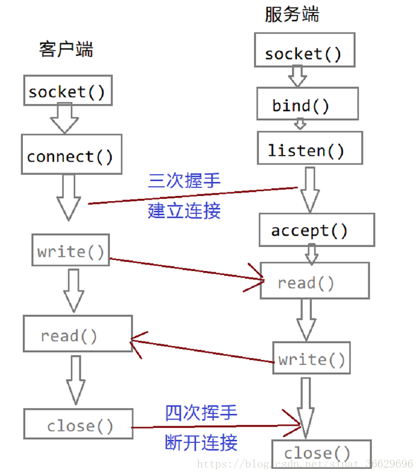
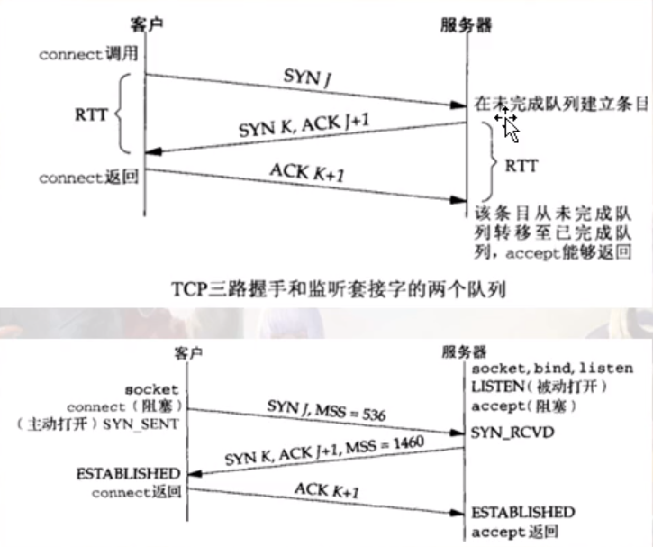
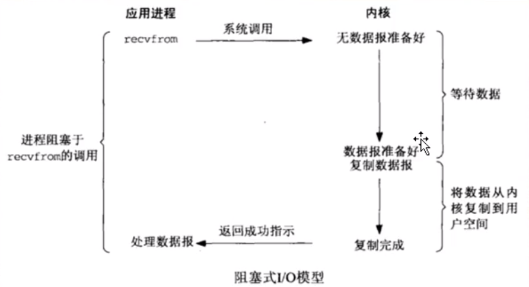
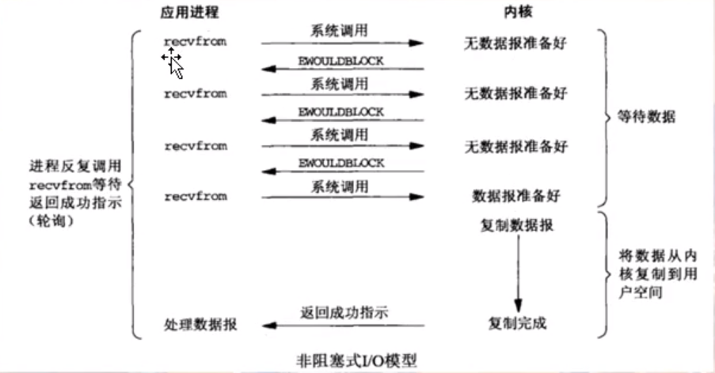
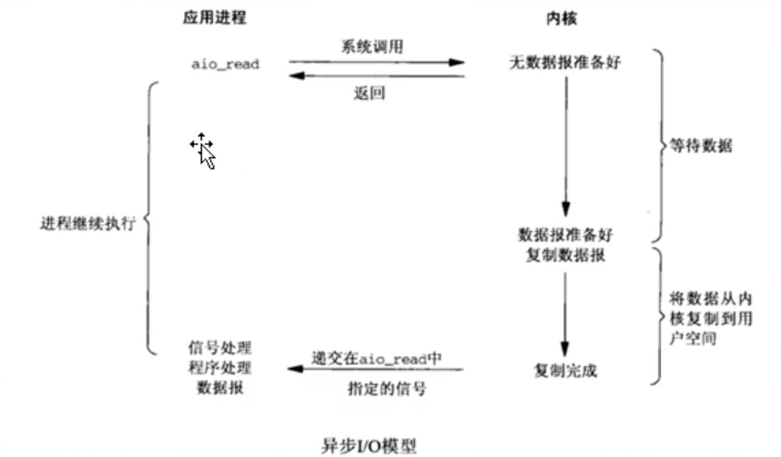
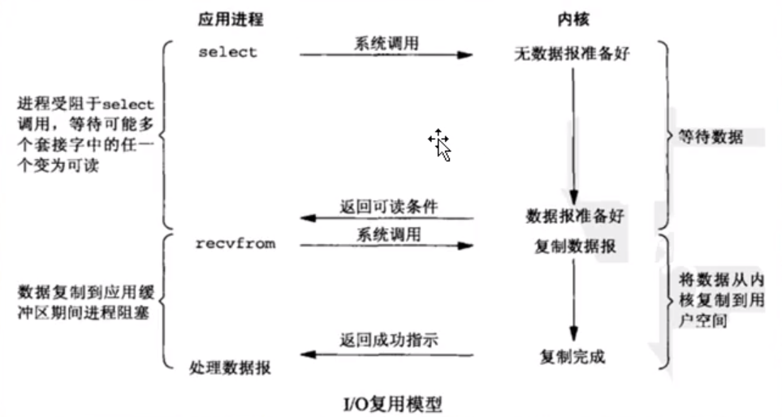
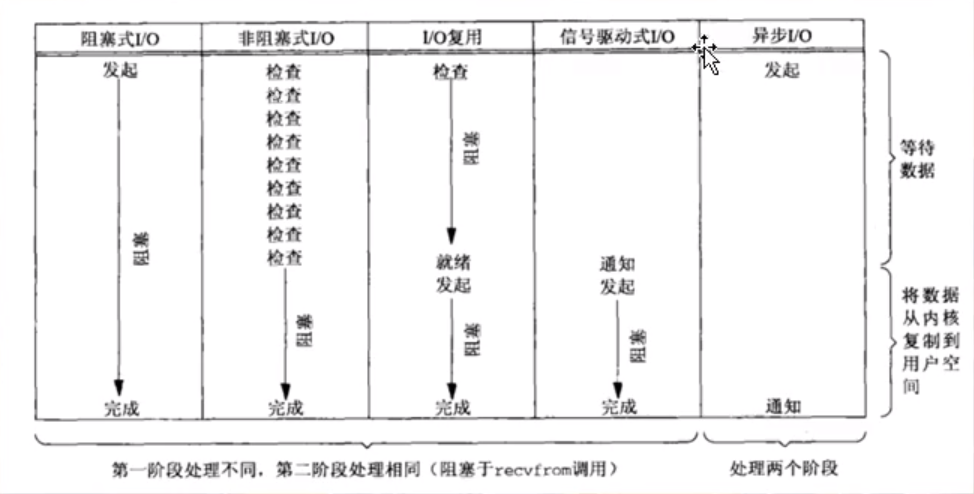

# （1）listen()队列剖析

listen()：监听端口，用在 TCP连接 中的 服务器端 角色；



### listen()函数

```c++
#include <sys/types.h>          
#include <sys/socket.h>

int listen(int sockfd, int backlog);
```

在网络通信中, 客户端通常处于主动的一方, 而服务器则是被动的一方, 服务器是被连接的, 所以他要时刻准备着被连接, 所以就需要调用 listen() 来监听, 等着被连接.

listen() 函数的主要作用就是将 socket() 函数得到的 sockfd 变成一个被动监听的套接字, 用来被动等待客户端的连接, 而参数 backlog 的作用就是设置连接队列的长度

三次握手,建立连接不是 listen() 函数完成的, 而是内核完成的, listen() 函数只是将 sockfd 和 backlog 告诉内核, 然后就返回了

之后, 如果有客户端通过 connect() 发起连接请求, 内核就会通过三次握手建立连接, 然后将建立好的连接放到一个队列中, 这个队列称为: 已完成连接队列

### connect()函数

```c++
#include <sys/types.h>
#include <sys/socket.h>

int connect(int sockfd,
            const struct sockaddr *addr,
            socklen_t addrlen);
```

通常客户端通过 connect() 函数来向服务端主动发起连接, 但是建立连接也不是这个函数完成的, 而是由内核完成的, 这个函数仅仅是通知内核通过三次握手建立连接, 然后将结果返回给这个函数.

这个函数默认会一直阻塞, 直到内核连接建立成功或者超时失败才返回(但一般这个过程很快)

所以说, 服务器端通过 listen() 函数来通知内核建立连接, 客户端通过 connect() 函数来通知内核建立连接

因此, 在 listen() 之后, 连接就已经建立好了, 建立好的连接存储在已完成连接队列中

这里还需要再分析一下 listen() 函数的第二个参数 backlog, 实际上, 内核为每一个监听套接字维护两个队列

* 未完成连接队列

`其中存储着尚未建立连接的套接字`

* 已完成连接队列

`存储着已经完成连接的套接字`



一般认为 backlog 参数的大小是这两个队列大小之和, 收到客户端的连接请求之后, 内核创建一个套接字存储在未完成连接队列中, 来进行三次握手建立连接

连接建立完成以后, 这个套接字就加到已完成连接队列的队尾, 服务器从已完成连接队列中取走一个, 又空出一个位置, 然后已经完成连接的套接字由补充进来, 就这样实现动态平衡

所以说, 如果在 listen 之后不进行 accept , connect 也是会成功返回的, 其实此时连接就已经建立好了

## （1.1）监听套接字的队列

对于一个调用listen()进行监听的套接字，操作系统会给这个套接字 维护两个队列；
a)未完成连接队列 【保存连接用的】
当客户端 发送tcp连接三次握手的第一次【syn包】给服务器的时候，服务器就会在未完成队列中创建一个 跟这个 syn包对应的一项，
其实，我们可以把这项看成是一个半连接【因为连接还没建立起来呢】，这个半连接的状态会从LISTEN变成SYN_RCVD状态，同时给客户端返回第二次握手包【syn,ack】
这个时候，其实服务器是在等待完成第三次握手；

b)已完成连接队列 【保存连接用的】
当第三次握手完成了，这个连接就变成了ESTABLISHED状态，每个已经完成三次握手的客户端 都放在这个队列中作为一项；
backlog曾经的含义：已完成队列和未完成队列里边条目之和 不能超过 backlog;
(1)客户端这个connect()什么时候返回，其实是收到三次握手的第二次握手包（也就是收到服务器发回来的syn/ack）之后就返回了；
(2)RTT是未完成队列中任意一项在未完成队列中留存的时间，这个时间取决于客户端和服务器；
对于客户端，这个RTT时间是第一次和第二次握手加起来的时间；
对于服务器，这个RTT时间实际上是第二次和第三次握手加起来的时间；
如果这三次握手包传递速度特别快的话，大概187毫秒能够建立起来这个连接；这个时间挺慢，所以感觉建立TCP连接的成本挺高；【短连接游戏-挺恶心的】
(3)如果一个恶意客户，迟迟不发送三次握手的第三个包。那么这个连接就建立不起来，那么这个处于SYN_RCVD的这一项【服务器端的未完成队列中】，
//就会一致停留在服务器的未完成队列中，这个停留时间大概是75秒，如果超过这个时间，这一项会被操作系统干掉；

## （1.2）accept()函数

```c++
#include <sys/types.h>          
#include <sys/socket.h>

int accept(int sockfd, 
           struct sockaddr *addr, 
           socklen_t *addrlen);
```

所以, accept() 函数的作用就是在已完成连接队列中取出一个已经建立好的连接

如果这个队列中已经没有已完成连接的套接字, 那么 accept() 就会一直阻塞, 直到取得一个已经建立连接的套接字

如果服务器来不及调用 accept() 取走队列中已经建立好的连接, 导致队列中的连接满了, 会怎么样呢 ?

这取决于内核的具体实现, 在Linux中会延时建立连接.

accept()函数，就使用来 从 已完成连接队列 中 的队首【队头】位置取出来一项【每一项都是一个已经完成三路握手的TCP连接】，返回给进程；
如果已完成连接队列是空的呢？那么咱们这个范例中accept()会一致卡在这里【休眠】等待，一直到已完成队列中有一项时才会被唤醒；
所以，从编程角度，我们要尽快的用accept()把已完成队列中的数据【TCP连接】取走，大家必须有这个认识；
accept()返回的是个套接字，这个套接字就代表那个已经用三次握手建立起来的那个tcp连接，因为accept()是从 已完成队列中取的数据；
换句话来说，我们服务器程序，必须要严格区分两个套接字：

* a)监听9000端口这个套接字，这个东西叫“监听套接字【listenfd】”，只要服务器程序在运行，这个套接字就应该一直存在；
* b)当客户端连接进来，操作系统会为每个成功建立三次握手的客端再创建一个套接字【当然是一个已经连接套接字】，accept()返回的就是这种套接字；
  也就是从已完成连接队列中取得的一项。随后，服务器使用这个accept()返回的套接字和客户端通信的；

**思考题：**

* (1)如果两个队列之和【已完成连接队列，和未完成连接队列】达到了listen()所指定的第二参数，也就是说队列满了；
  此时，再有一个客户发送syn请求，服务器怎么反应？
  实际上服务器会忽略这个syn，不给回应； 客户端这边，发现syn没回应，过一会会重发syn包；
* (2)从连接被扔到已经完成队列中去，到accept()从已完成队列中把这个连接取出这个之间是有个时间差的，如果还没等accept()从已完成队列中把这个连接取走的时候，客户端如果发送来数据，这个数据就会被保存在已经连接的套接字的接收缓冲区里，这个缓冲区有多大，最大就能接收多少数据量；

## （1.3）syn攻击【syn flood】:典型的利用TCP/IP协议涉及弱点进行坑爹的一种行为；

拒绝服务攻击(DOS/DDOS)；

拒绝服务攻击时，攻击者想非法占用被攻击者的一些资源，比如如：带宽，CPU，内存等等，使得被攻击者无法响应正常用户的请求。

讲泛洪攻击之前，我们先了解一下DoS攻击和DDoS攻击，这两个攻击大体相同，前者的意思是：拒绝服务攻击；后者的意思是：分布式拒绝服务攻击。不要看这两个攻击前一个比后一个多了一个字母，后一个攻击比前你一个攻击少了"分布式"三个字，其实他们具体的来说还是有所区分的。

DDoS是DoS攻击中的一种方法。下面我们来详细看一下区分：

DoS（拒绝服务）：不是DOS操作系统，造成DoS的攻击行为被称为DoS攻击，它的目的是使得计算机或者网络我无法提供正常服务。最常见的DOS攻击有计算机网络带宽攻击和连通性的攻击。

DDoS（分布式拒绝服务）；这个的攻击借助于客户/服务器技术，将多个计算机联合起来作为一个攻击平台，对一个或者是多个目标发动攻击，从而成倍的提高就裁决服务攻击的威力。

简单地说，DDoS的攻击威力要大于DoS的攻击威力，DDoS主要是发动群体攻击

syn攻击就是攻击方不断向服务器发送syn连接，但是不返回ack确认，这种不断的syn请求就会导致tcp中的已完成连接队列被填充满（因为tcp规定，backlog的值是有上限的），服务器为这些攻击的syn包都建立了半连接放在已完成队列中，等待半连接被领取，但是因为syn攻击不发送ack确认，就不会调用accept领取，导致已完成队列被填满，那么正常的客户请求就来的时候，就无法为这些正常用户提供服务（因为当已完成队列满的时候，系统将拒绝syn连接请求）

backlog：进一步明确和规定了：指定给定套接字上内核为之排队的最大已完成连接数【已完成连接队列中最大条目数】；
大家在写代码时尽快用accept()把已完成队列里边的连接取走，尽快 留出空闲为止给后续的已完成三路握手的条目用，那么这个已完成队列一般不会满；
一般这个backlog值给300左右；

那么我们如何去防范这种SYN攻击呢？

其实最常用的一个手段就是优化主机系统设置。比如降低SYN timeout时间，使得主机尽快释放半连接的占用或者采用SYN cookie设置，如果短时间内收到了某个IP的重复SYN请求，我们就认为受到了攻击。我们合理的采用防火墙设置等外部网络也可以进行拦截。

# （2）阻塞与非阻塞I/O

阻塞和非阻塞主要是指调用某个系统函数时，这个函数是否会导致我们的进程进入sleep()【卡在这休眠】状态而言的；

**a)阻塞I/O**
我调用一个函数，这个函数就卡在在这里，整个程序流程不往下走了【休眠sleep】，该函数卡在这里等待一个事情发生，只有这个事情发生了，这个函数才会往下走；
这种函数，就认为是阻塞函数；accept();
这种阻塞，并不好，效率很低；一般我们不会用阻塞方式来写服务器程序，效率低；比如系统给你分配了100的时间片，然后你因为阻塞休眠，就浪费了系统分配的时间片。



**b)非阻塞I/O：**

不会卡住，充分利用时间片，执行效率更高；
非阻塞模式的两个鲜明特点：

* (1)不断的调用accept()，recvfrom()函数来检查有没有数据到来，如果没有，函数会返回一个特殊的错误标记来告诉你，这种标记可能是EWULDBLOCK，也可能是EAGAIN；如果数据没到来，那么这里有机会执行其他函数，但是也得不停的再次调用accept()，recvfrom()来检查数据是否到来，非常累；
* (2)如果数据到来，那么就得卡在这里把数据从内核缓冲区复制到用户缓冲区，所以复制这个阶段是卡着完成的；



# （3）同步与异步I/O:这两个概念容易和 阻塞/非阻塞混淆；

### a)异步I/O：



调用一个异步I/O函数时，我门要给这个函数指定一个接收缓冲区，我还要给定一个回调函数；
调用完一个异步I/O函数后，该函数会立即返回。 其余判断交给操作系统，操作系统会判断数据是否到来，如果数据到来了，操作系统会把数据拷贝到你所提供的缓冲区里，然后调用你所指定的这个回调函数来通知你；
很容易区别非阻塞和异步I/O的差别：
（1）非阻塞I/O要不停的调用I/O函数来检查数据是否来，如果数据来了，就得卡在I/O函数这里把数据从内核缓冲区复制到用户缓冲区，然后这个函数才能返回；
（2）异步I/O根本不需要不停的调用I/O函数来检查数据是否到来，只需要调用一次，然后就可以干别的事情去了；
内核判断数据到来，拷贝数据到你提供的缓冲区，调用你的回调函数来通知你，你并没有被卡在那里的情况；

### b)同步I/O



select网络模型 / poll。epoll网络模型。这些都可以划分到同步IO
1)调用select()判断有没有数据，有数据，走下来，没数据卡在那里；(这里和异步I/O不一样，异步是一来就直接去取数据，而同步是会先判断有没有数据)
2)select()返回之后，用recvfrom()去取数据；当然取数据的时候也会卡那么一下(因为涉及到将数据从系统提供的收缓冲区复制到你自己提供的一个数据缓冲区这么一个动作，需要时间)；
同步I/O感觉更麻烦，要调用两个函数才能把数据拿到手；
但是同步I/O和阻塞式I/O比，就是所谓的 I/O复用【用两个函数来收数据的优势】 能力；

## （3.1）I/O复用

所谓I/O复用，就是我多个socket【多个TCP连接】可以弄成一捆【一堆】，我可以用select这种同步I/O函数在这等数据；
select()的能力是等多条TCP连接上的任意一条有数据来；然后哪条TCP有数据来，我再用具体的比如recvfrom()去收。
所以，这种调用一个函数能够判断一堆TCP连接是否来数据的这种能力，叫I/O复用，英文I/O multiplexing【I/O多路复用】

很多资料把 阻塞I/O，非阻塞I/O，同步I/O归结为一类 ，因为他们多多少少的都有阻塞的行为发生；
甚至有的资料直接就把 阻塞I/O，非阻塞I/O 都归结为同步I/O模型，这也是可以的】
而把异步I/O单独归结为一类，因为异步I/O是真正的没有阻塞行为发生的；

## （3.2）思考题

什么叫使用异步的方法去使用非阻塞调用？

非阻塞异步编程方法使用一个监听器，在使用回调的过程中，能够自动感知到调用结果，从而实现高并发的调用方法，简单的理解就是，使用了非阻塞异步编程方法，可以让我们在发起一个回调方法后，配合上一个自动监听机制，在回调方法执行完成后，主动且及时的通知调用者，这样就实现了一个非阻塞的回调方法了。

# 总结：

服务器端编程经常需要构造高性能的IO模型，常见的IO模型有四种：

（1）同步阻塞IO（Blocking IO）：即传统的IO模型。

（2）同步非阻塞IO（Non-blocking IO）：默认创建的socket都是阻塞的，非阻塞IO要求socket被设置为NONBLOCK。注意这里所说的NIO并非Java的NIO（New IO）库。

（3）IO多路复用（IO Multiplexing）：即经典的Reactor设计模式，有时也称为异步阻塞IO，Java中的Selector和Linux中的epoll都是这种模型。

（4）异步IO（Asynchronous IO）：即经典的Proactor设计模式，也称为异步非阻塞IO。

