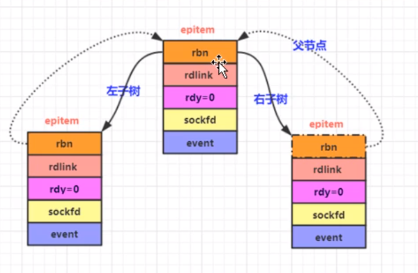
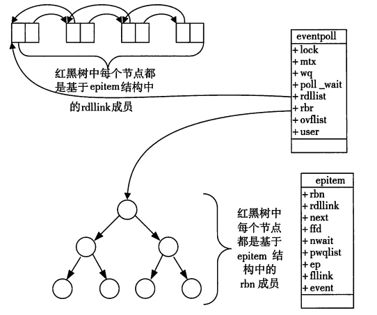
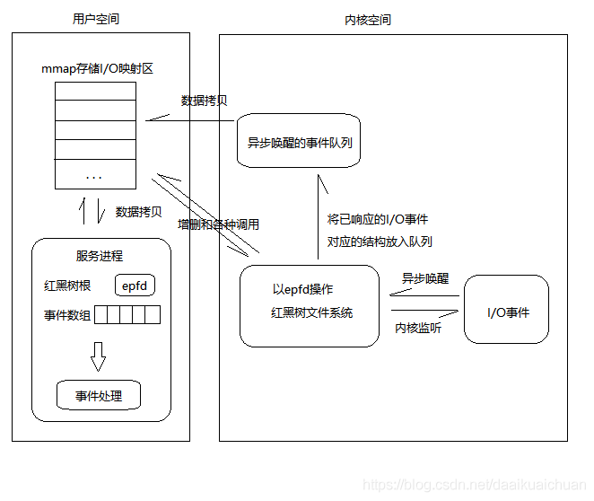
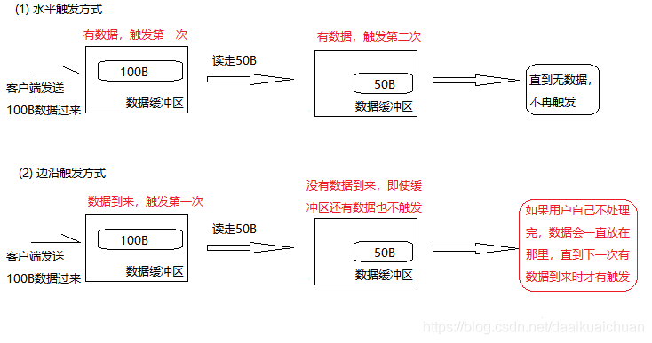
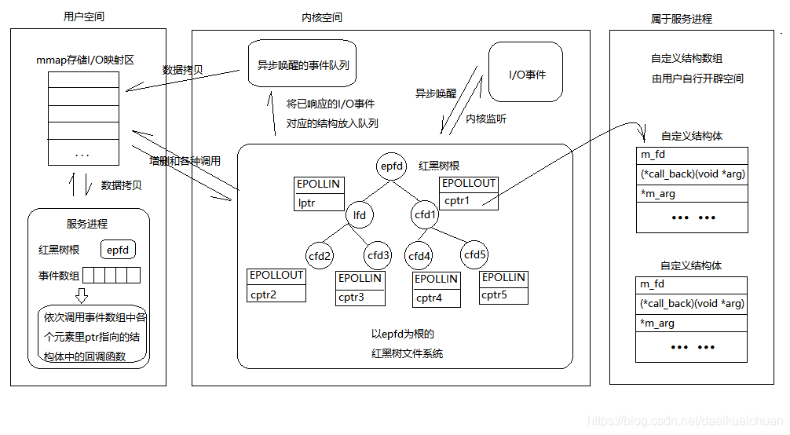
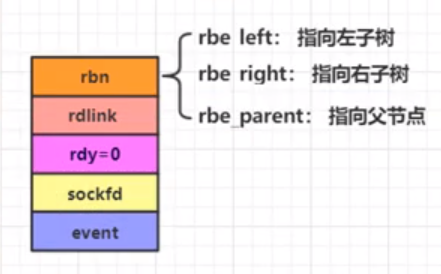

# （1）监听端口

## （1.1）开启监听端口

```c++
// 监听端口【支持多个端口】,这里遵从nginx官方的命名
// 在创建worker子进程之前就要执行这个函数
bool CSocket::ngx_open_listening_sockets()
{
    CConfig *p_config = CConfig::GetInstance();
    m_ListenPortCount = p_config->GetIntDefault("ListenPortCount", m_ListenPortCount);  // 取的要监听的端口数量

    int                 isock;              // socket
    struct sockaddr_in  serv_addr;          // 服务器的地址结构体
    int                 iport;              // 端口
    char                strinfo[100];       // 临时字符串


    // 初始化相关
    memset(&serv_addr, 0, sizeof(serv_addr));   // 初始化
    serv_addr.sin_family = AF_INET;             // 选择协议族为 ipv4
    serv_addr.sin_addr.s_addr = htonl(INADDR_ANY);  // 监听本地所有的IP地址，INADDR_ANY表示的是一个服务器上的所有网卡（服务器可能不止一个网卡）多个本地IP地址都能进行绑定端口号，进行侦听

    for(int i = 0; i < m_ListenPortCount; i++)  // 要监听这么多的端口
    {
        // 参数1：AF_INET: 使用IPV4协议，一般都这么写
        // 参数2：SOCK_STREAM   使用tcp，表示可靠连接【相对还有一个UDP套接字，表示不可靠连接】
        // 参数3：给0，固定用法
        isock = socket(AF_INET,SOCK_STREAM,0);  // 系统函数，成功返回非负描述符，出错返回-1
        if(isock == -1)
        {
            ngx_log_stderr(errno, "CSocket::Initialize()中socket()失败， i = %d.", i);
            // 其实这里直接退出，那如果已往有成功创建的socket呢？这样就会得不到释放，当然走到这里表示程序不正常，应该整体退出，也没有必要释放
            return false;
        }

        // setsockopt()：设置一些套接字参数选项
        // 参数2：是表示级别，和参数3配套使用，也就是说，参数3如果确定了，参数2就确定了
        // 参数3：允许重复用本地地址
        // 设置 SO_REUSEADDR。解决TIME_WAIT这个状态导致bind()失败的问题
        int reuseaddr = 1;  // 1:打开对应的设置项
        if(setsockopt(isock, SOL_SOCKET, SO_REUSEADDR, (const void *) &reuseaddr, sizeof(reuseaddr)) == -1)
        {
            ngx_log_stderr(errno, "CScoket::Initialize()中setsocopt(SO_REUSEADDR)失败，i = %d。", i);
            close(isock);   // 无需理会是否正常执行
            return false;
        }

        // 设置socket为非阻塞
        if(setnonblocking(isock) == false)
        {
            ngx_log_stderr(errno, "CSocekt::Initialize()中setnonblocking()失败,i=%d.",i);
            close(isock);
            return false;
        }

        // 设置本服务器要监听的地址和端口，这样客户端才能连接到该地址和端口并发送数据
        strinfo[0] = 0;
        sprintf(strinfo, "ListenPort%d", i);
        iport = p_config->GetIntDefault(strinfo, 10000);
        serv_addr.sin_port = htons((in_port_t)iport);   // in_port_t其实就是uint16_t

        // 绑定服务器地址结构体
        if(bind(isock, (struct sockaddr*)&serv_addr, sizeof(serv_addr)) == -1)
        {
            ngx_log_stderr(errno, "CSocekt::Initialize()中bind()失败,i=%d.",i);
            close(isock);
            return false;
        }

        // 开始监听
        if(listen(isock, NGX_LISTEN_BACKLOG) == -1)
        {
            ngx_log_stderr(errno, "CSocekt::Initialize()中listen()失败,i=%d.",i);
            close(isock);
            return false;
        }

        // 放到列表里
        lpngx_listening_t p_listensocketitem = new ngx_listening_t;         // 注意不要写错，前面类型是指针类型，后面的类型是一个结构体
        memset(p_listensocketitem, 0, sizeof(ngx_listening_t));             // 这里后面用的是 ngx_listening_t 而不是lpngx_listening_t
        p_listensocketitem->port = iport;                                   // 记录所监听的端口号
        p_listensocketitem->fd = isock;                                     // 保存套接字句柄
        ngx_log_error_core(NGX_LOG_INFO, 0, "监听%d端口成功！", iport);      // 打印日志
        m_ListenSocketList.push_back(p_listensocketitem);                   // 加入到队列中
    }
    return true;

}

```

## （1.2）设置非阻塞

```c++
// 设置socket连接为非阻塞模式【这种函数写法很固定】。非阻塞：【不断调用，不断调用这种，在拷贝数据的时候是阻塞的】
bool CSocket::setnonblocking(int sockfd)
{
    int nb = 1;     // 0:清除   1：设置
    if (ioctl(sockfd, FIONBIO, &nb) == -1)
    {
        return false;
    }
    return true;

    // 如下也是一种写法，跟上面这种写法其实是一样的，只是上面这个写法更简单
    // fcntl:file control 【文件控制】相关函数，执行各种描述符控制操作
    // 参数1：所要设置的秒数符，这里是套接字【也是描述符的一种】
    // int opts = fcntl(sockfd, F_GETFL);  // 用F_GETL先获取描述符的一些标志信息
    // if(opts < 0)
    // {
    //     ngx_log_stderr(errno,"CSocekt::setnonblocking()中fcntl(F_GETFL)失败.");
    //     return false;
    // }
    // opts |= O_NONBLOCK; // 把非阻塞标记加到原来的标记上，标记这是一个非租塞套接字，【如何关闭非阻塞呢？opts &= ~O_NONBLOCK;然后再F_SETFL 一下即可】
    // if(fcntl(sockfd, F_SETFL, opts) < 0)
    // {
    //     ngx_log_stderr(errno,"CSocekt::setnonblocking()中fcntl(F_SETFL)失败.");
    //     return false;
    // }
    // return true;
    
}

```


# （2）epoll技术简介

## （2.1）epoll概述

epoll是在2.6内核中提出的，是之前的select和poll的增强版本。相对于select和poll来说，epoll更加灵活，没有描述符限制。epoll使用一个文件描述符管理多个描述符，将用户关系的文件描述符的事件存放到内核的一个事件表中，这样在用户空间和内核空间的copy只需一次。

  设想一个场景：有100万用户同时与一个进程保持着TCP连接，而每一时刻只有几十个或几百个TCP连接是活跃的(接收TCP包)，也就是说在每一时刻进程只需要处理这100万连接中的一小部分连接。那么，如何才能高效的处理这种场景呢？进程是否在每次询问操作系统收集有事件发生的TCP连接时，把这100万个连接告诉操作系统，然后由操作系统找出其中有事件发生的几百个连接呢？实际上，在Linux2.4版本以前，那时的select或者poll事件驱动方式是这样做的。

  这里有个非常明显的问题，即在某一时刻，进程收集有事件的连接时，其实这100万连接中的大部分都是没有事件发生的。因此如果每次收集事件时，都把100万连接的套接字传给操作系统(这首先是用户态内存到内核态内存的大量复制)，而由操作系统内核寻找这些连接上有没有未处理的事件，将会是巨大的资源浪费，然后select和poll就是这样做的，因此它们最多只能处理几千个并发连接。而epoll不这样做，它在Linux内核中申请了一个简易的文件系统，把原先的一个select或poll调用分成了3部分：

```c++
int epoll_create(int size);  
int epoll_ctl(int epfd, int op, int fd, struct epoll_event *event);  
int epoll_wait(int epfd, struct epoll_event *events,int maxevents, int timeout);  
```

1. 调用epoll_create建立一个epoll对象(在epoll文件系统中给这个句柄分配资源)；

2. 调用epoll_ctl向epoll对象中添加这100万个连接的套接字；

3. 调用epoll_wait收集发生事件的连接。

  这样只需要在进程启动时建立1个epoll对象，并在需要的时候向它添加或删除连接就可以了，因此，在实际收集事件时，epoll_wait的效率就会非常高，因为调用epoll_wait时并没有向它传递这100万个连接，内核也不需要去遍历全部的连接。

## （2.2）学习epoll要达到的效果及一些说明

(1)理解epoll的工作原理；面试考epoll技术的工作原理；
(2)开始写代码
(3)认可nginx epoll部分源码；并且能复用的尽量复用；

# （3）epoll原理与函数介绍

一、epoll原理详解
  当某一进程调用epoll_create方法时，Linux内核会创建一个eventpoll结构体，这个结构体中有两个成员与epoll的使用方式密切相关，如下所示：

```c++
struct eventpoll {
　　...
　　/*红黑树的根节点，这棵树中存储着所有添加到epoll中的事件，
　　也就是这个epoll监控的事件*/
　　struct rb_root rbr;
　　/*双向链表rdllist保存着将要通过epoll_wait返回给用户的、满足条件的事件*/
　　struct list_head rdllist;
　　...
};
```


  我们在调用epoll_create时，内核除了帮我们在epoll文件系统里建了个file结点，在内核cache里建了个红黑树用于存储以后epoll_ctl传来的socket外，还会再建立一个rdllist双向链表，用于存储准备就绪的事件，当epoll_wait调用时，仅仅观察这个rdllist双向链表里有没有数据即可。有数据就返回，没有数据就sleep，等到timeout时间到后即使链表没数据也返回。所以，epoll_wait非常高效。

所以这里对于epoll中的红黑树，他的节点添加是由，**epoll_ctl（EPOLL_CTL_ADD）** 来进行添加的，有多少并发量，就要调用多少次该方法

  所有添加到epoll中的事件都会与设备(如网卡)驱动程序建立回调关系，也就是说相应事件的发生时会调用这里的回调方法。这个回调方法在内核中叫做ep_poll_callback，它会把这样的事件放到上面的rdllist双向链表中。

  在epoll中对于每一个事件都会建立一个epitem结构体，如下所示：

```c++
struct epitem {
　　...
　　//红黑树节点（它这里包含了3个指针，分别指向左子树，右子树，和其上级根节点）
　　struct rb_node rbn;
　　//双向链表节点
　　struct list_head rdllink;
　　//事件句柄等信息
　　struct epoll_filefd ffd;
　　//指向其所属的eventepoll对象
　　struct eventpoll *ep;
　　//期待的事件类型
　　struct epoll_event event;
　　...
}; // 这里包含每一个事件对应着的信息。
```

  

​	当调用epoll_wait检查是否有发生事件的连接时，只是检查eventpoll对象中的rdllist双向链表是否有epitem元素而已，如果rdllist链表不为空，则这里的事件复制到用户态内存（使用共享内存提高效率）中，同时将事件数量返回给用户。因此epoll_waitx效率非常高。epoll_ctl在向epoll对象中添加、修改、删除事件时，从rbr红黑树中查找事件也非常快，也就是说epoll是非常高效的，它可以轻易地处理百万级别的并发连接。




【总结】：

  一颗红黑树，一张准备就绪句柄链表，少量的内核cache，就帮我们解决了大并发下的socket处理问题。

执行epoll_create()时，创建了红黑树和就绪链表；

执行epoll_ctl()时，如果增加socket句柄，则检查在红黑树中是否存在，存在立即返回，不存在则添加到树干上，然后向内核注册回调函数，用于当中断事件来临时向准备就绪链表中插入数据；

执行epoll_wait()时立刻返回准备就绪链表里的数据即可。



二、epoll的两种触发模式

  epoll有EPOLLLT和EPOLLET两种触发模式，LT是默认的模式，ET是“高速”模式。

LT（水平触发）模式下，**只要这个文件描述符还有数据可读，每次 epoll_wait都会返回它的事件**，提醒用户程序去操作；

ET（边缘触发）模式下，在它检测到有 I/O 事件时，通过 epoll_wait 调用会得到有事件通知的文件描述符，**对于每一个被通知的文件描述符，如可读，则必须将该文件描述符一直读到空，**让 errno 返回 EAGAIN 为止，否则下次的 epoll_wait 不会返回余下的数据，会丢掉事件。如果ET模式不是非阻塞的，那这个一直读或一直写势必会在最后一次阻塞。

  还有一个特点是，epoll使用“事件”的就绪通知方式，通过epoll_ctl注册fd，一旦该fd就绪，内核就会采用类似callback的回调机制来激活该fd，epoll_wait便可以收到通知。



【epoll为什么要有EPOLLET触发模式？】：

  如果采用EPOLLLT模式的话，**系统中一旦有大量你不需要读写的就绪文件描述符，它们每次调用epoll_wait都会返回，**这样会大大降低处理程序检索自己关心的就绪文件描述符的效率.。而采用EPOLLET这种边缘触发模式的话，当被监控的文件描述符上有可读写事件发生时，epoll_wait()会通知处理程序去读写。如果这次没有把数据全部读写完(如读写缓冲区太小)，那么下次调用epoll_wait()时，它不会通知你，也就是它只会通知你一次，直到该文件描述符上出现第二次可读写事件才会通知你！！！**这种模式比水平触发效率高，系统不会充斥大量你不关心的就绪文件描述符。**

【总结】：

ET模式（边缘触发）**只有数据到来才触发，不管缓存区中是否还有数据，**缓冲区剩余未读尽的数据不会导致epoll_wait返回；

LT 模式（水平触发，默认）**只要有数据都会触发**，缓冲区剩余未读尽的数据会导致epoll_wait返回。

三、epoll反应堆模型

【epoll模型原来的流程】：

1. epoll_create(); // 创建监听红黑树

2. epoll_ctl(); // 向书上添加监听fd

3. epoll_wait(); // 监听

   有监听fd事件发送--->返回监听满足数组--->判断返回数组元素--->lfd满足accept--->返回cfd---->read()读数据--->write()给客户端回应。

【epoll反应堆模型的流程】：

1. epoll_create(); // 创建监听红黑树

2. epoll_ctl(); // 向书上添加监听fd

3. epoll_wait(); // 监听
   有客户端连接上来--->lfd调用acceptconn()--->将cfd挂载到红黑树上监听其读事件--->
   epoll_wait()返回cfd--->cfd回调recvdata()--->将cfd摘下来监听写事件--->
   epoll_wait()返回cfd--->cfd回调senddata()--->将cfd摘下来监听读事件--->...--->

   

## （3.1）课件介绍

https://github.com/wangbojing
a)c1000k_test这里，测试百万并发的一些测试程序；一般以main();
b)ntytcp：nty_epoll_inner.h，nty_epoll_rb.c
epoll_create();
epoll_ctl();
epoll_wait();
epoll_event_callback();
c)总结：建议学习完epoll实战代码之后，再来学习这里提到的课件代码，事半功倍；

## （3.2）epoll_create()函数

 **int epoll_create(int size);**

创建一个epoll对象，返回该对象的描述符【文件描述符】，这个描述符就代表这个epoll对象，后续会用到；
这个epoll对象最终要用close(),因为文件描述符/句柄 总是关闭的；

创建一个epoll的句柄，size用来告诉内核这个监听的数目一共有多大。这个参数不同于select()中的第一个参数，给出最大监听的fd+1的值。需要注意的是，当创建好epoll句柄后，它就是会占用一个fd值，在linux下如果查看/proc/进程id/fd/，是能够看到这个fd的，所以在使用完epoll后，必须调用close()关闭，否则可能导致fd被耗尽。

a)struct eventpoll ep = (struct eventpoll)calloc(1, sizeof(struct eventpoll));
b)rbr结构成员：代表一颗红黑树的根节点[刚开始指向空],把rbr理解成红黑树的根节点的指针；
红黑树，用来保存 键【数字】/值【结构】，能够快速的通过你给key，把整个的键/值取出来；
c)rdlist结构成员：代表 一个双向链表的表头指针；
双向链表：从头访问/遍历每个元素特别快；next。
d)总结：创建了一个eventpoll结构对象，被系统保存起来；
rbr成员被初始化成指向一颗红黑树的根【有了一个红黑树】；
rdlist成员被初始化成指向一个双向链表的根【有了双向链表】；

## （3.3）epoll_ctl()函数

**int epoll_ctl(int epfd, int op, int fd, struct epoll_event \*event);**

epoll的事件注册函数，它不同于select()在监听事件时告诉内核要监听什么类型的事件，而是在这里先注册要监听的事件类型。把一个socket以及这个socket相关的事件添加到这个epoll对象描述符中去，目的就是通过这个epoll对象来监视这个socket【客户端的TCP连接】上数据的来往情况;
当有数据来往时，系统会通知我们；
我们把感兴趣的事件通过epoll_ctl()添加到系统，当这些事件来的时候，系统会通知我们；

第一个参数是epoll_create()的返回值，

第二个参数表示动作，用三个宏来表示：
EPOLL_CTL_ADD：注册新的fd到epfd中；(等同于往红黑树上新增一个节点)，每个客户端连入服务器后，服务器都会产生一个对应的socket，每个连接这个socket的值都不同，所以这个socket就是红黑树的key
EPOLL_CTL_MOD：修改已经注册的fd的监听事件；你 用了EPOLL_CTL_ADD把节点添加到红黑树上之后，才存在修改；
EPOLL_CTL_DEL：从epfd中删除一个fd；是从红黑树上把这个节点干掉；这会导致这个socket【这个tcp链接】上无法收到任何系统通知事件；

第三个参数是需要监听的fd，

第四个参数是告诉内核需要监听什么事。这里包括的是 一些事件信息；EPOLL_CTL_ADD和EPOLL_CTL_MOD都要用到这个event参数里边的事件信息，struct epoll_event结构如下：

```c++
struct epoll_event {
  __uint32_t events;  /* Epoll events */
  epoll_data_t data;  /* User data variable */
};
```

events可以是以下几个宏的集合：
EPOLLIN ：表示对应的文件描述符可以读（包括对端SOCKET正常关闭）；
EPOLLOUT：表示对应的文件描述符可以写；
EPOLLPRI：表示对应的文件描述符有紧急的数据可读（这里应该表示有带外数据到来）；
EPOLLERR：表示对应的文件描述符发生错误；
EPOLLHUP：表示对应的文件描述符被挂断；
EPOLLET： 将EPOLL设为边缘触发(Edge Triggered)模式，这是相对于水平触发(Level Triggered)来说的。
EPOLLONESHOT：只监听一次事件，当监听完这次事件之后，如果还需要继续监听这个socket的话，需要再次把这个socket加入到EPOLL队列里

## （3.4）epoll_wait()函数

**int epoll_wait(int epfd, struct epoll_event \* events, int maxevents, int timeout);**

等待事件的产生，类似于select()调用。参数events用来从内核得到事件的集合，maxevents告之内核这个events有多大，这个maxevents的值不能大于创建epoll_create()时的size，参数timeout是超时时间（毫秒，0会立即返回，-1将不确定，也有说法说是永久阻塞）。该函数返回需要处理的事件数目，如返回0表示已超时

阻塞一小段时间并等待事件发生，返回事件集合，也就是获取内核的事件通知；
说白了就是遍历这个双向链表，把这个双向链表里边的节点数据拷贝出去，拷贝完毕的就从双向链表里移除；
因为双向链表里记录的是所有有数据/有事件的socket【TCP连接】；

参数epfd：是epoll_create()返回的epoll对象描述符；
参数events：是内存，也是数组，长度 是maxevents，表示此次epoll_wait调用可以收集到的maxevents个已经继续【已经准备好的】的读写事件；
说白了，就是返回的是 实际 发生事件的tcp连接数目；
参数timeout：阻塞等待的时长；
epitem结构设计的高明之处：既能够作为红黑树中的节点，又能够作为双向链表中的节点；

作为红黑树中的节点



作为双向链表中的节点


这样设计有个巧妙的地方在于，你不用专门为红黑树去设计一个结构体，然后在专门去为双向链表设计一个结构体，而是可以直接通过这一个结构 epitem 就能实现，既能够作为红黑树中的节点，又能够作为双向链表中的节点；

## （3.5）内核向双向链表增加节点

一般有四种情况，会使操作系统把节点插入到双向链表中；
a)客户端完成三路握手；服务器要accept();
b)当客户端关闭连接，服务器也要调用close()关闭；
c)客户端发送数据来的；服务器要调用read(),recv()函数来收数据；
d)当可以发送数据时；服务武器可以调用send(),write()；
e)其他情况；

