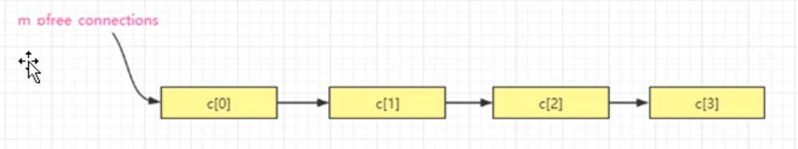

# （1）配置文件的修改

```makefile
#epoll连接的最大数【是每个worker进程允许连接的客户端数】，实际其中有一些连接要被监听socket使用，实际允许的客户端连接数会比这个数小一些
worker_connections = 1024
```


# （2）epoll函数实战

epoll_create()，epoll_ctl(), epoll_wait() 系统提供的函数调用

## （2.1）ngx_epoll_init函数内容

epoll_create(): 创建了一个epoll对象，创建了一个红黑树，还创建了一个双向链表

注意，服务器程序中，每一个函数都会有返回值，一定要养成一个习惯，判断函数返回值，一旦失败，要立即处理

连接池：数组。该数组的元素数量，就是程序里配置的连接数量，每个数组的元素类型是 `lpngx_connection_t`,所以他是一个结构数组

为什么要引入这个数组呢？ 比如2两个监听套接字，用户连入进来，每个用户多出来一个套接字，然后对于一个连接来说，光有这个套接字（数字）的信息是不够的，我们希望把这个套接字和其他有关的连接信息捆绑起来，达到的效果就是，我能通过这个套接字，就能取到这块连接的内存信息，修改也好，使用也好，会很方便

```c++
// lpngx_connection_t 结构体（连接池的元素类型）
typedef struct ngx_connection_s ngx_connection_t, *lpngx_connection_t;
// 以下三个结构是非常重要
// 1）该结构表示一个TCP连接【客户端主动发起，nginx服务器被动接收的TCP连接】
struct ngx_connection_s
{
    int                         fd;                 // 套接字句柄socket
    lpngx_listening_t           listening;          // 如果这个链接被分配给了一个监听套接字，那么这个里面就指向监听套接字对应的那个lpngx_listening_t的内存首地址
    
    // ---------------------------*********************
    unsigned                    instance:1;         // 【位域】失效标志位：0 有效， 1 失效 【这个是官方nginx中就有的，具体作用在 ngx_epoll_process_events()中详解】
    uint64_t                    iCurrsequence;      // 引入一个序号，每次分配出去时+1，这种方法也有可能在一定程度上检测错包废包，具体用法后续完善
    struct    sockaddr          s_sockaddr;         // 保存对方地址信息
    // char                        addr_text[100];     // 地址的文本信息，100足够，一般其实如果是IPV4地址，255.255.255.255，其实只需要20个字节就足够

    // 和读有关的标志----------------------------------------
    // uint8_t                     r_ready;            // 读准备好标记
    uint8_t                     w_ready;            // 写准备好标记

    ngx_event_handler_pt        rhandler;           // 读事件的相关处理方法
    ngx_event_handler_pt        whandler;           // 写事件的相关处理方法


    // ------------------------------------------
    lpngx_connection_t          data;               // 这个是一个指针【等价于传统链表里的next成员：后继指针】，用于指向下一个本类型对象，用于把空闲的连接池对象串起来构成一个单向的链表，方便取用


}
```



**注意看下面这段代码：他里面有个do while循环，这个do while循环执行完后，可以预见，我们的连接池数组被通过next指针链接成了一个链表，并且将成员变量m_pfree_connections指向了链表的头指针，那就有个疑问？本身我们的连接池是一个数组，为什么还要链接成一个链表呢？**

首先它是一个连接池，当有一个新的连接来的时候，我们需要从这个池中取出一个元素绑定给该连接使用，然后又来一个用户，我们就需要从这个连接池中找一个空闲的（未被其他套接字绑定使用的）元素。现在的问题是，怎么能够快速的定位到一个空闲的元素呢？如果我们使用数组遍历查找，把每个用到的元素做一个标记，然后找一个空闲的，不管怎样都会显得笨拙，不够高效。所以，基于这个问题，nginx官方使用了这种，找一个空闲链，将所有没有用到的数组，给他串到一起，因为我们现在的连接池刚刚初始化，每一个元素都是空闲的，所以被全部串起来。到时候需要取空闲元素的时候，只需要从这个空闲链中将链表表头拿出来即可使用，然后将m_pfree_connections指向下一个链表元素，保证m_pfree_connections每次都指向一个空闲的连接池元素。然后置于连接池对象的回收，只需要把需要回收的元素资源释放后绑定到空闲链的表头，用m_pfree_connections指向其回收回来的元素即可。

```c++
// *-*-*---*-*-*************************************************--------------------------------------
// 1)epoll功能初始化，子进程中进行，本函数被ngx_worker_process_init()调用
int CSocket::ngx_epoll_init()
{
    // 1）很多内核版本不处理epoll——create参数，知道该参数 > 0 即可
    // 创建一个epoll对象，创建了一个红黑树，还创建了一个双向链表
    m_epollhandle = epoll_create(m_worker_connections);     // 直接以epoll连接的最大项数为参数，肯定满足大于0
    if(m_epollhandle == -1)
    {
        ngx_log_stderr(errno, "CSocket::ngx_epoll_init()中epoll_create()失败。");
        exit(2);    // 这个是致命问题。直接退出系统。资源交由系统进行释放
    }

    // 2）创建连接池【数组】、创建出来，这个东西用于后续处理所有客户端的连接
    m_connection_n = m_worker_connections;      // 记录当前连接池中的连接总数
    // 连接池【数组，每个元素时一个对象】
    m_pconnections = new ngx_connection_t[m_connection_n];      // new是不可能失败，这里不用判断，如果失败，直接报异常会更好
    // m_pread_events = new ngx_event_t[m_connection_n];
    // m_pwrite_events = new mgx_event_t[m_connection_n];
    // for(int i = 0; i < m_connection_n; i++)
    // {
    //     m_pconnections[i].instance = 1; // 失效标志位设置为1,
    // }

    int i = m_connection_n;             // 连接池中的连接数
    lpngx_connection_t next = NULL;
    lpngx_connection_t c = m_pconnections;  // 连接池数组的首地址

    // 这个do while循环就是在初始化连接池，并将连接池数组元素通过next指针绑定到一起，形成链表
    do
    {
        i--;                    // 注意i是数字末尾，从最后遍历，i递减至数组的首个元素

        // 从尾部往头部走----------------------
        c[i].data = next;       // 设置连接对象的next指针，注意第一次循环时next = NULL
        c[i].fd = -1;           // 初始化连接，无socket和该连接池中的连接【对象】绑定
        c[i].instance = 1;      // 失效标志位设置为1,【失效】
        c[i].iCurrsequence = 0; // 当前序号统一从 0 开始

        // -----------------------------------

        next = &c[i];           // next指针向前移

    } while (i);    // 循环直到 i 为 0 .即循环到数组首地址
    // 注意这里：当这个循环执行完毕后，next的指向现在是指向这个链表的表头

    m_pfree_connections = next;         // 设置空闲连接链表头指针，因为现在next指向c[0]，注意现在整个链表都是空的
    m_free_connection_n = m_connection_n;   // 空闲连接链表的长度，因为现在整个链表都是空的，所以这两个参数相等

    // 3）遍历所有监听socket【监听端口】，我们为每个监听socket增加一个 连接池 中的连接。说白了，就是让一个socket和一个内存绑定，以方便记录该socket相关的数据，状态等
    std::vector<lpngx_listening_t>::iterator pos;
    for(pos = m_ListenSocketList.begin(); pos != m_ListenSocketList.end(); ++pos)
    {
        c = ngx_get_connection((*pos)->fd);     // 从连接池中获取一个空闲连接对象
        if(c == NULL)
        {
            // 这是致命问题，刚开始怎么可能连接池就为空呢？
            ngx_log_stderr(errno,"CSocekt::ngx_epoll_init()中ngx_get_connection()失败.");
            exit(2); // 致命问题，直接退，交给系统处理释放
        }
        c->listening = (*pos);      // 连接对象 和 监听对象关联，方便通过连接对象找到监听对象
        (*pos)->connection = c;     // 监听对象 和 连接对象关联，方便通过监听对象找到连接对象

        // rev->accept = 1;         // 监听端口必须设置accept标志为1

        // 对于监听端口的读事件设置处理方法，因为监听端口是用来等待对象连接的发送三次握手的，所以监听端口关心的就是【读事件】
        c->rhandler = &CSocket::ngx_event_accept;

        // 往监听socket上增加监听事件，从而开始让监听端口履行其职责【如果不加这行，虽然端口能连接上，但是不会触发ngx_epoll_process_events()里面的epoll_wait()往下走
        // ngx_epoll_add_event参数
        // (*pos)->fd,              socket句柄
        // 1, 0,                    读， 写 【只关心读事件，所以参数2：readevent = 1，而参数3：writeevent = 0;】
        // 0,                       其他事件补充标记
        // EPOLL_CTL_ADD,           事件类型【增加，还有其他事件 MOV(修改),DEL(删除)】
        // c                        连接池中的连接
        if(ngx_epoll_add_event((*pos)->fd, 1, 0, 0, EPOLL_CTL_ADD, c) == -1)
        {
            exit(2); //有问题，直接退出，日志 已经写过了
        }
    }
    
    return 1;

}

```

ngx_get_connection()函数详解。这是一个重要函数，从连接池中找空闲连接。（这是一个编程技巧，应该掌握）

```c++
// 从连接池中获取一个空闲连接，【当一个客户端tcp连接进入，我希望把这个连接和我连接池中的一个连接【对象】绑到一起，后续可以通过这个连接，把这个对象找到，因为对象里可以记录各种信息】
lpngx_connection_t CSocket::ngx_get_connection(int isock)
{
    lpngx_connection_t c = m_pfree_connections; // 空闲连接链表头

    if (c == NULL)
    {
        // 系统应该控制连接数量，防止空闲连接被耗尽，能走到这里，都不正常
        ngx_log_stderr(0, "CSocket::ngx_get_connection()中的空闲连接链表为空，这不合理！");
        return NULL;
    }
    
    m_pfree_connections = c->data;                      // 指向连接池中下一个未用的节点
    m_free_connection_n--;                              // 空闲连接减1

    // 1）注意这里的操作，先把c指向的对象中有用的东西搞出来，保存成变量，因为这些数据可能有用
    uintptr_t instance = c->instance;                   // 常规c->instance在刚构造连接池的时候这里是1，【失效】
    uint64_t iCurrsequence = c->iCurrsequence;
    // 其他内容后续再加

    // 2）把已往有用的数据搞出来后，清空并给适当值
    memset(c, 0, sizeof(ngx_connection_t));             // 注意类型不要用错为lpngx_connection_t，否者就出错了
    c->fd = isock;
    // 其他内容后续添加

    // 3）这个值有用，所以在上面 (1)中被保留，没有被清空，这里又把这个值赋回来
    c->instance = !instance;                            // 官方nginx写法，【分配内存的时候，连接池中每个对象这个变量给的值都为1，所以这里取反应该是0，【有效】】
    c->iCurrsequence = iCurrsequence;
    ++c->iCurrsequence;                                 // 每次取用该值都增加1

    // wev->write = 1;                                  // 这个标记没有意义，后续再加
    return  c;

}
```

对于新用户连接寄哪里（三次握手），服务器端关心的是读事件，所以在事件增加函数中，第二个参数为1

其实不管是三次握手还是四次挥手，对于服务器来说，都是读事件

CSocket::ngx_epoll_add_event()的具体实现

```c++
// epoll增加事件，可能被ngx_epoll_init()等函数调用
// fd:句柄，一个socket
// readevent：表示是否是一个读事件，0是，1不是
// writeevent：表示是否是一个写事件，0是，1不是
// otherflag：其他需要额外补充的标记
// eventtype：事件类型，一帮用的就是系统的枚举值， 增加，删除，修改等
// c：对应的连接池中的连接的指针
// 返回值：成功返回1，失败返回-1
int CSocket::ngx_epoll_add_event(int fd, int readevent, int writeevent, uint32_t otherflag, uint32_t eventtyple, lpngx_connection_t c)
{
    struct epoll_event ev;
    memset(&ev, 0, sizeof(ev));

    if(readevent == 1)
    {
        // 读事件，这里发现官方nginx没有使用EPOLLERR，所以这里我也不使用
        ev.events = EPOLLIN|EPOLLRDHUP; // EPOLLIN读事件，也就是read ready【客户端三次握手连接进来，也属于一种可读事件】 EPOLLRDHUP 客户端关闭连接，断联
                                        // 这里似乎不用加EPOLLERR,只用EPOLLRDHUP即可，EPOLLERR/EPOLLRDHUP实际上是通过触发读写事件进程读写操作 recv write来检测连接异常

        // ev.events |= (ev.events | EPOLLET); // 只支持费阻塞socket的高速模式【ET：边缘触发】，就拿accept来说，如果加这个EPOLLET，则客户端连入时，epoll_wait()只会返回一次该事件
                                            // 如果用的是EPOLLLT【LT：水平触发】，则客户端连入时，epoll_wait()就会被触发多次，一直到用accept()来处理

        //https://blog.csdn.net/q576709166/article/details/8649911
        // 关于EPOLLERR的一些说法
        // 1）对端正常关闭（程序里close(),shell下kill或者ctrl+c），触发EPOLLIN和EPOLLRDHUP，但是不触发EPOLLERR 和 EPOLLHUP
        // 2）EPOLLRDHUP    这个好像系统检测不到，可以使用EPOLLIN，read返回0，删除掉事件，关闭close(fd)；如果有EPOLLRDHUP，检测他就可以知道是对方关闭，否者就用上面的方法
        // 3）client端close()连接，server会报某个sockfd可读，即epollin来临，然后recv一下，如果返回0在调用epoll_stl中的EPOLL_CTL_DEL,同时关闭close(sockfd);
        // 有些系统会收到一个EPOLLRDHUP，当然检测这个是最好不过，只可惜是有些系统。所以使用上面的方法最保险，如果能加上对EPOLLRDHUP的处理那就是万能的了
        // 4）EPOLLERR  只有采取动作时，才能知道是否对方异常，即如果对方突然断掉，那是不可能有此事件发生的。只有自己采取动作（当然自己此时也不知道）read,write时，出EPOLLERR错，说明对方已经异常断开
        // 5）EPOLLERR  是服务器这边出错（自己出错能检测到）
        // 6）给已经关闭的socket写时，会发生EPOLLERR，也就是说，只有在采取行动（比如：读一个已经关闭的socket，或者写一个已经关闭的socket）的时候，才知道对方是否已经关闭了
        // 这个时候，如果对方异常关闭了，则会出现EPOLLERR，出现Error把对方DEL掉，close就可以

    }
    else
    {
        // 其他事件类型
    }

    if(otherflag != 0)
    {
        ev.events |= otherflag;
    }

    // 以下代码出自官方nginx，因为指针的最后一位【二进制位】肯定不是1，所以，和c->instance做 | 运算；到时候通过一些编码，即可以取得C的真实地址，又可以把此时此刻的c->instance值取到
    // 比如c是个地址，可能的值是 0x00af0578, 对应的二进制是‭101011110000010101111000，而 | 1 后，是0x00af0579
    ev.data.ptr = (void *)((uintptr_t)c | c->instance);     // 把对象弄进去，后续来事件时，用epoll_wait()后，这个对象就能被取出来
                                                            // 但同时把一个标志位【不是0就是1】弄进去

    if(epoll_ctl(m_epollhandle, eventtype,fd,&ev) == -1)
    {
        ngx_log_stderr(errno, "CSocekt::ngx_epoll_add_event()中epoll_ctl(%d,%d,%d,%u,%u)失败.",fd,readevent,writeevent,otherflag,eventtype);
        // exit(2); // 致命问题，直接退出，资源交由系统释放，后来发现不能直接退
        return -1;
    }

    return 1;

}

```

关于这段代码的进一步解析：

```c++
// 以下代码出自官方nginx，因为指针的最后一位【二进制位】肯定不是1，所以，和c->instance做 | 运算；到时候通过一些编码，即可以取得C的真实地址，又可以把此时此刻的c->instance值取到
    // 比如c是个地址，可能的值是 0x00af0578, 对应的二进制是‭101011110000010101111000，而 | 1 后，是0x00af0579
    ev.data.ptr = (void *)((uintptr_t)c | c->instance);     // 把对象弄进去，后续来事件时，用epoll_wait()后，这个对象就能被取出来
                                                            // 但同时把一个标志位【不是0就是1】弄进去
```

首先要明白，ev.events就是记录我们要观察哪些事件。而这里ev.data他里面还有一个成员ptr，他也是一个指针，这个东西是一个void * 任意类型的指针。要明白的是，我们现在是把一个socket跟连接池中的连接绑定到一块了，然后，我们通过这句代码，把这个连接池的连接 c 和这个ev.data.ptr绑定到一起。这样做的好处就是将来我们的套接字 fd 来事件的时候，我们就可以通过这个ptr指针，把这个c的内存取到，然后使用c里的一些数据。也就是将来等到套接字上监听的事件来的时候，可以通过这个ptr拿到这块内存，所以epoll很友好的一个体现就在这里。

同时nginx还使用了一个小技巧，他不仅把连接池中的连接绑定到事件的ptr上，还做了一个位运算（|）。之前我们知道 这个c->instance 是一个位域，只占了1/8（也就是一个字节的1位），他要么是0，要么是1，首先因为c是一个指针，指针的最后一位【二进制位】肯定不是1，那么我就可以把指针的最后一位拿给位域使用，所以，和c->instance做 | 运算；到时候通过一些编码，即可以取得C的真实地址，又可以把此时此刻的c->instance值取到。所以通过这种写法，ev.data.str就能保存两个变量，首先是一个真正的指针，其次是一个位域信息

```shell
# make编译启动项目后
# 在root权限下使用 lsof -i:80
# 查看80 端口被哪些进程所使用
lsof -i:80

# tips：
# lsof -i :22 知道22端口被哪个进程占用
# netstat -lnp|grep 7000 查看7000端口被哪个进程占用

# 虽然这两个命令都可以查看端口占用情况，但是netstat 命令只能看到端口目前处于被监听状态，不能看到具体被哪个进程占用
# 不能看到具体被哪个进程占用（应该是下面这种写法）
netstat -tunlp | grep 80
```


## （2.2）ngx_epoll_init函数的调用（要在子进程中进行调用，和master进程没有关系）

```c++
//描述：子进程创建时调用本函数进行一些初始化工作
static void ngx_worker_process_init(int inum)
{
    sigset_t  set;      //信号集

    sigemptyset(&set);  //清空信号集
    if (sigprocmask(SIG_SETMASK, &set, NULL) == -1)  //原来是屏蔽那10个信号【防止fork()期间收到信号导致混乱】，现在不再屏蔽任何信号【接收任何信号】
    {
        ngx_log_error_core(NGX_LOG_ALERT,errno,"ngx_worker_process_init()中sigprocmask()失败!");
    }
        
    //如下这些代码参照官方nginx里的ngx_event_process_init()函数中的代码
    g_socket.ngx_epoll_init();           //初始化epoll相关内容，同时 往监听socket上增加监听事件，从而开始让监听端口履行其职责
    //g_socket.ngx_epoll_listenportstart();//往监听socket上增加监听事件，从而开始让监听端口履行其职责【如果不加这行，虽然端口能连上，但不会触发ngx_epoll_process_events()里边的epoll_wait()往下走】
    
    
    //....将来再扩充代码
    //....
    return;
}
```

然后到现在为止，调用栈变成了

nginx中创建worker子进程

─官方nginx ,一个master进程，创建了多个worker子进程；

──master process ./nginx 

──worker process

───ngx_master_process_cycle()     //创建子进程等一系列动作

────ngx_setproctitle()       //设置进程标题   

────ngx_start_worker_processes()  //创建worker子进程  

─────for (i = 0; i < threadnums; i++)  //master进程在走这个循环，来创建若干个子进程

──────ngx_spawn_process(i,"worker process");

───────pid = fork(); //分叉，从原来的一个master进程（一个叉），分成两个叉（原有的master进程，以及一个新fork()出来的worker进程

─────── //只有子进程这个分叉才会执行ngx_worker_process_cycle()

───────ngx_worker_process_cycle(inum,pprocname);  //子进程分叉

────────ngx_worker_process_init();

─────────sigemptyset(&set);  

─────────sigprocmask(SIG_SETMASK, &set, NULL); //允许接收所有信号

─────────g_socket.ngx_epoll_init();  //初始化epoll相关内容，同时 往监听socket上增加监听事件，从而开始让监听端口履行其职责

──────────m_epollhandle = epoll_create(m_worker_connections); 

──────────ngx_epoll_add_event((*pos)->fd....);

───────────epoll_ctl(m_epollhandle,eventtype,fd,&ev);

────────ngx_setproctitle(pprocname);      //重新为子进程设置标题为worker process

────────for ( ;; ) {}. ....          //子进程开始在这里不断的死循环


────sigemptyset(&set); 

────for ( ;; ) {}.         //父进程[master进程]会一直在这里循环
