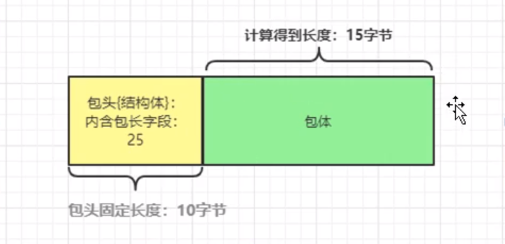

# （1）ET，LT模式深入分析及测试

LT：水平触发/低速模式，这个事件没处理完，就会被 一直触发；
ET：边缘触发/告诉模式，这个事件通知只会出现一次；
普遍认为ET比LT效率高一些，但是 ET编程难度比LT大一些；
ET模式下，如果没有数据可接收，则recv会返回-1

思考：为什么ET模式事件只触发一次[事件被扔到双向链表中一次，被epoll_wait取出后就干掉]
LT模式事件会触发多次呢？[事件如果没有处理完，那么事件会被多次往双向链表中扔]

如果我们想要通过epoll_wait()拿到一个事件通知，相当于我们要到epoll模型的双向链表里取链表节点，双向链表中有个节点就是来的事件，如果我们想通过epoll_wait()拿事件，那么内核就必须把这个事件链接到这个双向链表中来。

假如客户端一次发送了10个字符，然后读事件每次只取2个字符，那么也就是读缓冲区中的数据没接收完，在LT（水平模式）下，内核是不会把这个套接字事件从双向链表中去除，或者去除了之后，发现读数据缓冲区又有残留数据存在，那么又会给他插进双向链表中去，总之内核会保证双向链表中有这个事件链接存在，这样就能保证你再调用epoll_wait的时候，就能再次把这个事件拿到。ET模式不一样，ET不管你在收数据的时候收了几个，在调用epoll_wait取事件的时候，不管你在数据读缓冲区取了多少数据，取没取完，内核都会将这个事件从双向链表中移除，那么你在下次调用epoll_wait的时候就找不到对应的事件去缓冲区取剩余数据了。除非客户端再发一次数据来，然后又会触发ET模式的读事件，这样就可以再去缓冲区读数据了

如何选择ET，还是LT
如果收发数据包有固定格式【后续会讲】，那么建议采取LT：编程简单，清晰，写好了效率不见得低；
本项目中采用LT这种方法【固定格式的数据收发方式来写我们的项目】

如果收发数据包没有固定格式，可以考虑采用ET模式；

```c++
// 当我们采用ET模式处理数据接收事件
newc->rhandler = &CSocket::ngx_wait_request_handler;    // 设置数据来的时候的读处理函数。其实官方nginx中是ngx_http_wait_request_handler()

        // 客户端应该主动发送第一次的数据，这里读事件加入epoll监控
        // s,                   socket句柄
        // 1, 0,                读， 写
        // EPOLLET,             其他补充标记【EPOLLET（高速模式，边缘触发ET）】
        // EPOLL_CTL_ADD,       事件类型【增加，还有删除/修改】
        // newc                 连接池中的连接
        if (ngx_epoll_add_event(s, 1, 0, EPOLLET, EPOLL_CTL_ADD, newc) == -1)	// ET
        if (ngx_epoll_add_event(s, 1, 0, 0, EPOLL_CTL_ADD, newc) == -1)	// LT
        {
            // 增加事件失败。失败日志在ngx_epoll_add_event中写过了
            ngx_close_accepted_connection(newc);
            return; // 直接返回
        }
```

ET测试代码：

ngx_wait_request_handler()函数

```c++
//来数据时候的处理，当连接上有数据来的时候，本函数会被ngx_epoll_process_events()所调用  ,官方的类似函数为ngx_http_wait_request_handler();
void CSocekt::ngx_wait_request_handler(lpngx_connection_t c)
{
    
	unsigned char buf[10] = {0};
    memset(buf, 0, sizeof(buf));
    do
    {
        int n = recv(c->fd, 2, 0);      // 每次只接收两个字节
        if (n == -1 && errno == EAGAIN)
        {
            break;
        }
        else if (n == 0)
        {
            break;
        }
        ngx_log_stderr(0, "成功， 收到的字节数为%d, 内容为%s", n, buf);
    } while (1);
    
    return;
}
```

  LT模式测试代码

  水平触发如果没有正确处理客户端关闭情况，那么水平触发就会在客户端关闭的时候不断的触发

  因为客户端关闭也是可读

```c++
//来数据时候的处理，当连接上有数据来的时候，本函数会被ngx_epoll_process_events()所调用  ,官方的类似函数为ngx_http_wait_request_handler();
void CSocekt::ngx_wait_request_handler(lpngx_connection_t c)
{
    
    // LT模式测试代码
    // 水平触发如果没有正确处理客户端关闭情况，那么水平触发就会在客户端关闭的时候不断的触发
    // 因为客户端关闭也是可读
    unsigned char buf[10] = {0};
    memset(buf, 0, sizeof(buf));
    int n = recv(c->fd, 2, 0);      // 每次只接收两个字节
    if (n == 0)
    {
        // 连接关闭
        ngx_free_connection(c);
        close(c->fd);
        c->fd = -1;
    }
    ngx_log_stderr(0, "成功， 收到的字节数为%d, 内容为%s", n, buf);

    return;
}
```


# （2）服务器设计

## （2.1）服务器设计原则总述

我们写的是：通用的服务框架。稍加改造甚至不用改造就可以把它直接应用在很多的具体开发工作中；
我们的工作重点就可以聚焦在业务逻辑上； 相当于你自带框架【自带源码】入职；甚至你可以挑战高级程序员/主程序这种职业；

## （2.2）收发包格式问题提出

第一条命令出拳【1abc2】，第二条加血【1def2|30】；
1abc21def2|30

## （2.3）TCP粘包、缺包

tcp粘包问题
client发送abc,def,hij，三个数据包发出去；
a)客户端粘包现象
客户端因为有一个Nagle优化算法；
send(“abc”); write()也可以
send(“def”);
send(“hij”);
因为Nagle算法存在的，这三个数据包被Nagle优化算法直接合并一个数据包发送出去；这就属于客户端粘包；
如果你关闭Nagle优化算法，那么你调用几次send()就发送出去几个包；那客户端的粘包问题就解决了；

b)服务器端粘包现象
不管你客户端是否粘包，服务器端都存在粘包的问题：就算你客户端不粘包，但是，仍然避免不了服务器端粘包的问题；
服务器端两次 recv之间可能间隔100毫秒，那可能在这100毫秒内，客户端这三个包都到了，这三个包都被保存到了服务器端的
针对该TCP连接收数据缓冲中【abcdefhij】；你再次recv一次，就可能拿到了全部的“abcdefhij”，这就叫服务器端的 粘包；

再举一例：
send(“abc…”); //8000字节；这个可能被操作系统拆成6个包发送出去了；
网络可能出现延迟或者阻塞，
服务器端第一次recv() = “ab”
recv = “c…”，
recv…
recv() = “…de”… [缺包]

## （2.4）TCP粘包、缺包解决

粘包，要解决的就是吧这几个包拆出来，一个是一个；
解决粘包的方案很多；这里提供的方案是简单、严谨、有效的一种解决方案；
严谨
abcd e f defdefhij ,很多服务器程序员不考虑 恶意数据包；
服务器程序员不能假设收到的数据包都是善意 的，合理的，构造畸形数据包 abc#def-hij

如何解决拆包问题：给收发的数据包定义一个统一的格式[规则]；c/s都按照这个格式来，就能够解决粘包问题；
包格式： 包头+包体 的格式；其中 包头 是固定长度【10字节】,在包头中，有一个成员变量会记录整个包【包头+包体】的长度；
这样的话，先收包头，从包头中，我知道了整个包的长度，然后 用整个包的长度 - 10个字节 = 包体的长度。
我再收 “包体的长度”这么多的字节； 收满了包体的长度字节数，我就认为，一个完整的数据包【包头+包体】收完；



收包总结：
（1）先收固定长度包头 10字节；
（2）收满后，根据包头中的内容，计算出包体的长度：整个长度-10
（3）我再收包体长度这么多的数据，收完了，一个包就完整了；
我们就认为受到了一个完整的数据包；从而解决了粘包的问题；

大家要有一个认识：
官方的nginx的代码主要是用来处理web服务器【一种专用的服务器】，代码写的很庞杂；
不太适合咱们这种固定数据格式【包头+包体】的服务器【通用性强的服务器，可以应用于各种领域】。