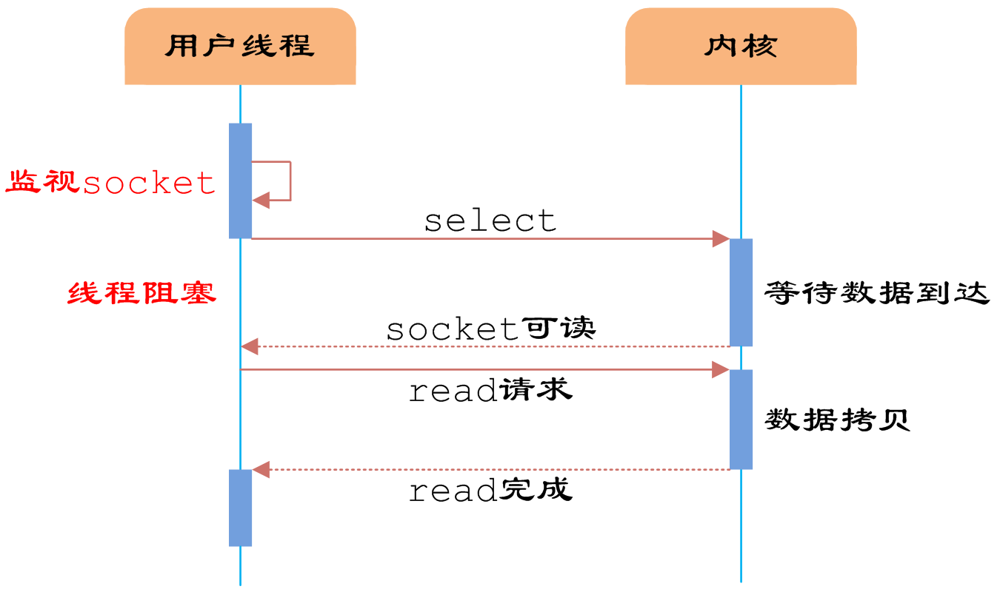

# [IO多路复用机制详解](https://www.cnblogs.com/yanguhung/p/10145755.html)

**高性能IO模型浅析**

服务器端编程经常需要构造高性能的IO模型，常见的IO模型有四种：

（1）同步阻塞IO（Blocking IO）：即传统的IO模型。

（2）同步非阻塞IO（Non-blocking IO）：默认创建的socket都是阻塞的，非阻塞IO要求socket被设置为NONBLOCK。注意这里所说的NIO并非Java的NIO（New IO）库。

（3）IO多路复用（IO Multiplexing）：即经典的Reactor设计模式，有时也称为异步阻塞IO，Java中的Selector和Linux中的epoll都是这种模型。

（4）异步IO（Asynchronous IO）：即经典的Proactor设计模式，也称为异步非阻塞IO。

 

**同步和异步**的概念描述的是用户线程与内核的交互方式：同步是指用户线程发起IO请求后需要等待或者轮询内核IO操作完成后才能继续执行；而异步是指用户线程发起IO请求后仍继续执行，当内核IO操作完成后会通知用户线程，或者调用用户线程注册的回调函数。

**阻塞和非阻塞**的概念描述的是用户线程调用内核IO操作的方式：阻塞是指IO操作需要彻底完成后才返回到用户空间；而非阻塞是指IO操作被调用后立即返回给用户一个状态值，无需等到IO操作彻底完成。

 

另外，Richard Stevens 在《Unix 网络编程》卷1中提到的基于信号驱动的IO（Signal Driven IO）模型，由于该模型并不常用，本文不作涉及。接下来，我们详细分析四种常见的IO模型的实现原理。为了方便描述，我们统一使用IO的读操作作为示例。

 

**一、同步阻塞IO**

 

同步阻塞IO模型是最简单的IO模型，用户线程在内核进行IO操作时被阻塞。


图1 同步阻塞IO

如图1所示，用户线程通过系统调用read发起IO读操作，由用户空间转到内核空间。内核等到数据包到达后，然后将接收的数据拷贝到用户空间，完成read操作。

用户线程使用同步阻塞IO模型的伪代码描述为：

```c++
{

    read(socket, buffer);

    process(buffer);

}
```

即用户需要等待read将socket中的数据读取到buffer后，才继续处理接收的数据。整个IO请求的过程中，用户线程是被阻塞的，这导致用户在发起IO请求时，不能做任何事情，对CPU的资源利用率不够。

 

**二、同步非阻塞IO**

 

同步非阻塞IO是在同步阻塞IO的基础上，将socket设置为NONBLOCK。这样做用户线程可以在发起IO请求后可以立即返回。

 

图2 同步非阻塞IO

如图2所示，由于socket是非阻塞的方式，因此用户线程发起IO请求时立即返回。但并未读取到任何数据，用户线程需要不断地发起IO请求，直到数据到达后，才真正读取到数据，继续执行。

用户线程使用同步非阻塞IO模型的伪代码描述为：

```c++
{

    while(read(socket, buffer) != SUCCESS)

    ;

    process(buffer);

}
```

即用户需要不断地调用read，尝试读取socket中的数据，直到读取成功后，才继续处理接收的数据。整个IO请求的过程中，虽然用户线程每次发起IO请求后可以立即返回，但是为了等到数据，仍需要不断地轮询、重复请求，消耗了大量的CPU的资源。一般很少直接使用这种模型，而是在其他IO模型中使用非阻塞IO这一特性。

 

**三、IO多路复用**

IO多路复用模型是建立在内核提供的多路分离函数select基础之上的，使用select函数可以避免同步非阻塞IO模型中轮询等待的问题。



图3 多路分离函数select

如图3所示，用户首先将需要进行IO操作的socket添加到select中，然后阻塞等待select系统调用返回。当数据到达时，socket被激活，select函数返回。用户线程正式发起read请求，读取数据并继续执行。

从流程上来看，使用select函数进行IO请求和同步阻塞模型没有太大的区别，甚至还多了添加监视socket，以及调用select函数的额外操作，效率更差。但是，使用select以后最大的优势是用户可以在一个线程内同时处理多个socket的IO请求。用户可以注册多个socket，然后不断地调用select读取被激活的socket，即可达到在**同一个线程内同时处理多个IO请求的目的**。而在同步阻塞模型中，必须通过多线程的方式才能达到这个目的。

用户线程使用select函数的伪代码描述为：

```c++
{

    select(socket);

    while(1) {

        sockets = select();

        for(socket in sockets) {

            if(can_read(socket)) {

                read(socket, buffer);

                process(buffer);

            }

        }

    }

}
```

其中while循环前将socket添加到select监视中，然后在while内一直调用select获取被激活的socket，一旦socket可读，便调用read函数将socket中的数据读取出来。

 

然而，使用select函数的优点并不仅限于此。虽然上述方式允许单线程内处理多个IO请求，但是每个IO请求的过程还是阻塞的（在select函数上阻塞），平均时间甚至比同步阻塞IO模型还要长。如果用户线程只注册自己感兴趣的socket或者IO请求，然后去做自己的事情，等到数据到来时再进行处理，则可以提高CPU的利用率。

IO多路复用模型使用了Reactor（反应堆）设计模式实现了这一机制。


图4 Reactor设计模式

如图4所示，EventHandler抽象类表示IO事件处理器，它拥有IO文件句柄Handle（通过get_handle获取），以及对Handle的操作handle_event（读/写等）。继承于EventHandler的子类可以对事件处理器的行为进行定制。Reactor类用于管理EventHandler（注册、删除等），并使用handle_events实现事件循环，不断调用同步事件多路分离器（一般是内核）的多路分离函数select，只要某个文件句柄被激活（可读/写等），select就返回（阻塞），handle_events就会调用与文件句柄关联的事件处理器的handle_event进行相关操作。


图5 IO多路复用

如图5所示，通过Reactor的方式，可以将用户线程轮询IO操作状态的工作统一交给handle_events事件循环进行处理。用户线程注册事件处理器之后可以继续执行做其他的工作（异步），而Reactor线程负责调用内核的select函数检查socket状态。当有socket被激活时，则通知相应的用户线程（或执行用户线程的回调函数），执行handle_event进行数据读取、处理的工作。由于select函数是阻塞的，因此多路IO复用模型也被称为异步阻塞IO模型。注意，这里的所说的阻塞是指select函数执行时线程被阻塞，而不是指socket。一般在使用IO多路复用模型时，socket都是设置为NONBLOCK的，不过这并不会产生影响，因为用户发起IO请求时，数据已经到达了，用户线程一定不会被阻塞。

用户线程使用IO多路复用模型的伪代码描述为：

```c++
void UserEventHandler::handle_event() {

    if(can_read(socket)) {

        read(socket, buffer);

        process(buffer);

    }

}

 

{

	Reactor.register(new UserEventHandler(socket));

}
```

用户需要重写EventHandler的handle_event函数进行读取数据、处理数据的工作，用户线程只需要将自己的EventHandler注册到Reactor即可。Reactor中handle_events事件循环的伪代码大致如下。

```c++
Reactor::handle_events() {

    while(1) {

        sockets = select();

        for(socket in sockets) {

        	get_event_handler(socket).handle_event();

        }

    }

}
```

事件循环不断地调用select获取被激活的socket，然后根据获取socket对应的EventHandler，执行器handle_event函数即可。

IO多路复用是最常使用的IO模型，但是其异步程度还不够“彻底”，因为它使用了会阻塞线程的select系统调用。因此IO多路复用只能称为异步阻塞IO，而非真正的异步IO。

 

**四、异步IO**

 

“真正”的异步IO需要操作系统更强的支持。在IO多路复用模型中，事件循环将文件句柄的状态事件通知给用户线程，由用户线程自行读取数据、处理数据。而在异步IO模型中，当用户线程收到通知时，数据已经被内核读取完毕，并放在了用户线程指定的缓冲区内，内核在IO完成后通知用户线程直接使用即可。

异步IO模型使用了Proactor（前摄器）设计模式实现了这一机制。


图6 Proactor设计模式

如图6，Proactor模式和Reactor模式在结构上比较相似，不过在用户（Client）使用方式上差别较大。Reactor模式中，用户线程通过向Reactor对象注册感兴趣的事件监听，然后事件触发时调用事件处理函数。而Proactor模式中，用户线程将AsynchronousOperation（读/写等）、Proactor以及操作完成时的CompletionHandler注册到AsynchronousOperationProcessor。AsynchronousOperationProcessor使用Facade模式提供了一组异步操作API（读/写等）供用户使用，当用户线程调用异步API后，便继续执行自己的任务。AsynchronousOperationProcessor 会开启独立的内核线程执行异步操作，实现真正的异步。当异步IO操作完成时，AsynchronousOperationProcessor将用户线程与AsynchronousOperation一起注册的Proactor和CompletionHandler取出，然后将CompletionHandler与IO操作的结果数据一起转发给Proactor，Proactor负责回调每一个异步操作的事件完成处理函数handle_event。虽然Proactor模式中每个异步操作都可以绑定一个Proactor对象，但是一般在操作系统中，Proactor被实现为Singleton模式，以便于集中化分发操作完成事件。


图7 异步IO

如图7所示，异步IO模型中，用户线程直接使用内核提供的异步IO API发起read请求，且发起后立即返回，继续执行用户线程代码。不过此时用户线程已经将调用的AsynchronousOperation和CompletionHandler注册到内核，然后操作系统开启独立的内核线程去处理IO操作。当read请求的数据到达时，由内核负责读取socket中的数据，并写入用户指定的缓冲区中。最后内核将read的数据和用户线程注册的CompletionHandler分发给内部Proactor，Proactor将IO完成的信息通知给用户线程（一般通过调用用户线程注册的完成事件处理函数），完成异步IO。

用户线程使用异步IO模型的伪代码描述为：

```c++
void UserCompletionHandler::handle_event(buffer) {

	process(buffer);

}

 

{

	aio_read(socket, new UserCompletionHandler);

}
```

用户需要重写CompletionHandler的handle_event函数进行处理数据的工作，参数buffer表示Proactor已经准备好的数据，用户线程直接调用内核提供的异步IO API，并将重写的CompletionHandler注册即可。

相比于IO多路复用模型，异步IO并不十分常用，不少高性能并发服务程序使用IO多路复用模型+多线程任务处理的架构基本可以满足需求。况且目前操作系统对异步IO的支持并非特别完善，更多的是采用IO多路复用模型模拟异步IO的方式（IO事件触发时不直接通知用户线程，而是将数据读写完毕后放到用户指定的缓冲区中）。Java7之后已经支持了异步IO