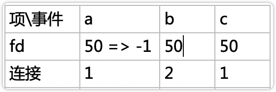
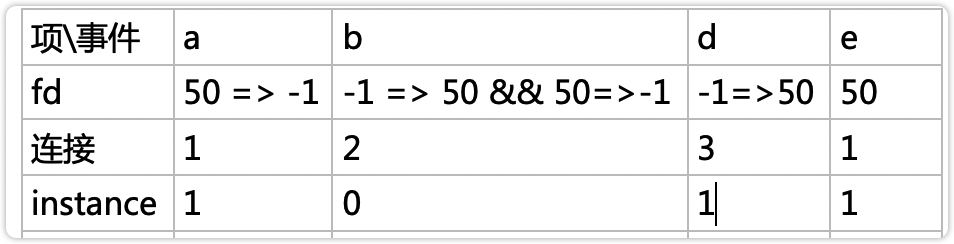
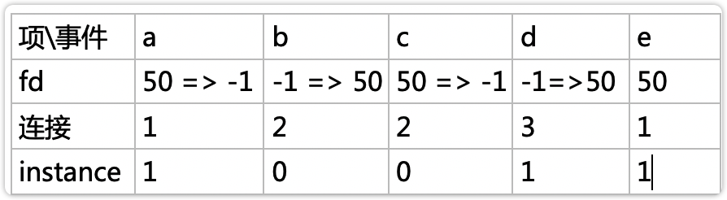

# [nginx 是如何处理过期事件的？](https://www.cnblogs.com/wudanyang/p/13837667.html)


# 什么是过期事件

对于不需要加入到 `post` 队列 延后处理的事件，`nginx` 的事件都是通过 `ngx_epoll_process_events` 函数进行处理的

举例：假如 `epoll_wait` 一次性返回 3 个事件，在第一个事件关闭了一个连接对应的正好是第三个事件的连接，第二个事件 `accept` 了一个连接，正好使用的是第二个事件的文件描述符

如图所示:



那么如果仅仅判断是否使用的同一个描述符或者描述符是否被置为 -1，就不能判断是否是同一个连接

上面的这个问题，称之为`事件过期问题`

# `nginx` 是如何处理过期事件的？

`nginx` 中的指针的最后一位一定是 0 ，于是，`nginx` 就使用这最后一位用来表示是否过期

[深入理解nginx中，第9章中有一句：利用指针的最后一位一定是0的特性。能解释一下这个特性？](https://www.zhihu.com/question/40636241?sort=created)

看下面代码中取出与判断 `instance` 位的操作

`nginx` 会在每次 `accept` 一个连接的时候，将 `instance` 位取反，那么只需要判断 `instance` 位是否一直就能判断事件是否过期了

```c++
// nginx-1.9.2/src/core/ngx_connection.c
// ngx_get_connection
    instance = rev->instance;
 
    ngx_memzero(rev, sizeof(ngx_event_t));
    ngx_memzero(wev, sizeof(ngx_event_t));
 
    rev->instance = !instance;
    wev->instance = !instance
// nginx-1.9.2/src/event/modules/ngx_epoll_module.c
// ngx_epoll_process_events
    //遍历本次epoll_wait返回的所有事件
    for (i = 0; i < events; i++) { //和ngx_epoll_add_event配合使用
        /*
        对照着上面提到的ngx_epoll_add_event方法，可以看到ptr成员就是ngx_connection_t连接的地址，但最后1位有特殊含义，需要把它屏蔽掉
          */
        c = event_list[i].data.ptr; //通过这个确定是那个连接
 
        instance = (uintptr_t) c & 1; //将地址的最后一位取出来，用instance变量标识, 见ngx_epoll_add_event
 
        /*
          无论是32位还是64位机器，其地址的最后1位肯定是0，可以用下面这行语句把ngx_connection_t的地址还原到真正的地址值
          */ //注意这里的c有可能是accept前的c，用于检测是否客户端发起tcp连接事件,accept返回成功后会重新创建一个ngx_connection_t，用来读写客户端的数据
        c = (ngx_connection_t *) ((uintptr_t) c & (uintptr_t) ~1);
 
        rev = c->read; //取出读事件 //注意这里的c有可能是accept前的c，用于检测是否客户端发起tcp连接事件,accept返回成功后会重新创建一个ngx_connection_t，用来读写客户端的数据
 
        if (c->fd == -1 || rev->instance != instance) { //判断这个读事件是否为过期事件
          //当fd套接字描述符为-l或者instance标志位不相等时，表示这个事件已经过期了，不用处理
            /*
             * the stale event from a file descriptor
             * that was just closed in this iteration
             */
 
            ngx_log_debug1(NGX_LOG_DEBUG_EVENT, cycle->log, 0,
                           "epoll: stale event %p", c);
            continue;
        }
 
        // 还有代码，但是不贴这么多了
        ......
    }
```

------

但是，问题来了，思考一下下面两种情况：




这样 `instance` 位又成了 1，那 `e` 事件处理的岂不是 3 连接的事件了，这样过期事件并没有解决啊

首先，第二张图片中的情况不可能存在，因为 `epoll` 中的事件是有顺序的，`c` 事件必然是再 `e` 事件之后

那么第一张图片中的情况还是没有解决过期事件啊

于是我就翻阅很多资料（主要靠百度）

看到有人遇到过这个疑问：

[nginx中事件模型中instance变量的处理细节](https://www.itdaan.com/blog/2012/05/03/b6c3a68fcfd4f37b5e9416ee7f0a244d.html)

如果觉得上面文章太长可以看我的讲解：

意思呢就是

`nginx` `accept` 连接之后，会立刻将连接放到 `post` 延迟处理队列中，不会出现 `accept` 之后立刻 `close` 的情况

于是呢，`nginx` 就完美的解决了事件过期的情况

看一下 `nginx` 在获取连接的代码

```c++
// nginx-1.9.2/src/http/ngx_http_request.c
// ngx_http_init_connection
    /*
     如果新连接的读事件ngx_event_t结构体中的标志位ready为1，实际上表示这个连接对应的套接字缓存上已经有用户发来的数据，
     这时就可调用上面说过的ngx_http_init_request方法处理请求。
     */
    //这里只可能是当listen的时候添加了defered参数并且内核支持，在ngx_event_accept的时候才会置1，才可能执行下面的if里面的内容，否则不会只需if里面的内容
    if (rev->ready) {
        /* the deferred accept(), iocp */
        if (ngx_use_accept_mutex) { //如果是配置了accept_mutex，则把该rev->handler延后处理，
        //实际上执行的地方为ngx_process_events_and_timers中的ngx_event_process_posted
            ngx_post_event(rev, &ngx_posted_events);
            return;
        }
 
        rev->handler(rev); //ngx_http_wait_request_handler
        return;
    }
```