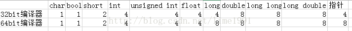
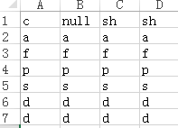
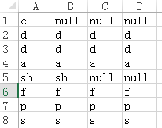

# [#pragma pack()用法详解](https://www.cnblogs.com/flyinggod/p/8343478.html)

**1.什么是对齐？为什么要对齐？**

现代计算机中内存空间都是按照byte划分的，从理论上讲似乎对任何类型的变量的访问可以从任何地址开始，但实际情况是在访问特定变量的时候经常在特定的内存地址访问，这就需要各类型数据按照一定的规则在空间上排列，而不是顺序的一个接一个的排放，这就是对齐。

各个硬件平台对存储空间的处理上有很大的不同。一些平台对某些特定类型的数据只能从某些特定地址开始存取。其他平台可能没有这种情况，但是最常见的是如果不按照适合其平台要求对数据存放进行对齐，会在存取效率上带来损失。比如有些平台每次读都是从偶地址开始，如果一个int型（假设为32位系统）如果存放在偶地址开始的地方，那么一个读周期就可以读出，而如果存放在奇地址开始的地方，就可能会需要2个读周期，并对两次读出的结果的高低字节进行拼凑才能得到该int数据。显然在读取效率上下降很多。这也是空间和时间的博弈。

**2.pragma pack语法**

用sizeof运算符求算某结构体所占空间时，并不是简单地将结构体中所有元素各自占的空间相加，这里涉及到内存字节对齐的问题，有时候为了内存对齐需要补齐空字节。通常写程序的时候，不需要考虑对齐问题。编译器会替我们选择适合目标平台的对齐策略。当然，我们也可以通知给编译器传递预编译指令而改变对指定数据的对齐方法。

语法：**#pragma pack( [show] | [push | pop] [, identifier], n )**
作用：指定结构，联合和类的包对齐方式（pack alignment）
show(optical):显示当前packing aligment的字节数，以warning message的形式显示。

**3.结构体对齐规则**

结构体中各个成员按照它们被声明的顺序在内存中顺序存储。

1)将结构体内所有数据成员的长度值相加，记为sum_a； 
2)将各数据成员内存对齐，按各自对齐模数而填充的字节数累加到和sum_a上，记为sum_b。对齐模数是【该数据成员所占内存】与【#pragma pack指定的数值】中的较小者。
3)将和sum_b向结构体模数对齐，该模数是【#pragma pack指定的数值】、【未指定#pragma pack时，系统默认的对齐模数8字节】和【结构体内部最大的基本数据类型成员】长度中数值较小者。**结构体的长度应该是该模数的整数倍。**

**3.1 基本数据类型所占内存大小**

****

以下例子均按32bit编译器处理。

**3.2 Test1**

```c++
#pragma pack(4)  
struct Test1  
{  
    char c;  
    short sh;  
    int a;  
    float f;  
    int *p;  
    char *s;  
    double d;  
};  
```

总共占28Bytes。 c的偏移量为0，占1个Byte。sh占2个Byte，它的对齐模数是2（2<4，取小者），存放起始地址应该是2的整数倍，因此c后填充1个空字符，sh的起始地址是2。a占4个Byte，对齐模数是4，因此接在sh后存放即可，偏移量为4。f占4个字节，对齐模数是4，存放地址是4的整数倍，起始地址是8。p,s的起始地址分别是12,16。d占8个字节，对齐模数是4（4<8)，d从偏移地址为20处存放。存放后结构体占28个字节，是4的整数倍不用补空字符。



 

```c++
struct Test2  
{  
    char c;  
    double d;  
    int a;  
    short sh;  
    float f;  
    int *p;  
    char *s;          
};  
```

将Test1个变量的顺序换一下位置，结构体Test2占用内存32Byte，可见写结构体时，将各个变量按所占内存从小到大排列所占结构体所占内存较小。



**3.3关于静态变量static**

静态变量的存放位置与结构体实例的存储地址无关，是单独存放在静态数据区的，因此用siezof计算其大小时没有将静态成员所占的空间计算进来。

```c++
#pragma pack(4)  
struct Test3  
{  
    char c;  
    short sh;  
    int a;  
    float f;  
    int *p;  
    char *s;  
    double d;  
    static double sb;  
    static int sn;  
}; 
```

sizeof(Test3)=28

**3.4关于类**

空类是会占用内存空间的，而且大小是1，原因是C++要求每个实例在内存中都有独一无二的地址。

（一）类内部的成员变量：

- 普通的变量：是要占用内存的，但是要注意对齐原则（这点和struct类型很相似）。
- static修饰的静态变量：不占用内容，原因是编译器将其放在全局变量区。

（二）类内部的成员函数：

- 普通函数：不占用内存。

- 虚函数：要占用4个字节，用来指定虚函数的虚拟函数表的入口地址。所以一个类的虚函数所占用的地址是不变的，和虚函数的个数是没有关系的

  ```c++
  #pragma pack(4) 
  class cBase{};  
  ```

  ## sizeof(cBase)=1

- **3.4.1 不包含虚函数的类**

  

  ```c++
  #pragma pack(4)  
  class CBase1  
  {  
  private:  
      char c;  
      short sh;  
      int a;  
  public:  
      void fOut(){ cout << "hello" << endl; }  
  };  
  ```

  

  不包含虚函数时，对于类中的成员变量按结构体对齐方式处理，普通函数函数不占内存。sizeof(CBase1)=8

  **3.4.2 包含虚函数的类**

  

  ```c++
  #pragma pack(4)  
  class CBase2  
  {  
  private:  
      char c;  
      short sh;  
      int a;  
  public:  
      virtual void fOut(){ cout << "hello" << endl; }  
  }; 
  ```

  

   包含虚函数时，类中需要保存虚函数表的入口地址指针，即需要多保存一个指针。这个值跟虚函数的个数多少没有关系。sizeof(CBase2)=12

  **3.4.3 子类**

  子类所占内存大小是**父类+自身成员变量的值。**特别注意的是，子类与父类共享同一个虚函数指针，因此当子类新声明一个虚函数时，不必在对其保存虚函数表指针入口。

  

  ```c++
  #pragma pack(4)  
  class CBase2  
  {  
  private:  
      char c;  
      short sh;  
      int a;  
  public:  
      virtual void fOut(){ cout << "virtual 1" << endl; }  
  };  
  class cDerive :public CBase  
  {  
  private :  
      int n;  
  public:  
      virtual void fPut(){ cout << "virtual 2"; }  
  };
  ```

  

  sizeof(cDerive)= sizeof(cBase)+sizeof(int n) = 16