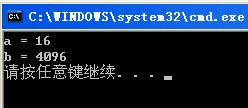
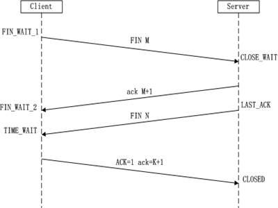
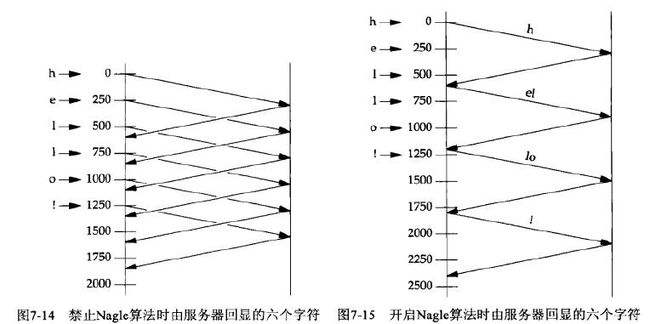
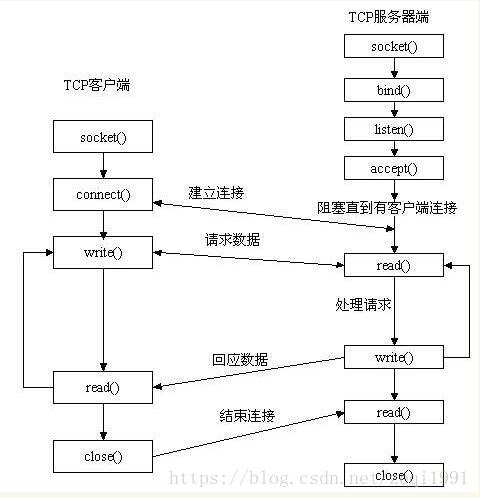

[TOC]


#### TCP socket的buffer

每个TCP socket在内核中都有一个发送缓冲区和一个接收缓冲区，TCP的全双工的工作模式以及TCP的流量(拥塞)控制便是依赖于这两个独立的buffer以及buffer的填充状态。接收缓冲区把数据缓存入内核，应用进程一直没有调用recv()进行读取的话，此数据会一直缓存在相应socket的接收缓冲区内。再啰嗦一点，不管进程是否调用recv()读取socket，对端发来的数据都会经由内核接收并且缓存到socket的内核接收缓冲区之中。recv()所做的工作，就是把内核缓冲区中的数据拷贝到应用层用户的buffer里面，并返回，仅此而已。进程调用send()发送的数据的时候，最简单情况（也是一般情况），将数据拷贝进入socket的内核发送缓冲区之中，然后send便会在上层返回。换句话说，send（）返回之时，数据不一定会发送到对端去（和write写文件有点类似），send()仅仅是把应用层buffer的数据拷贝进socket的内核发送buffer中，发送是TCP的事情，和send其实没有太大关系。接收缓冲区被TCP用来缓存网络上来的数据，一直保存到应用进程读走为止。对于TCP，如果应用进程一直没有读取，接收缓冲区满了之后，发生的动作是：收端通知发端，接收窗口关闭（win=0）。这个便是滑动窗口的实现。保证TCP套接口接收缓冲区不会溢出，从而保证了TCP是可靠传输。因为对方不允许发出超过所通告窗口大小的数据。 这就是TCP的流量控制，如果对方无视窗口大小而发出了超过窗口大小的数据，则接收方TCP将丢弃它。

#### 1. 套接字对象的创建

```C++
	/*
     * _domain 套接字使用的协议族信息
     * _type 套接字的传输类型
     * __protocol 通信协议
     * */
     int socket (int __domain, int __type, int __protocol) __THROW;
```

socket起源于UNIX，在Unix一切皆文件哲学的思想下，socket是一种"打开—读/写—关闭"模式的实现，可以将该函数类比常用的`open()`函数，服务器和客户端各自维护一个"文件"，在建立连接打开后，可以向自己文件写入内容供对方读取或者读取对方内容，通讯结束时关闭文件。

**参数介绍**

第一个参数：关于协议族信息可选字段如下，只列出一般常见的字段。

|  地址族  |                    含义                    |
| :------: | :----------------------------------------: |
| AF_INET  |         IPv4网络协议中采用的地址族         |
| AF_INET6 |         IPv6网络协议中采用的地址族         |
| AF_LOCAL | 本地通信中采用的UNIX协议的地址族（用的少） |

第二个参数：套接字类型。常用的有SOCKET_RAW，SOCK_STREAM和SOCK_DGRAM。

| 套接字类型  |                             含义                             |
| :---------: | :----------------------------------------------------------: |
| SOCKET_RAW  | 原始套接字(SOCKET_RAW)允许对较低层次的协议直接访问，比如IP、 ICMP协议。 |
| SOCK_STREAM |        SOCK_STREAM是数据流，一般为TCP/IP协议的编程。         |
| SOCK_DGRAM  |        SOCK_DGRAM是数据报，一般为UDP协议的网络编程；         |

第三个参数：最终采用的协议。常见的协议有IPPROTO_TCP、IPPTOTO_UDP。如果第二个参数选择了SOCK_STREAM，那么采用的协议就只能是IPPROTO_TCP；如果第二个参数选择的是SOCK_DGRAM，则采用的协议就只能是IPPTOTO_UDP。**此参数可以指定单个协议系列中的不同传输协议。在Internet通讯域中，此参数一般取值为0，系统会根据套接字的类型决定应使用的传输层协议。**

#### 2. 向套接字分配网络地址——bind()

```C++
/* 
* __fd:socket描述字，也就是socket引用
* myaddr:要绑定给sockfd的协议地址
* __len:地址的长度
*/
int bind (int __fd, const struct sockaddr* myaddr, socklen_t __len)  __THROW;
```

第一个参数：socket文件描述符`__fd`即套接字创建时返回的对象，

第二个参数：`myaddr`则是填充了一些网络地址信息，包含通信所需要的相关信息，其结构体具体如下：

```C++
struct sockaddr
  {
    sa_family_t sin_family;	/* Common data: address family and length.  */
    char sa_data[14];		/* Address data.  */
  };
```

在具体传参的时候，会用该结构体的变体`sockaddr_in`形式去初始化相关字段，该结构体具体形式如下，结构体`sockaddr`中的`sa_data`就保存着地址信息需要的IP地址和端口号，对应着结构体`sockaddr_in`的`sin_port`和`sin_addr`字段。

```C++
struct sockaddr_in{
    sa_family_t sin_family;		//前面介绍的地址族
    uint16_t sin_port;			//16位的TCP/UDP端口号
    struct in_addr sin_addr;	//32位的IP地址
    char sin_zero[8];			//不使用
}
```

`in_addr` 结构定义如下：

```C++
/* Internet address.  */
typedef uint32_t in_addr_t;
struct in_addr
{
	in_addr_t s_addr;
};
```

而`sin_zero` 无特殊的含义，只是为了与下面介绍的sockaddr结构体一致而插入的成员。因为在给套接字分配网络地址的时候会调用`bind`函数，其中的参数会把`sockaddr_in`转化为`sockaddr`的形式，如下：

```C++
struct sockaddr_in serv_addr;
...
bind(serv_socket, (struct sockaddr*)&serv_addr, sizeof(serv_addr)；
```

"将sin_addr设置为INADDR_ANY"的含义是什么？

**INADDR_ANY**
转换过来就是0.0.0.0，泛指本机的意思，也就是表示本机的所有IP，因为有些机子不止一块网卡，多网卡的情况下，这个就表示所有网卡ip地址的意思。
比如一台电脑有3块网卡，分别连接三个网络，那么这台电脑就有3个ip地址了，如果某个应用程序需要监听某个端口，那他要监听哪个网卡地址的端口呢？

如果绑定某个具体的ip地址，你只能监听你所设置的ip地址所在的网卡的端口，其它两块网卡无法监听端口，如果我需要三个网卡都监听，那就需要绑定3个ip，也就等于需要管理3个套接字进行数据交换，这样岂不是很繁琐？

所以出现INADDR_ANY，你只需绑定INADDR_ANY，管理一个套接字就行，不管数据是从哪个网卡过来的，只要是绑定的端口号过来的数据，都可以接收到。

需要注意的是`s_addr`是一种`uint32_t`类型的数据，而且在网络传输时，统一都是以大端序的网络字节序方式传输数据，而我们通常习惯的IP地址格式是点分十进制，例如：“219.228.148.169”，这个时候就会调用以下函数进行转化，将IP地址转化为32位的整数形数据，同时进行网络字节转换：

```C++
in_addr_t inet_addr (const char *__cp) __THROW;
//或者
int inet_aton (const char *__cp, struct in_addr *__inp) __THROW;	//windows无此函数
```

如果单纯要进行网络字节序地址的转换，可以采用如下函数：

```C++
/*Functions to convert between host and network byte order.

   Please note that these functions normally take `unsigned long int' or
   `unsigned short int' values as arguments and also return them.  But
   this was a short-sighted decision since on different systems the types
   may have different representations but the values are always the same.  */

// h代表主机字节序
// n代表网络字节序
// s代表short(4字节)
// l代表long(8字节)
extern uint32_t ntohl (uint32_t __netlong) __THROW __attribute__ ((__const__));
extern uint16_t ntohs (uint16_t __netshort)
     __THROW __attribute__ ((__const__));
extern uint32_t htonl (uint32_t __hostlong)
     __THROW __attribute__ ((__const__));
extern uint16_t htons (uint16_t __hostshort)
```

**htons**

htons是将整型变量从主机字节顺序转变成网络[字节顺序](https://baike.baidu.com/item/字节顺序/10059170)， 就是整数在地址空间存储方式变为高位字节存放在内存的低地址处。

网络字节顺序是TCP/IP中规定好的一种数据表示格式，它与具体的CPU类型、操作系统等无关，从而可以保证数据在不同主机之间传输时能够被正确解释，网络字节顺序采用big-endian排序方式。

在Windows和Linux网络编程时需要用到的，用来将主机字节顺序转化为网络字节顺序，以Windows下的代码为例：

```c++
#include<winsock2.h>
u_short htons(u_short hostshort);
```

htons的功能：将一个无符号短整型的主机数值转换为网络[字节顺序](https://baike.baidu.com/item/字节顺序)，即大尾顺序(big-endian)

参数u_short hostshort：16位[无符号整数](https://baike.baidu.com/item/无符号整数)

返回值：TCP/IP网络字节顺序.

不同的CPU有不同的字节顺序类型，这些字节顺序类型指的是整数在内存中保存的顺序，即主机字节顺序。常见的有两种：

低地址-------------------》》》》》-------------------高地址

| 序号 | 英文名        | 中文名   | 描述                                            |
| ---- | ------------- | -------- | ----------------------------------------------- |
| 1    | big-endian    | 大尾顺序 | 地址的低位存储值的高位 **【高位在前低位在后】** |
| 2    | little-endian | 小尾顺序 | 地址的低位存储值的低位 **【高位在后低位在前】** |

##### 示例

###### 例1

而我们常用的 x86 CPU (intel, AMD) 电脑是 little-endian,也就是整数的低位[字节](https://baike.baidu.com/item/字节)放在内存的低字节处。举个例子吧。假定你的数据是0x1234,

在网络字节顺序里 这个数据放到内存中就应该显示成

addr addr+1

0x12 0x34

而在x86电脑上，数据0x1234放到内存中实际是：

addr addr+1

0x34 0x12

htons 的用处就是把实际主机内存中的整数存放方式调整成网络[字节顺序](https://baike.baidu.com/item/字节顺序)。

###### 例2 C++代码示例

```c++
#include <winsock2.h>
#include <iostream>
#pragma comment(lib,"ws2_32.lib")
using namespace std;
int main()
{
    int a = 16, b;
    b = htons(a);
    cout << "a=" << a << endl;
    cout << "b=" << b << endl;
    return 0;
}
```

运行的结果如图1



解释一下，数字16的16进制表示为0x0010，数字4096的16进制表示为0x1000。 由于Intel机器是小尾端，存储数字16时实际顺序为1000，存储4096时实际顺序为0010。因此在发送网络包时为了报文中数据为0010，需要经过htons进行字节转换。如果用IBM等大尾机器，则没有这种字节顺序转换，但为了程序的可移植性，也最好用这个函数。

不同CPU上运行不同的操作系统，其主机字节顺序也是不同，参见下表：

| 处理器   | 操作系统 | 字节顺序      |
| -------- | -------- | ------------- |
| Alpha    | 全部     | little-endian |
| HP-PA    | NT       | little-endian |
| HP-PA    | UNIX     | big-endian    |
| Intelx86 | 全部     | little-endian |
| MIPS     | NT       | little-endian |
| MIPS     | UNIX     | big-endian    |
| PowerPC  | NT       | little-endian |
| PowerPC  | 非NT     | big-endian    |

##### setsockopt()

在TCP连接中，**recv等函数默认为阻塞模式(block)**，即**直到有数据到来之前函数不会返回**，而我们有时则需要一种**超时机制使其在一定时间后返回**而不管是否有数据到来，这里我们就会用到`setsockopt()`函数：

```c++
int  setsockopt(int  s, int level, int optname, void* optval, socklen_t* optlen);
```

这里我们要涉及到一个结构：

```c++
    struct timeval
    {
        time_t tv_sec; //单位为秒
        time_t tv_usec; //单位为微秒
    };

  struct timeval tv_out;
  tv_out.tv_sec = 1;
  tv_out.tv_usec = 0;
```

填充这个结构后，我们就可以以如下的方式调用这个函数：

```c++
setsockopt(fd, SOL_SOCKET, SO_RCVTIMEO, &tv_out, sizeof(tv_out));
// (具体参数可以man一下，或查看MSDN)
```

这样我们就**设定了recv()函数的超时机制**，当超过tv_out**设定的时间而没有数据到来时recv()就会返回0值**。

##### 设置套接口的选项。

```c++
  #include <winsock.h>

  int PASCAL FAR setsockopt( 
      SOCKET s, 
      int level, 
      int optname,
      const char FAR* optval,
      int optlen);
```

- s：标识一个套接口的描述字。
- level：选项定义的层次；目前**仅支持SOL_SOCKET和IPPROTO_TCP层次**。
- optname：需设置的选项。
- optval：指针，指向**存放选项值的缓冲区**。
- optlen：optval**缓冲区的长度**。

##### 注释：

`setsockopt()`函数**用于任意类型、任意状态套接口的设置选项值**。尽管在不同协议层上存在选项，但本函数仅定义了最高的“套接口”层次上的选项。选项影响套接口的操作，诸如加急数据是否在普通数据流中接收，广播数据是否可以从套接口发送等等。

有两种套接口的选项：

- 一种是布尔型选项，允许或禁止一种特性；
- 另一种是整形或结构选项。

##### setsockopt()支持下列选项。其中 【类型】 表明optval所指数据的类型。

| 选项         | 类型               | 意义                                                         |
| ------------ | ------------------ | ------------------------------------------------------------ |
| SO_BROADCAST | BOOL               | 允许套接口传送广播信息。                                     |
| SO_DEBUG     | BOOL               | 记录调试信息。                                               |
| SO_DONTLINER | BOOL               | 不要因为数据未发送就阻塞关闭操作。设置本选项相当于将SO_LINGER的l_onoff元素置为零。 |
| SO_DONTROUTE | BOOL               | 禁止选径；直接传送。                                         |
| SO_KEEPALIVE | BOOL               | 发送“保持活动”包。                                           |
| SO_LINGER    | struct linger FAR* | 如关闭时有未发送数据，则逗留。                               |
| SO_OOBINLINE | BOOL               | 在常规数据流中接收带外数据。                                 |
| SO_RCVBUF    | int                | 为接收确定缓冲区大小。                                       |
| SO_REUSEADDR | BOOL               | 允许套接口和一个已在使用中的地址捆绑（参见bind()）。         |
| SO_SNDBUF    | int                | 指定发送缓冲区大小。                                         |
| TCP_NODELAY  | BOOL               | 禁止发送合并的Nagle算法(防止TCP粘包)。                       |

允许一个布尔型选项，则将optval指向非零整形数；禁止一个选项optval指向一个等于零的整形数。对于布尔型选项，**optlen应等于sizeof(int)**；对其他选项，optval指向包含所需选项的整形数或结构，而optlen则为整形数或结构的长度。

###### 1.SO_LINGER

SO_LINGER选项用于控制下述情况的行动：套接口上有排队的待发送数据，且closesocket()调用已执行。参见closesocket()函数中关于SO_LINGER选项对closesocket()语义的影响。应用程序通过创建一个linger结构来设置相应的操作特性：

```c++
struct linger {
      int l_onoff;
      int l_linger;
};
```

为了允许SO_LINGER，应用程序应**将l_onoff设为非零，将l_linger设为零或需要的超时值**（以秒为单位），然后调用setsockopt()。

###### 2.SO_DONTLINGER

为了允许SO_DONTLINGER（亦即禁止SO_LINGER），**l_onoff应设为零，然后调用setsockopt()**。
缺省条件下，一个套接口不能与一个已在使用中的本地地址捆绑（参见bind()）。但有时会需要“重用”地址。因为每一个连接都由本地地址和远端地址的组合唯一确定，所以只要远端地址不同，两个套接口与一个地址捆绑并无大碍。为了通知WINDOWS套接口实现不要因为一个地址已被一个套接口使用就不让它与另一个套接口捆绑，应用程序可在bind()调用前先设置SO_REUSEADDR选项。请注意仅在bind()调用时该选项才被解释；故此无需（但也无害）将一个不会共用地址的套接口设置该选项，或者在bind()对这个或其他套接口无影响情况下设置或清除这一选项。

###### 3.SO_KEEPALIVE

一个应用程序可以通过打开SO_KEEPALIVE选项，使得WINDOWS套接口实现在TCP连接情况下**允许使用“保持活动”包**。一个WINDOWS套接口实现**并不是必需支持“保持活动”，但是如果支持的话，具体的语义将与实现有关**，应遵守RFC1122“Internet主机要求－通讯层”中第4.2.3.6节的规范。如果有关连接由于“保持活动”而失效，则进行中的任何对该套接口的调用都将以WSAENETRESET错误返回，后续的任何调用将以WSAENOTCONN错误返回。

###### 4.TCP_NODELAY

TCP_NODELAY选项**禁止Nagle算法**。Nagle算法**通过将未确认的数据存入缓冲区直到蓄足一个包一起发送的方法，来减少主机发送的零碎小数据包的数目**。但对于某些应用来说，这种算法**将降低系统性能**。所以TCP_NODELAY可用来将此算法关闭。应用程序编写者只有在确切了解它的效果并确实需要的情况下，才设置TCP_NODELAY选项，因为**设置后对网络性能有明显的负面影响**。**TCP_NODELAY是唯一使用IPPROTO_TCP层的选项，其他所有选项都使用SOL_SOCKET层**。

###### 5.SO_DEBUG

如果设置了SO_DEBUG选项，WINDOWS套接口供应商被鼓励（但不是必需）**提供输出相应的调试信息**。但产生调试信息的机制以及调试信息的形式已超出本规范的讨论范围。

##### setsockopt()不支持的BSD选项有：

| 选项          | 类型 | 意义                 |
| ------------- | ---- | -------------------- |
| SO_ACCEPTCONN | BOOL | 套接口在监听。       |
| SO_ERROR      | int  | 获取错误状态并清除。 |
| SO_RCVLOWAT   | int  | 接收低级水印。       |
| SO_RCVTIMEO   | int  | 接收超时。           |
| SO_SNDLOWAT   | int  | 发送低级水印。       |
| SO_SNDTIMEO   | int  | 发送超时。           |
| SO_TYPE       | int  | 套接口类型。         |
| IP_OPTIONS    |      | 在IP头中设置选项。   |

##### 返回值：

若**无错误发生，setsockopt()返回0。否则的话**，返回SOCKET_ERROR错误，应用程序可通过WSAGetLastError()获取相应错误代码。

##### 错误代码：

|                   |                                                              |
| :---------------: | :----------------------------------------------------------: |
| WSANOTINITIALISED |        在使用此API之前应首先成功地调用WSAStartup()。         |
|    WSAENETDOWN    |           WINDOWS套接口实现检测到网络子系统失效。            |
|     WSAEFAULT     |           optval不是进程地址空间中的一个有效部分。           |
|  WSAEINPROGRESS   |           一个阻塞的WINDOWS套接口调用正在运行中。            |
|     WSAEINVAL     |             level值非法，或optval中的信息非法。              |
|   WSAENETRESET    |                当SO_KEEPALIVE设置后连接超时。                |
|  WSAENOPROTOOPT   | 未知或不支持选项。其中，SOCK_STREAM类型的套接口不支持SO_BROADCAST选项，SOCK_DGRAM类型的套接口不支持 |
|    WSAENOTCONN    |               当设置SO_KEEPALIVE后连接被复位。               |
|    WSAENOTSOCK    |                    描述字不是一个套接口。                    |

#### 3. 进入等待连接请求状态

给套接字分配了所需的信息后，就可以调用`listen()`函数对来自客户端的连接请求进行监听（客户端此时要调用`connect()`函数进行连接）

```C++
/* Prepare to accept connections on socket FD.
   N connection requests will be queued before further requests are refused.
   Returns 0 on success, -1 for errors.  */
extern int listen (int __fd, int __n) __THROW;
```

第一个参数：socket文件描述符`__fd`，分配所需的信息后的套接字。

第二个参数：连接请求的队列长度，如果为6，表示队列中最多同时有6个连接请求。

这个函数的fd(socket套接字对象)就相当于一个门卫，对连接请求做处理，决定是否把连接请求放入到server端维护的一个队列中去。

#### 4. 受理客户端的连接请求

`listen()`中的sock(__fd : socket对象)发挥了服务器端接受请求的门卫作用，此时为了按序受理请求，给客户端做相应的回馈，连接到发起请求的客户端，此时就需要再次创建另一个套接字，该套接字可以用以下函数创建：

```C++
/* Await a connection on socket FD.
   When a connection arrives, open a new socket to communicate with it,
   set *ADDR (which is *ADDR_LEN bytes long) to the address of the connecting
   peer and *ADDR_LEN to the address's actual length, and return the
   new socket's descriptor, or -1 for errors.

   This function is a cancellation point and therefore not marked with
   __THROW.  */
extern int accept (int __fd, struct sockaddr *addr, socklen_t *addr_len);
```

函数成功执行时返回socket文件描述符，失败时返回-1。

第一个参数：socket文件描述符`__fd`，要注意的是这个套接字文件描述符与前面几步的套接字文件描述符不同。

第二个参数：保存发起连接的客户端的地址信息。

第三个参数： 保存该结构体的长度。

#### 5. send/write发送信息

linux下的发送函数为：

```C++
/* Write N bytes of BUF to FD.  Return the number written, or -1.

   This function is a cancellation point and therefore not marked with
   __THROW.  */
 ssize_t write (int __fd, const void *__buf, size_t __n) ;
```

而在windows下的发送函数为：

```C++
ssize_t send (int sockfd, const void *buf, size_t nbytes, int flag) ;
```

第四个参数是传输数据时可指定的信息，一般设置为0。

**send函数工作原理：**

 send函数只负责将数据提交给协议层。 当调用该函数时，send先比较待发送数据的长度len和套接字s的发送缓冲区的长度，如果len大于s的发送缓冲区的长度，该函数返回SOCKET_ERROR； 如果len小于或者等于s的发送缓冲区的长度，那么send先检查协议是否正在发送s的发送缓冲中的数据； 如果是就等待协议把数据发送完，如果协议还没有开始发送s的发送缓冲中的数据或者s的发送缓冲中没有数据，那么send就比较s的发送缓冲区的剩余空间和len； 如果len大于剩余空间大小，send就一直等待协议把s的发送缓冲中的数据发送完，如果len小于剩余空间大小，send就仅仅把buf中的数据copy到剩余空间里（注意并不是send把s的发送缓冲中的数据传到连接的另一端的，而是协议传的，send仅仅是把buf中的数据copy到s的发送缓冲区的剩余空间里）。 如果send函数copy数据成功，就返回实际copy的字节数，如果send在copy数据时出现错误，那么send就返回SOCKET_ERROR； 如果send在等待协议传送数据时网络断开的话，那么send函数也返回SOCKET_ERROR。

  要注意send函数把buf中的数据成功copy到s的发送缓冲的剩余空间里后它就返回了，但是此时这些数据并不一定马上被传到连接的另一端。 如果协议在后续的传送过程中出现网络错误的话，那么下一个Socket函数就会返回SOCKET_ERROR。（每一个除send外的Socket函数在执行的最开始总要先等待套接字的发送缓冲中的数据被协议传送完毕才能继续，如果在等待时出现网络错误，那么该Socket函数就返回SOCKET_ERROR）  

#### 6. recv/read接受信息

linux下的接收函数为

```C++
/* Read NBYTES into BUF from FD.  Return the
   number read, -1 for errors or 0 for EOF.

   This function is a cancellation point and therefore not marked with
   __THROW.  */
ssize_t read (int __fd, void *__buf, size_t __nbytes);
```

而在windows下的接收函数为

```C++
ssize_t recv(int sockfd, void *buf, size_t nbytes, int flag) ;
```

**recv函数工作原理：**

接收来自socket缓冲区对字节数据,当缓冲区没有数据可取时,recv会一直处于阻塞状态,直到缓冲区至少又一个字节数据可取,或者远程端关闭,关闭远程端并读取所有数据后,返回空字符串.

  recv先检查套接字s的接收缓冲区，如果s接收缓冲区中没有数据或者协议正在接收数据，那么recv就一直等待，直到协议把数据接收完毕。当协议把数据接收完毕，recv函数就把s的接收缓冲中的数据copy到buf中（注意协议接收到的数据可能大于buf的长度，所以在这种情况下要调用几次recv函数才能把s的接收缓冲中的数据copy完。recv函数仅仅是copy数据，真正的接收数据是协议来完成的），recv函数返回其实际copy的字节数。如果recv在copy时出错，那么它返回SOCKET_ERROR；如果recv函数在等待协议接收数据时网络中断了，那么它返回0 。
 对方优雅的关闭socket并不影响本地recv的正常接收数据；如果协议缓冲区内没有数据，recv返回0，指示对方关闭；如果协议缓冲区有数据，则返回对应数据(可能需要多次recv)，在最后一次recv时，返回0，指示对方关闭。

**要点：**

在进行TCP协议传输的时候，要注意数据流传输的特点，recv和send不一定是一一对应的（一般情况下是一一对应），也就是说并不是send一次，就一定recv一次就接收完，有可能send一次，recv多次才接收完，也可能send多次，一次recv就接收完了。TCP协议会保证数据的有序完整的传输，但是如何去正确完整的处理每一条信息，是程序员的事情。
例如：服务器在循环recv，recv的缓冲区大小为100byte，客户端在循环send，每次send 6byte数据，则recv每次收到的数据可能为6byte，12byte，18byte，这是随机的，编程的时候注意正确的处理。

#### 7. 关闭连接

```C++
/* Close the file descriptor FD.

   This function is a cancellation point and therefore not marked with
   __THROW.  */
int close (int __fd);
```

退出连接，此时要注意的是：**调用`close()`函数即表示向对方发送了`EOF`结束标志信息**。

------

### 客户端

 服务端的socket套接字在绑定自身的IP即 及端口号后这些信息后，就开始监听端口等待客户端的连接请求，此时客户端在创建套接字后就可以按照如下步骤与server端通信，创建套接字的过程不再重复了。

#### 1. 请求连接

```C++
/* Open a connection on socket FD to peer at ADDR (which LEN bytes long).
   For connectionless socket types, just set the default address to send to
   and the only address from which to accept transmissions.
   Return 0 on success, -1 for errors.

   This function is a cancellation point and therefore not marked with
   __THROW.  */
int connect (int socket, struct sockaddr* servaddr, socklen_t addrlen);
```

几个参数的意义和前面的accept函数意义一样。要注意的是服务器端收到连接请求的时候并不是马上调用accept()函数，而是把它放入到请求信息的等待队列中。

### 套接字的多种可选项

可以通过如下函数对套接字可选项的参数进行获取以及设置。

```C++
/* Put the current value for socket FD's option OPTNAME at protocol level LEVEL
   into OPTVAL (which is *OPTLEN bytes long), and set *OPTLEN to the value's
   actual length.  Returns 0 on success, -1 for errors.  */
extern int getsockopt (int sock, int __level, int __optname,
		       void *__optval, socklen_t *optlen) __THROW;

/* Set socket FD's option OPTNAME at protocol level LEVEL
   to *OPTVAL (which is OPTLEN bytes long).
   Returns 0 on success, -1 for errors.  */
extern int setsockopt (int sock, int __level, int __optname,
		       const void *__optval, socklen_t __optlen) __THROW;
```

参数说明：

**scok**： 套接字的文件描述符

**__level** ：可选项的协议层，如下：

| **协议层**  |          **功能**          |
| :---------: | :------------------------: |
| SOL_SOCKET  | 套接字相关通用可选项的设置 |
| IPPROTO_IP  | 在IP层设置套接字的相关属性 |
| IPPROTO_TCP | 在TCP层设置套接字相关属性  |

**__optname** ：要查看的可选项名，几个主要的选项如下

|    **选项名**     |                           **说明**                           | **数据类型** | 所属协议层  |
| :---------------: | :----------------------------------------------------------: | :----------: | ----------- |
|     SO_RCVBUF     |                        接收缓冲区大小                        |     int      | SOL_SOCKET  |
|     SO_SNDBUF     |                        发送缓冲区大小                        |     int      | SOL_SOCKET  |
|    SO_RCVLOWAT    |                        接收缓冲区下限                        |     int      | SOL_SOCKET  |
|    SO_SNDLOWAT    |                        发送缓冲区下限                        |     int      | SOL_SOCKET  |
|      SO_TYPE      |            获得套接字类型(这个只能获取，不能设置)            |     int      | SOL_SOCKET  |
|   SO_REUSEADDR    | 是否启用地址再分配，主要原理是操作关闭套接字的Time-wait时间等待的开启和关闭 |     int      | SOL_SOCKET  |
|    IP_HDRINCL     |                     在数据包中包含IP首部                     |     int      | IPPROTO_IP  |
| IP_MULTICAST_TTL  |             生存时间(Time To Live)，组播传送距离             |     int      | IPPROTO_IP  |
| IP_ADD_MEMBERSHIP |                           加入组播                           |     int      | IPPROTO_IP  |
|    IP_OPTINOS     |                          IP首部选项                          |     int      | IPPROTO_IP  |
|    TCP_NODELAY    |                       不使用Nagle算法                        |     int      | IPPROTO_TCP |
|   TCP_KEEPALIVE   |        TCP保活机制开启下，设置保活包空闲发送时间间隔         |     int      | IPPROTO_TCP |
|   TCP_KEEPINTVL   |    TCP保活机制开启下，设置保活包无响应情况下重发时间间隔     |     int      | IPPROTO_TCP |
|    TCP_KEEPCNT    |    TCP保活机制开启下，设置保活包无响应情况下重复发送次数     |     int      | IPPROTO_TCP |
|    TCP_MAXSEG     |                     TCP最大数据段的大小                      |     int      | IPPROTO_TCP |

**__optval** ：保存查看(get)/更改(set)的结果

**optlen** ： 传递第四个参数的字节大小

这里只对几个可选项参数进行说明：

#### 1.设置可选项的IO缓冲区大小

参考案例如下：

```C++
int status, snd_buf;
socklen_t len = sizeof(snd_buf);
status = getsockopt(serv_socket, SOL_SOCKET, SO_SNDBUF, (void*)&snd_buf, &len);
cout << "发送缓冲区大小: " << snd_buf <<endl;
```

虽然可以获得的接收/发送缓冲区的大小，但是通过设置接收/发送缓冲区大小时，得到的结果会与我们期望的不一样，因为对缓冲区大小的设置是一件很谨慎的事，其自身会根据设置的值进行一定的优化。

#### 2. 是否启用地址再分配与Time-wait时间等待

关于地址再分配问题会发生在这种情况下，首先看两种情况，假设客户端和服务器正在通讯（测试代码）

client.cpp

```c++
#include <iostream>
#include <stdio.h>
#include <stdlib.h>
#include <string.h>
#include <sys/socket.h>
#include <arpa/inet.h>
#include <unistd.h>
using namespace std;

#define BUF_SIZE 1024
void errorhandling(char *message);

int main(int argc, char *argv[])
{
    int sock;
    struct sockaddr_in serv_addr;
    char message[BUF_SIZE];
    int str_len = 0 ,idx = 0, read_len = 0;

    if(argc != 3){
        cout << "Usage : " << argv[0] << "<IP> <port> "<<endl;
        exit(0);
    }

    sock = socket(PF_INET, SOCK_STREAM, 0);
    if(sock == -1){
        errorhandling("socket() error;");
    }

    memset(&serv_addr, 0, sizeof(serv_addr));
    serv_addr.sin_family = AF_INET;
    serv_addr.sin_addr.s_addr = inet_addr(argv[1]);
    serv_addr.sin_port = htons(atoi(argv[2]));

    if(connect(sock, (struct sockaddr*)&serv_addr, sizeof(serv_addr)) == -1){
        errorhandling("connect error!");
    }else{
        cout << "connected....." << endl;
    }

    while(1){
        cout << "Input Q/q to exit." << endl;
        fgets(message, BUF_SIZE, stdin);
        if(!strcmp(message, "q\n") || !strcmp(message, "Q\n"))
            break;
        write(sock, message, strlen(message));
        str_len = read(sock, message, BUF_SIZE - 1);
        message[str_len] = '\0';
        printf("Message from server : %s", message);
    }

    close(sock);

    /*
    while(read_len =read(sock, &message[idx++], 1)){
        if(read_len == -1){
            errorhandling("read error");
        }
        str_len += read_len;
    }

    cout << "message from server: " << message <<endl;
    cout << "read function call " << str_len << "times" <<endl;
    */
    close(sock);
    return 0;
}

void errorhandling(char *message){
    fputs(message, stderr);
    fputc('\n', stderr);
    exit(1);
}
```

server.cpp

```c++
#include <iostream>
#include <stdio.h>
#include <stdlib.h>
#include <string.h>
#include <sys/socket.h>
#include <arpa/inet.h>
#include <unistd.h>
using namespace std;

#define BUF_SIZE 1024

void errorhandling(char *message);

int main(int argc, char *argv[]){

    int serv_socket;
    int clnt_socket;
    int id = 1, strlen;
    struct sockaddr_in serv_addr;
    struct sockaddr_in clnt_addr;
    socklen_t clnt_addr_size;

    char message[BUF_SIZE];

    if(argc != 2){
        cout << "Usage : " << argv[0] << " <port> "<<endl;
        exit(0);
    }


    serv_socket = socket(PF_INET, SOCK_STREAM, 0);
    if(serv_socket == -1){
        errorhandling("socket() error!");
    }

    memset(&serv_addr, 0, sizeof(serv_addr));
    serv_addr.sin_family = AF_INET;
    serv_addr.sin_addr.s_addr = htonl(INADDR_ANY);  //自动获取计算机的IP地址
    serv_addr.sin_port = htons(atoi(argv[1]));  //atoi (表示ascii to integer)是把字符串转换成整型数的一个函数

    if(bind(serv_socket, (struct sockaddr*)&serv_addr, sizeof(serv_addr)) == -1){
        errorhandling("bind() error");
    }
    if(listen(serv_socket, 5) == -1){
        errorhandling("listen() error");
    }
    clnt_addr_size = sizeof(clnt_addr);

    //处理五次连接请求
    for (int i = 0; i < 5; ++i) {
        clnt_socket = accept(serv_socket, (sockaddr*)&clnt_addr, &clnt_addr_size);
        if(clnt_socket == -1)
            errorhandling("accept error");
        else{
            cout << "Conneted client " << id << endl;

        }

        while((strlen=read(clnt_socket, message, BUF_SIZE)) != 0){
            printf("Message from client : %s", message);
            write(clnt_socket, message, strlen);
            memset(message, 0, sizeof(message));
        }
        id++;
        close(clnt_socket);
    }
    /*
    clnt_socket = accept(serv_socket, (struct sockaddr*)&clnt_addr, &clnt_addr_size);
    if(clnt_socket == -1){
        errorhandling("accept error");
    }

    write(clnt_socket, message, sizeof(message));
    */
    close(serv_socket);
    return 0;
}

void errorhandling(char *message){
    fputs(message, stderr);
    fputc('\n', stderr);
    exit(1);
}
```

#### 编译指令

```shell
#服务端
gqx@gqx-Lenovo-Product:~/workplace/SocketServer$ g++ -o server main.cpp
gqx@gqx-Lenovo-Product:~/workplace/SocketServer$ ./server 9999

#客户端
gqx@gqx-Lenovo-Product:~/workplace/SocketClient$ g++ -std=c++11 -o client main.cpp
gqx@gqx-Lenovo-Product:~/workplace/SocketClient$ ./client 127.0.0.1 9999
```

① 在客户端的终端按`Crtl + c`或者其他方式断开与服务器的连接，此时客户端发送FIN消息，经过四次握手断开连接，操作系统关闭套接字，相当于`close()`的过程。然后在次启动客户端，顺利启动。

② 在服务端的终端按`Crtl + c`或者其他方式断开与客户端的连接，像①中一样，再次启动服务端，此时出现`bind() error`错误。

服务器端出现这种情况的原因是调用套接字分配网络地址函数`bind()`的时候之前使用建立连接的同一端口号还没有来得及停用（大约要过两三分钟才处于可用状态），而客户端申请连接的端口是任意指定，程序运行时会动态分配端口号。

服务器端端口没有被释放到被释放的时间状态称为Time-wait状态，这个状态的出现可以借助TCP断开连接的四次握手协议来分析，如下图：



当client端发送`ACK=1 ack=k+1`这个消息给服务端就立即消除套接字，若此时该消息中途传输被遗失，则这个时候server端就永远无法收到client的`ACK`消息了。

#### 3. TCP_NODELAY

TCP套接字默认是使用Nagle算法的，该算法的特征是**只有收到前一条数据的ACK消息后，才会发送下一条数据。**

从网上找到一张图说明使用和禁用Nagle算法的区别（[图片来源](http://www.it610.com/article/5254468.htm)），如下：


设置代码如下：

```C++
#include <netinet/tcp.h> //注意要引入这个头文件

int opt_val = 1;
setsockopt(serv_socket, IPPROTO_TCP, TCP_NODELAY, (void*)&opt_val, sizeof(opt_val));
```

------

### 程序案例

案例的过程，在网上看到了关于read和write的发送与接受过程的图，便于理解：



注意以上代码都是在ubuntu下运行的，在windows的代码与此有所不同。比如要引入一个`<winsock2.h>`的头文件，调用`WSAStartup(...)`函数进行Winsock的初始化，而且它们的接受与发送函数也有所不同。


#### 创建一个TCP连接，要通过几个TCP套接字

大家都知道tcp连接前需要客户端和服务器进行“三次握手”，那三次握手完成后这个socket是关闭了还是开启供数据传输用？

开始接触tcp时，认为三次握手完成后这个socket肯定是开启的要不然怎么进行数据传送。

其实不然，**三次握手完成后，服务器生成一个新的套接字**，它专门用于对应完成三次握手的用户。

这个新的套接字是一个称为serverSocket的TCP套接字对象；它是专门对客户进行连接的新生成的套接字，称为连接套接字（connectionSocket）。

##### 总结：

客户和服务器之间建立TCP连接要通过两个套接字，欢迎套接字（这是所有要与服务器通信的客户的起始接触点）和新生成的服务器侧的连接套接字（这是随后为与每个客户通信而生成的套接字）


#### TCP连接的服务器端有两个套接字,客户端一个

在[服务器端](https://www.baidu.com/s?wd=服务器端&from=1012015a&fenlei=mv6quAkxTZn0IZRqIHckPjm4nH00T1YLnvu-n1FhuWT4rj0LrAR30ZwV5Hcvrjm3rH6sPfKWUMw85HfYnjn4nH6sgvPsT6KdThsqpZwYTjCEQLGCpyw9Uz4Bmy-bIi4WUvYETgN-TLwGUv3EPHf3rH0YPjcL)，socket()返回的套接字用于监听（listen）和接受（accept）客户端的连接请求。这个套接字不能用于与客户端之间发送和接收数据。

accept()接受一个客户端的连接请求，并返回一个新的套接字。所谓“新的”就是说这个套接字与socket()返回的用于监听和接受客户端的连接请求的套接字不是同一个套接字。与本次接受的客户端的通信是通过在这个新的套接字上发送和接收数据来完成的。

再次调用accept()可以接受下一个客户端的连接请求，并再次返回一个新的套接字（与socket()返回的套接字、之前accept()返回的套接字都不同的新的套接字）。这个新的套接字用于与这次接受的客户端之间的通信。

假设一共有3个客户端连接到[服务器端](https://www.baidu.com/s?wd=服务器端&from=1012015a&fenlei=mv6quAkxTZn0IZRqIHckPjm4nH00T1YLnvu-n1FhuWT4rj0LrAR30ZwV5Hcvrjm3rH6sPfKWUMw85HfYnjn4nH6sgvPsT6KdThsqpZwYTjCEQLGCpyw9Uz4Bmy-bIi4WUvYETgN-TLwGUv3EPHf3rH0YPjcL)。那么在[服务器端](https://www.baidu.com/s?wd=服务器端&from=1012015a&fenlei=mv6quAkxTZn0IZRqIHckPjm4nH00T1YLnvu-n1FhuWT4rj0LrAR30ZwV5Hcvrjm3rH6sPfKWUMw85HfYnjn4nH6sgvPsT6KdThsqpZwYTjCEQLGCpyw9Uz4Bmy-bIi4WUvYETgN-TLwGUv3EPHf3rH0YPjcL)就一共有4个套接字：第1个是socket()返回的、用于监听的套接字；其余3个是分别调用3次accept()返回的不同的套接字。

如果已经有客户端连接到服务器端，不再需要监听和接受更多的客户端连接的时候，可以关闭由socket()返回的套接字，而不会影响与客户端之间的通信。

当某个客户端断开连接、或者是与某个客户端的通信完成之后，服务器端需要关闭用于与该客户端通信的套接字。

举个简单的例子（以下代码只是示范性的，用于说明不同套接字的作用，实际的函数会需要更多的参数）：

```c++
/* 建立用于监听和接受客户端连接请求的套接字 */
server_sock = socket();
/* 绑定监听的IP地址和端口 */
bind(server_sock);
/* 开始监听 */
listen(server_sock);
/**
* 等待客户端连接请求，在没有客户端连接请求到来之前，
* 程序会一直阻塞在这个函数里。
*/
client_sock = accept(server_sock);
/**
* 已经接受客户端连接请求，accept()函数创建并返回了一个
* 新的套接字client_sock，用于与客户端通信。
* 如果不再需要接受其他客户端的连接请求，可以关闭监听
* 套接字了。
*/
close(server_sock);
/* 发送数据到客户端 */
send(client_sock, data);
/* 从客户端接收数据 */
recv(client_sock, data);
/* 通信结束，关闭与客户端通信的套接字 */
close(client_sock);
```

accept4()函数共有4个参数，相比accept()多了一个flags的参数，用户可以通过此参数直接设置套接字的一些属性，如SOCK_NONBLOCK或者是SOCK_CLOEXEC。

当accept4的flags为0的时候，accept4和accept没有区别。

当一个进程使用fork()函数创建了一个子进程时，紫禁城会拷贝父进程的几乎所有内容，包括打开的文件描述符。
但是，实际上fork的过程是子进程复制了父进程的task_struct结构体，然后修改其中的部分内容。而文件描述符的部分，是直接复制的父进程的，也就是说，子进程并不是重新打开，而是直接复制，所以子进程和父进程使用的是相同的文件描述符。

而当子进程使用exec函数族执行新的程序的时候，新的内容会替换掉原空间中的内容，所以，文件描述符相关的东西就找不到了，这个文件描述符就无法关闭了。所以，在调用exec函数族前需要手动关闭文件描述符。

而当文件描述符设置了O_CLOEXEC属性后，在调用exec函数族时，文件描述符就会自动关闭，无需手动关闭。

SOCK_CLOEXEC和O_CLOEXEC标志位，与使用fcntl设置文件描述符的FD_CLOEXEC有同样的作用，都是在fork的子进程中用exec系列系统调用加载新的可执行程序之前，关闭子进程中fork得到的fd。
