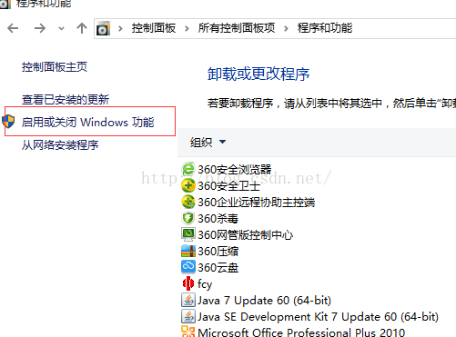
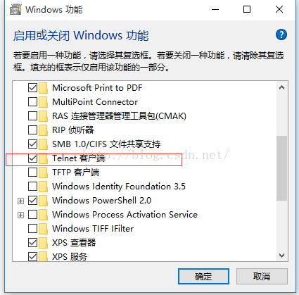

# [telnet 命令使用方法详解，telnet命令怎么用？](https://www.cnblogs.com/ylcms/p/7250129.html)

什么是Telnet？
　　对于Telnet的认识，不同的人持有不同的观点，可以把Telnet当成一种通信协议，但是对于入侵者而言，Telnet只是一种远程登录的工具。一旦入侵者与远程主机建立了Telnet连接，入侵者便可以使用目标主机上的软、硬件资源，而入侵者的本地机只相当于一个只有键盘和显示器的终端而已。

　　为什么需要telnet？
　　telnet就是查看某个端口是否可访问。我们在搞开发的时候，经常要用的端口就是 8080。那么你可以启动服务器，用telnet 去查看这个端口是否可用。

　　Telnet协议是TCP/IP协议家族中的一员，是Internet远程登陆服务的标准协议和主要方式。它为用户提供了在本地计算机上完成远程主机工作的能力。在终端使用者的电脑上使用telnet程序，用它连接到服务器。终端使用者可以在telnet程序中输入命令，这些命令会在服务器上运行，就像直接在服务器的控制台上输入一样。可以在本地就能控制服务器。要开始一个telnet会话，必须输入用户名和密码来登录服务器。Telnet是常用的远程控制Web服务器的方法。

　　Windows XP怎么执行telnet 命令？

　　1、点击开始　→　运行　→　输入CMD，回车。
　　2、在出来的DOS界面里，输入telnet[测试](http://lib.csdn.net/base/softwaretest)端口命令： telnet IP 端口 或者 telnet 域名 端口，回车。
　　如果端口关闭或者无法连接，则显示不能打开到主机的链接，链接失败；端口打开的情况下，链接成功，则进入telnet页面（全黑的），证明端口可用。

　　Telnet 客户端命常用命令：

　　open : 使用 openhostname 可以建立到主机的 Telnet 连接。

　　close : 使用命令 close 命令可以关闭现有的 Telnet 连接。

　　display : 使用 display 命令可以查看 Telnet 客户端的当前设置。

　　send : 使用 send 命令可以向 Telnet 服务器发送命令。支持以下命令：

　　ao : 放弃输出命令。

　　ayt : “Are you there”命令。

　　esc : 发送当前的转义字符。

　　ip : 中断进程命令。

　　synch : 执行 Telnet 同步操作。

　　brk : 发送信号。

　　上表所列命令以外的其他命令都将以字符串的形式发送至 Telnet 服务器。例如，sendabcd 将发送字符串 abcd 至 Telnet 服务器，这样，Telnet 会话窗口中将出现该字符串。

　　quit ：使用 quit 命令可以退出 Telnet 客户端。

　　telnet用于远程登录到网络中的计算机，并以命令行的方式远程管理计算机。需要注意的是，远程机器必须启动telnet服务器，否则无法打开telnet命令。
　　例如：在命令提示符中输入“telnet 114.80.67.193”，按回车键，但是为了安全起见，要输入“n”并按回车键，出现登录提示符。输入登录名后，按回车键即可登录到远程机器。

　　使用telnet的open子命令远程登录远程机器。命令格式：open hostname[port]，hostname为ip地址，port默认为23。 在telnet提示符下输入“open 114.80.67.193”，按回车键。再输入“n”，根据提示输入用户名和密码即可远程机器上。

　　使用telnet的unset子命令关闭本地回显功能。操作过程：先在命令提示符中输入“telnet”，按回车键；然后输入“setlocalecho”，按回车键，即可打开本地回显功能；如要关闭回显能力，只要在telnet命令提示符后输入“unsetlocalecho”，按回车。

　　使用telnet的status子命令查看连接状态。操作过程： 输入“telnet”进入telnet命令，再输入“status”，按回车，此时显示当前已经登录到IP为114.80.67.193的机器上。

　　为什么在Vista/Win7 下不能够使用telnet？Vista/Windows 7怎么执行telnet 命令？

　　Windows 7提示：telnet不是内部或外部命令，怎么办？一般只有Windows 7才会出现这种情况，这里主要说下Windows7怎么解决。

　　在Win7不能够使用的主要原因是由于win7默认情况下是没有安装telnet服务，所以我们需要安装telnet服务。怎么安装呢？很简单，只需要您简单的做如下操作：

　　开始　→　控制面板　→　程序和功能　→　打开或关闭Windows功能，在这里就可以看到“telnet服务器”和“telnet客服端”。

　　

　　

　　如果要访问他人电脑的就安装个客服端，如果要访问自己电脑的就需要两个都安装了，因为自己电脑既是服务器又是客服端了。

　　关闭Windows防火墙：开始　→　控制面板　→　Windows防火墙，在这里就可以选择是关闭还是开启防火墙。

　　为了安全，开启一部份端口的设置方法：

　　【开启】---【控制面板】--【Windows防火墙】--【高级设置】--【入站规则】--【新建规则(在界面的最右边)】---【端口】--【Tcp】--输入【特定本地端口（我这边就是输入8080）】--【允许连接】--【具体情况下可配置只允许访问的用户，这边没有配置，直接下一步】--【配置可访问的计算机，这边也没有配置，直接下一步】--【域，专用，公用都选择上，下一步】--【输入规则名称(比如我这边是要开发tomcat让外面访问，就起名TomcatServer)】--【完成即可】

　　涉及的命令总结：

　　① ping + ip： 查看某一个ip地址是否能够连通，如： ping 114.80.67.193

　　② telnet ip port ： 查看某一个机器上的某一个端口是否可以访问，如：telnet 114.80.67.193 8080

　　③ 退出命令： exit---退出dos窗口，q!,wq---[Linux](http://lib.csdn.net/base/linux)下退出vi编辑器
　　　　　　　　　ctrl+]，之后在按q ---退出telnet界面
　　　　　　　　　quit---退出[MySQL](http://lib.csdn.net/base/mysql).......

　　Telnet 命令使用方法

　　Telnet 命令允许您与使用 Telnet 协议的远程计算机通讯。运行 Telnet 时可不使用参数，以便输入由 Telnet 提示符 (Microsoft Telnet>) 表明的 Telnet 上下文。可从 Telnet 提示符下，使用 Telnet 命令管理运行 Telnet 客户端的计算机。

　　Telnet 客户端命令提示符接受以下命令：

　　open : 使用 openhostname 可以建立到主机的 Telnet 连接。

　　close : 使用命令 close 命令可以关闭现有的 Telnet 连接。

　　display : 使用 display 命令可以查看 Telnet 客户端的当前设置。

　　send : 使用 send 命令可以向 Telnet 服务器发送命令。支持以下命令：

　　ao : 放弃输出命令。

　　ayt : “Are you there”命令。

　　esc : 发送当前的转义字符。

　　ip : 中断进程命令。

　　synch : 执行 Telnet 同步操作。

　　brk : 发送信号。

　　上表所列命令以外的其他命令都将以字符串的形式发送至 Telnet 服务器。例如，sendabcd 将发送字符串 abcd 至 Telnet 服务器，这样，Telnet 会话窗口中将出现该字符串。

　　quit

　　使用 quit 命令可以退出 Telnet 客户端。

　　set

　　使用带有下列参数之一的 set 命令为当前会话配置 Telnet 客户端。

　　bsasdel

　　Backspace 将作为删除而发送。

　　codeset option

　　只有当语言设置为日语时才可用。将当前代码集设置为选项，可以为下列选项之一：

　　? Shift JIS

　　? Japanese EUC

　　? JIS Kanji

　　? JIS Kanji (78)

　　? DEC Kanji

　　? NEC Kanji

　　应该在远程计算机上设置相同的代码集。默认情况下，Telnet 客户端使用光栅字体。使用这些代码集访问远程计算机之前，您必须配置 Telnet 客户端以使用 TrueType 字体，从而确保正确地显示字符。

　　crlf

　　新行模式：导致 Return 键发送 0x0D, 0x0A。

　　delasbs

　　Delete 将作为退格键发送。

　　escapecharacter

　　从 Telnet 会话模式转换到 Telnet 命令模式。当处于 Telnet 命令模式时，按 Enter 将会返回到 Telnet 会话模式。

　　localecho

　　打开 localecho。

　　logfilename

　　指定为该会话将 Telnet 日志写入到的文件的名称。如果不指定该文件的路径，将在当前目录中创建文件。指定日志文件还会启动日志记录。

　　logging

　　启动该会话的日志。

　　mode {console | stream}

　　操作的模式。

　　ntlm

　　启动 NTLM 身份验证。

　　term {ansi | vt100 | vt52 | vtnt}

　　您希望 Telnet Client 模拟的终端的类型。

　　?

　　显示 set 的帮助信息。

　　unset

　　使用 unset 命令可以关闭先前使用 set 命令设置的选项。

　　status

　　使用 status 命令可以确定运行 Telnet 客户端的计算机是否已成功连接。

　　?/help

　　显示“帮助”信息。

　　FTP:文件传输协议。先说说他的功能吧，主要就是从运行FTP服务器的计算机传输文件。可以交互使用。这里要注意，只有安装了tcp/ip协议的机器才能使用ftp命令。

　　命令格式：ftp [-v][-d][-i][-n][-g][-s:filename][-a][-w:windowsize][computer]

　　说说他们的含义吧。

　　-v 不显示远程服务器响应

　　-n 禁止第一次连接的时候自动登陆

　　-i 在多个文件传输期间关闭交互提示

　　-d 允许调试、显示客户机和服务器之间传递的全部ftp命令

　　-g 不允许使用文件名通配符，文件名通配符的意思是说允许在本地文件以及路径名中使用通配字符

　　-s:filename 指定包含ftp命令的文本文件。在ftp命令启动后将自动运行这些命令。在加的参数里不能有空格。

　　-a 绑定数据连接时，使用任何的本地端口

　　-w:windowsize 忽略默认的4096传输缓冲区

　　computer 指定要连接的远程计算机的ip地址

　　呵呵，理解了上面的，就说说一些具体的命令，我个人觉得虽然现在工具用起来很方便了，但懂这些命令在很多地方还是很有用的，就像现在nt下的命令提示符

　　1) ?

　　说明：显示ftp命令的说明。后面可以加参数，是加需要解释的命令名，不加则显示包含所有命令列表。

　　2) append

　　说明：使用当前文件类型设置，将本地文件附加到远程计算机中。大概格式是

　　append local-file [remote-file] 其中local-file是说指定要添加的本地文件。

　　remote-file是说指定要将local-file附加到远程计算机文件，要是省了这个，则是使用本地文件名做远程文件名。

　　3)ascii

　　说明:默认情况下，将文件传输类型设置为ASCII

　　4)bell

　　说明：响玲开关，意思是文件传输完成后是否有玲声提醒。默认是关闭的。

　　5)binary

　　说明：将文件传输类型设置为二进制。

　　6)bye

　　说明:结束和远程计算机的ftp会话，也就是安全断开，退出ftp.

　　7)cd

　　说明：更改远程计算机上的工作目录。如cd data 其中data是要进入的远程计算机的目录。

　　8)close

　　说明:结束与远程服务器的ftp会话，并返回命令解释程序。

　　9)dir

　　说明:显示远程的文件以及子目录列表。如dir data local-file

　　其中data是指定要查看列表的目录，没指定的话就是当前目录。local-file是指定要保存列表的本地文件，不指定的话就在屏幕输出。

　　10)debug

　　说明：调试开关，打开的时候打印每个发送到远程计算机的命令，命令前有——>

　　默认情况是关闭的。

　　11)disconnnect

　　说明：与远程计算机断开连接，但还保持着ftp命令提示符。

　　12)get

　　说明：使用当前文件传输类型，把远程的文件拷贝到本地计算机上。

　　如get remote-file local-file

　　remote-file是指定要复制的文件，local-file是指定本地计算机上的文件名，

　　没有指定的话则个remote-file同名。

　　13)glob

　　说明：文件名通配开关

　　14)hash

　　说明：转换每个传输数据快的散列标记打印(#).数据快的大小是2048字节。默认情况下是关闭的，

　　15)help

　　说明：显示ftp命令的解释，如help commmand 其中command就是你要解释的命令，如果不加command这个参数的话就会显示所有命令的列表

　　16)!

　　说明:这个命令差点忘记了功能是在本地计算机上运行指定命令。如! command 其中command就是你要运行的命令，如果不加command这个参数的话，则显示本地命令提示， 这时你输入exit命令就能返回到ftp了。

　　17)lcd

　　说明:更改本地计算机的本地目录,在默认的时候是启动ftp的目录.这个不要觉得没用啊，在你使用ftp的时候为了传递文件不是常改变本地和远程计算机的目录吗?

　　如lcd [directory] 其中[directory]是指定要进入的本地计算机的目录,如果你不加这个参数,就会显示出本地计算机的工作目录.

　　18)literal

　　说明:向远程ftp服务器发送协商参数,报告.

　　如lireral argument [...] 其中argument是指定要发送给远程服务器的协商参数。

　　19)ls

　　说明:显示远程目录的文件和字目录.

　　如ls remote-directory local-file

　　其中remote-directory是指要查看的列表的目录,不指定的话显示的是当前工作目录。local-file是指定要保存列表的本地文件.不指定的话是在屏幕上输出.

　　20)mdelete

　　说明:删除远程计算机上的文件.如mdelete remote-file ...

　　remote-file肯定是要删的文件啊，可以删除多个.

　　21)mdir

　　说明:显示远程目录的文件和子目录列表,他允许指定多个文件.

　　如mdir remote-file ... local-file

　　参数我想大家应该明白什么意思吧?不明白就看看前面的类似命令吧.

　　22)mget

　　说明:使用当前文件传输类型将多个远程文件复制到本地计算机.

　　如mget remote-files ...

　　其实remote-files可以指定多个，他就是指定要复制到本地计算机的远程文件.

　　23)mkdir

　　说明:创建远程目录.

　　如mkdir directory 这个命令和nt下的命令提示符中的md directory一样，不多说了.

　　24)mls

　　说明:显示远程目录的文件和目录简表

　　如mls remote-file ... local-file

　　其中remote-file这个参数是必须要加的，’’-’’是使用远程计算机的当前工作目录.

　　25)mput

　　说明:使用当前文件传输类型,将本地文件复制到远程计算机.

　　如mput local-files ...

　　26)open

　　说明:连接到指定ftp服务器上，

　　如open computer port 其中computer一般是远程计算机的ip地址,port不用说就是指定端口了。

　　27)prompt

　　说明:转换提示,在多个文件传输的时候,ftp提示可以有选择的检索或保存文件，如果关闭提示,则mget和mput命令传输所有文件,在默认情况下是打开的.

　　28)put

　　说明:使用当前文件传输类型将本地文件复制到远程计算机中，

　　如put local-file remote-file

　　其中local-file是指定要复制的本地文件，

　　remote-file是指定要复制的远程计算机上的文件名，不指定的话是和本地计算机上的文件名同名.

　　29)pwd

　　说明:显示远程呢感计算机上的当前目录.

　　30)quit

　　说明:结束与远程计算机的ftp会话,并退出ftp.

　　31)quote

　　说明:向远程ftp服务器发送协议,报告.期待ftp单码应答,这个命令的功能和literal相同.

　　32)recv

　　说明:使用当前文件传输类型将远程文件复制到本地计算机,他与get命令作用相同。

　　33)remotehelp

　　说明:显示远程命令的帮助.这个命令的用法和help,!一样可以参考他的用法.

　　34)rename

　　说明:更改远程计算机上的文件名。

　　这个命令和nt的命令提示符的ren一样，如rename filename newfilename

　　35)rmdir

　　说明:删除远程目录.

　　这个命令和nt的命令提示符的rm一样，如rmdir directory

　　36)send

　　说明:使用当前文件传输类型将本地文件复制到远程计算机.send和put命令的功能一样。

　　如send local-file remote-file

　　37)status

　　说明:显示ftp连接和转换的当前状态

　　38)trace

　　说明:转换报文跟踪,运行ftp的命令时,trace将显示没个报文的理由。

　　39)type

　　说明:设置或显示文件传输类型.

　　如type [type-name]

　　其中type-name 的意思是文件传输的类型，默认是ASCII,没加这个参数就是显示当前的传输类型.

　　40)user

　　说明:指定连接到远程计算机的用户.

　　如user user-name [passwd] [account]

　　其中user-name不用说都是用来登陆计算机的用户名了，

　　passwd是指定user-name的密码,不指定的话ftp会提示输入密码。

　　account是指定用来登陆计算机的帐号,如不指定,ftp会提示输入帐号.

　　41)verbose

　　说明:转换冗余模式。这里如果打开,会显示所有ftp响应,文件传输结束的时候会显示传输的效率和统计信息,默认的情况是打开的!

　　Telnet被入侵者用来做什么？

　　(1)Telnet是控制主机的第一手段
　　如果入侵者想要在远程主机上执行命令，需要建立IPC$连接，然后使用net time命令查看系统时间，最后使用at命令建立计划任务才能完成远程执行命令。虽然这种方法能够远程执行命令，但相比之下，Telnet方式对入侵者而言则会方便得多。入侵者一旦与远程主机建立Telnet连接，就可以像控制本地计算机一样来控制远程计算机。可见，Telnet方式是入侵者惯于使用的远程控制方式，当他们千方百计得到远程主机的管理员权限后，一般都会使用Telnet方式进行登录。

　　(2)用来做跳板
　　入侵者把用来隐身的肉鸡称之为“跳板”，他们经常用这种方法，从一个“肉鸡”登录到另一个“肉鸡”，这样在入侵过程中就不会暴露自己的IP地址。

　　关于NTLM验证
　　由于Telnet功能太强大，而且也是入侵者使用最频繁的登录手段之一，因此微软公司为Telnet添加了身份验证，称为NTLM验证，它要求Telnet终端除了需要有Telnet服务主机的用户名和密码外，还需要满足NTLM验证关系。NTLM验证大大增强了Telnet主机的安全性，就像一只拦路虎把很多入侵者拒之门外。

　　Telnet语法
　　telnet [-a][-e escape char][-f log file][-l user][-t term][host [port]]
　　-a 企图自动登录。除了用当前已登陆的用户名以外，与 -l 选项相同。
　　-e 跳过字符来进入 telnet 客户提示。
　　-f 客户端登录的文件名
　　-l 指定远程系统上登录用的用户名称。
　　要求远程系统支持 TELNET ENVIRON 选项。
　　-t 指定终端类型。
　　支持的终端类型仅是: vt100, vt52, ansi 和 vtnt。
　　host 指定要连接的远程计算机的主机名或 IP 地址。
　　port 指定端口号或服务名。

　　使用Telnet登录
　　登录命令：telnet HOST [PORT] 例如：telnet 61.152.158.132 23（默认端口）
　　断开Telnet连接的命令：exit
　　成功地建立Telnet连接，除了要求掌握远程计算机上的账号和密码外，还需要远程计算机已经开启“Telnet服务”，并去除NTLM验证。也可以使用专门的Telnet工具来进行连接，比如STERM，CTERM等工具。

　　Telnet典型入侵（如果以下内容不太了解，可以简单了解）

　　1.Telnet典型入侵步骤
　　步骤一：建立IPC$连接。其中sysback是前面建立的后门账号。
　　步骤二：开启远程主机中被禁用的Telnet服务。
　　步骤三：断开IPC$连接。
　　步骤四：去掉NTLM验证。如果没有去除远程计算机上的NTLM验证，在登录远程计算机的时候就会失败。
　　不过入侵者会使用各种方法使NTLM验证形同虚设。解除NTLM的方法有很多，下面列出一些常用的方法，来看看入侵者如何去除NTLM验证。

　　方法一：

　　首先，在本地计算机上建立一个与远程主机上相同的账号和密码。
　　然后，通过“开始”→“程序”→“附件”找到“命令提示符”，使用鼠标右键单击“命令提示符”，然后选择“属性”
　　在“以其他用户身份运行(U)”前面“打钩”，然后单击“确定”按钮。接着，仍然按照上述路径找到“命令提示符”，用鼠标左键单击打开，得到如图所示对话框。
　　如图所示，键入“用户名”和“密码”。
　　单击“确定”按钮后，得到MS-DOS界面，然后用该MS-DOS进行Telnet登录。
　　键入“telnet 192.168.27.128”命令并回车后，在得到的界面中键入“y”表示发送密码并登录，如图所示。
　　最后得到就是远程主机为Telnet终端用户打开的Shell，在该Shell中输入的命令将会直接在远程计算机上执行。
　　比如，键入“net user”命令来查看远程主机上的用户列表。

　　方法二：

　　该方法使用工具NTLM.EXE来去除NTLM验证。首先与远程主机建立IPC$连接，然后将NTLM.EXE拷贝至远程主机，最后通过at命令使远程计算机执行NTLM.EXE。
　　计划任务执行NTLM.EXE后，便可键入“telnet 192.168.27.128”命令来登录远程计算机。
　　最后得到登录界面
　　在该登录界面中键入用户名和密码，如果用户名和密码正确，便会登录到远程计算 机，得到远程计算机的Shell。
　　成功登录。
　　另外，还可以使用与opentelnet.exe相配套的程序resumetelnet.exe来恢复远程主机的NTLM验证，命令格式为“ResumeTelnet.exe \\server sername password”。
　　执行后回显可知，resumetelnet.exe关闭了目标主机的Telnet服务，恢复了NTLM验证。
　　Telnet高级入侵全攻略
　　从前面的介绍可以看出，即使计算机使用了NTLM验证，入侵者还是能够轻松地去除NTLM验证来实现Telnet登录。如果入侵者使用23号端口登录，管理员便可以轻易地发现他们，但不幸的是，入侵者通常不会通过默认的23号端口进行Telnet连接。那么入侵者究竟如何修改Telnet端口，又如何修改Telnet服务来隐蔽行踪呢?下面举一些常见的例子来说明这一过程，并介绍一下完成这一过程所需要的工具。
　　X-Scan：用来扫出存在NT弱口令的主机。
　　opentelnet：用来去NTLM验证、开启Telnet服务、修改Telnet服务端口。
　　AProMan：用来查看进程、杀死进程。
　　instsrv：用来给主机安装服务。

　　(1)AProMan简介
　　AproMan以命令行方式查看进程、杀死进程，不会被杀毒软件查杀。举个例子，如果入侵者发现目标主机上运行有杀毒软件，会导致上传的工具被杀毒软件查杀，那么他们就会要在上传工具前关闭杀毒防火墙。使用方法如下：
　　c:\AProMan.exe -a 显示所有进程
　　c:\AProMan.exe -p 显示端口进程关联关系(需Administrator权限)
　　c:\AProMan.exe -t [PID] 杀掉指定进程号的进程
　　c:\AProMan.exe -f [FileName] 把进程及模块信息存入文件

　　(2)instsrv简介
　　instsrv是一款用命令行就可以安装、卸载服务的程序，可以自由指定服务名称和服务所执行的程序。instsrv的用法如下：
　　安装服务：instsrv <服务名称> <执行程序的位置>
　　卸载服务：instsrv <服务名称> REMOVE
　　还有另一款优秀的远程服务管理工具SC。它属于命令行工具，可以在本地对远程计算机上的服务进行查询、启动、停止和删除。它的用法很简单，这里不作介绍了。下面通过实例来介绍入侵者如何实现Telnet登录并留下Telnet后门的过程。

　　步骤一：扫出有NT弱口令的主机。在X-Scan的“扫描模块”中选中“NT-SERVER弱口令”。
　　然后在“扫描参数中”指定扫描范围为“192.168.27.2到192.168.27.253”。
　　等待一段时间后，得到扫描结果。

　　步骤二：用opentelnet打开远程主机Telnet服务、修改目标主机端口、去除NTLM验证。

　　无论远程主机是否开启“Telnet服务”，入侵者都可以通过工具opentelnet来解决。比如，通过“opentelnet \\192.168.27.129 administrator "" 1 66”命令为IP地址为192.168. 27.129的主机去除NTLM认证，开启Telnet服务，同时又把Telnet默认的23号登录端口改成66号端口。

　　步骤三：把所需文件(instsrv.exe、AProMan.exe)拷贝到远程主机。
　　首先建立IPC$，然后通过映射网络硬盘的方法把所需文件拷贝、粘贴到远程计算机的c:\winnt文件夹中。
　　拷贝成功后。

　　步骤四：Telnet登录。
　　在MS-DOS中键入命令“telnet 192.168.27.129 66”来登录远程主机192.168.27.129。

　　步骤五：杀死防火墙进程。
　　如果入侵者需要把类似木马的程序拷贝到远程主机并执行，那么他们会事先关闭远程主机中的杀毒防火墙。虽然这里没有拷贝类似木马的程序到远程主机，但还是要介绍一下这一过程。当入侵者登录成功后，他们会进入到c:\winnt目录中使用AProMan程序。首先通过命令 AProMan –A查看所有进程，然后找到杀毒防火墙进程的PID，最后使用AProMan –t [PID]来杀掉杀毒防火墙。

　　步骤六：另外安装更为隐蔽的Telnet服务。
　　为了事后仍然能登录到该计算机，入侵者在第一次登录之后都会留下后门。这里来介绍一下入侵者如何通过安装系统服务的方法来让Telnet服务永远运行。在安装服务之前，有必要了解一下Windows[操作系统](http://lib.csdn.net/base/operatingsystem)是如何提供“Telnet服务”的。打开“计算机管理”，然后查看“Telnet服务”属性。
　　在“Telnet 的属性”窗口中，可以看到其中“可执行文件的路径”指向“C:\WINNT\ SYSTEM32\tlntsvr.exe”。可见，程序tlntsvr.exe就是Windows系统中专门用来提供“Telnet服务”的。也就是说，如果某服务指向该程序，那么该服务就会提供Telnet服务。因此，入侵者可以自定义一个新服务，将该服务指向tlntsvr.exe，从而通过该服务提供的Telnet服务登录，这样做后，即使远程主机上的Telnet服务是被禁用的，入侵者也可以毫无阻碍的登录到远程计算机，这种方法被称之为 Telnet后门。下面就介绍一下上述过程是如何实现的。首先进入instsrv所在目录。
　　然后使用instsrv.exe建立一个名为“SYSHEALTH”的服务，并把这个服务指向C:\WINNT z\SYSTEM32\tlntsvr.exe，根据instsrv.exe的用法，键入命令“instsrv.exe SYSHEALTH C:\WINNT\SYSTEM32\tlntsvr.exe”。
　　一个名为“SYSHEAHTH”的服务就这样建立成功了。虽然从表面看上去该服务与远程连接不存在任何关系，但是实际上该服务是入侵者留下的Telnet后门服务。
　　通过“计算机管理”可以看到该服务已经添加在远程计算机上。入侵者一般会把这个服务的启动类型设置成“自动”，把原来的“Telnet服务”停止并禁用。
　　通过验证可知，虽然远程主机上的Telnet服务已经被停止并禁用，但入侵者仍然能够通过Telnet来控制远程主机。通过这些修改，即使管理员使用“netstat –n”命令来查看开放端口号也看不出66端口正在提供Telnet服务，此命令平常还可以拿来判断端口的连接情况。

　　小结：telnet命令是功能强大的远程登陆命令，几乎所有的入侵者都喜欢用它，屡试不爽。为什么？因为它操作简单，如同使用自己的机器一样，只要你熟悉DOS命令，在成功以administrator身份连接了远程机器后，就可以用它来干你想干的一切了。