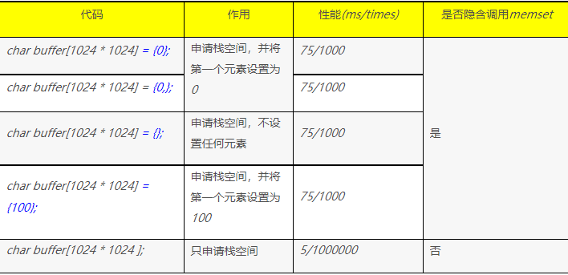

性能杀手：”潜伏”的memset

【memset性能陷进】

memset是大家常用的函数，而且一般的编程书籍都会谆谆告诫大家：申请内存后要初始化，防止使用未经初始化的内存导致不可预知的结果，所以我们一般都会按照如下方式编写代码：

```c++
char* buffer = (char*)malloc(1024);

memset(buffer, 0x00, 1024);
```

 

代码看起来很标准，也很美观，但这里却隐藏着一个陷进：memset的性能并不高！如果你的内存在1K左右，可能还察觉不到，但如果是1M，那性能影响就很明显了，我们来看实测数据（Redhat EL5 Intel(R) Xeon(R) CPU E5620 2.40GHz, gcc 4.1.2）：


| 内存大小 | 重复次数 | 时间    |
| -------- | -------- | ------- |
| *1K*     | *100000* | *14ms*  |
| *1M*     | *1000*   | *60ms*  |
| *10M*    | *1000*   | *725ms* |

 

所以如果你在代码里循环调用memset，或者每次流程处理都要调用memset，而且每次都要memset 1M以上，那么你就要小心了，1000次的memset 1M就能够消耗你100多ms的时间，对于高并发高性能的系统来说，这个时间是非常可观的，这就意味着即使不考虑业务处理，1秒钟你最多也不可能处理超过10000次请求。

 

【“潜伏”的memset】

但这只是memset的第一个陷阱，还有更加隐蔽的第二个陷阱，而且这个陷阱你从代码上根本看不出和memset有什么关系！下面我们就来看这个“潜伏”的memset究竟是如何潜伏的。

代码很简单，就是在栈内存中申请缓冲区，然后再赋值：

`char buffer[1024] = {0};`

这一行代码很简单，和上面代码不同的地方就在于一个在堆内存中申请，一个在栈内存中申请。但就是这么一行简单的代码，却隐藏了一个陷阱：初始化的时候调用了memset。我们用ltrace工具来看看：

```c++
===============================代码====================================

int main(){

   char buffer[1024 * 1024] = {0};

}

==============================ltrace 输出================================

__libc_start_main(0x8048444, 1, 0xbff9b0a4, 0x80484b0, 0x80484a0 <unfinished ...>

memset(0xbfe9afec, '/000', 1048576)                      = 0xbfe9afec

+++ exited (status 236) +++
```

 

可能会有同学会说，你全部都初始化为0了，当然慢了，如果我只初始化第一个元素，是不是会没有这个问题呢？

多说无益，代码验证：

```c++
===============================代码====================================

int main(){

   char buffer[1024 * 1024] = {0,};

}

==============================ltrace 输出================================

__libc_start_main(0x8048444, 1, 0xbfb54f84, 0x80484b0, 0x80484a0 <unfinished ...>

memset(0xbfa54ecc, '/000', 1048576)                      = 0xbfa54ecc

+++ exited (status 204) +++

 
```

从上面的ltrace输出可以看出，不管你是全部设置为0，还是只设置第一个，都会调用memset，而且memset的长度都是1024*1024，难道这行代码和括号里的值没有关系，无论怎样都会调用memset？我们再来验证一下：

```c++
===============================代码====================================

int main(){

   char buffer[1024 * 1024] = {};

}

==============================ltrace 输出================================

__libc_start_main(0x8048444, 1, 0xbff0e844, 0x80484b0, 0x80484a0 <unfinished ...>

memset(0xbfe0e78c, '/000', 1048576)                      = 0xbfe0e78c

+++ exited (status 140) +++
```

 

再验证括号里设置其它值：

```c++
===============================代码====================================

int main(){

   char buffer[1024 * 1024] = {100};

}

==============================ltrace 输出================================

__libc_start_main(0x8048444, 1, 0xbfea51b4, 0x80484b0, 0x80484a0 <unfinished ...>

memset(0xbfda50fc, '/000', 1048576)                      = 0xbfda50fc

+++ exited (status 252) +++
```

经过4次代码验证，确实证实了不管{}里面是什么内容，都会调用memset，将所有内存设置为0。

实际上上面的代码里面还有一个陷阱，下面这两行语句的效果是一样的，第一行并不是将所有的内存位都设置为0，而只是设置第0个内存位为0.

```c++
char buffer[1024 * 1024] = {0};

char buffer[1024 * 1024] = {0,};
```

因为隐藏调用了memset，所以设置为0的时候还看不出，我们换一个值就看的很清楚了：

```c++
============================代码=======================================

#include <stdio.h>

int main(){

    char buffer[1024 * 1024 ] = {100};
    
    printf("%d/n", *buffer);
    
    printf("%d/n", *(buffer+1));

}

=============================输出======================================

100

0
```

 

各种赋值的情况我们已经验证过了，当然也要验证一下不赋值的情况，下面是验证情况：

```c++
===============================代码====================================

int main(){

char buffer[1024 * 1024 ];

*buffer = 'A';

printf("%d/n", *buffer);

}

==============================ltrace 输出================================

__libc_start_main(0x8048444, 1, 0xbfbab8f4, 0x80484b0, 0x80484a0 <unfinished ...>

printf("%d/n", 6565

)                                                                = 3

+++ exited (status 3) +++
```

从ltrace结果可以清楚的看出：即使使用了内存，这次也并没有调用memset了。

 

除了char类型外，其它的类型也都是这样的，有兴趣的同学可以自己尝试一下，这里就不贴详细的代码了。

 

【总结汇总】

 

综合前面的代码分析和性能测试，建议大家在编写代码的时候不要用char buffer[1024 * 1024] = XXX;这种方式，而要使用char buffer[1024 * 1024];除非确定一定要memset。

 

有的同学就会问到：既然这样，难道我们就不用memset了？

我的理解是：memset 1k以下，次数也不多，则可以用；否则除非你确定一定要memset，否则就不要用，你可以用其它替代方法。

例如：

1）如果内存是用来存放字符串的，你完全可以使用sprintf等函数，让其自动添加结束符；或者自己记录字符串的长度，在最后手动设置字符串结束符。

2）对于C++的struct来说，可以定义默认构造函数来完成初始化。


附：

使用Visual studio 2008测试，发现有同样的问题，初步估计是不是哪个标准定义了，但找了几个C/C++/POSIX的标准初看了一下，内容太多，都是英文的，一时半会看不出来，有兴趣有时间的同学可以去研究一下。


===========================================================================================

2014.10.10补充： 经过CSDN网友  @土鸡笨蛋 的提醒，然后自己试了一下，在gcc编译时加上 O2或者O3 优化参数，就不会隐含调用memset了


非常感谢@土鸡笨蛋 的测试和补充，让这个知识点更全面了，由此也引出两个值得注意的点：

1）Debug模式和Release模式处理不一样，因此可能出现Debug模式下没有问题，正式发布上线后就有问题

2）研发开发的时候为了方便可以用Debug模式，但给测试同学测试的时候一定要用Release模式，否则就可能出现上述问题

————————————————
版权声明：本文为CSDN博主「华仔爱技术」的原创文章，遵循CC 4.0 BY-SA版权协议，转载请附上原文出处链接及本声明。
原文链接：https://blog.csdn.net/yunhua_lee/article/details/6381866