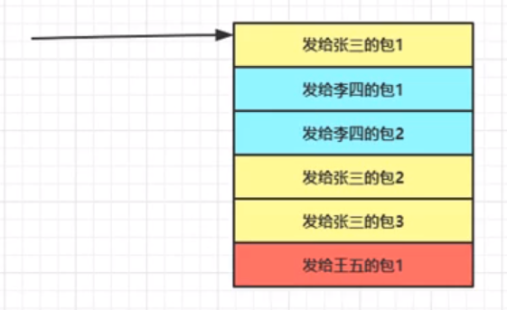

假设有这么一种发送队列情况图，有3个用户都连入服务器中来了，他们都有不同的业务需要处理，处理完后需要给他们返回数据包。

假设在从消息队列中取出张三的包1，在发送的时候，张三的接收缓冲区满了，就会导致我们发送的时候，一次性发送不完，然后程序就会走到需要调用epoll驱动发送代码块里。然后程序继续走，执行给李四发包，然后李四的包发送得很顺畅，然后线程继续玩下走，走到给张三发包2，这时候因为张三的包1还没发送完，所以给张三发送的包2就continue回去【注意这里是卡在发包1这里，包1没发送完，那么理所应当包2也就会被跳过，等待包1发送完】，然后线程现在走到包3这里，恰好这时候包1发送完了，【注意现在的情况是包1发送完，包2被跳过，该判断包3有没有发】，继续玩下走就会导致，包3倍正常发出去，但是包2被跳过了。所以最终有可能发给客户端的包就是 包1 包3 包2

那么这种没有按顺序发送数据的情况怎么解决呢？

1：不解决，只要客户端乱序收包机制完善，就没问题

2：客户端：客户端发包请求采用一问一答方式，发包1，等到服务器返回包1的处理结果在发包2，发包2，等到服务器返回包1的处理结果在发包3

其实本身要求服务端按序返回是根本没有必要的，因为服务器采用多线程，本身多线程处理顺序就是不可控的。

消息的跳跃发送, 如果真的有需求, 我认为不应该在服务器端解决, 更不应该在发送消息队列线程中处理, 

因为消息进入发送队列的顺序并不等于消息接收的顺序. 在发送消息队列处理这个问题 只能使消息按照插入这个队列的顺序发送, 

但是线程池处理每条消息的时间有长有短, 在这个环节就不能保证消息是按序处理完毕插入发送队列的. 

所以如果实在需要实现, 我觉得可以在客户端仿照滑动窗口协议, 客户端给每个数据包按顺序编号, 服务器返回的每个包都保留这个编号, 客户端收到包后, 只向应用层返回按序收到的最大编号的消息体.