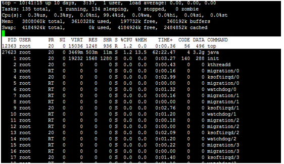
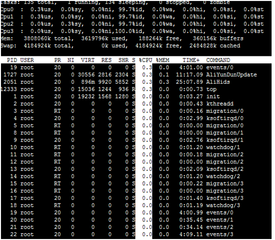
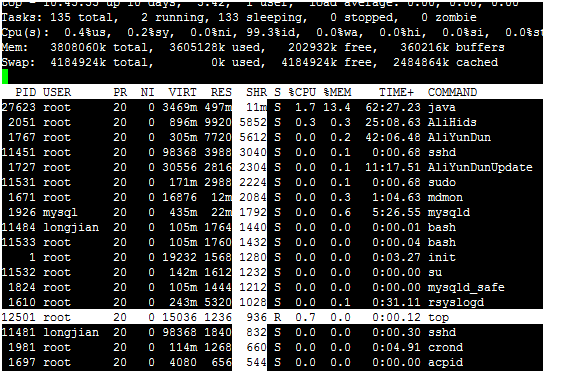

# [linux top命令查看内存及多核CPU的使用讲述](https://www.cnblogs.com/dragonsuc/p/5512797.html)

 

 

##### 查看多核CPU命令

mpstat -P ALL 和 sar -P ALL 
说明：sar -P ALL > aaa.txt  重定向输出内容到文件 aaa.txt

 

##### top命令

经常用来监控linux的系统状况，比如cpu、内存的使用，程序员基本都知道这个命令，但比较奇怪的是能用好它的人却很少，例如top监控视图中内存数值的含义就有不少的曲解。
本文通过一个运行中的WEB服务器的top监控截图，讲述top视图中的各种数据的含义，还包括视图中各进程（任务）的字段的排序。

 

###### top进入视图

 

  第一行：
  10:08:45 — 当前系统时间
  10 days, 3:05 — 系统已经运行了10天3小时5分钟（在这期间没有重启过）
  1 users — 当前有1个用户登录系统
  load average: 0.00, 0.00, 0.00 — load average后面的三个数分别是1分钟、5分钟、15分钟的负载情况。

load average数据是每隔5秒钟检查一次活跃的进程数，然后按特定算法计算出的数值。如果这个数除以逻辑CPU的数量，结果高于5的时候就表明系统在超负荷运转了。

  第二行：
  Tasks — 任务（进程），系统现在共有135个进程，其中处于运行中的有1个，134个在休眠（sleep），stoped状态的有0个，zombie状态（僵尸）的有0个。

  第三行：cpu状态
  0.3% us — 用户空间占用CPU的百分比。
  0.0% sy — 内核空间占用CPU的百分比。
  0.0% ni — 改变过优先级的进程占用CPU的百分比
  99.7% id — 空闲CPU百分比
  0.0% wa — IO等待占用CPU的百分比
  0.0% hi — 硬中断（Hardware IRQ）占用CPU的百分比
  0.0% si — 软中断（Software Interrupts）占用CPU的百分比

在这里CPU的使用比率和windows概念不同，如果你不理解用户空间和内核空间，需要充充电了。

  第四行：内存状态
  3808060k total — 物理内存总量（4GB）
  3660048k used — 使用中的内存总量（3.6GB）
  148012k free — 空闲内存总量（148M）
  359760k buffers — 缓存的内存量 （359M）

  第五行：swap交换分区
  4184924k total — 交换区总量（4G）
  0k used — 使用的交换区总量（0M）
  4184924k free — 空闲交换区总量（4G）
  2483956k cached — 缓冲的交换区总量（2483M）

第四行中使用中的内存总量（used）指的是现在系统内核控制的内存数，空闲内存总量（free）是内核还未纳入其管控范围的数量。纳入内核管理的内存不见得都在使用中，还包括过去使用过的现在可以被重复利用的内存，内核并不把这些可被重新使用的内存交还到free中去，因此在linux上free内存会越来越少，但不用为此担心。

如果出于习惯去计算可用内存数，这里有个近似的计算公式：第四行的free + 第四行的buffers + 第五行的cached，按这个公式此台服务器的可用内存：148M+259M+2483M = 2990M。

对于内存监控，在top里我们要时刻监控第五行swap交换分区的used，如果这个数值在不断的变化，说明内核在不断进行内存和swap的数据交换，这是真正的内存不够用了。

 第六行是空行

  第七行以下：各进程（任务）的状态监控
  PID — 进程id
  USER — 进程所有者
  PR — 进程优先级
  NI — nice值。负值表示高优先级，正值表示低优先级
  VIRT — 进程使用的虚拟内存总量，单位kb。VIRT=SWAP+RES
  RES — 进程使用的、未被换出的物理内存大小，单位kb。RES=CODE+DATA
  SHR — 共享内存大小，单位kb
  S — 进程状态。D=不可中断的睡眠状态 R=运行 S=睡眠 T=跟踪/停止 Z=僵尸进程
  %CPU — 上次更新到现在的CPU时间占用百分比
  %MEM — 进程使用的物理内存百分比
  TIME+ — 进程使用的CPU时间总计，单位1/100秒
  COMMAND — 进程名称（命令名/命令行）

 

###### 多U多核CPU监控

 

在top基本视图中，按键盘数字“1”，可监控每个逻辑CPU的状况：

 

观察上图，服务器有4个逻辑CPU，实际上是1个物理CPU。

如果不按1，则在top视图里面显示的是所有cpu的平均值。

###### 进程字段排序

默认进入top时，各进程是按照CPU的占用量来排序的，在【top视图 01】中进程ID为14210的java进程排在第一（cpu占用100%），进程ID为14183的java进程排在第二（cpu占用12%）。可通过键盘指令来改变排序字段，比如想监控哪个进程占用MEM最多，我一般的使用方法如下：

\1. 敲击键盘“b”（打开/关闭加亮效果），top的视图变化如下：

  

我们发现进程id为12363的“top”进程被加亮了，top进程就是视图第二行显示的唯一的运行态（runing）的那个进程，可以通过敲击“y”键关闭或打开运行态进程的加亮效果。
\2. 敲击键盘“x”（打开/关闭排序列的加亮效果），top的视图变化如下：
可以看到，top默认的排序列是“%CPU”。
\3. 通过”shift + >”或”shift + <”可以向右或左改变排序列，下图是按一次”shift + >”的效果图：

 

视图现在已经按照%MEM来排序了。

###### 改变进程显示字段

\1. 敲击“f”键，top进入另一个视图，在这里可以编排基本视图中的显示字段：

 

 

这里列出了所有可在top基本视图中显示的进程字段，有”*”并且标注为大写字母的字段是可显示的，没有”*”并且是小写字母的字段是不显示的。如果要在基本视图中显示“CODE”和“DATA”两个字段，可以通过敲击“r”和“s”键：

 

 \2. “回车”返回基本视图，可以看到多了“CODE”和“DATA”两个字段：

 

 

 

###### top命令的补充

top命令是Linux上进行系统监控的首选命令，但有时候却达不到我们的要求，比如当前这台服务器，top监控有很大的局限性。这台服务器运行着websphere集群，有两个节点服务，就是【top视图 01】中的老大、老二两个java进程，top命令的监控最小单位是进程，所以看不到我关心的java线程数和客户连接数，而这两个指标是java的web服务非常重要的指标，通常我用ps和netstate两个命令来补充top的不足。

 监控java线程数：

ps -eLf | grep java | wc -l

监控网络客户连接数：

netstat -n | grep tcp | grep 侦听端口 | wc -l

上面两个命令，可改动grep的参数，来达到更细致的监控要求。

在Linux系统“一切都是文件”的思想贯彻指导下，所有进程的运行状态都可以用文件来获取。系统根目录/proc中，每一个数字子目录的名字都是运行中的进程的PID，进入任一个进程目录，可通过其中文件或目录来观察进程的各项运行指标，例如task目录就是用来描述进程中线程的，因此也可以通过下面的方法获取某进程中运行中的线程数量（PID指的是进程ID）：

ls /proc/PID/task | wc -l
在linux中还有一个命令pmap，来输出进程内存的状况，可以用来分析线程堆栈：

 pmap PID

大家都熟悉Linux下可以通过top命令来查看所有进程的内存，CPU等信息。除此之外，还有其他一些命令，可以得到更详细的信息，例如进程相关

cat /proc/your_PID/status 

通过top或ps -ef | grep '进程名' 得到进程的PID。该命令可以提供进程状态、文件句柄数、内存使用情况等信息。
内存相关
  vmstat -s -S M 
该可以查看包含内存每个项目的报告，通过-S M或-S k可以指定查看的单位，默认为kb。结合watch命令就可以看到动态变化的报告了。

也可用 cat /proc/meminfo 

要看cpu的配置信息可用

cat /proc/cpuinfo 

它能显示诸如CPU核心数，时钟频率、CPU型号等信息。

要查看cpu波动情况的，尤其是多核机器上，可使用

mpstat -P ALL 10 

该命令可间隔10秒钟采样一次CPU的使用情况，每个核的情况都会显示出来，例如，每个核的idle情况等。
只需查看均值的，可用
  iostat -c 
IO相关
  iostat -P ALL 
该命令可查看所有设备使用率、读写字节数等信息。

另外，htop ，有时间可以用一下。

 

 

##### [Linux查看物理CPU个数、核数、逻辑CPU个数](http://www.cnblogs.com/emanlee/p/3587571.html)

\# 总核数 = 物理CPU个数 X 每颗物理CPU的核数

\# 总逻辑CPU数 = 物理CPU个数 X 每颗物理CPU的核数 X 超线程数

 

\# 查看物理CPU个数

cat /proc/cpuinfo| grep "physical id"| sort| uniq| wc -l

 

\# 查看每个物理CPU中core的个数(即核数)

cat /proc/cpuinfo| grep "cpu cores"| uniq

 

\# 查看逻辑CPU的个数

cat /proc/cpuinfo| grep "processor"| wc -l

 

 查看CPU信息（型号）
cat /proc/cpuinfo | grep name | cut -f2 -d: | uniq -c