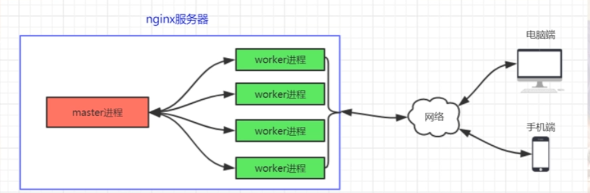
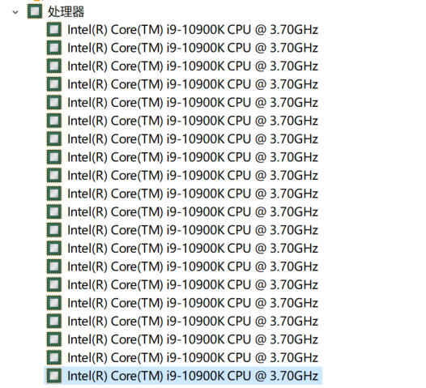
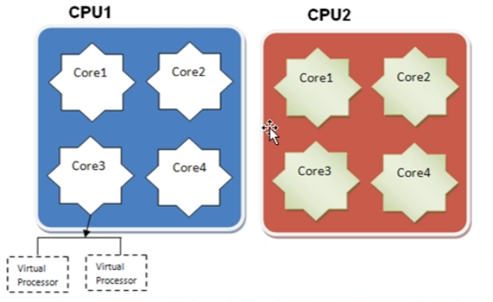
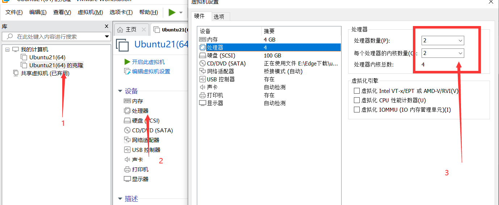

# （1）nginx的整体结构

## （1.1）master进程和worker进程概览

可以看到nginx启动之后，出现了一个master进程和一个worker进程
第一列：root/nobody 表示进程所属的用户ID
第二列：20230/20231 表示进程ID（PID)用来唯一的标识一个进程
第三列：1/20230 标识进程的父进程（PPID），可以看见woker进程的父进程是一个master进程，表明worker进程是master进程创建出来的（使用fork()创建）
第四列：

```shell
invi@inviubuntu:/usr/local/nginx/sbin$ ps -ef | grep nginx
root       20230       1  0 02:13 ?        00:00:00 nginx: master process ./nginx
nobody     20231   20230  0 02:13 ?        00:00:00 nginx: worker process
```

## （1.2）nginx进程模型

一个master进程，1到多个worker进程。这种工作机制来进行对外服务，这种工作机制保障了nginx能够稳定灵活的运行



* master进程：进程监控，不处理具体业务，专门用来管理和监控worker进程（监工）
* worker进程：处理实际业务逻辑，和用户交互
* master进程和worker进程如何通讯？可以使用信号，也可以共享内存
* 稳定性和灵活性体现之一：worker进程一旦挂掉，，那么master进程就会立即fork一个子进程出来投入服务

## （1.3）调整worker进程数量

worker进程几个比较合适？
公认的做法是，对于多核计算机，就让每个worker进程运行在一个单独的核上。
这样能最大限度减少CPU进程的切换成本，提高系统运行效率

本物理机（20核）


这里核数不是CPU数，而是processor数
图例里有2个CPU，蓝色一个和红的一个，里面各有4各内核，每个内核里有两个逻辑处理器（超线程技术/siblings），这个逻辑处理器就是processer
所以，这个图例里有16个processor



查看ubuntu下有几个processor

```shell
grep -c processor /proc/cpuinfo
# 2
```

理论上来说，只要虚拟机的processor不超过物理机的processor数，就都是可以正常运行的，

配置虚拟processor数为4个



```shell
grep -c processor /proc/cpuinfo
# 4
```

配置nginx worker进程数为系统processor数

```shell
# 进入到nginx安装目录下的conf目录
cd /usr/local/nginx/conf
# 配置nginx.conf配置文件
sudo vim nginx.conf
# 修改worker——processes数 4
worker_processes  4
# 保存退出，sbin目录下启动nginx
invi@inviubuntu:/usr/local/nginx/sbin$ sudo ./nginx 
# 查看启动后的nginx进程情况
invi@inviubuntu:/usr/local/nginx/sbin$ ps -ef | grep nginx
# root        1614       1  0 07:07 ?        00:00:00 nginx: master process ./nginx
# nobody      1615    1614  0 07:07 ?        00:00:00 nginx: worker process
# nobody      1616    1614  0 07:07 ?        00:00:00 nginx: worker process
# nobody      1617    1614  0 07:07 ?        00:00:00 nginx: worker process
# nobody      1618    1614  0 07:07 ?        00:00:00 nginx: worker process

```

# （2） nginx进程模型细说

稳定、灵活

## （2.1）nginx重载配置文件

```shell
sudo ./nginx -s -reload
```

## （2.2）nginx热升级

```shell
# sbin目录下查看nginx版本
./nginx -v
# nginx version: nginx/1.20.1
```

能够实现热更新和热回滚
<https://www.cnblogs.com/rancher-maomao/p/9940256.html>

## （2.3）nginx的关闭

```shell
# 使用./nginx -? 查看有哪些nginx指令

-s signal     : send signal to a master process: stop, quit, reopen, reload
# -s 信号：向主进程发送信号：停止、退出、重新打开、重新加载
# stop : 简单粗暴的退出，一执行，就立即关闭服务
# quit : 自然优雅的退出，服务完当前的连接对象后再退出，对于新的连接请求进行拒绝服务

sudo ./nginx -s quit
```

## （2.4）总结

多线程和多进程
多线程模型的弊端：因为是共享内存，如果某个线程报错，就会影响到其他线程，最终会导致整个服务器程序的崩溃
多进程中，如果一个worker进程挂掉，master进程可以立即重新拉起一个新的worker进程（fork)
