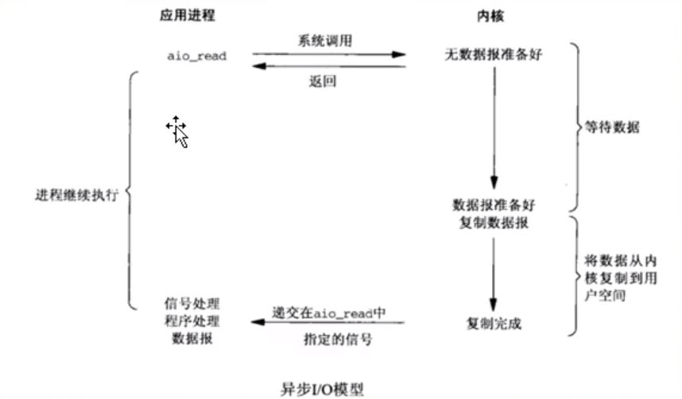

------


# 网络基础

## TCP三次握手建立连接


第一次握手：建立连接时，客户端发送syn包（syn=j）到服务器，并进入SYN_SENT状态，等待服务器确认；SYN：同步序列编号（Synchronize Sequence Numbers）。

第二次握手：服务器收到syn包，必须确认客户的SYN（ack=j+1），同时自己也发送一个SYN包（syn=k），即SYN+ACK包，此时服务器进入SYN_RECV状态；

第三次握手：客户端收到服务器的SYN+ACK包，向服务器发送确认包ACK(ack=k+1），此包发送完毕，客户端和服务器进入ESTABLISHED（TCP连接成功）状态，完成三次握手。

## 一个最基础的TCP通讯流程【socket编程】


#### 1. 套接字对象的创建

```C++
	/*
     * _domain 套接字使用的协议族信息
     * _type 套接字的传输类型
     * __protocol 通信协议
     * */
     int socket (int __domain, int __type, int __protocol) __THROW;
```

socket起源于UNIX，在Unix一切皆文件哲学的思想下，socket是一种"打开—读/写—关闭"模式的实现，可以将该函数类比常用的`open()`函数，服务器和客户端各自维护一个"文件"，在建立连接打开后，可以向自己文件写入内容供对方读取或者读取对方内容，通讯结束时关闭文件。

#### 2. 向套接字分配网络地址——bind()

```C++
/* 
* __fd:socket描述字，也就是socket引用
* myaddr:要绑定给sockfd的协议地址
* __len:地址的长度
*/
int bind (int __fd, const struct sockaddr* myaddr, socklen_t __len)  __THROW;
```

第一个参数：socket文件描述符`__fd`即套接字创建时返回的对象，

第二个参数：`myaddr`则是填充了一些网络地址信息，包含通信所需要的相关信息

#### 3. 进入等待连接请求状态

给套接字分配了所需的信息后，就可以调用`listen()`函数对来自客户端的连接请求进行监听（客户端此时要调用`connect()`函数进行连接）

```C++
/* Prepare to accept connections on socket FD.
   N connection requests will be queued before further requests are refused.
   Returns 0 on success, -1 for errors.  */
extern int listen (int __fd, int __n) __THROW;
```

第一个参数：socket文件描述符`__fd`，分配所需的信息后的套接字。

第二个参数：连接请求的队列长度，如果为6，表示队列中最多同时有6个连接请求。

这个函数的fd(socket套接字对象)就相当于一个门卫，对连接请求做处理，决定是否把连接请求放入到server端维护的一个队列中去。

#### 4. 受理客户端的连接请求

`listen()`中的sock(__fd : socket对象)发挥了服务器端接受请求的门卫作用，此时为了按序受理请求，给客户端做相应的回馈，连接到发起请求的客户端，此时就需要再次创建另一个套接字，该套接字可以用以下函数创建：

```C++
/* Await a connection on socket FD.
   When a connection arrives, open a new socket to communicate with it,
   set *ADDR (which is *ADDR_LEN bytes long) to the address of the connecting
   peer and *ADDR_LEN to the address's actual length, and return the
   new socket's descriptor, or -1 for errors.

   This function is a cancellation point and therefore not marked with
   __THROW.  */
extern int accept (int __fd, struct sockaddr *addr, socklen_t *addr_len);
```

函数成功执行时返回socket文件描述符，失败时返回-1。

第一个参数：socket文件描述符`__fd`，要注意的是这个套接字文件描述符与前面几步的套接字文件描述符不同。

第二个参数：保存发起连接的客户端的地址信息。

第三个参数： 保存该结构体的长度。

#### 5. send/write发送信息

linux下的发送函数为：

```C++
/* Write N bytes of BUF to FD.  Return the number written, or -1.

   This function is a cancellation point and therefore not marked with
   __THROW.  */
 ssize_t write (int __fd, const void *__buf, size_t __n) ;
```

而在windows下的发送函数为：

```C++
ssize_t send (int sockfd, const void *buf, size_t nbytes, int flag) ;
```

第四个参数是传输数据时可指定的信息，一般设置为0。

**send函数工作原理：**

 send函数只负责将数据提交给协议层。 当调用该函数时，send先比较待发送数据的长度len和套接字s的发送缓冲区的长度，如果len大于s的发送缓冲区的长度，该函数返回SOCKET_ERROR； 如果len小于或者等于s的发送缓冲区的长度，那么send先检查协议是否正在发送s的发送缓冲中的数据； 如果是就等待协议把数据发送完，如果协议还没有开始发送s的发送缓冲中的数据或者s的发送缓冲中没有数据，那么send就比较s的发送缓冲区的剩余空间和len； 如果len大于剩余空间大小，send就一直等待协议把s的发送缓冲中的数据发送完，如果len小于剩余空间大小，send就仅仅把buf中的数据copy到剩余空间里（注意并不是send把s的发送缓冲中的数据传到连接的另一端的，而是协议传的，send仅仅是把buf中的数据copy到s的发送缓冲区的剩余空间里）。 如果send函数copy数据成功，就返回实际copy的字节数，如果send在copy数据时出现错误，那么send就返回SOCKET_ERROR； 如果send在等待协议传送数据时网络断开的话，那么send函数也返回SOCKET_ERROR。

  要注意send函数把buf中的数据成功copy到s的发送缓冲的剩余空间里后它就返回了，但是此时这些数据并不一定马上被传到连接的另一端。 如果协议在后续的传送过程中出现网络错误的话，那么下一个Socket函数就会返回SOCKET_ERROR。（每一个除send外的Socket函数在执行的最开始总要先等待套接字的发送缓冲中的数据被协议传送完毕才能继续，如果在等待时出现网络错误，那么该Socket函数就返回SOCKET_ERROR）  

#### 6. recv/read接受信息

linux下的接收函数为

```C++
/* Read NBYTES into BUF from FD.  Return the
   number read, -1 for errors or 0 for EOF.

   This function is a cancellation point and therefore not marked with
   __THROW.  */
ssize_t read (int __fd, void *__buf, size_t __nbytes);
```

而在windows下的接收函数为

```C++
ssize_t recv(int sockfd, void *buf, size_t nbytes, int flag) ;
```

**recv函数工作原理：**

接收来自socket缓冲区对字节数据,当缓冲区没有数据可取时,recv会一直处于阻塞状态,直到缓冲区至少又一个字节数据可取,或者远程端关闭,关闭远程端并读取所有数据后,返回空字符串.

  recv先检查套接字s的接收缓冲区，如果s接收缓冲区中没有数据或者协议正在接收数据，那么recv就一直等待，直到协议把数据接收完毕。当协议把数据接收完毕，recv函数就把s的接收缓冲中的数据copy到buf中（注意协议接收到的数据可能大于buf的长度，所以在这种情况下要调用几次recv函数才能把s的接收缓冲中的数据copy完。recv函数仅仅是copy数据，真正的接收数据是协议来完成的），recv函数返回其实际copy的字节数。如果recv在copy时出错，那么它返回SOCKET_ERROR；如果recv函数在等待协议接收数据时网络中断了，那么它返回0 。
 对方优雅的关闭socket并不影响本地recv的正常接收数据；如果协议缓冲区内没有数据，recv返回0，指示对方关闭；如果协议缓冲区有数据，则返回对应数据(可能需要多次recv)，在最后一次recv时，返回0，指示对方关闭。

**要点：**

在进行TCP协议传输的时候，要注意数据流传输的特点，recv和send不一定是一一对应的（一般情况下是一一对应），也就是说并不是send一次，就一定recv一次就接收完，有可能send一次，recv多次才接收完，也可能send多次，一次recv就接收完了。TCP协议会保证数据的有序完整的传输，但是如何去正确完整的处理每一条信息，是程序员的事情。
例如：服务器在循环recv，recv的缓冲区大小为100byte，客户端在循环send，每次send 6byte数据，则recv每次收到的数据可能为6byte，12byte，18byte，这是随机的，编程的时候注意正确的处理。

#### 7. 关闭连接

```C++
/* Close the file descriptor FD.

   This function is a cancellation point and therefore not marked with
   __THROW.  */
int close (int __fd);
```

退出连接，此时要注意的是：**调用`close()`函数即表示向对方发送了`EOF`结束标志信息**。


### 监听套接字的队列


通常客户端通过 connect() 函数来向服务端主动发起连接, 但是建立连接也不是这个函数完成的, 而是由内核完成的, 这个函数仅仅是通知内核通过三次握手建立连接, 然后将结果返回给这个函数.

这个函数默认会一直阻塞, 直到内核连接建立成功或者超时失败才返回(但一般这个过程很快)

所以说, 服务器端通过 listen() 函数来通知内核建立连接, 客户端通过 connect() 函数来通知内核建立连接

因此, 在 listen() 之后, 连接就已经建立好了, 建立好的连接存储在已完成连接队列中

这里还需要再分析一下 listen() 函数的第二个参数 backlog, 实际上, 内核为每一个监听套接字维护两个队列

* **未完成连接队列【保存连接用的】**

`其中存储着尚未建立连接的套接字`，当客户端 发送tcp连接三次握手的第一次【syn包】给服务器的时候，服务器就会在未完成队列中创建一个 跟这个 syn包对应的一项，
其实，我们可以把这项看成是一个半连接【因为连接还没建立起来呢】，这个半连接的状态会从LISTEN变成SYN_RCVD状态，同时给客户端返回第二次握手包【syn,ack】
这个时候，其实服务器是在等待完成第三次握手；

* **已完成连接队列【保存连接用的】**

`存储着已经完成连接的套接字`，当第三次握手完成了，这个连接就变成了ESTABLISHED状态，每个已经完成三次握手的客户端 都放在这个队列中作为一项；

一般认为 backlog 参数的大小是这两个队列大小之和, 收到客户端的连接请求之后, 内核创建一个套接字存储在未完成连接队列中, 来进行三次握手建立连接

连接建立完成以后, 这个套接字就加到已完成连接队列的队尾, 服务器从已完成连接队列中取走一个, 又空出一个位置, 然后已经完成连接的套接字由补充进来, 就这样实现动态平衡

所以说, 如果在 listen 之后不进行 accept , connect 也是会成功返回的, 其实此时连接就已经建立好了

如果这三次握手包传递速度特别快的话，大概187毫秒能够建立起来这个连接；这个时间挺慢，所以感觉建立TCP连接的成本挺高；
如果一个恶意客户，迟迟不发送三次握手的第三个包。那么这个连接就建立不起来，那么这个处于SYN_RCVD的这一项【服务器端的未完成队列中】，
就会一致停留在服务器的未完成队列中，这个停留时间大概是75秒，如果超过这个时间，这一项会被操作系统干掉；

#### syn攻击【syn flood】:典型的利用TCP/IP协议弱点进行网络攻击的一种行为；

拒绝服务攻击(DOS/DDOS)，泛洪攻击；

syn攻击就是攻击方不断向服务器发送syn连接，但是不返回ack确认，这种不断的syn请求就会导致tcp中的已完成连接队列被填充满（因为tcp规定，backlog的值是有上限的），服务器为这些攻击的syn包都建立了半连接放在已完成队列中，等待半连接被领取，但是因为syn攻击不发送ack确认，就不会调用accept领取，导致已完成队列被填满，那么正常的客户请求就来的时候，就无法为这些正常用户提供服务（因为当已完成队列满的时候，系统将拒绝syn连接请求）

那么我们如何去防范这种SYN攻击呢？

其实最常用的一个手段就是优化主机系统设置。比如降低SYN timeout时间，使得主机尽快释放半连接的占用或者采用SYN cookie设置，如果短时间内收到了某个IP的重复SYN请求，我们就认为受到了攻击。我们合理的采用防火墙设置等外部网络也可以进行拦截。

------


# 阻塞与非阻塞I/O，同步I/O与异步I/O

阻塞和非阻塞主要是指调用某个系统函数时，这个函数是否会导致我们的进程进入sleep()【卡在这休眠】状态而言的；

## 阻塞与非阻塞I/O

### 阻塞I/O

我调用一个函数，这个函数就卡在在这里，整个程序流程不往下走了【休眠sleep】，该函数卡在这里等待一个事情发生，只有这个事情发生了，这个函数才会往下走；
这种函数，就认为是阻塞函数；accept();
这种阻塞，并不好，效率很低；一般我们不会用阻塞方式来写服务器程序，效率低；比如系统给你分配了100的时间片，然后你因为阻塞休眠，就浪费了系统分配的时间片。


### 非阻塞I/O

不会卡住，充分利用时间片，执行效率更高；
非阻塞模式的两个鲜明特点：

* (1)不断的调用accept()，recvfrom()函数来检查有没有数据到来，如果没有，函数会返回一个特殊的错误标记来告诉你，这种标记可能是EWULDBLOCK，也可能是EAGAIN；如果数据没到来，那么这里有机会执行其他函数，但是也得不停的再次调用accept()，recvfrom()来检查数据是否到来，非常累；
* (2)如果数据到来，那么就得卡在这里把数据从内核缓冲区复制到用户缓冲区，所以复制这个阶段是卡着完成的；


## 同步与异步I/O   

这两个概念容易和 阻塞/非阻塞混淆；

### 异步I/O：



调用一个异步I/O函数时，我门要给这个函数指定一个接收缓冲区，我还要给定一个回调函数；
调用完一个异步I/O函数后，该函数会立即返回。 其余判断交给操作系统，操作系统会判断数据是否到来，如果数据到来了，操作系统会把数据拷贝到你所提供的缓冲区里，然后调用你所指定的这个回调函数来通知你；
很容易区别非阻塞和异步I/O的差别：
（1）非阻塞I/O要不停的调用I/O函数来检查数据是否来，如果数据来了，就得卡在I/O函数这里把数据从内核缓冲区复制到用户缓冲区，然后这个函数才能返回；
（2）异步I/O根本不需要不停的调用I/O函数来检查数据是否到来，只需要调用一次，然后就可以干别的事情去了；
内核判断数据到来，拷贝数据到你提供的缓冲区，调用你的回调函数来通知你，你并没有被卡在那里的情况；

### 同步I/O


select网络模型 / poll。epoll网络模型。这些都可以划分到同步IO
1)调用select()判断有没有数据，有数据，走下来，没数据卡在那里；(这里和异步I/O不一样，异步是一来就直接去取数据，而同步是会先判断有没有数据)
2)select()返回之后，用recvfrom()去取数据；当然取数据的时候也会卡那么一下(因为涉及到将数据从系统提供的收缓冲区复制到你自己提供的一个数据缓冲区这么一个动作，需要时间)；
同步I/O感觉更麻烦，要调用两个函数才能把数据拿到手；
但是同步I/O和阻塞式I/O比，就是所谓的 I/O复用【用两个函数来收数据的优势】 能力；

### I/O复用

所谓I/O复用，就是我多个socket【多个TCP连接】可以弄成一捆【一堆】，我可以用select这种同步I/O函数在这等数据；
select()的能力是等多条TCP连接上的任意一条有数据来；然后哪条TCP有数据来，我再用具体的比如recvfrom()去收。
所以，这种调用一个函数能够判断一堆TCP连接是否来数据的这种能力，叫I/O复用，英文I/O multiplexing【I/O多路复用】

很多资料把 阻塞I/O，非阻塞I/O，同步I/O归结为一类 ，因为他们多多少少的都有阻塞的行为发生；
甚至有的资料直接就把 阻塞I/O，非阻塞I/O 都归结为同步I/O模型，这也是可以的】
而把异步I/O单独归结为一类，因为异步I/O是真正的没有阻塞行为发生的；

**什么叫使用异步的方法去使用非阻塞调用？**

非阻塞异步编程方法使用一个监听器，在使用回调的过程中，能够自动感知到调用结果，从而实现高并发的调用方法，简单的理解就是，使用了非阻塞异步编程方法，可以让我们在发起一个回调方法后，配合上一个自动监听机制，在回调方法执行完成后，主动且及时的通知调用者，这样就实现了一个非阻塞的回调方法了。

## 总结：

服务器端编程经常需要构造高性能的IO模型，常见的IO模型有四种：

（1）同步阻塞IO（Blocking IO）：即传统的IO模型。

（2）同步非阻塞IO（Non-blocking IO）：默认创建的socket都是阻塞的，非阻塞IO要求socket被设置为NONBLOCK。注意这里所说的NIO并非Java的NIO（New IO）库。

（3）IO多路复用（IO Multiplexing）：即经典的Reactor设计模式，有时也称为异步阻塞IO，Java中的Selector和Linux中的epoll都是这种模型。

（4）异步IO（Asynchronous IO）：即经典的Proactor设计模式，也称为异步非阻塞IO。


------


# epoll

## epoll概述

epoll是在2.6内核中提出的，是之前的select和poll的增强版本。相对于select和poll来说，epoll更加灵活，没有描述符限制。epoll使用一个文件描述符管理多个描述符，将用户关系的文件描述符的事件存放到内核的一个事件表中，这样在用户空间和内核空间的copy只需一次。

  设想一个场景：有100万用户同时与一个进程保持着TCP连接，而每一时刻只有几十个或几百个TCP连接是活跃的(接收TCP包)，也就是说在每一时刻进程只需要处理这100万连接中的一小部分连接。那么，如何才能高效的处理这种场景呢？进程是否在每次询问操作系统收集有事件发生的TCP连接时，把这100万个连接告诉操作系统，然后由操作系统找出其中有事件发生的几百个连接呢？实际上，在Linux2.4版本以前，那时的select或者poll事件驱动方式是这样做的。

  这里有个非常明显的问题，即在某一时刻，进程收集有事件的连接时，其实这100万连接中的大部分都是没有事件发生的。因此如果每次收集事件时，都把100万连接的套接字传给操作系统(这首先是用户态内存到内核态内存的大量复制)，而由操作系统内核寻找这些连接上有没有未处理的事件，将会是巨大的资源浪费，然后select和poll就是这样做的，因此它们最多只能处理几千个并发连接。而epoll不这样做，它在Linux内核中申请了一个简易的文件系统，把原先的一个select或poll调用分成了3部分：

```c++
int epoll_create(int size);  
int epoll_ctl(int epfd, int op, int fd, struct epoll_event *event);  
int epoll_wait(int epfd, struct epoll_event *events,int maxevents, int timeout);  
```

1. 调用epoll_create建立一个epoll对象(在epoll文件系统中给这个句柄分配资源)；

2. 调用epoll_ctl向epoll对象中添加这100万个连接的套接字；

3. 调用epoll_wait收集发生事件的连接。

  这样只需要在进程启动时建立1个epoll对象，并在需要的时候向它添加或删除连接就可以了，因此，在实际收集事件时，epoll_wait的效率就会非常高，因为调用epoll_wait时并没有向它传递这100万个连接，内核也不需要去遍历全部的连接。

## epoll原理与函数介绍

### epoll原理详解

  当某一进程调用epoll_create方法时，Linux内核会创建一个eventpoll结构体，这个结构体中有两个成员与epoll的使用方式密切相关，如下所示：

```c++
struct eventpoll {
　　...
　　/*红黑树的根节点，这棵树中存储着所有添加到epoll中的事件，
　　也就是这个epoll监控的事件*/
　　struct rb_root rbr;
　　/*双向链表rdllist保存着将要通过epoll_wait返回给用户的、满足条件的事件*/
　　struct list_head rdllist;
　　...
};
```


  我们在调用epoll_create时，内核除了帮我们在epoll文件系统里建了个file结点，在内核cache里建了个红黑树用于存储以后epoll_ctl传来的socket外，还会再建立一个rdllist双向链表，用于存储准备就绪的事件，当epoll_wait调用时，仅仅观察这个rdllist双向链表里有没有数据即可。有数据就返回，没有数据就sleep，等到timeout时间到后即使链表没数据也返回。所以，epoll_wait非常高效。

所以这里对于epoll中的红黑树，他的节点添加是由，**epoll_ctl（EPOLL_CTL_ADD）** 来进行添加的，有多少并发量，就要调用多少次该方法

  所有添加到epoll中的事件都会与设备(如网卡)驱动程序建立回调关系，也就是说相应事件的发生时会调用这里的回调方法。这个回调方法在内核中叫做ep_poll_callback，它会把这样的事件放到上面的rdllist双向链表中。

  在epoll中对于每一个事件都会建立一个epitem结构体，如下所示：

```c++
struct epitem {
　　...
　　//红黑树节点（它这里包含了3个指针，分别指向左子树，右子树，和其上级根节点）
　　struct rb_node rbn;
　　//双向链表节点
　　struct list_head rdllink;
　　//事件句柄等信息
　　struct epoll_filefd ffd;
　　//指向其所属的eventepoll对象
　　struct eventpoll *ep;
　　//期待的事件类型
　　struct epoll_event event;
　　...
}; // 这里包含每一个事件对应着的信息。
```

epoll对象模型

  

​	当调用epoll_wait检查是否有发生事件的连接时，只是检查eventpoll对象中的rdllist双向链表是否有epitem元素而已，如果rdllist链表不为空，则这里的事件复制到用户态内存（使用共享内存提高效率）中，同时将事件数量返回给用户。因此epoll_waitx效率非常高。epoll_ctl在向epoll对象中添加、修改、删除事件时，从rbr红黑树中查找事件也非常快，也就是说epoll是非常高效的，它可以轻易地处理百万级别的并发连接。


### epoll_create()函数

```c++
 int epoll_create(int size);
```

创建一个epoll对象，返回该对象的描述符【文件描述符】，这个描述符就代表这个epoll对象，后续会用到；
这个epoll对象最终要用close(),因为文件描述符/句柄 总是关闭的；

创建一个epoll的句柄，size用来告诉内核这个监听的数目一共有多大。这个参数不同于select()中的第一个参数，给出最大监听的fd+1的值。需要注意的是，当创建好epoll句柄后，它就是会占用一个fd值，在linux下如果查看/proc/进程id/fd/，是能够看到这个fd的，所以在使用完epoll后，必须调用close()关闭，否则可能导致fd被耗尽。

a)struct eventpoll ep = (struct eventpoll)calloc(1, sizeof(struct eventpoll));
b)rbr结构成员：代表一颗红黑树的根节点[刚开始指向空],把rbr理解成红黑树的根节点的指针；
红黑树，用来保存 键【数字】/值【结构】，能够快速的通过你给key，把整个的键/值取出来；
c)rdlist结构成员：代表 一个双向链表的表头指针；
双向链表：从头访问/遍历每个元素特别快；next。
d)总结：创建了一个eventpoll结构对象，被系统保存起来；
rbr成员被初始化成指向一颗红黑树的根【有了一个红黑树】；
rdlist成员被初始化成指向一个双向链表的根【有了双向链表】；

### epoll_ctl()函数

```c++
int epoll_ctl(int epfd, int op, int fd, struct epoll_event \*event);
```

epoll的事件注册函数，它不同于select()在监听事件时告诉内核要监听什么类型的事件，而是在这里先注册要监听的事件类型。把一个socket以及这个socket相关的事件添加到这个epoll对象描述符中去，目的就是通过这个epoll对象来监视这个socket【客户端的TCP连接】上数据的来往情况;
当有数据来往时，系统会通知我们；
我们把感兴趣的事件通过epoll_ctl()添加到系统，当这些事件来的时候，系统会通知我们；

第一个参数是epoll_create()的返回值，

第二个参数表示动作，用三个宏来表示：
EPOLL_CTL_ADD：注册新的fd到epfd中；(等同于往红黑树上新增一个节点)，每个客户端连入服务器后，服务器都会产生一个对应的socket，每个连接这个socket的值都不同，所以这个socket就是红黑树的key
EPOLL_CTL_MOD：修改已经注册的fd的监听事件；你 用了EPOLL_CTL_ADD把节点添加到红黑树上之后，才存在修改；
EPOLL_CTL_DEL：从epfd中删除一个fd；是从红黑树上把这个节点干掉；这会导致这个socket【这个tcp链接】上无法收到任何系统通知事件；

第三个参数是需要监听的fd，

第四个参数是告诉内核需要监听什么事。这里包括的是 一些事件信息；EPOLL_CTL_ADD和EPOLL_CTL_MOD都要用到这个event参数里边的事件信息，struct epoll_event结构如下：

```c++
struct epoll_event {
  __uint32_t events;  /* Epoll events */
  epoll_data_t data;  /* User data variable */
};
```

events可以是以下几个宏的集合：
EPOLLIN ：表示对应的文件描述符可以读（包括对端SOCKET正常关闭）；
EPOLLOUT：表示对应的文件描述符可以写；
EPOLLPRI：表示对应的文件描述符有紧急的数据可读（这里应该表示有带外数据到来）；
EPOLLERR：表示对应的文件描述符发生错误；
EPOLLHUP：表示对应的文件描述符被挂断；
EPOLLET： 将EPOLL设为边缘触发(Edge Triggered)模式，这是相对于水平触发(Level Triggered)来说的。
EPOLLONESHOT：只监听一次事件，当监听完这次事件之后，如果还需要继续监听这个socket的话，需要再次把这个socket加入到EPOLL队列里

### epoll_wait()函数

```c++
int epoll_wait(int epfd, struct epoll_event \* events, int maxevents, int timeout);
```

等待事件的产生，类似于select()调用。参数events用来从内核得到事件的集合，maxevents告之内核这个events有多大，这个maxevents的值不能大于创建epoll_create()时的size，参数timeout是超时时间（毫秒，0会立即返回，-1将不确定，也有说法说是永久阻塞）。该函数返回需要处理的事件数目，如返回0表示已超时

阻塞一小段时间并等待事件发生，返回事件集合，也就是获取内核的事件通知；
说白了就是遍历这个双向链表，把这个双向链表里边的节点数据拷贝出去，拷贝完毕的就从双向链表里移除；
因为双向链表里记录的是所有有数据/有事件的socket【TCP连接】；

参数epfd：是epoll_create()返回的epoll对象描述符；
参数events：是内存，也是数组，长度 是maxevents，表示此次epoll_wait调用可以收集到的maxevents个已经就续【已经准备好的】的读写事件；
说白了，就是返回的是 实际 发生事件的tcp连接数目；
参数timeout：阻塞等待的时长；
epitem结构设计的高明之处：既能够作为红黑树中的节点，又能够作为双向链表中的节点；

作为红黑树中的节点


作为双向链表中的节点


这样设计有个巧妙的地方在于，你不用专门为红黑树去设计一个结构体，然后在专门去为双向链表设计一个结构体，而是可以直接通过这一个结构 epitem 就能实现，既能够作为红黑树中的节点，又能够作为双向链表中的节点；

### 内核向双向链表增加节点

一般有四种情况，会使操作系统把节点插入到双向链表中；
a)客户端完成三路握手；服务器要accept();
b)当客户端关闭连接，服务器也要调用close()关闭；
c)客户端发送数据来的；服务器要调用read(),recv()函数来收数据；
d)当可以发送数据时；服务武器可以调用send(),write()；（比如：服务器端发送数据的带宽大，客户端接收带宽一般较小，那么每次发送完数据后，要观察客户端情况，防止出现把客户端“噎死”的情况）
e)其他情况；


【总结】：

  一颗红黑树，一张准备就绪句柄链表，少量的内核cache，就帮我们解决了大并发下的socket处理问题。

执行epoll_create()时，创建了红黑树和就绪链表；

执行epoll_ctl()时，如果增加socket句柄，则检查在红黑树中是否存在，存在立即返回，不存在则添加到树干上，然后向内核注册回调函数，用于当中断事件来临时向准备就绪链表中插入数据；

执行epoll_wait()时立刻返回准备就绪链表里的数据即可。

### epoll的两种触发模式

  epoll有EPOLLLT和EPOLLET两种触发模式，LT是默认的模式，ET是“高速”模式。

LT（水平触发）模式下，**只要这个文件描述符还有数据可读，每次 epoll_wait都会返回它的事件**，提醒用户程序去操作；

ET（边缘触发）模式下，在它检测到有 I/O 事件时，通过 epoll_wait 调用会得到有事件通知的文件描述符，**对于每一个被通知的文件描述符，如可读，则必须将该文件描述符一直读到空，**让 errno 返回 EAGAIN 为止，否则下次的 epoll_wait 不会返回余下的数据，会丢掉事件。如果ET模式不是非阻塞的，那这个一直读或一直写势必会在最后一次阻塞。

  还有一个特点是，epoll使用“事件”的就绪通知方式，通过epoll_ctl注册fd，一旦该fd就绪，内核就会采用类似callback的回调机制来激活该fd，epoll_wait便可以收到通知。


【epoll为什么要有EPOLLET触发模式？】：

  如果采用EPOLLLT模式的话，**系统中一旦有大量你不需要读写的就绪文件描述符，它们每次调用epoll_wait都会返回，**这样会大大降低处理程序检索自己关心的就绪文件描述符的效率.。而采用EPOLLET这种边缘触发模式的话，当被监控的文件描述符上有可读写事件发生时，epoll_wait()会通知处理程序去读写。如果这次没有把数据全部读写完(如读写缓冲区太小)，那么下次调用epoll_wait()时，它不会通知你，也就是它只会通知你一次，直到该文件描述符上出现第二次可读写事件才会通知你！！！**这种模式比水平触发效率高，系统不会充斥大量你不关心的就绪文件描述符。**

【总结】：

ET模式（边缘触发）**只有数据到来才触发，不管缓存区中是否还有数据，**缓冲区剩余未读尽的数据不会导致epoll_wait返回；

LT 模式（水平触发，默认）**只要有数据都会触发**，缓冲区剩余未读尽的数据会导致epoll_wait返回。


### 什么是可读，什么是可写

**写过程**

水平触发（LT）：只要写缓冲区还有空间，就返回写就绪。

边缘触发（ET）：

  1.首次加入epoll且写缓冲区有空间，返回写就绪

  2.写缓冲区内容被取走，返回写就绪

  3.EPOLL_CTL_MOD修改关联文件描述符event，且写缓冲区有空间，返回写就绪

**读过程**

水平触发：只要读缓冲区有数据，就返回可读。

边缘触发：

  数据到来的时候返回可读。（即如果上一次没有读完的数据，需要等到下一次数据到来的时候才能继续读）。

其实不管是三次握手还是四次挥手，对于服务器来说，都是读事件

------

# Nginx核心架构设计和高并发支撑原理

## 事件驱动架构

事件驱动架构，简单的说就是由一些事件发生源来产生事件，由事件收集器来收集、分发事件，然后由事件处理器来处理这些事件（事件处理器需要先在事件收集器里注册自己想处理的事件）。

对于 Nginx 服务器而言，一般由网卡、磁盘产生事件，Nginx 中的事件模块将负责事件的收集、分发操作；而所有的模块都可能是事件消费者，它们首先需要向事件模块注册感兴趣的事件类型，这样，在有事件产生时，事件模块会把事件分发到相应的模块中进行处理。

**传统 web 服务器处理事件的简单模型（矩形代表进程）:**


Nginx 采用事件驱动架构处理业务的方式与传统的 web 服务器是不同的。它不使用进程或者线程来作为事件消费者，所谓的事件消费者只能是某个模块。只有事件收集、分发器才有资格占用进程资源，它们会在分发某个事件时调用事件消费模块使用当前占用的进程资源，如下图所示，该图中列出了 5 个不同的事件，在事件收集、分发者进程的一次处理过程中，这 5 个事件按照顺序被收集后，将开始使用当前进程分发事件，从而调用相应的事件消费者来处理事件。当然，这种分发、调用也是有序的。

**Nginx 处理事件的简单模型：**


由上图可以看出，处理请求事件时，Nginx 的事件消费者只是被事件分发者进程短期调用而已，这种设计使得网络性能、用户感知的请求时延都得到了提升，每个用户的请求所产生的事件会及时响应，整个服务器的网络吞吐量都会由于事件的及时响应而增大。当然，这也带来一定的要求，即每个事件消费者都不能有阻塞行为，否则将会由于长时间占用事件分发者进程而导致其他事件得不到及时响应，Nginx 的非阻塞特性就是由于它的模块都是满足这个要求的。


## 管理进程、多工作进程设计

Nginx 在启动后，会有一个 master 进程和多个 worker 进程。master 进程主要用来管理worker 进程，包括接收来自外界的信号，向各 worker 进程发送信号，监控 worker 进程的运行状态以及启动 worker 进程。worker 进程是用来处理来自客户端的请求事件。多个 worker 进程之间是对等的，它们同等竞争来自客户端的请求，各进程互相独立，一个请求只能在一个 worker 进程中处理。worker 进程的个数是可以设置的，一般会设置与机器 CPU 核数一致，这里面的原因与事件处理模型有关。Nginx 的进程模型，可由下图来表示：


在服务器上查看 Nginx 进程：


这种设计带来以下优点：

利用多核系统的并发处理能力

现代操作系统已经支持多核 CPU 架构，这使得多个进程可以分别占用不同的 CPU 核心来工作。Nginx 中所有的 worker 工作进程都是完全平等的。这提高了网络性能、降低了请求的时延。

负载均衡

多个 worker 工作进程通过进程间通信来实现负载均衡，即一个请求到来时更容易被分配到负载较轻的 worker 工作进程中处理。这也在一定程度上提高了网络性能、降低了请求的时延。

管理进程会负责监控工作进程的状态，并负责管理其行为

管理进程不会占用多少系统资源，它只是用来启动、停止、监控或使用其他行为来控制工作进程。首先，这提高了系统的可靠性，当 worker 进程出现问题时，管理进程可以启动新的工作进程来避免系统性能的下降。其次，管理进程支持 Nginx 服务运行中的程序升级、配置项修改等操作，这种设计使得动态可扩展性、动态定制性较容易实现。

内存池的设计

为了避免出现内存碎片，减少向操作系统申请内存的次数、降低各个模块的开发复杂度，Nginx 设计了简单的内存池，它的作用主要是把多次向系统申请内存的操作整合成一次，这大大减少了 CPU 资源的消耗，同时减少了内存碎片。

因此，通常每一个请求都有一个简易的独立内存池（如每个 TCP 连接都分配了一个内存池），而在请求结束时则会销毁整个内存池，把曾经分配的内存一次性归还给操作系统。这种设计大大提高了模块开发的简单些，因为在模块申请内存后不用关心它的释放问题；而且因为分配内存次数的减少使得请求执行的时延得到了降低。同时，通过减少内存碎片，提高了内存的有效利用率和系统可处理的并发连接数，从而增强了网络性能。


------

# 一个已实现了的通讯架构图


用到的技术。信号量，并发，多线程，线程池，epoll，信号集【多进程编程】，守护进程编写。。。。