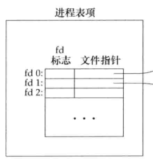
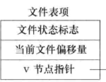
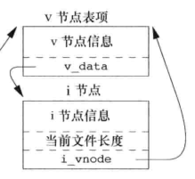
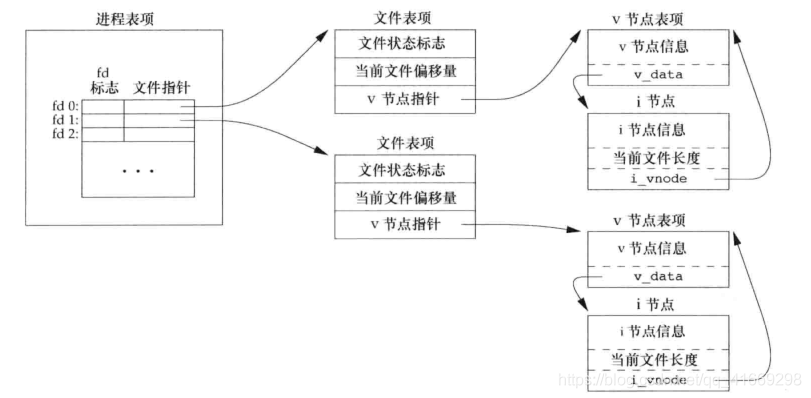
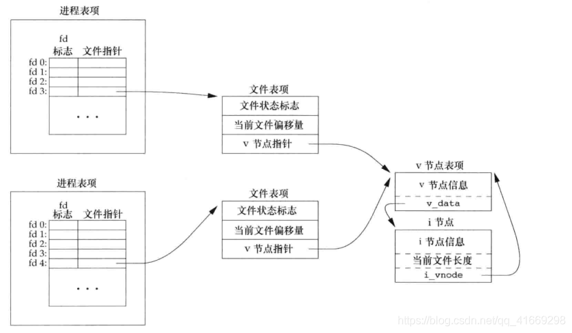
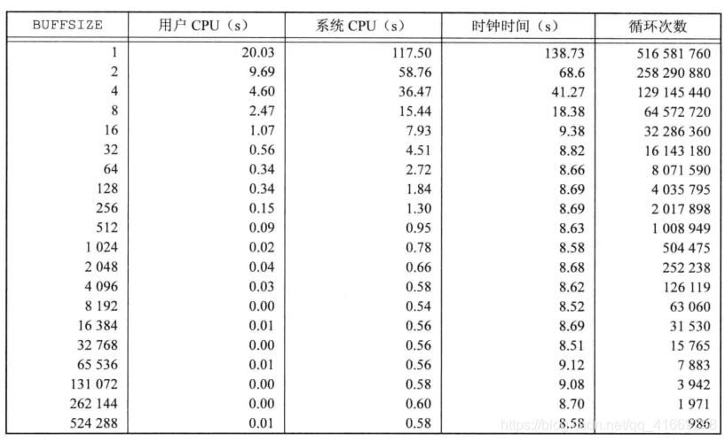
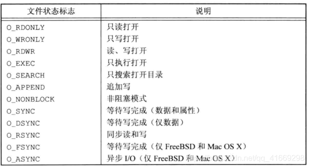

# Linux文件结构
## 文件描述符

  文件描述符已经不陌生了，在一个进程中一个打开的文件就是用一个文件描述符所表征的，可以看作是一个句柄，就是所谓的遥控器。但是这个遥控器到底怎么来控制具体的文件呢？接下来会依此讲解文件描述符背后的在UNIX环境下实现相关的数据结构。

## UNIX环境下的文件共享

  文件描述符用来表征一个文件，但是为什么操作系统要用这么一个整数来表征一个文件呢？这就操作系统底层实现有莫大的关系。
  在进程PCB中有着这么一个部分，IO状态信息，说的再具体点，在PCB中存在着一张表，我们可以叫它文件描述符表也可以叫做打开文件描述符表，这张表每个进程都会有且为进程独有，所以它是进程级的。这张表上的每一个表项都有两个部分组成，文件描述符标志以及一个文件指针。其中文件描述符标志也就是我们所使用的文件描述符`fd`，当然我们也可以将其看做是这张表的下标。这张表长这样。



  这张表中每一项都有一个文件指针，那么这个指针又指向哪里呢？这就要提到另一张表打开文件表，注意这张表由操作系统管理，且系统中只有唯一一张这样的表，因此这张表是系统级的。这张表中的每一项都存储着一个进程与这个文件相关的一些信息，其中主要分为三个部分：文件状态标志，文件当前偏移量，`v-node`结点指针。

  文件状态标志就是文件在打开时的状态标志，例如可读，可写，可读写，阻塞等都会记录在其中，这些状态标志也可以使用`fcntl`函数修改。

  文件当前偏移量就是文件指针当前在文件中指向的位置，我们可以用lseek函数修改。
  `v-node`结点指针我们稍后再谈，现在我们要详细讲讲这张表的工作过程。这张表属于系统级的，系统中任何进程打开任何文件都会在其中添加一个记录项，按照一般情况下来说两个不同的进程打开相同的文件也会在表中创建两个不同的表项，因此两个进程对同一个文件可以有不同的状态标志以及文件当前偏移量，一个进程中不同的文件描述符所代表的文件描述符表项中的文件指针也该指向不同的打开文件表项，但是在某些情况下文件描述符表中不同表项的指针却又有可能指向系统级打开文件表中的同一个表项。例如我们在`fork`子进程时，子进程复制父进程PCB中的大部分信息包括IO状态信息时会复制文件描述符表，因此两个不同的进程此时就会打开同一个文件，并且文件指针的指向也不会改变会指向相同的打开文件表表项；在使用`dup`函数重定向时一个进程中不同文件描述符表项中的文件指针也会指向同一个打开文件表中的表项。
  这张表中的每个表项长这样。



  最后还剩一个问题，这个`v-node`结点指针干嘛用的？`v-node`节点指针当然指向v-node节点的啊。那么什么是`v-node`节点？说到`v-node`就不得不提起`i-node`节点，在UNIX操作系统中操作系统管理文件的方式是通过使用`v-node`和`i-node`节点的方式进行管理的，每个文件都会有这样的节点用于保存相关的文件信息，例如`v-node`节点上保存了文件类型，对这个文件进行操作的函数指针以及对应的`i-node`节点的指针；而`i-node`节点上保存了文件长度，文件数据存储在磁盘的位置，文件所属者等。这些文件信息平时存储在磁盘上，当一个文件倍打开时系统会将这些信息读入内存，并且相同的文件的`i-node`及`v-node`节点在内存中只会存在一份。这两个节点长这样。



  那么为什么要用两个节点保存这些信息呢？这是为了在一个操作系统上对多文件系统进行支持。把与文件系统无关的文件信息存储在`v-node`节点上，其余信息存在`i-node`上，分开存储，这样的系统也叫做虚拟文件系统。而Linux比较特殊，他其中没有`v-node`节点而是用了两个不同的`i-node`节点，但是结果而言大同小异。
  综上所述，把以上集中数据结构连接起来就构成了一个进程对文件进行控制的完整脉络，进程也就得到了和文件控制有关的所有信息，可见并不是所有文件信息都保存在PCB中的。



  对于两个不同的进程打开同一个文件，他们的文件指针可能指向不同的打开文件表项，但是最终都会指向同一个`v-node`和`i-node`节点，正如之前所说，相同文件的有关信息在内存中只会存在一份。如下图。



## 打开关闭文件

### open()

  open()函数用于打开一个文件，函数声明如下。

```cxx
int open(const char *pathname, int flags, mode_t mode);
//  Arguments:
//  path:打开文件或创建文件的名字，
//  flags:表示选项，用|连接多个选项
//  flags选项宏的定义文件在每个系统中有所不同，Linux中定义在fcntl-linux.h文件中
//  mode参数仅在使用部分选项时才用到，例如O_CREAT在mode中需要给定文件初始权限
//  Return Value:打开的文件描述符，失败返回-1
```

  返回的文件描述符符合最小未使用分配原则。
  其中flags选项有几个比较常用选项，介绍如下：

```
//以下这五个选项只能五选其一
O_RDONLY:只读
O_WRONLY:只写
O_RDWR:可读可写
O_EXEC:可执行
O_SEARCH:只搜索（应用于目录）
//剩下这些选项可以同时存在多个
O_APPEND:追加写，打开文件时将文件当前偏移量置为文件长度，建议要是要想像文件末尾追加数据都加上这个选项，原因后面解释。
O_CREAT:文件不存在则创建，全线由mode给出
O_CLOEXEC:当前进程如果发生进程替换，自动关闭当前文件
O_DIRECTORY:打开的不是目录则报错
O_EXCL:同时存在O_CREAT时如果文件存在则报错
O_NOFOLLOW:如果打开的是一个符号链接则出错
O_NONBLOCK:非阻塞打开文件
O_SYNC:非延迟写，即同步写，每次都等待物理写磁盘成功后再返回
O_TRUNC:打开文件则截断文件
```


  以上这些宏定义在fcntl.h中，但是根据操作系统不同具体定义的位置也各不相同。

### openat()

  openat()和open()参数及功能和返回值都很类似，其函数声明和主要区别如下：

```cxx
int openat(int dirfd, const char *pathname, int flags);
int openat(int dirfd, const char *pathname, int flags, mode_t mode);
// openat函数与open函数功能类似，唯独多出dirfd参数用以区分功能
// openat函数解决的主要问题是
// 1、可以让同一进程下的多个线程之间拥有不同的当前工作目录，从而可以使用同样的相对路径打开绝对路径可能不同的文件
// 2、解决TOCTTOU(Time Of Check To Time Of Use)。如果两个文件相关的系统调用互相依赖，则这个系统是脆弱的
// openat函数主要特性
// 1、如果pathname是绝对路径，那么此时dirfd参数毫无意义，功能则与open一致
// 2、如果pathname是相对路径，且dirfd参数不是特殊宏AT_FDCWD，则将dirfd所在的目录作为此时的当前工作目录，以此打开相对路径的文件
// 3、如果pathname是相对路径，且dirfd参数未特殊宏AT_FDCWD，则就以当前工作目录打开相对路径的文件，功能与open无异

```

### 文件名截断

  在我们利用`open()`函数创建新文件时如果文件名过长会怎样呢？
  在UNIX系统中，有这么一个宏提前定义在系统中即`NAME_MAX`，它标识了当前系统中一个文件名最大的字符长度。假设一个系统中此值为255但是我们想要创建一个文件名为256长度的文件时操作系统会怎么处理呢？此时有两种做法。
  第一种做法为截断。即既然只支持最长255那么你可以创建新文件，但是我只截取前255个字符作为新文件的文件名，文件照样会创建成功。这种处理方法在DOS系统上十分常见。
  第二种做法为报错返回-1。即文件名超出系统限制，那么文件创建失败返回-1并且修改errno为`ENAMETOOLONG`，这种做法在BSD系统和Linux上十分常见。
  如果我们想要知道我们当前系统对于这个问题的处理方法是怎样的我们可以使用`pathconf()`函数或者`fpathconf()`查看系统系统限制，如果返回为真则表示当前系统的处理为出错返回而不是截断。

```cxx
int main()
{                            
  //测试文件是否截断                             
  //如果使用一个系统调用如open创建一个新文件的文件名大于NAME_MAX，有的系统会选择截断，而有的系统选择返回-1报错
  //如果_POSIX_NO_TRUNC值为真则返回-1报错，为假则对文件名进行截断，并且成功创建
  std::cout << pathconf(".", _PC_NO_TRUNC) << std::endl;         
  //Linux操作系统下的处理为报错返回，并将errno置为ENAMETOOLONG          
}
```

### creat()

  这个函数可以用于创建一个文件，因为在早期版本中`open()`函数的选项并没有现在这样丰富，无法创建文件，所以出现了这个函数。函数原型及介绍如下：

```cxx
int creat(const char *pathname, mode_t mode);
// 用于新建一个文件，功能与open(pathname, O_CREAT | O_WRONLY | O_TRUNC, mode)完全一致
// 成功返回文件描述符，失败返回-1
```

### close()

  `close()`用于关闭一个文件，函数介绍及原型如下：

```cxx
int close(int fd);
// close用于关闭一个文件，成功返回0，失败返回-1
```

### lseek()

#### 文件当前偏移量

  每个文件在打开后都会一个文件当前偏移量的概念存在，也可以叫做文件指针，它指向文件中某一位置，并且之后的读写操作会全部从此处开始，一般来说文件当前偏移量一般来说是一个非负整数，但是在某些情况下我们获取的偏移量有可能为负值或者大于文章长度。每个文件当前偏移量存储在系统级的打开文件表当中。
  当一个文件被打开时文件当前偏移量被置为0，如果使用了O_APPEND选项则置为文章长度，方便追加。

### lseek()

#### 基本使用

  lseek()用于修改文件当前偏移量，函数原型及介绍如下：

```cxx
off_t lseek(int fd, off_t offset, int whence);
// Arguments:
// fd:操作的文件描述符
// whence:可以有三种参数，SEEK_SET，SEEK_CUR，SEEK_END，分别代表相对位置文件开头，当前文件偏移量，文件结尾位置
// offset:表示移动距离，offset可正可负
// Return Value:成功返回更改后的文件当前偏移量，失败返回-1，如果当前fd是一个管道，套接字等不可修改的会将errno置为ESPIPE
```

  注意其中的off_t类型，这个类型为偏移量类型，虽然偏移量为非负，但是这里的类型却是个有符号整型，因此它可正可负，并且它也代表了一个文件的最大长度，如果它是32位的，则文章最大长度为2^31 - 1，在Linux操作系统下它是8个字节的即64位，但是否能创建一个大于2G的文件取决于底层文件系统。
  我们也可以使用lseek()获取当前文件偏移量，方式如下：

```cxx
void PrintOffset()
{
  int fd = open("test.txt", O_CREAT | O_TRUNC | O_RDWR, 0664);
  if(fd == -1)
  {
    perror("error:");
    return;
  }
  //通过以下这种方法可以获取当前的偏移量
  off_t curOffset = -1;
  curOffset = lseek(fd, 0, SEEK_CUR);
  //打印0，可知文件默认打开偏移量为0
  std::cout << curOffset << std::endl;
}
int main()
{
  PrintOffset();
}
```

  以上方法还可以用来检测一个文件支不支持更改偏移量，例如管道套接字等文件不支持更改，则会返回-1，errno置为ESPIPE。
  还要注意一点，lseek()只更改文件当前偏移量，不涉及IO。

#### lseek()引起空洞

  之前有提到过文件当前偏移量是可以大于当前文件长度的，如果在这种情况下还进行文件写入是允许的，但是会形成文件空洞。空洞的部分用\0代替，但是空洞并不占用磁盘块。

## 文件读写

### read()

  函数声明及介绍如下：

```cxx
// size_t read(int fildes, void *buf, size_t nbyte);
// 从文件中读取数据
// Arguments:
// fildes:读取的文件描述符
// buf:数据存放的目标缓冲区
// nbyte:最多读取的数据长度，16位无符号整型，一次读取最多为65535个字节
// Return Value:
// 返回实际读取的数据长度，大部分情况下目标文件中有多少数据则读取多少数据并且返回读取长度；
// 如果是管道或者套接字目前暂无数据则会阻塞
// 如果是普通文件，读到文件结尾返回0
// 可以设置非阻塞读取，如果暂无数据则不会阻塞而回返回-1并将errno置为EAGAIN
// 返回值ssize_t是一个带符号整形
```

  read()函数读取出错返回-1，对于不同类型的文件有着不同的处理。

### write()

  函数声明及介绍如下：

```cxx
ssize_t write(int fildes, const void *buf, size_t nbyte);
// 向文件中写入数据
// Argumentes:
// fildes:文件描述符
// buf:写入数据存放的缓冲区
// nbyte:写入的最长数据长度
// Return Value:
// 返回实际写入的数据长度，如果数据长度小于nbyte则在后补'\0'；如果文件剩余容量小于nbyte则返回能写入的最大数据长度
```

  同样的，write()函数读取出错返回-1，对于不同类型的文件有着不同的处理。

```cxx
void Test1()
{                                                             
  int fd = open("test.txt", O_CREAT | O_RDWR | O_TRUNC, 0664);
  if(fd < 0)
  {
    perror("error:");
    return;
  }
  //末尾补\0
  int ret = write(fd, "Misaki", 7);
  std::cout << ret << std::endl;
  lseek(fd, 0, SEEK_SET);
  char buf[1024] = {0};
  ret = read(fd, buf, 1024);
  std::cout << ret << std::endl;
  std::cout << buf << std::endl;
  //可以发现末尾确实补了\0
  for(int i = 0; i < ret; i++)
  {
    std::cout << (int)buf[i] << " ";
  }                
}  

int main()   
{  
  Test1();   
}


// 7
// 7
// Misaki
// 77 105 115 97 107 105 0 

```

### IO效率问题

  首先看以下一段读取文件常用的代码：

```cxx
#define BUFSIZE 4096
bool Test2()
{
  int n = 0;
  char buf[BUFSIZE];
  while((n = read(STDIN_FILENO, buf, 4096)) > 0)
  {
    if(write(STDOUT_FILENO, buf, n) != n)
    {
      perror("write error:");
      return false;
    }
  }
  if(n < 0)
  {
    perror("read error:");
    return false;
  }
  return true;
}

int main()
{
  if(Test2() == false)
  {
    std::cerr << "copy error" << std::endl;
    return -1;
  }                                        
}

```

  这段代码是很普通的一段从标准输入读取数据写入标准输出的文件读取写入代码，但是其中有一个重要的问题，我们在用文件读取的时候往往需要在程序内开辟一块缓冲区用作数据暂存，问题来了，这块buffer开多大呢？
  这里跟文件系统相关了，我们都知道数据在磁盘上是按照扇区读取的，但是操作系统读取磁盘数据的最小单位是磁盘块，也就是说我们每次读取数据最小都要读取一个磁盘块大小的数据，如果读取数据长度小于磁盘块操作系统也要把整个磁盘块数据先读进来然后再拿其中一部分剩下的丢掉，这样就导致一个问题如果我们读取的数据小于一个磁盘块就会导致效率低下，造成性能浪费，而在Linux操作系统上一个磁盘块大小为4K，所以我们一次读取数据大于等于4K并且为4K整数倍的话效率是最高的。不过现在的操作系统为了提高效率使用了预读技术，这使得不带缓冲的文件IO在使用较小缓冲区读取大的连续存储的文件时也能有较高地效率，我们可以从下图看出：




### 原子性操作

  考虑这么一种场景，两个不同的进程同时打开了一个文件，要对文件进行追加写，但是问题来了，两个进程这里都使用了lseek的方式将当前文件偏移量置为文件末尾处再写，这样的操作并不是一个原子性操作，很有可能导致两个进程同时先将偏移量移到末尾，然后一个写文件结束，另一个再继续在之前的偏移量接着写，这时的偏移量并不在文章末尾，会导致将第一个进程写的数据覆盖。举个例子，假设一个文件目前长度为1500，进程都将偏移量置为了1500，然后第一个线程先写400的数据，之后第二个进程接着准备写400数据，但是第二个进程的偏移量还在1500处，并没有更新为1900，此时再写入数据就会把之前进程写入的数据覆盖。
  以上的问题想要解决也很容易，有两个办法，第一个就是使用O_APPEND选项，在打开文件加入这个选项后，每次写入数据都会自动将偏移量置为文件末尾处再写，不用lseek保证了原子性；第二个办法就是使用pread()和pwrite()函数，这两个函数与read()和write()几乎无异，不同的是它多了一个参数，可以原子性的帮助我们在读写之前修改文件偏移量，但是要注意这里的文件偏移量修改只对这一次操作有效，以下是函数声明及介绍：

ssize_t pread(int fildes, void *buf, size_t nbyte, off_t offset);
ssize_t pwrite(int fildes, const void *buf, size_t nbyte,off_t offset);
这两个函数与read和write参数功能以及返回值一致，主要区别在第四个参数offset
这两个函数会将偏移量置为offset在进行读写操作，期间是原子性的，并且不可打断。操作完成后也不会修改原有的偏移量的值。

```cxx
int main()
{                                                            
  int fd = open("test.txt", O_CREAT | O_RDWR, 0664);         
  if(fd < 0)                                   
  {                                             
    perror("open error:");                
    return -1;
  }
  char buf[4096];
  lseek(fd, 1, SEEK_SET);
  //从这里可以看出pread是将偏移量置为offset，而不是加上offset
  int ret = pread(fd, buf, 4096, 1);
  std::cout << ret << std::endl;
  buf[ret] = '\0';        
  std::cout << buf;
  //事实打印出来的当前偏移量并没有发生改变
  std::cout << lseek(fd, 0, SEEK_CUR) << std::endl;;
} 


// 7
// Misaki

```

## 重定向

### dup()

  dup()函数用于重定向，传入一个描述符，系统会将当前最小未使用的文件描述符中的文件指针指向这个描述符所指向的系统级打开文件表项，因此在重定向后新文件描述符将和旧文件描述符拥有相同的文件状态和当前文件偏移量以及`v-node`节点指针，因为这些信息都是存储在系统级打开文件表中的。
  函数介绍及声明如下：

```cxx
// int dup(int oldfd);
// Arguments:
// oldfd:旧文件描述符
// Return Value:成功返回新文件描述符，失败返回-1


int main()
{
  //一个进程执行时自动打开0,1,2三个文件描述符，作为标准输入标准输出标准错误
  //在这里我们重定向的新文件描述符自动更新为3
  //并且文件描述符重定向旧文件描述符依然可以用，且指向文件不变
  int newfd = dup(1);
  std::cout << newfd << std::endl;
  write(newfd, "123\n", 4);
  write(STDOUT_FILENO, "123\n", 4);
}
```

### dup2()

  功能比dup()更加强大，传入两个参数，可以指定让新文件描述符中的文件指针拷贝为旧文件描述符的文件指针，也就是在dup()的基础上我们可以指定将哪个文件描述符作为新新文件描述符，而不是最小未使用。如果新文件描述符已经打开文件则将其关闭。
  函数声明及介绍如下：

```cxx
int dup2(int oldfd, int newfd);
// 让文件描述符表中newfd的项中的文件表项指针更改为oldfd项中文件表项指针
// 若newfd原先有指向文件并且已经打开则关闭，若newfd == oldfd则直接返回newfd
// Arguments:
// oldfd:旧文件描述符
// newfd:新文件描述符
// Return Value:成功返回新文件描述符，失败返回-1
// dup和dup2都是原子性的，其相当于调用了close函数和fcntl函数
```

  dup和dup2的功能相当于调用了functl实现，实现方法如下：

```cxx
dup:
fcntl(oldfd, F_DUPFD, 0);
dup2:
close(newfd);
fcntl(oldfd, F_DUPFD, newfd);
```

## 内核缓冲与同步写

### 内核缓冲

  即使我们说文件IO是没有缓冲区的，但是其实并不尽然，我们应该说文件IO是不会维护进程缓冲区，但是Unix操作系统为了提高读写效率会在内核中存在一块缓冲区，我们称之为内核缓冲。以写为例，我们每次调用write()写数据到达文件的时候并不是直接将数据写入文件，因为如果要写入的数据非常多则会因为IO占用非常多的时间，导致阻塞严重。系统在这里的处理时先将要写入的数据写入每个文件的内核缓冲区，然后随后再将它们真正写入文件，这样的写入模式称之为延迟写。
  但是这样会导致问题，对一些需要即时写入即时使用的数据来说会导致文件数据与缓冲区的数据不相符，原因是缓冲区中的数据还没来得及更新，于是这里牵扯到了同步写。

### sync()

  sync()通常由系统利用守护进程update每隔30秒周期性调用，它的作用是将系统中所有修改过的内核缓冲区加入写队列，从而让其可以更新到真正的文件中，但是这个函数并不等待真正的写入就会返回。

```cxx
void sync(void)
```
### 同步写
  因为系统默认是不会等待真正数据写入文件，对于要求立即写入文件的程序来说这样并不靠谱，于是系统也为我们提供了可以同步写的方法。同步写一般应用于数据库文件当中。

### fsync()

  fsync()会传入一个文件描述符，并且等待此文件缓冲区中的数据真正写入到磁盘后才会返回，达到同步写。

```cxx
int fsync(int fd);
```

### fdatasync()

  fdatasync()与fsync()类似，唯一不同的是它只等待文件数据更新到磁盘上即可返回，并不文件的属性信息更新，因此调用它返回会更快。

```cxx
int fdatasync(int fd);
```

## 修改文件属性

  在打开文件时可以指定文件状态以及一些附加选项，当然既然可以指定那么就可以修改，而fcntl()就向我们提供了这一功能。

### fcntl()

  函数声明及介绍：

```cxx
int fcntl(int fd, int cmd, ...);

// fcntl函数可以更改已经打开的文件的属性 
// Arguments:
// fd:文件描述符      
// cmd:执行命令
// ...:不定参数，后面有可能会根据cmd的不同有着不同的需要传递的参数
// Return Value:返回值根据cmd的不同也不同，但是失败都会返回-1，大部分设置为主的模式成功会返回0
// 常用cmd:  
// F_DUPFD:赋值文件描述符，dup底层就是用这个参数进行实现的，它会将第三个参数起最小未使用的描述符复制为fd所指文件
// F_DUPFD_CLOEXEC:这里涉及一个文件描述符标志，FD_CLOEXEC，这也是唯一一个文件描述符标志，当被定义了这个文件描述符标志的文件
// 当当前进程在exec进程替换时会自动关闭这个文件，防止子进程一直占用，多用于只需要父进程可以使用这个文件而子进程关闭这个文件的文件上
// FD_CLOEXEC也可以通过F_SETFD模式进行设置，F_DUPFD_CLOEXEC则与F_DUPFD功能以及参数类似，不同的是会自动为newfd设置FD_CLOEXEC标志
// F_GETFD:获得对应于fd的文件描述符标志FD_CLOEXEC作为返回值返回
// F_SETFD:对于fd设置新的文件描述符标志，新标志作为第三个参数传入
// F_GETFL:对于fd获得文件状态标志，例如O_RDWR之类的称为文件状态标志，但是一个文件中的O_RDWR,O_WRONLY,O_RDONLY,O_EXEC,o_SEARCH是互斥的
// 因此可以使用O_ACCMODE获得访问方式屏蔽位
// F_SETFL:对于fd设置文件状态标志
```

  这里要区分两个概念，文件描述符标志和文件状态标志。目前文件描述符标志最常用的标志就一个FD_CLOEXEC标志，这个标志也可以在打开文件时加上，也可以通过fcntl()的FD_SETFD选项加上这个标志。这个标志的作用就是当前进程在放生进程替换时会自动关闭有这个标志的文件，主要解决的问题是父进程创建子进程，子进程拷贝了父进程文件描述符表因此有着和父进程相同的打开文件以及偏移量，如果子进程发生进程替换，可能会导致文件无意篡改的情况，所以关闭不用的描述符防止数据无意篡改。文件状态标志就是一些文件相关的状态信息及打开时的选项，常见有如下选项：



  以下是使用示例：

//打印文件状态标志

```cxx
void GetState(int fd)
{
  int flags = fcntl(fd, F_GETFL);
  if(flags < 0)
  {
    perror("fcntl error:");
    return;
  }
  //用屏蔽字获取当前状态标志
  switch(flags & O_ACCMODE)
  {
    case O_WRONLY:
      std::cout << "write only" << std::endl;
      break;
    case O_RDONLY:
      std::cout << "read only" << std::endl;
      break;
    case O_RDWR:
      std::cout << "read write" << std::endl;
      break;
    default:
      std::cerr << "unknow mode" << std::endl;
      break;
  }
  if(flags & O_NONBLOCK)
  {
    std::cout << "nonblock" << std::endl;
  }
  if(flags & O_APPEND)
  {
    std::cout << "append" << std::endl;
  }
  //一个文件描述符就算设置了SYNC同时写系统也不一定一定会按照预期进行同时写，因此程序员有必要调用fsync()函数
  if(flags & O_SYNC)
  {
    std::cout << "sync" << std::endl;
  }
}

int main(int argc, char* argv[])
{
  if(argc != 2)
  {
    std::cerr << "use ./main <fd> << std::endl";
    return -1;
  }
  GetState(atoi(argv[1]));
}          


// [misaki@localhost BaseIO]$ ./main 0 < /dev/tty
// read only
// [misaki@localhost BaseIO]$ ./main 1 > test.txt
// [misaki@localhost BaseIO]$ cat test.txt 
// write only
// [misaki@localhost BaseIO]$ ./main 2 2>>test.txt
// write only
// append
// [misaki@localhost BaseIO]$ ./main 5 5<>test.txt
// read write
```
  这里要注意的一个文件状态是O_SYNC和O_DSYNC同步写状态，这里就算给一个文件加上了这个标志，操作系统为了优化也不一定会同步写，要想百分百同步写还是需要调用fsync()和fdatasync()函数。

### dev/fd

  打开dev/fd中的文件描述符意义基本上等同于重新打开一份已经在进程中打开过的文件，基本上和dup(fd)的作用是差不多的，我们可以这样使用:

```cxx
int fd = open("/dev/fd/0", mode);
```
  这样的写法等同于

```cxx
int fd = dup(0);

```
  并且要求mode必须是事先打开文件选项的子集，但是Linux平台是个例外，在Linux上打开/dev/fd的文件等同于打开了一份新的文件，与原来打开的文件无关。

```cxx
#include <iostream>
#include <fcntl.h>
#include <unistd.h>
#include <stdio.h>
#include <stdlib.h>

int main()
{
  int fd = open("test.txt", O_CREAT | O_RDWR, 0664);
  if(fd < 0)
  {
    perror("open error:");
    return -1;
  }
  write(fd, "Misaki0", 7);
  dup2(fd, 1);
  std::cout << "Misaki1" << std::endl;
  int stdOut = open("/dev/fd/1", O_RDWR);
  if(stdOut < 0)
  {
    perror("open stdOut error:");
    return -1;
  }
  dup2(stdOut, 1);
  lseek(1, 14, SEEK_DATA);                               
  std::cout << "Misaki2" << std::endl;
  close(stdOut);
  close(fd);
}


[misaki@localhost BaseIO]$ cat test.txt 
Misaki0Misaki1Misaki2
```

 这个例子可以看出来利用/dev/fd打开的文件有着自己独有的文件偏移量。
 /dev/fd这种用法一般在shell语句中用于获取一个进程的标准输入标准输出比较多。
